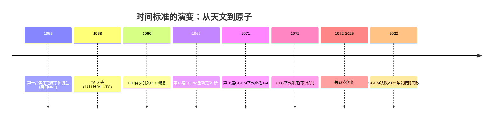

# 《时间简史：人类如何度量宇宙》

> 作者：广山哥  
> 完成时间：2026-09-09

---

# 引言：我们活在时间的洪流里

## 一、那个消失的夜晚

2012 年 6 月 30 日，格林尼治时间午夜前的最后几秒，全球最大的网络社区之一 Reddit 突然安静了下来。用户刷新页面，得到的只有错误提示；工程师打开监控面板，看到服务器成片地停止响应。这不是黑客攻击，也不是流量洪峰——就在同一时刻，Mozilla、LinkedIn、Foursquare、Yelp、Gawker 都出现了类似的故障。半个互联网像是被人按下了暂停键，而肇事者，是一秒。

准确地说，是全世界在这一天共同多出来的一秒。为了让原子钟走出的时间不至于和地球自转越差越远，国际地球自转服务决定在协调世界时 6 月 30 日 23 时 59 分 59 秒之后，插入一个正常情况下根本不存在的时刻——23 时 59 分 60 秒。这一秒叫闰秒。对天文学家来说，它是一次例行校准；对计算机来说，它是一场灾难。Linux 内核里的一个计时子系统，在处理这个多出来的刻度时算错了顺序，提前唤醒了大量本该继续睡眠的进程，CPU 被瞬间挤爆，服务一层接一层倒下。Reddit 停摆了大约三十到四十分钟，而在那之前，几乎没有一位用户听说过“闰秒”这个词。

这就是本书想要讲的世界的缩影。时间看起来是背景，是空气，是我们从不留意的东西；可一旦它出错，整个现代文明会立刻显形。那一夜，人们才隐约意识到：我们早已把整个人类社会——通信、金融、交通、电网、导航——挂在一套看不见、摸不着、却被反复校准的时间基础设施上。

## 二、一个我们从不追问的问题

我们每天都在使用时间。早上被闹钟叫醒，地铁按时刻表进站，交易在毫秒内完成，航班在预定时刻降落，外卖在承诺的时间送达。时间可靠得像空气，以至于我们从不追问它从哪里来。

可是，如果停下来想一想，问题会一个接一个冒出来。**“一秒”到底有多长？是谁规定的？**为什么北京的时间和纽约的时间可以换算，而几百年前每个城镇却各走各的钟？为什么地球自己转一圈并不总是二十四小时，人类却还要费尽力气去迁就它？为什么卫星上的钟每天比地面快三十八微秒，就必须在发射前把它调慢？

这些问题看似琐碎，答案却串起了人类文明最重要的一条暗线。时间不是大自然写在石头上交给我们的现成答案，它是一代又一代人用木棍、流水、齿轮、石英和原子，一点点**造**出来的。本书讲的，就是这部“造时间”的历史。

## 三、这不是一本物理学专著

需要先说明本书的边界。它不是一本讨论时间本质的物理学专著，不会带你推演相对论方程，也不会解释弦论里的额外维度。它是一部**人类度量时间的文明史**：从远古先民插在地上的那根木棍，到悬浮在太空中的原子钟；从各地车站混乱的“当地时间”，到 GPS 卫星上纳秒级的时间同步。

全书的脉络可以用四个词概括：**感知、度量、统一、驾驭**。

人类最初只是**感知**时间——日出而作，日落而息，用太阳、月亮和四季当作三根天然的指针。接着，我们学会**度量**时间，把影子、水流、沙粒和火焰变成可以读数的刻度，又用历法和机械钟把时间切成整齐的格子。再往后，铁路和电报逼着全人类**统一**时间，格林尼治从一个英国天文台变成整个星球的零度。最后，原子钟让我们真正**驾驭**时间，把“一秒”钉死在铯原子的跃迁上，让纳秒成为金融、通信和导航的地基。

这四个阶段，每一步都不是纯粹的技术进步，而是社会需求、科学发现与权力博弈共同作用的结果。度量时间的历史，从来不只是钟表匠的历史。

## 四、全书地图

本书共分五部十八章。

**第一部“感知时间”**回到文明的黎明：第 1 章看人类如何从日月星辰中长出最初的时间感，第 2 章讲那根插在地上的棍子如何变成日晷与圭表，第 3 章顺着水流进入水钟与漏刻，第 4 章讲沙漏与蜡烛钟这些“干式”和“燃烧式”的计时器。

**第二部“度量时间”**进入历法与机械的时代：第 5 章讲儒略历到格里高利历的那场历法之战，包括 1582 年凭空消失的十天；第 6 章讲机械钟的诞生与北宋苏颂的水运仪象台；第 7 章讲伽利略的脉搏与惠更斯的摆钟，人类第一次能把一秒切得更细。

**第三部“统一时间”**讲标准化：第 8 章看铁路如何终结各自为政的地方时，第 9 章回到 1884 年的华盛顿，看本初子午线与时区如何被确立，第 10 章讲石英钟如何把计时从机械带入电子，也第一次暴露出地球自己并不守时。

**第四部“驾驭时间”**是全书的中心：第 11 章讲原子钟的诞生，第 12 章讲 1967 年“一秒”被重新定义的那场革命，第 13 章讲原子时与世界时之间的战争，第 14 章回到开头那个夜晚，细说闰秒如何一次次制造互联网惨案，第 15 章讲 GPS 与天上的时钟，第 16 章讲时间如何变成金融与互联网时代的硬通货。

**第五部“未来时间”**把镜头推向明天：第 17 章看光钟、空间冷原子钟和芯片原子钟，第 18 章回到那个最古老也最困难的问题——我们究竟在度量什么？

## 五、这本书想怎么做

写作上，本书给自己定了四条规矩。

其一，**人物驱动**。每一章都有一个或几个核心人物：从凯撒大帝到格里高利十三世，从苏颂到伽利略，从惠更斯到拉比，从埃森到玛丽森。技术的演进从来不是抽象曲线，而是具体的人在具体的房间里，和具体的困难较劲。

其二，**故事先行**。每个技术节点都从一个具体场景切入。讲闰秒，就从 Reddit 宕机的那一夜讲起；讲 GPS，就从一颗卫星上的原子钟讲起；讲历法，就从那消失的十天讲起。先让人看见，再让人理解。

其三，**东西方并重**。本书既讲巴黎地窖里的标准器，也讲中国的圭表、漏刻和水运仪象台；既讲英国国家物理实验室的铯钟，也讲天宫二号上的空间冷原子钟。度量时间是全人类共同的事业，不该只有一条叙事线。

其四，**难度递进**。我们从人人都能理解的生活经验出发——日出日落、火车时刻表、手机定位——再一步步走进相对论修正和量子跃迁。深水区会有，但每一步都先铺好台阶。

## 六、怎么读这本书

本书各章可以独立成篇。对钟表史感兴趣的读者，可以直接从第 6、7 章读起；对互联网事故好奇的读者，可以从第 14 章读起；想知道手机为什么能定位的读者，可以从第 15 章读起，互不碍事。但如果你愿意按顺序读下来，会发现一条越来越清晰的线索：人类对时间的每一次重新定义，都是对世界的一次重新组织。

最后是致谢。感谢国际计量局、美国国家标准与技术研究院、美国航空航天局等机构公开的技术文献，感谢所有把“让时间可测量”当作毕生事业的计时学家和工程师——他们是最不出名的立法者，立下的却是这个星球上唯一被全体人类无条件遵守的法。也感谢每一位愿意在忙碌生活里抽出几小时，认真想一想“现在几点”这个问题的读者。

现在，让我们回到一切开始的地方。天亮了，一个人走到空地上，把一根木棍插进泥土里，然后蹲下来，看它的影子一点点移动。

人类度量宇宙的历史，就从那根木棍的影子里开始。

> 时间从不说话，是我们在替它数数；而我们数得越准，就越看清自己站在洪流里的位置。

---

## 目录

- 引言：我们活在时间的洪流里
- 第 1 章 日出而作，日落而息——时间的原始感知
- 第 2 章 插在地上的棍子——日晷与圭表
- 第 3 章 水的流逝——水钟与漏刻
- 第 4 章 沙与火——沙漏与蜡烛钟
- 第 5 章 历法之战——从儒略历到格里高利历
- 第 6 章 齿轮的轰鸣——机械钟的诞生
- 第 7 章 伽利略的脉搏——摆钟的革命
- 第 8 章 铁路的咆哮——地方时的终结
- 第 9 章 本初子午线——全球时区的诞生
- 第 10 章 石英的律动——从机械到电子
- 第 11 章 原子的心跳——原子钟的诞生
- 第 12 章 重新定义“一秒”——1967 年的革命
- 第 13 章 两个时间的战争——原子时与世界时
- 第 14 章 多出的一秒——闰秒的互联网惨案
- 第 15 章 天上的时钟——GPS 与时间同步
- 第 16 章 时间的货币——金融与互联网时代
- 第 17 章 更精准的明天——光钟与空间钟
- 第 18 章 时间的哲学——我们究竟在度量什么？
- 附录

---

# 第 1 章 日出而作，日落而息——时间的原始感知

在所有钟表出现之前，人类早已在报时。报时的是太阳、月亮和星空：太阳升起，身体醒来；太阳落下，身体困倦；月亮圆了又缺，缺了又圆；候鸟来了又走，河水涨了又退。我们的祖先并不知道地球在自转，也不知道月球在绕着地球运行，但他们知道一件事——有些东西会回来。这一章要回答的是：人类最初的时间感，究竟是怎样从天上长出来的？以及，为什么面对同一片天空，不同文明却长出了三种完全不同的时间观：一条笔直向前的线、一个周而复始的圆环，还有一种过去、现在与未来同时存在的“每时”。这里藏着本书的第一个秘密：时间从来不是天上掉下来的现成答案，它从第一天起就掺进了人的选择。

## 一-1 太阳、月亮与四季：最早的三根指针

最古老的钟没有刻度，只有一个圆盘和一根会走的针。太阳从东边升起，从西边落下，白天与黑夜交替一次，人就有了“一天”的概念。“日出而作，日入而息”这八个字，是流传最广、也最朴素的时间制度：不需要任何仪器，只需要抬起头，看天光来判断该不该出门、该不该收工。

太阳给人的第一个单位是“日”。它的逻辑简单到不需要解释——一觉醒来是天亮，再一觉醒来又是天亮，中间隔着的那段黑暗，就是自然的换行符。严格说来，一个真太阳日并不总是同样长：地球绕太阳的轨道是椭圆，公转速度时快时慢，再加上黄赤交角的影响，一年之中，真太阳日与平均长度之间的累积偏差最大可以到十几分钟。这个偏差古人很早就察觉到了，他们用日晷读出的正午，和用漏刻量出的正午，并不总能对齐。但对一个靠天吃饭的农人来说，十几分钟无关紧要。他要的是“天亮了”，而不是“六点零三分”。

月亮给人的是第二个单位，也是三根指针里最有节奏感的一根。月相从看不见到一弯细牙，到半圆，到满月，再到半圆，最后重新隐没，一轮大约 29.53 天。中国人把这四个关键节点叫朔、上弦、望、下弦；甲骨文里的“月”字，就是画一弯月牙。月亮的好处是它每晚都在变，肉眼可辨，不需要任何工具就能数；坏处是它变得太快，一个月不到就完成一次循环，用它来标记季节远远不够。于是人们把月亮数成“月”，把若干个“月”攒起来，试着去逼近那个更大的周期。

第三个单位来自太阳在一年中的南北摆动，也就是四季。夏天太阳升得高、影子短，冬天太阳升得低、影子长。中国古人用一根立在地上的杆子测量正午影子的长短，影子最短的那天是夏至，最长的那天是冬至，两个冬至之间就是一个“回归年”，约 365.2422 天。古埃及人则盯上了另一根指针：每年 7 月中旬，消失七十来天的天狼星会在黎明前的东方重新露面，天文学上叫“偕日升”，而尼罗河差不多就在这个时候开始泛滥。祭司们把这一天定为一年之始，把一年分成 12 个月、每月 30 天，年末再加 5 天宗教节日，凑成 365 天。这套历法很好用，但它比真实的回归年每年短了约四分之一天，四年就差一天，日子会慢慢往前漂。古埃及人没有立刻设闰年去补，而是任它漂，大约 1460 年漂满一圈，这个周期被称为天狼星周期或索提斯周期。

三根指针就这样各就各位：太阳管日，月亮管月，四季管年。问题也随之而来——它们根本不商量。朔望月 29.53 天，回归年 365.2422 天，一年里放十二个月，只有 354 天出头，比回归年少了十一天；放十三个月，又会多出十九天。日、月、年这三个单位，彼此之间没有任何一个能整除另一个。人类第一次面对的时间难题，不是“现在几点”，而是“这一年到底该算几个月”。

解决的办法是置闰。既然三根指针无法自动对齐，就人为地插进一个额外的月份，把它强行掰回去。中国商代的甲骨文里已经能看到成熟的阴阳合历：大月 30 天，小月 29 天，一年约 365 天，为了不让月份和季节错位，他们在年终插入一个闰月，早期叫“十三月”，后来慢慢挪到年中。差不多同一时期，巴比伦人也在做同样的事。他们先是在需要的时候临时下令加一个月，到大约公元前 499 年，开始按一个固定的周期规律置闰：19 年里插入 7 个闰月。古希腊天文学家默冬在公元前 432 年也公布了这个周期，后世称为默冬章。中国的历家则在春秋晚期独立掌握了“十九年七闰”，《周髀算经》和《汉书·律历志》里记着“章岁十九，章闰七，章月二百三十五”。

十九年七闰之所以是天才的方案，是因为它几乎精确。19 个回归年等于 6939.60177701 日，235 个朔望月等于 6939.68865 日，两者只差约 0.087 日，也就是两小时零五分。这个误差要累积两百多年才会凑满一天。在没有任何现代天文仪器的年代，人类用最笨的办法——一年一年地看，一代一代地记——逼近了这样一个近乎完美的比例。这是时间史上第一场真正的“战争”，对手不是别人，而是天空本身的不配合。

调和的结果，就是我们今天还能看到的农历。农历把月亮看不见的那天定为初一，叫朔；把月亮最圆的那天放在十五或十六，叫望；两个朔之间算一个月，大月 30 天，小月 29 天。十二个月下来只有 354 天上下，与回归年差着十一天，所以每隔两三年就要塞进一个闰月。中国农历的置闰规则后来发展得极为精细：一年分二十四个节气，其中十二个叫“中气”，如果某个月里没有中气，就在下一个月补一个闰月，这叫“无中气置闰”。这套规则一直用到今天，春节、清明、中秋的日期，都是它算出来的。

```
                 天然的三根指针

   ┌────────┬──────────────┬──────────────────┐
   │  指针  │   对应天体    │   平均周期        │
   ├────────┼──────────────┼──────────────────┤
   │   日   │    太阳       │   约 24 小时      │
   │   月   │    月亮       │   约 29.53 日     │
   │   年   │   太阳与四季   │   约 365.2422 日  │
   └────────┴──────────────┴──────────────────┘

   三者互不整除  →  必须人为置闰
   19 个回归年 ≈ 235 个朔望月
   于是有了「十九年七闰」
```

还有一样东西常被误当成天然指针，那就是“星期”。一周七天既不来自太阳，也不来自月亮，更不来自四季。古巴比伦人用日、月、金、木、水、火、土七个天体各代表一天，拼出七曜的次序；犹太－基督教传统则把七天追溯到《创世记》的六日创造与第七日安息。中国古代的《易经》里也有“七日来复”的说法。换句话说，日、月、年是天给的，星期是人定的。这是人类第一次不满足于被动地读天，而是主动地把时间切成自己想要的小块。

商代甲骨文里，一天已经被分成了几个有名字的时段：旦是清晨，中日是正午，昃是太阳偏西，昏是黄昏，夕是夜晚；后世又细分成大采、小食、大食、小采等等。这些名称今天读起来有些陌生，但它们做的是同一件事——把连续流逝的天光，切成可以彼此约定的格子。当一个人说“中日时分在宗庙见”，他给出的不是模糊的“中午前后”，而是一个社会共同承认的时刻。

不过，三根指针再怎么排列组合，也只能给出“大概”。今天是不是播种的时候，明天月亮圆不圆，这些够用了；但要约定“三天后在河边碰头”，或者记录“这件事发生在月亮第三次变圆的夜里”，光靠抬头看天就不够了。人类需要一种能留在手里的东西，把天上的节律搬到地上来。最早的这种“东西”，既不是钟，也不是表，而是一根骨头，和骨头上的一道道刻痕。

> 太阳给了我们一天，月亮给了我们一个月，四季给了我们一年；但它们从不商量，替它们商量的人，只能是我们。

## 一-2 线性、循环与无时间：三种时间观的文明分野

三根指针给了人类度量时间的工具，却没有规定时间应该长成什么形状。同样一条河流，有人看到的是它奔向大海、一去不返，有人看到的是它蒸发成云、落回山巅、重新流下。面对同一片天空，不同文明给出了三种截然不同的回答，而这些回答的分野，比任何一台钟都更深地塑造了此后的历史。

第一种是线性时间观。它相信时间是一条从起点出发、笔直奔向终点的直线，过去、现在、未来依次排列，不可逆转。这个观念最清晰的源头是《创世记》的开头：起初，神创造天地。短短一句话，给世界装上了一个绝对的起点；此后六日创造、第七日安息，再往后是人类的堕落、上帝的救赎与末日的审判，整部历史像一支射出去的箭。到了公元 5 世纪，奥古斯丁在《上帝之城》中把这套叙事系统化：历史不是无意义的循环，而是一条有开端、有方向、有终局的直线，每个人都在其中走向自己的归宿。线性时间观给了西方一种独特的力量——它让“进步”成为可能。如果明天只是今天的重复，那就没有理由去改变什么；只有当时间是一条向前的路，人才会相信明天可以比今天更好，才会去预言、去规划、去赌一个不同的未来。代价则是焦虑：时间成了一种有限的、正在流逝的、必须被抓住的资源。

线性时间观还有一个不常被提起的副作用：它让“准时”变成一种道德。如果时间是一条不可逆的直线，那么浪费别人的时间，就等于偷走别人生命里不可复得的一段。这套观念要到机械钟普及之后才会真正落地，但它的种子，早在《创世记》的第一句话里就埋下了。

第二种是循环时间观。它相信时间是一个圆环，四季更替、日月盈昃、王朝兴亡，都是同一个圆的不同段落。中国古人用干支纪日，十天干配十二地支，凑成六十个组合，六十天一轮，循环往复，周而复始；这套系统从殷墟甲骨上的完整六十甲子算起，一直用到今天，是世界上最长的连续纪日记录。《易经》说“一阴一阳之谓道”，《道德经》说“反者道之动”，孟子说“五百年必有王者兴”，司马迁用“三统循环”来解释历史。时间在这里不是一条线，而是一个会呼吸的圆：衰落到极点就会反弹，乱到极点就会重归治。印度的循环观更为宏大。一个“劫”（kalpa）等于 43.2 亿年，是梵天的一日；一劫之后有等长的“灭”，合起来是梵天的一昼夜；梵天的一生有 100 年，约合 311.04 万亿年。一个宇迦周期为 432 万年，包含四个时代，道德与寿命逐代递减，末法时代之后又回到起点。在这样的尺度面前，一个人的一生连一个零头都算不上。循环时间观给人的是稳定与忍耐：既然低谷之后必有回升，那就熬得住；既然一切终将重来，那就没有什么真正的终结。

循环时间观还有一种更日常的版本，就是“周期”。玛雅人用卓尔金历和哈布历套成 52 年的历法轮，认为一个周期走完，世界会回到相似的起点；他们算出 2012 年 12 月 21 日是第十三个伯克盾的结束，于是被现代人误读成“世界末日”。其实在玛雅人的框架里，那只是翻过日历的最后一页，下一页随即开始。中国古代的干支也是同样的逻辑：六十天一轮，六十年一甲子，“甲子”二字既是数字，也是“重新开始”的意思。循环时间观的魅力就在这里——它不否认变化，但坚持变化有节律，而节律是可以预期的。

第三种最难翻译，它属于澳大利亚原住民。人类学家给这个世界观起了个名字叫“梦幻时代”（Dreamtime），原词来自中部澳洲阿兰达人的 alcheringa。但这个译名从一开始就问题重重。1896 年，民族志学者弗朗西斯·吉伦（Francis Gillen）第一次在报告里使用它，随后他的同事鲍德温·斯宾塞（W. Baldwin Spencer）在 1899 年的《中澳大利亚的土著部落》中把它解释为“最遥远的过去”。1908 年，德国传教士卡尔·施特雷洛（Carl Strehlow）在《Die Aranda》里提出质疑：阿兰达人告诉他，altjira 指的是一个没有开始的永恒存在，而不是历史上的某个时期；“土著并不知道‘梦幻时代’是他们历史上某段时间的名称”。后来人类学家斯坦纳（W. E. H. Stanner）说，这个概念最好被非原住民理解为“一整套意义”，学界则用一个更准确的说法来概括它——everywhen，也就是“每时”。在“每时”里，创世时代并不是已经结束的往昔，而是仍在持续发生的当下：祖先的足迹化作了山脉与河流，那些事件既是过去，也是现在，还会在未来继续展开。所以，把“梦幻时代”理解成“没有时间”是一种误读；它有的是另一种拓扑——过去、现在、未来不是排队，而是同时在场。这种时间观与土地深度绑定：原住民的歌谣沿着祖先走过的路线展开，同时记录着水源、食物产地和通往其他部落的道路，唱歌就等于在读一张会发声的地图。澳大利亚原住民文化是世界上最古老的连续现存文化之一，起源至少可追溯到约 65,000 年前，曾有 400 多个部落、数百种语言；他们用口述、歌谣、舞蹈和岩画，把时间一代代传了下来。

```
          三种时间观：同一片天空，三种形状

   ┌────────┬───────────────┬──────────────┬────────────────┐
   │        │    线性时间    │    循环时间   │   无时间／每时  │
   ├────────┼───────────────┼──────────────┼────────────────┤
   │  形状  │    一条直线    │    一个圆环   │   一张同时铺开的网│
   │  代表  │  犹太－基督教   │  中国、印度   │  澳大利亚原住民  │
   │  起点  │ 《创世记》起初  │  干支、四季   │    梦幻时代      │
   │  终点  │    末日审判    │   回归／轮回  │     无终点       │
   │  力量  │   进步、预言   │   稳定、忍耐  │   与土地共生     │
   └────────┴───────────────┴──────────────┴────────────────┘
```

这三种时间观最容易被误解成一条进化阶梯：仿佛线性是“先进”的，循环是“落后”的，无时间是“原始”的。事实恰恰相反，它们不是同一道题的三个答案，而是三道不同的题。线性时间观回应的是“我们能否得救”，它需要一个起点和一个终点；循环时间观回应的是“我们如何与变化相处”，它需要一套可以预期的节律；而“每时”回应的是“我们与这片土地是什么关系”，它需要把祖先、土地和后代放进同一个当下。每一种时间观都是被具体的生存方式塑造的：农耕需要知道节气，所以必须测影、必须置闰；游牧和迁徙需要记住路线，所以歌谣就是历法；一个相信末日审判的社会，会把钟表越做越精确，因为时间是要交账的。换句话说，一个文明如何回答“时间是什么形状”，就等于回答了“我们该怎样活着”。

但无论是直线、圆环还是“每时”，都有一个共同的敌人：遗忘。再精准的天象，如果不能被记下来，就只能在活人的记忆里存在；而记忆会随人老去、随人死去。人类需要一种能把时间从脑子里搬出去的东西。于是，在冰河时代的洞穴里，在篝火旁的骨头上，人类开始了最早的“记录”——那一道一道刻痕，就是本书故事的真正起点。

> 线性时间让人相信明天不同，循环时间让人相信明天相似，梦幻时代则让人相信，明天和创世那天是同一刻。

> 一个文明如何回答“时间是什么形状”，就等于回答了“我们该怎样活着”。

## 一-3 骨器上的刻痕：旧石器时代的月亮历

故事要从一根狒狒的腿骨说起。在南非与斯威士兰交界处的莱邦博山脉，有一个叫边界洞（Border Cave）的岩厦。考古学家彼得·博蒙特（Peter Beaumont）在这里挖出了一截狒狒的腓骨，上面整整齐齐地刻着 29 道痕迹。这根骨头后来被称为莱邦博骨，它的一端已经断裂，所以我们不知道原本一共有多少道刻痕。依据 24 个放射性碳测年，它距今约 43,000 至 42,000 年，是已知最古老的带刻痕骨器之一。2012 年，弗朗切斯科·德埃里科（Francesco d’Errico）等人在《美国科学院院刊》上报告，这根骨头出土的层位定年在距今 4.3 万至 4.2 万年之间。

29 这个数字太诱人了。一个月相周期平均是 29.53 天，莱邦博骨上恰好是 29 道刻痕。于是有人推断，四万多年前的某个人，可能每天晚上在骨头上刻一道，数着月亮从看不见到重新看不见的整个循环。也有人提出另一种解释：29 道刻痕更接近月经周期的天数，或许这是最早的生育记录。博蒙特本人则更谨慎，他注意到刻痕的截面变化显示用了不同的刀口，因此认为这些痕迹更可能出自某种仪式，而不是单纯的计数。三种解释至今都没有定论，唯一能确定的是：这是一个有意为之的序列，不是随手乱划。

比莱邦博骨年轻一些，但更有名的是伊尚戈骨。1950 年，比利时地质学家让·德·海因泽林·德·布劳库尔（Jean de Heinzelin de Braucourt）在比属刚果的伊尚戈地区发现了它。那里靠近塞姆利基河，而塞姆利基河是尼罗河源头之一，当年曾聚居着大量以捕鱼和采集为生的人，后来一次火山喷发把整个聚落埋了起来。这根骨头深褐色，长约 10 厘米，大小像一支铅笔，一端嵌着一块锋利的石英片，大概就是当年用来刻划的刀具。它的刻痕不是一排，而是沿着骨身分成三列，像三行没有文字的账簿。它现藏于布鲁塞尔的比利时皇家自然科学研究所，年代主流口径为距今约两万年。

伊尚戈骨最引人注目的，是那些刻痕之间似乎藏着规律。亚历山大·马沙克用显微镜逐一检视后认为，这些刻痕可能代表一份为期六个月的太阴历——把月亮的圆缺按月分组，六个月刚好是一个可以反复使用的周期。也有学者把三列刻痕的数目加起来，发现总数分别是 60、60 和 48，都是 12 的倍数；其中一列还出现了 11、13、17、19 四个质数。于是另一种更轰动的说法出现了：两万年前的人已经在琢磨质数。但这个说法很快遭到反驳。学者彼得·鲁德曼指出，质数的概念必须以除法为前提，而除法在公元前 10000 年之后才可能出现，人类真正理解质数可能要晚到公元前 500 年。两万年前的人不可能在做质数运算。还有人提出了最朴素也最煞风景的解释：那些刻痕也许只是为了让手握得更牢，防止骨头打滑。一根骨头，四种解释，每一种都有支持者，每一种都无法被彻底证实。

这种争议本身就是本章最重要的一课。考古学能告诉我们“这里有一串刻痕”，却无法直接告诉我们“刻痕的主人在想什么”。我们手里握着的是物证，脑子里补上的是故事，而故事总是比物证走得更远。诚实的写法是把两者分开：莱邦博骨有 29 道刻痕，这是事实；它记录的是月相，这是推测。科学不是把推测说成事实，而是给推测标上“推测”两个字，然后继续找证据。

把视线从非洲移开，还能看到更多同类的东西。1937 年，捷克考古学家卡尔·阿布索隆（Karl Absolon）在摩拉维亚的下维斯特尼采发掘出一根幼狼的桡骨，属奥瑞纳文化，距今约三万年，上面有 55 道刻痕，分成两组，可能也是某种记账或记日的工具；就在这根骨头附近，还出土了一尊象牙维纳斯小像的头部。再往后到中石器时代，记录的对象从骨头变成了地景。苏格兰阿伯丁郡的沃伦场，大约建于公元前 8000 年，12 个坑沿一条弧线排开，与冬至日出的地平线方位相关，研究者认为它是一套用来校准月亮周期与太阳年的阴阳合历装置，比美索不达米亚最早的历法还早了将近五千年。最耐人寻味的是，造它的人是狩猎采集者，而不是通常被认为才会修建大型纪念物的定居农民。

刻痕之所以重要，还因为它对应着一种最古老也最可靠的计数方式——一一对应。要数一群羊，就在绳子上打一个结，或者往罐子里丢一颗石子；羊多一只，结就多一个，石子就多一颗。这种办法不需要数字，只需要让两个集合彼此配对。骨头上的刻痕，正是把“月亮的每一次圆缺”和“骨头上的一道痕”配了对。今天在纳米比亚等地，仍有桑人使用带刻痕的“日历棒”，与莱邦博骨上的做法如出一辙。四万多年过去，人类换掉了材料，却没有换掉这个念头。

旧石器时代的人并非只会刻骨头。他们会用赭石在身上涂抹，会在洞穴深处画野牛，会埋葬死者并随葬器物。这些都是“符号”，而刻痕是其中最安静的一种。它不表达情感，也不描绘形象，它只做一件事——计数。正因为安静，它才走得更远：从一根骨头上的 29 道痕，到泥板上的楔形数字，到结绳、算筹、算盘，最后到今天的二进制，人类所有的记账系统，都可以追溯到这样一串刻痕。

从一根骨头上的刻痕，到十二个坑排成的弧线，人类做的事情其实是同一件：把时间从身体里搬出来，放进一个可以保存、可以传递、可以核对的外部载体。这看起来只是技术的进步，实际上是一次认知的跃迁。在此之前，时间只存在于人的记忆里，记忆一断，时间就断了；在此之后，时间可以离开人，独自留在一根骨头、一块石头、一个坑阵里。当代研究者托马斯·内尔还提醒我们注意一个细节：这些刻痕代表的可能不是“1”这个抽象的数字，而是“第一、第二、第三”这样的序数——刻痕的价值不在它等于多少，而在它排在序列的哪个位置。刻下一道痕，不是为了记下“一”，而是为了把骨头的序列和月亮的循环对齐。这是一种“节奏的同步技术”，是人类第一次试图让两个不同的周期彼此咬合。

> 在骨头上刻下第一道痕的人，并没有发明数字；他发明的是记忆的替身——从此，时间可以离开身体，住进物体里。

```
        三件骨器：人类最早的「时间记录」

   ┌──────────┬──────────────┬────────────┬──────────────────┐
   │   名称   │     年代     │    材质    │      刻痕        │
   ├──────────┼──────────────┼────────────┼──────────────────┤
   │ 莱邦博骨 │ 约 4.3 万年前 │  狒狒腓骨  │ 29 道，一端已断   │
   │ 沃尔夫骨 │ 约 3 万年前   │  幼狼桡骨  │ 55 道，分两组     │
   │ 伊尚戈骨 │ 约 2 万年前   │  狒狒骨    │ 三列，一端嵌石英  │
   └──────────┴──────────────┴────────────┴──────────────────┘

   莱邦博骨的 29 道刻痕（示意）：

   ║ ｜｜｜｜ ｜｜｜｜ ｜｜｜｜ ｜｜｜｜ ｜｜｜｜ ｜｜｜｜ ｜｜｜
     └─── 数得清，才留得住 ───┘
```

## 一-4 天问：文明开端的那一问

记录时间之后，人类迟早会问出一个更难的问题：时间本身，是从哪里开始的？公元前 300 年前后，被放逐的楚国贵族屈原写下了一首奇特的诗，全诗 374 句、约 1553 字，从头到尾只有问题，一共 172 问，没有一句回答。它叫《天问》。开篇四问，问的就是时间的起点：“遂古之初，谁传道之？上下未形，何由考之？冥昭瞢暗，谁能极之？冯翼惟象，何以识之？”

翻译过来就是：最古老的开端，是谁传下来的？那时天地还没有成形，拿什么去考证？一片混沌明暗不分，谁能探究到底？只有一团气在飘荡，又靠什么去辨认？据东汉王逸《楚辞章句》说，屈原是在放逐途中看见楚国先王庙和公卿祠堂的壁画，上面画着天地山川、神灵怪物，于是“呵而问之”，把满腔愤懑写在墙上。这个说法流传很广，却未必可靠。可以确定的是，屈原不是在进行文学修辞，他是在做一件当时几乎没有人做过的事——把宇宙的来历当作一个可以被追问、也应该被追问的问题。

屈原问而不答，并不是因为他忘了写答案，而是因为在他那个时代，很多问题根本没有答案可写。他只能把问题留下来，交给后来的人。四百多年后，唐代的柳宗元写了一篇《天对》，试图逐条回答屈原的诘问；但两篇放在一起读会发现，他们常常不在同一个频道上——屈原问的是“谁”和“为什么”，柳宗元答的是“气”和“理”。问题可以被继承，答案却必须由每一代人用自己的工具重新给出。

把《天问》放回世界文明的坐标里，会发现它并不孤单。几乎所有早期文明，都在追问同一个起点，只是答案的形状不同。《创世记》用一句“起初，神创造天地”给时间装上了一个绝对的开始，此后的六日创造、第七日安息，成了线性时间观的地基。古希腊的赫西俄德在《工作与时日》里，把人类历史描述为黄金、白银、青铜、英雄、黑铁五个时代，一代不如一代，时间在这里不是向上进步，而是向下滑落。中国自己的创世叙事来得更晚：直到三国时期，东吴学者徐整在《三五历纪》里才写下“天地混沌如鸡子，盘古生其中。万八千岁，天地开辟”，这时距屈原发问已经过去五百多年。印度人给出的答案尺度最大：一个劫是 43.2 亿年，只是梵天的一日。玛雅人则干脆给创世日编了号——13.0.0.0.0，通常换算为公元前 3114 年 8 月 11 日，这一天是长计历里十三个伯克盾完成的日子，也是他们眼中人类世界被造出来的时刻。

有意思的是，这些叙事给出的时间尺度相差极大：《创世记》是六日，盘古是一万八千年，印度是 43.2 亿年，玛雅是精确到日的历法编号。同一个问题，答案从六天到几十亿年都有，这本身就说明，创世叙事回答的往往不是“多久”，而是“谁说了算”。

顺带说一句，《天问》的结构并不混乱。清代王夫之在《楚辞通释》里指出，它“自天地山川，次及人事，追述往古，终于以楚先”——先问天，再问地，再问人间的兴亡，最后落到楚国的命运。屈原不是漫无目的地发问，他是在用一连串问题，为整个世界的秩序重新排一遍序。而排序这件事，本身就是时间的工作。

这些答案千差万别，但有一个共同点：一旦一个文明开始追问时间的起点，它同时也就开始了编年、立法和记账。追问起点从来不是纯粹的哲学爱好，它直接通向秩序。谁定义了历法的起点，谁就定义了什么时候播种、什么时候祭祀、什么时候征税；谁掌握了“年”和“月”的解释权，谁就掌握了整个社会的节律。中国古人把这层意思说得最直白——敬授民时。商代的贞人用火烧龟甲，看裂纹判断吉凶，但那些刻在甲骨上的卜辞，同时也留下了完整的六十甲子和长达五百多天的连续日数。占卜与档案、神意与农时，就这样写在同一片骨头上。度量时间，从它诞生的那一刻起，就是一件和政治、权力、信仰纠缠在一起的事。

中国最早的授时传统可以追到《尚书·尧典》：“日中星鸟，以殷仲春；日永星火，以正仲夏；宵中星虚，以殷仲秋；日短星昴，以正仲冬。”说的是黄昏时看正南方天空出现哪颗星，就能判断是哪个季节。把星空当成一本可以翻的日历，把“敬授民时”当成君主的首要职责——这就是中国式时间秩序的开端。

屈原写下这些问题的年代，正是楚国由盛转衰的关头。公元前 296 年，楚怀王客死秦国，楚国朝堂上忠奸颠倒，屈原被再次放逐，流落沅湘之间。《天问》表面上是问天，骨子里也是在问人：如果天地的秩序如此精妙，人间的秩序为什么如此混乱？这种把宇宙问题与人间问题绑在一起问的方式，恰恰说明了一件事——在古人的心里，时间从来不只是自然现象，它同时也是秩序的尺度。

两千三百年后，屈原的问题并没有被取消，只是被换成了可以被测量的形式。2021 年，中国的天问一号探测器飞向火星，名字正是取自这首诗。今天的宇宙学告诉我们，宇宙大约诞生于 138 亿年前的一次大爆炸；因为光速是有限的，我们看到的越远的天体就越古老，宇宙微波背景辐射就是大爆炸留下的余晖。我们依然没有亲眼见证“遂古之初”，但我们学会了用一种新的方式去看——不是靠传说，而是靠光。这大概是对《天问》最好的回应：问题还是那个问题，只是人类终于找到了一种可以反复验证的问法，也有了把答案写下来的工具。

而这一切的起点，仍然是那根骨头上的刻痕，和刻痕背后那句没有人回答的追问。问完之后，人不能只停在问上。他需要一件工具，把天空的节律固定在地面上，让影子替太阳说话，让刻度替记忆说话。于是，在某一座村落的空地上，一个人蹲下来，把一根木棍插进了泥土里。

> 所有文明都在追问时间从哪里开始；而人类真正的回答，是把一根棍子插进泥土，让影子替天空说话。

---

# 第 2 章 插在地上的棍子——日晷与圭表

第一章里，我们已经看见人类如何从太阳、月亮和四季中长出最初的时间感。可是那种时间感是事件式的：天亮了，月圆了，该播种了。事件可以被记住，却不能被读出来。要让时间变成可以读数、可以转述、可以算账的东西，还需要一个动作——把一根棍子插进泥土里，然后蹲下来，看它的影子。

本章要回答的问题是：人类第一次如何把连续流逝的光影，切成可以报数的刻度？答案看上去简单得近乎可笑，一根棍子而已。可正是这根棍子，完成了从感知到度量的第一次跃迁：它把太阳的位置翻译成影子的方向，把影子的方向翻译成刻度的数字。从此，时间不再只是天上的事，而是地上的一把尺子。代价也随之而来——这把尺子只在晴天有效，只在白天有效，只在一个地方有效。它撞上的那堵墙，正是第三章要接着讲的故事。

## 二-1 第一根棍子：从影子到刻度

清晨，一个人走到空地上，把一根笔直的木棍插进松软的泥土里，让它在正午的阳光下不留一点倾斜。太阳刚从东边升起来，木棍的影子又长又软，斜斜地铺向西边。到了正午，影子缩成最短的一截，端端正正指向北方。傍晚太阳西沉，影子重新拉长，这次倒向东边。一整天里，影子像一个不知疲倦的指针，从西边扫到北边，再扫到东边。

在这三件事里——影子的方向、影子的长度、影子移动的快慢——藏着人类第一台时间仪器的全部信息量。我们今天把这根投下影子的杆叫作“表”，把这个动作叫“立杆测影”。古希腊人给它的名字是 gnomon。这个词的原义与“知道”“指示”相关，也指木匠手里那把 L 形的直角尺。无论是哪一种来历，它的意思都指向同一件事：这是一个把看不见的东西显示出来的装置。它不是用来观测太阳的，而是用来读出太阳的。

这一步的跃迁，值得停下来拆开看。第一章里的时间，是靠“事件”标记的：日出是一次事件，月圆是一次事件，第一场雨是一次事件。事件有明确的起点和终点，人只需要记住它发生了。可是影子不是事件，影子是一条连续变化的曲线。你盯着它看，看到的是无级过渡的模糊，而不是可以报出来的数字。要把连续变成离散，人需要做三件事。

第一件，固定一个参照物。棍子必须插在同一个地方，必须保持同一个角度，不能今天在东边明天在西边。这听上去是常识，意义却极大：它把观察者从观测中请了出去。在立杆测影之前，一个人抬头看太阳，太阳的位置取决于他自己站在哪里、朝哪个方向；插下一根固定的棍子之后，影子的位置只取决于太阳和这块土地。观测第一次有了一个不随人移动的坐标系。

第二件，在影子走过的路径上做标记。影子本身不会说话，但人可以在它每天都会经过的地方划线。清晨影子在哪个位置，正午影子缩到哪一格，傍晚影子又到哪一格，把每天相同的时刻对应到相同的位置，重复几天、几十天之后，这些线就从临时的痕迹变成了固定的刻度。刻度是人对连续世界做的第一次粗暴而有效的切分。

第三件，约定刻度的数量与名字。为什么白天要分成十二份，而不是十份或一百份？一个流传已久的解释是十二的因数多，能被二、三、四、六整除，切起来方便；另一种说法认为它来自一年十二个月相的周期，或者来自一只手除拇指外三节指节的总数。这些说法未必能互相说服，但它们共同指向一个事实：刻度的划分不是太阳规定的，而是人规定的。太阳只负责让影子移动，至于把这段移动切成几份、每一份叫什么，是人类的约定。度量时间从一开始就是一件社会性的事。

于是，一根棍子加一把尺子，就构成了人类最早的日晷。它的原理可以用一句几何话说完：影长等于表高乘以太阳高度角的余切。换成大白话——太阳升得越高，影子越短；表立得越高，影子越长。

```
        太阳
          \
           \   光线
            \
             \
              |\  ← 表（gnomon），高 H
              | \
              |  \
              |   \
     ─────────┴────●───────────  圭／地面
                   影长 L

  正午：太阳最高 → 影子最短
  清晨与傍晚：太阳低 → 影子最长
  几何关系：L = H × cot（太阳高度角）
  表越高，同样的角度误差 → 影端位移越大 → 读数越细
  但表越高 → 半影越宽 → 影端越糊
```

这个关系里藏着一个关于精度的两难。表越高，同样的太阳高度变化会换来影端更大的位移，读数就越细；可太阳并不是一个点光源，它是一个角直径约零点五三度的圆盘，因此表的影子边缘从来不是一条清晰的直线，而是一条模糊的过渡带，叫作半影。表越高，影子越长，这条模糊带也越宽。想靠加高表来提升精度，就必须同时想办法对付越来越糊的影端。这个难题，一千年后中国的郭守敬会给出一个漂亮的答案。

还有一件容易被忽略的事：一根表能给出的信息，远不止“现在几点”。正午影子最短且指向正北，于是它同时是一具罗盘；一年中正午影长在冬至达到最长、夏至缩到最短，于是它又是一部日历；而当它把白天切成格子，它才成为钟。古希腊人留下的定义里，gnomon 正是这样一件三合一的东西——历法、罗盘和钟，被压缩进一根简单的棍子里。这也是它能在如此多的文明里独立长出来的原因：你不需要复杂的材料，只需要一块平地、一根直杆、足够的耐心，以及一套愿意被反复遵守的约定。

具体到最原始的发现过程，第一步可能并不是计时，而是定向。某一天，一个人在正午前后反复插杆、反复比较，发现影子最短的那一刻，影端总是指向同一个方向。他在地上做个记号，第二天再看，记号还在那个方向。于是他得到了一条线，这条线后来被叫作南北线。有了南北，才有东西；有了方位，营地、田地和祭祀的朝向才能被统一。定向是计时的前提：只有先确认“正午”这个特殊时刻存在，把白天切成格子才有意义。这也解释了为什么许多文明都把正午影最短当作一天的中点——它不是被规定的，而是被影子自己指出来的。

在计量方式上，最早的读数其实不是角度，而是长度。人们不量“太阳有多高”，只量“影子有多长”，因为长度可以直接用脚、用手、用一根绳子去比。把长短变化记下来，规律自然浮现：影子先缩短，再拉长，中间有一个最短点。这个最短点既是一天的中点，也是一年中影长极值变化的锚点。人类最早的定量天文学，就是这样从一把量长度的尺子开始的。

一旦刻度稳定下来，它对社会的改变是缓慢而彻底的。在没有刻度的年代，约人见面只能说“上午”“晌午”“日头偏西”，每个人的判断都不一样；有了日晷，“第三个小时”成了一个可以被不同人读出同一结果的约定。公共广场上的日晷因此不只是计时器，还是最早的公共时间基础设施——它把分散的个人经验，收拢成一套大家共享的时间语言。

反过来看，这套装置的“读数”其实极其依赖人的眼睛和纪律。影子是连续移动的，刻在圭面上的线却是离散的；两个刻度之间到底算哪一刻，全靠目测。为了让不同的人读出同一个结果，刻度必须画得足够宽、足够清楚，还要有一个大家公认的“零点”——通常是正午。这意味着日晷不仅是一件物理仪器，还是一份社会契约：只要人们接受同一套刻度，影子就有了公共含义。时间之所以能被度量，从来不只是因为有一根好棍子，更因为有一群人愿意照着同一根棍子过日子。

影子的方向和影子的长度，其实是两个独立的信息通道。长度主要反映太阳的高度，方向主要反映太阳的方位。最早的日晷多半只读长度，因为长度最容易比；后来的日晷转向读方向，因为方向在一天之内的变化更均匀，也更容易刻成均匀的扇面。读长度还是读方向，决定了日晷的形制是横躺着的一根尺，还是立起来的一个盘。这个选择一直影响到今天的钟面——圆形的表盘继承的正是方向式日晷的几何。

在理解这根棍子的时候，我们还应该意识到它没有解决什么。它默认了三件事：天是晴的，太阳是能看见的，棍子插在某一个固定的地方。只要这三条里有一条不成立，整套读数就归零。这三条默认，后来会变成三堵墙。人类接下来的几千年，很大程度上就是在想办法绕开它们。

> 一根棍子插下去，人类第一次不再问“现在大概是什么时候”，而是问“现在影子落在第几格”。

## 二-2 巴比伦与埃及的日影钟

把棍子变成真正的仪器，最早的一批实物出现在埃及。现存最古老的日晷，是一具用绿片岩制成的影钟，年代至少可以追溯到公元前八世纪。它的构造朴素得可以一眼看懂：一条平直的长底座，一端立起一根横杆，底座上刻着六个时间分格。清晨，人把横杆那一端朝东，太阳从东边照过来，横杆的影子落在底座上；过了正午，把整件东西掉个头，让横杆朝西，再读另一半。影子从一个分格挪到下一个分格，就是一个时段。

更早的线索来自墓葬。约公元前一千三百年在位的法老塞提一世，他的陵墓中发现过一套用于制造影钟的器械。而在公元前一千五百年左右，埃及人已经造出了 T 形的日晷，把从日出到日落的一整段白天划分成十二份。这个“十二”从哪来？一种说法与夜空有关：埃及人把天球分成三十六组星，称为旬星，每一组在一年中轮流在黎明前升起；他们发现每晚大约有十二组旬星依次出现，于是把夜晚分成十二份。白天的划分也向十二靠拢——十个等分，再加上黎明和黄昏各一份，正好十二。昼夜各十二，合起来就是二十四。这个划分方式被后来的希腊人和罗马人继承，一直用到今天。

这里已经埋下了一个值得注意的不对称：夜晚的十二份靠星星的升起划分，白天的十二份靠太阳的方位划分，两套参照物并不相同。白天用太阳，夜里用星星，中间还夹着黎明与黄昏两个模糊的过渡段。也就是说，一天并没有被一个统一的节拍器贯穿，而是被几套不同的天象接力拼起来的。这种拼法能够运转，靠的是日复一日的经验，而不是一台自洽的机器。

问题也恰恰出在这里。日出到日落的长度，夏天和冬天并不一样。把它等分成十二份，每一份的长度就会随季节伸缩。也就是说，同一个“第三小时”，在夏天和冬天根本不是一回事。古罗马人继承了这套体系，于是出现了一个今天听来匪夷所思的算术：他们冬天的一小时大约只有四十五分钟，夏天的一小时却能有七十五分钟。这不是玩笑，而是“季节小时”体系的必然结果。人问“现在几点”，答案取决于今天是什么季节。

这件事的意义远比它看起来深。它意味着人类第一次意识到：单位本身可能是变的。你要度量时间，就得先问一句——你说的“一小时”，到底是太阳走过白天的十二分之一，还是一段固定长度的流逝？前者跟着太阳走，后者跟太阳脱钩。这个区分在两千多年后才被彻底想清楚，而它的种子，就埋在埃及影钟的六个分格里。

也正是在这里，日影钟暴露出它作为仪器的另一层门槛：它要求的不是一根随便插着的棍子，而是一套严格的施工纪律。底座必须放平，横杆必须与底座垂直，整件东西必须严格沿东西方向摆放，上午朝东、下午朝西，稍有偏斜，读数就整体走样。埃及人为此发明了默克赫特：一根铅垂线加一片劈开成细缝的棕榈叶，用来确定真正的竖直方向，也用来把两具仪器前后对齐、瞄准北极星。传说中最早的日晷只是一根棍子，但真正能报数的日晷，从第一天起就是一件需要水准、垂线和方位知识的精密器物。工具越简单，背后的规矩越不简单。

巴比伦人走了另一条路。他们使用六十进制，把圆周分成三百六十度，这套进制后来渗进了时间的细分：一小时六十分，一分六十秒。更重要的是，巴比伦天文学家早就注意到太阳每天在星空背景上的移动并不均匀，时快时慢；托勒密在《天文学大成》第三卷第九章专门讨论过这一修正。也就是说，在日晷还只是一根棍子的时候，已经有人发现：太阳本身就不是一个匀速的指针。

希腊人接着把这门手艺推向几何化。约公元前二百八十年，萨摩斯的阿里斯塔克斯造出一种半球形日晷：在一方块石头上挖出一个半球形的凹面，把指针的一端固定在球心，影端一天走过的轨迹近似一条圆弧。每条弧再分成十二等份，于是白天就有了十二个“季节小时”。这种日晷沿用了好几百年，据阿拉伯天文学家巴塔尼记载，直到公元十世纪，伊斯兰世界仍在使用。约公元前一百年，雅典的风之塔落成，八角形的塔身装着八面朝向不同方位的平面日晷，几乎是把一整天切成了八块可以同时读取的表盘。更晚些，罗马人做出了可以随身携带的日晷，有些还配着可更换的圆盘，用来补偿不同纬度的刻度差异。

在希腊和罗马的城市里，日晷还承担着一种今天难以想象的公共职能。市场何时开市、法庭何时开庭、议会何时散会，都按“第几个钟点”来宣布。雅典的公民在广场上看一眼日晷，就知道自己有没有迟到；罗马的元老院甚至在日落之后不再受理决议，因为那时候影子和刻度都不再可靠。时间在这里第一次成为一种公共资源：它被刻在石头上，立在所有人经过的地方，谁都可以去读。也正因为如此，日晷的误差不再是私人的小麻烦，而会变成整个城邦的作息问题。

季节小时的混乱，终于在天文学内部逼出了一个新概念。希帕克斯意识到，一小时长度随季节浮动，会让天文计算和历法推演变得非常麻烦；他提出把一昼夜均分成二十四个等长的“昼夜平分时”。这个想法在当时并没有立刻普及，因为白天的等长小时仍然要靠日晷刻度来读，而日晷刻度又得跟着季节改；但它指出了一个方向：要想让时间可算，单位必须先固定。

从一根棍子走到这里，日晷完成了三重身份的转变。它有了刻度，不再是模糊的估读；它有了相对固定的形制，可以被复制、被携带、被当作器物交易；它还开始内建校正——可更换的圆盘承认了一件事：同一套刻度，换一个纬度就不准。最后这一点尤其关键。日晷从诞生那天起就是一件“地方性”的仪器，它忠实地记录着某一个地点、某一个季节的太阳，却无法给出一个放之四海而皆准的时刻。

> 日晷把太阳的轨迹刻进了石头，也把地方的纬度刻进了自己；它天生是一个好钟，却注定不是一个通用的钟。

## 二-3 中国的圭表：《周礼》“以土圭之法测土深，正日景”

在埃及和巴比伦，日影钟的注意力集中在“今天这一刻是白天第几段”；而在中国，同样一根棍子被派去回答另一个问题：一年到底有多长，什么时候该下种。这个差别塑造出了一种不同的仪器——圭表。

圭表由两件东西组成。垂直立在平地上的那根杆叫“表”，水平铺在地上、带刻度的尺叫“圭”。“圭”原本是一种玉制礼器，后来成了那条量影子的长尺的名字。表负责投影，圭负责读数，一竖一横，构成一把专门用来量太阳的尺子。它的基本用法和埃及影钟一样：正午读影。但读出来的数字，主要不是用来报时，而是用来定节气、算年长。

《周礼·地官·大司徒》里有一句被反复引用的话：“以土圭之法测土深，正日景，以求地中。”这十二个字需要拆开看。“测土深”不是挖地，而是通过南北两地的影长差，推算大地的南北距离；“正日景”就是校正正午的日影，让它成为可靠的基准；“求地中”则是要找出大地的中心。在古人的观念里，找到一个“地中”，才能让历法、方位和政令有一个统一的参照。这套说法把天文测量和天下秩序绑在了一起——测量从一开始就不只是技术，也是政治。《周髀算经》则把观测规律说得更直白：“冬至日南极，晷长南；夏至日北极，晷短北。”冬至影最长，夏至影最短，两句话就把一年里最重要的两个极点钉死了。周代的标准表高是八尺，约合今天的一米八到一米九之间，正好是一个成年人举手可及的高度。

八尺这个数字并非随意。表太矮，影长太短，冬至与夏至的影长差只有几寸，肉眼难以分辨；表太高，则影子过长、半影过宽，读数反而更糊。八尺是一个在观测场地、材料和精度之间折中的选择，也方便一个人独自完成测量。《周髀算经》里记载的冬至影长为一丈三尺五寸、夏至影长为一尺六寸，这些数字未必处处准确，却说明古人已经把不同节气的影长整理成了一张可以对照的表。有了这张表，历官只要测出当天影长，就能反推太阳走到了一年中的哪个位置。

“求地中”这三个字，还透露出圭表测影的另一重功能。在古人的天下观里，历法必须从一个中心发出，才能让四方的农时保持一致。通过比较南北各地的影长，可以推算彼此的距离，也能找到那个影长适中的位置，把它认作“地中”。登封之所以长期作为观测中心，既因为它地处中原、纬度适中，也因为这套政治地理的需要。测量在这里不只是求知，更是建立秩序的手段。

圭表传统可以一直往前追。山西襄汾的陶寺遗址，距今约四千一百到四千七百年。考古队在这里发现了一组十三根夯土柱，呈半圆形排列，柱与柱之间留下十余道观测缝，中央有一个固定的观测点。站在那个点上，冬至的日出会从某一道缝隙里透进来，夏至的日出又从另一道缝隙里露头，春分秋分的日出则落在中间的缝。为了验证这不是巧合，考古人员曾在每个节气的日出时连续观测了三年，确认这套系统的误差不超过一两天。陶寺还出土了漆木表杆与玉质土圭，被认为是中国现存最早的圭表实物之一。这套装置的存在，恰好印证了《尚书·尧典》里那句“历象日月星辰，敬授人时”——把天象整理成历法，再把它交到农人手里。商代甲骨文中频繁出现的“立中”二字，通常也被读作官方天文观测的直接记录；到了周代，圭表测影进一步制度化，河南登封成为核心观测点。

登封至今留着两处标志性的遗存。一处是周公测景台。相传西周初年，周公曾在这一带测影，以求“地中”；今天看到的石台，则是唐开元十一年（公元 723 年）由太史监官员把原来的土台木表改成石台石表之后的样子。它通高 3.95 米，下部梯形的基座是“圭”，上部竖立的石柱是“表”。夏至正午，表影长约 37 厘米，恰好缩到圭的北沿以内，站在台子四周几乎看不到影子，所以当地俗称它“无影台”。这个“无影”不是真的没有影子，而是影短到了仪器的边缘——恰恰是夏至的判据。

另一处，是元代郭守敬主持修建的登封观星台。它的思路是把同一件事做到极致。传统表高八尺，郭守敬把表加到四十尺，整整五倍；表越高，影子越长，同样的太阳高度变化对应的影端位移就越大，读数也就越细。但加高带来了那个老问题——半影变宽，影端更糊。郭守敬的解法是在表顶架一根横梁，再在圭面上放一块开了小孔的铜板，这就是“景符”。正午阳光穿过横梁两侧、再透过小孔，在圭面投出一个小小的光斑；模糊的半影被替换成一个边界清楚的光点，影端的位置一下子从“大概在哪一段”变成“落在哪一毫米”。台下的石圭长约 31.196 米，被称为“量天尺”，配合高表与景符，测量精度提高到毫米量级。几何负责放大，光学负责聚焦，两件事合起来，才把一根棍子的读数能力推到了古代工程的极限。

有了这样的仪器，剩下的就是数据的规模。郭守敬组织了“四海测验”，在全国设 27 个观测点同时测影，用多点数据消解单点误差。至元十八年（公元 1281 年），《授时历》颁行，其中回归年取 365.2425 日，与现代值 365.2422 日只差 0.0003 日，折算下来每年约 26 秒。这个数值与三百年后格里高利历采用的数值相同，而《授时历》比它早约三百年。

二十四节气的精密化也走在这条路上：公元前 104 年，《太初历》第一次把二十四节气写进官方历法，用“平气法”把回归年二十四等分，每段约十五天多一点；到唐代《大衍历》，改用“定气法”，按太阳在黄道上每走过十五度定一个节气，承认太阳自己走得并不均匀；阴阳合历再以“中气置闰”来协调朔望月与回归年，某个月如果没有中气，这一年就加一个闰月。

陶寺的十三根柱子与登封的高表之间，隔着两千多年，却能看到同一条方法的升级。陶寺的做法是“看缝隙”：太阳从哪一道缝里出来，今天就是哪个节气，这是一种对准式的、定性的判断。登封的做法是“量影长”：把影子落在圭面的哪一毫米读出来，再代入历法算出节气的精确时刻，这是一种数字式的、定量的测量。从对准到计量，中间跨过的正是本书反复强调的那道门槛——把自然现象翻译成可以累加、可以复算、可以交付的数字。

把这一整条线索连起来看，圭表真正完成的事情，是把“一年”从一个只能被感受的循环，变成一个可以被逐年复算的数字。节气不再是祭司口中的仪式，而是可以提前算出来、写进历书、发给全国农人的工程参数。“敬授人时”这四个字，说的正是这种交付：天象经过仪器，变成了普通人可以照着安排播种与收割的时刻表。埃及人用影子切分白天，中国人用影子丈量年岁；同一根棍子，在两个文明里长出了两种不同的时间工程。

> 圭表量出的不是影子的长度，而是一年可以被算准的承诺。

## 二-4 日晷的天花板：阴天与夜晚

把日晷和圭表捧到这个位置之后，我们必须转身看看它们的墙。这堵墙由三块砖砌成：天气、夜晚，以及纬度与季节。它们不是使用中的小麻烦，而是这套原理与生俱来的边界。

第一块砖是天气。日晷的一切读数都来自太阳的直射光。云层一挡，影子就散了，刻度再多也读不出来。对一个靠日晷安排生活的社会来说，这意味着阴天就等于时间失明。你可以修再高的表、刻再细的圭，天上没有太阳，整套仪器立刻退回成一根普通的木头。

不妨设想一个具体场景。明代北京的钦天监官员要在清晨记录日出时刻，抬头只见灰蒙蒙一片，昨天的云压到今天还没散。他能做的只有两件事：要么翻出前几天的记录做推算，要么去漏刻房看水位。日晷静静地立在院子里，晷针投不出任何影子。这不是仪器故障，而是原理层面的失效——太阳不在，整个刻度系统就失去了输入。

第二块砖是夜晚。太阳落山，影子消失，日晷直接下班。可夜晚恰恰是许多事情必须计时的时段：寺庙要按时辰起课，军队要轮班值守，城市要敲更报时。古人的办法是接力——白天看日晷，夜里换水钟，再辅以星象。埃及人把日落到日出分成十二份，靠水钟和星座的升起位置来读夜里的时段；希腊人和罗马人也用同样的组合。也就是说，日晷从一开始就不是一台自足的机器，它必须和别的工具拼在一起，才能覆盖一整天。夜晚这段空白，正是下一章的主角。

第三块砖是纬度与季节。日晷的晷针必须与地球自转轴平行，它与水平面的夹角要等于当地纬度；北半球指北，南半球指南。纬度一变，刻度就得重画，所以罗马人才会做出带可更换圆盘的便携日晷——那不是装饰，而是在承认“同一套刻度换一个地方就不准”。季节的麻烦更根本：如果沿用埃及式的季节小时，把日出到日落等分十二份，那么一小时的长度会随季节伸缩，罗马的冬天一小时约四十五分钟，夏天一小时约七十五分钟。同一个人说“第三小时”，冬天和夏天指的其实是不同的时长。要摆脱这种混乱，就得让小时脱离太阳、变成固定长度，而这需要一台不靠太阳的钟。

这三块砖最终逼出的，是一个当时的人还没有能力实现的概念：等长的二十四小时。要走出季节小时，就得让一昼夜被同一个节拍器均匀切开，而太阳在夜里是缺席的，能承担这个节拍器的只能是某种人工的、可以自己持续的过程。修道院最早感受到这种压力——修士一天要做七次日课，其中有几次落在半夜，单靠日晷根本叫不动人。钟楼的报时、更鼓的节拍，本质上都是在为太阳缺席的那一半时间补一台机器。日晷越精确，人们越清楚地意识到，它只覆盖了一天的一半。

即使撇开这三块砖，日晷本身也有精度天花板。半影把影端糊成一条带，刻度画得再细也读不到带里面去；人眼在带中央取一个位置，误差通常在一刻钟上下。有意思的是，欧洲十四世纪最早的一批机械钟，每天误差也差不多是十几分钟——它们在精度上并没有立刻超过日晷。机械钟真正的优势不在准，而在于它不挑天气、不挑昼夜。人类愿意接受一台更笨重、更昂贵、甚至更不准的机器，正是因为日晷那堵墙实在绕不过去。

还有一层更深的误差，要到很久以后才被普通人感知。日晷读出的是真太阳时：太阳真正经过当地子午线的那一刻，就是正午。可太阳并不是一个匀速的指针。地球的轨道是椭圆，公转速度时快时慢；地球的自转轴又斜着二十三度多。两个效应叠加起来，使得真太阳日长短不一。于是，把一台调校得完美无缺的日晷和现代时钟放在一起，一年之中它最多可以快出 16 分 33 秒（约在 11 月 3 日），也可以慢下 14 分 6 秒（约在 2 月 11 日）。这中间的差叫“方程时”。巴比伦人早就察觉到太阳每日运动的不均匀，托勒密甚至专门算过它；只是在没有稳定机械钟的年代，这个差对普通人无关紧要。等到钟表接管计时，人们才发现：日晷并没有错，它只是太忠实地反映了太阳——真正“不守时”的，是太阳本身。

方程时这个发现的意义，要等到十七世纪以后才真正显现。当摆钟把一天的误差压到秒级，人们再回头看日晷，才发现两者之间的差不是噪声，而是一条年年重复、可以列表计算的曲线。天文台开始把每天的方程时值印进历书，教人如何用日晷校准钟表。日晷于是从主角变成了配角：它不再用来读时，而是用来验证别的钟。

```
  工具        参照物      工作条件          主要弱点
  ───────────────────────────────────────────────────
  表／日晷     太阳影子    晴天 + 白天        阴天、夜晚、纬度
  水钟／漏刻   水的流动    恒压 + 常温        结冰、需频繁校准
  沙漏         沙的流动    密闭 + 干燥        受潮、磨损
  蜡烛／线香   燃烧速率    无风              燃烧不均、不可复现
```

把这张表横着读一遍，就会发现一条清晰的规律：每一种计时器，都是在用一个新的参照物，替换掉上一个参照物最致命的弱点。日晷怕阴天和黑夜，于是有了水钟；水钟怕结冰和校准，于是有了沙漏与燃烧计时；而所有这些器物最终都怕同一件事——它们依赖的物理过程本身会变，于是人类又去找更稳定的节律，先是摆，再是石英，最后是原子。度量时间的历史，就是这样一条不断更换参照物的链条。

所以，日晷的天花板不是它不够精巧。恰恰相反，它已经把“用太阳计时”这件事做到了极致。真正的天花板在于：它的整个刻度系统，都挂在太阳、地点和天气这三个变量上。只要这三个变量中的任何一个变脸，时间就无从读起。要往前走，人类必须换掉那个被度量了三千年的光源，把目光从天上收回到身边，去找一种能自己流动、昼夜不停、走到哪里都一样的东西。

太阳下山了，影子不见了。下一个接班的，是水。

> 日晷的局限不是它不够准，而是它把时间拴在了太阳身上；而太阳，每天都要落山。

---

# 第 3 章 水的流逝——水钟与漏刻

第二章的末尾，日晷撞上了它无法逾越的那堵墙：太阳一落山，或者云层一压下来，晷针的影子就从刻度上退场，时间也随之消失。人类第一次学会了读时间，却发现这份能力要看天的脸色。问题于是被逼了出来：有没有一种计时器，不向太阳借光，而是自己稳稳地走？答案藏在水里。本章要讲的，就是水钟如何在埃及的墓室与中国的壶阵之间，把时间从“看天”变成“可控的连续量”；也是在这条路上，“水钟”与“漏刻”这两条中西线索，如何各自长成不同的技术传统。故事的起点，是一只陪法老下葬的壶。我们会先看这只壶在墓室里做什么，再拆开它背后的流体力学，最后回到东方，看中国的漏刻如何把同一件事做成一整套国家制度。

## 三-1 法老墓中的水钟

把时钟拨回三千五百年前。古埃及第十八王朝的第二位法老阿蒙霍特普一世，在位时间大约在公元前一五二五到前一五〇四年之间，也有学者把这段统治放在前1526到前1506年。他继承的是父亲雅赫摩斯一世打下的疆土，重建上埃及的神庙，还开创了把陵墓与祭庙分开的新葬制。关于他的记载并不算多，但有一件随葬品反复被后人提起：一只水钟。有文献称，现存最早被记录下来的水钟，就与阿蒙霍特普一世的墓相关，时间约在公元前一五〇〇年。一只计时的壶进了王墓，说明在那个时代，它已经不只是工具，而是一种够体面、够神圣的陪葬。

这里必须把两件事分清楚，否则很容易被转述带偏。第一件事是文献线索：公元前十六世纪的一份墓志铭提到，一位名叫阿蒙内姆哈特的埃及官员自称发明了水钟。这是“谁最早发明”的最早文字出处，但它出自当事人自述，学界通常只把它当作线索，而不是判决。第二件事是现存实物：今天能见到的最早水钟，约在公元前一四一七到前一三七九年之间制成，出土于卡纳克的阿蒙－拉神庙。它由石料凿成，内壁刻着十二列刻度，对应一年的十二个月。为什么是十二列，而不是一列通用刻度？因为古埃及的“小时”并不等长，夏天的白昼一小时比冬天长，夜里的时辰也随季节伸缩；要为每个月的昼夜各备一套读数，才能在一年里都读得准。阿蒙霍特普一世的水钟属于文献里的“最早”，卡纳克这只壶属于实物里的“最早”，两者相隔百余年，不能混为一谈。

水钟并不是凭空独立工作的。早期的水钟往往要用日晷来校准：白天靠太阳定出正确时刻，再把壶里的水位或箭上的刻度对到那个点上；到了夜里，它就替日晷值班。这种“白天校、夜里用”的搭配，恰恰说明水钟最初是作为日晷的补充出现的——它不是要取代太阳，而是要填补太阳缺席的那段时间。从埃及出发，水钟向东传到两河流域、波斯和印度，向西进入希腊与罗马。雅典古市集的博物馆里，至今陈列着公元前五世纪晚期的水钟实物；希腊化时代的工程师克特西比乌斯与罗马建筑师维特鲁威，都在著作里讨论过水钟的结构。希腊人还把齿轮、浮子和报时装置装进水钟，让它能带动小人偶开门、敲钟，几乎成了一台会表演的自动机。但无论外形怎么变，内核始终是那只不断滴水的容器。

水钟的工作原理，用今天的语言说并不复杂。壶里盛水，底部留一个小孔，水一滴一滴往外走，水面随之下降；壶壁上的刻度记下水面到了哪里，也就记下了过去了多少时间。水往低处流，这件事本身没有时间刻度，但“流走了多少”可以被量出来。埃及人把这种器具用在夜间：白天还有太阳和影子，夜里就只剩神庙里一盏灯和一只滴水的壶，祭司靠它保证仪式在正确的时刻开始。希腊人后来给它取了一个极传神的名字——klepsydra，字面意思是“偷水者”。水悄悄地把时间偷走，人守在旁边，替被偷走的那部分记账。

要理解十二列刻度的分量，得先理解古埃及人说的“一小时”并不固定。他们把日出到日落算作白昼，日落到日出算作夜晚，再把昼、夜各分成十二段；夏至前后白昼长，白天的一小时就被拉长，冬天则相反。同一只壶，要在一年十二个月里都读得准，刻度就不能只有一套。卡纳克水钟内壁那十二列刻度，正是为这种伸缩的时辰准备的：换一个月，就换一列读数。可以想见祭司的日常——黄昏时对着日晷把水位校准，入夜后守在壶边，看水面一格格沉下去，在刻度走到某个位置时敲响法器。水钟把一夜的黑暗切成十二份，也把神事与人事安排进同一张时刻表。

水钟有两种基本型制。水从壶里往外漏的，叫泄水型，读的是水位下降；水往另一只壶里注的，叫受水型，读的是水位上升。埃及早期多用泄水型，壶壁上刻的十二列刻度就随着水面下沉逐格读过去；后来的水钟常在壶里放一根带刻度的浮箭，浮箭随水面升降，读数更清楚。无论是漏出去还是注进来，计时依赖的是同一件事：只要水的流量稳定，累积的水量就与时间成正比，水位于是成了时间的替身。

这套器具很快走出神庙，进入公共生活。古希腊与古罗马的法庭用它限制发言时间：轮到谁说话，就把水放开；议程中断，就把水管堵住，等重新开始时再放。水钟在这里扮演的角色很微妙，它不再是“现在几点”的答案，而是一段被分配、被监管、可以被强行暂停的时间。时间的性质悄悄变了：它从天上的一束光，变成了容器里一份可以切割、可以分配的份额。

当然，早期的水钟并不精密。有科普资料估计，一只维护良好的古代水钟，一天下来误差大约在十五到二十分钟。这个量级放在今天当然粗糙，但在没有机械钟的年代，已经足够安排一场祭祀或一场庭审。原因之一是水本身会变：温度升高，水的黏度下降，流得快一点；温度降低，流得慢一点；水里溶解的矿物质一点点结在孔口周围，孔越用越细，同一只壶走出的时间也就悄悄变了；冬天结冰，更会让它彻底停摆。因此水钟需要专人维护：定期清洗、换水、校对刻度。祭司们夜里守着的那只壶，其实是一套需要持续照看的系统，而不是一件放上去就能自己走的机器。这些毛病，后来的中国漏刻同样没能完全摆脱。

但水钟真正的意义不在精度，而在方向：它第一次让人类不必抬头看天，就能在一个密闭的容器里，让时间连续地、可数地流出来。日晷把时间画在影子上，水钟把时间装进了器皿。影子和器皿的差别，就是“只能看”和“可以管”的差别。

> 日晷教人看天，水钟教人管物；人类计时史上第一次，时间有了一个不依赖太阳的容器。

## 三-2 水钟的物理：孔口、恒压与刻度

水钟最大的敌人，是它自己。水越流越少，水面越来越低，出口的水流也就越来越慢。用直筒壶做泄水型水钟，如果刻度均匀地排下去，读到的时间会越走越不准——壶里水多的时候水走得快，水少的时候走得慢，同样的“一格”在不同深度代表的时长并不相同。这个现象背后的规律，直到一六四三年才被意大利人托里拆利写成公式：从容器底部小孔流出的速度 v 等于根号下二倍重力加速度乘水面到孔口的高度，也就是 v＝√(2gh)。水面越高，h 越大，流速越快；水位一降，流速跟着降。托里拆利定律是伯努利原理的一个特例，而古代的水钟工匠并不知道这条公式，他们只是凭经验发现：单靠一只壶，时间读不均匀。

这条定律其实可以用一句话说清：水从孔口喷出的速度，等于它从水面自由落到孔口时获得的速度。水在壶里是“站着”的，它带着与高度成正比的势能；一离开孔口，势能变成动能，高度越高，换来的速度就越快。所以水面高时，水冲得急；水面降下来，冲劲也跟着弱下去。古人没有写下这个公式，却用几百年的经验摸清了它的脾气——这正是计时史上反复出现的模式：先有对规律的直觉，后有对规律的公式。

于是，水钟的改进分成两条路。第一条路是改变容器的形状。如果壶壁不是直的，而是做成上宽下窄的锥形，或者像埃及水钟那样把侧壁做成倾斜的，那么水面下降同样高度，放出的水量却不同，流速的变化可以被形状抵消。用流体力学的语言说，只要容器半径随高度的变化设计得当，水面下降的速率 dH/dt 就能保持恒定；每个小时水位下降同样多，刻度就可以均匀地刻下去。这很可能就是埃及水钟侧壁倾斜的真正用意：它不是审美，而是一次用几何形状对抗物理规律的尝试。古人未必说得清公式，却把公式的答案凿进了石头。

用大白话说，就是要让壶在越高的地方越宽。水面高的时候流速快，本该走得快；但因为那一圈壶身特别宽，水位每降一寸，放走的水量更多，反而把流速的优势抵消掉了。反过来，水位低、流速慢的时候，壶身收窄，同样放走一点水，水面就降得更明显。一宽一窄之间，水面下降的节奏被拉平，刻度也就能均匀地刻下去。

第二条路是稳住水头，让出口处的水压始终不变。思路很直接：既然水位会降，那就不断给它补水，让水位降不下去。最早的办法是人工加水，可人一勺一勺地添，水面一起一落，出口流速照样抖动。于是有了多级漏壶——上级壶向下级壶滴水，下级壶再向更下一级滴水，最后一级供水壶因为有源源不断的来水补充，水位大致稳定，出口流速也就大致恒定。中国东汉张衡的水运浑象已经用上了二级漏壶，晋代出现三级，唐代出现四级。级数越多，最下面那只壶的水位就越稳，计时也越准。

但多级补偿也有它的天花板。再多的壶，最后一级的水位仍会随上游水量的波动轻微起伏；而且每加一级，器物就复杂一分，维护的人手、水质、清洗都成了负担。北宋的做法换了一个思路：不靠“补”，而靠“溢”。在供水壶侧面开一个分水孔，让上游注进来的水略多于下游流走的水，多出来的水从分水孔自动溢走，流进一只专门接废水的“减水盎”。这样一来，水位被牢牢钉在分水孔的高度上：水少了，孔不溢；水多了，多出来的自己走。沈括后来把这道机关叫“枝渠”，把承接废水的壶叫“废壶”。水位恒定这个目标，终于从“不断补”变成了“让它自己漏掉多余的”。这已经是很成熟的工程思维：与其对抗波动，不如给波动留一个出口。

“恒定水位”听起来像一句工程术语，其实我们在生活里天天见到它的后代。屋顶水箱靠一只浮球阀维持水位：水少了，浮球下沉，阀门打开补水；水到了，浮球抬起，阀门关上。抽水马桶的水箱、老式化油器的浮子室，用的是同一个思路。它们的祖先，就是漏壶里那道溢流口和那只随水面起落的浮箭。人类解决“让水位不变”这件事的办法，两千年里并没有本质变化：要么持续补，要么让它溢，要么用浮子感知高低再决定进多少水。水钟留下的不只是一段计时史，还有一整套反馈控制的直觉。

与恒定水头并列的，还有另一条更朴素的路：不去管流速稳不稳，直接称量流出来的水有多重。北魏的秤漏就是这么做的——把受水壶挂上杆秤，水的重量随时间线性增加，秤杆上的读数便可以直接换算成时刻。受水型漏刻用浮箭读水位，本质上也属于这一类：它记录的是累积量，而不是瞬时流量。多级补偿、漫流溢流、称重读箭，三条路各有各的机关，但都建立在同一个前提上——单位时间里流过的水，必须是一样多的。

虹吸的加入，让漏壶的门槛降了下来。东汉末年，农民在灌溉中用一种叫“渴乌”的曲管，把水自动引到比水面更低的地方；这个原理被搬进漏刻后，普通容器之间也能靠一根管子完成输水，不必再依赖昂贵的壶嘴工艺。空气压力把水“吸”过管顶，再让它顺着另一侧落下——古人不懂大气压，却造出了稳定可靠的输水通道。

面对水本身的这些麻烦，古人的办法很具体。《周礼》里那句“及冬，则以火爨鼎水而沸之，而沃之”，说的正是冬天烧鼎煮水、以温水注入漏壶防冻。沈括在《浮漏议》里也专门写道，冬季要设“煴燎”烘烤，防止水凝；他还把容易堵塞的曲管改成直颈玉嘴，把管口下移，让水流更畅、更耐用。这些细节听起来琐碎，却正是计时史的真实纹理：每一秒的稳定，背后都是一连串与温度、水质、孔口的琐碎较劲。

```text
        泄水型（单壶）                受水型＋多级补偿
   ┌──────────────┐             ┌──────────────┐  上级壶
   │  水面高，快  │             │  ▓▓▓▓▓▓▓▓▓▓  │
   │              │             └──────┬───────┘
   │  ·           │                    │ 渴乌（虹吸管）
   │  · 水位下降  │             ┌──────┴───────┐  供水壶
   │  · 流速变慢  │             │  ▓▓▓▓▓▓▓▓▓ ← │ 溢流口
   │  · 刻度上疏下密            └──────┬───────┘   │
   └──────┬───────┘                    │           ↓ 减水盎
          │ 小孔                       ↓
          ↓                      受水壶：浮箭随水位上升
    水位越低，滴得越慢            水位恒定 → 刻度可均匀
```

> 恒定水位，是水钟史上的第一原理；人类所有后来的计时器，本质上都在找各自的“恒定水位”。

## 三-3 中国的漏刻传统

在东方，这条水路走出了另一套名字和另一套制度。中国人把水钟叫作“漏刻”：漏是漏壶，刻是刻箭，也就是壶里那根带刻度的箭。合起来，就是我们熟悉的“铜壶滴漏”。它的出现很早，早到传说里已经说不清年头。《隋书·天文志》说“昔黄帝创观漏水，制器取则，以分昼夜”，梁代《漏刻经》也说“漏刻之作，盖肇于轩辕之日，宣乎夏商之代”。这些说法把发明权追到了黄帝与夏商，但今天还没有找到那个年代的器物来佐证，只能当作传说。真正可靠的文字，出现在《周礼·夏官司马》里：周代设“挈壶氏”，编制是下士六人、史二人、徒十二人，一共二十个人，专门守着漏壶；职责写得很具体——“挈壶以令军井……凡军事，县壶以序聚柝……皆以水火守之，分以日夜。及冬，则以火爨鼎水而沸之，而沃之”。换句话说，至少在《周礼》成书的春秋时期，漏刻已经是一套有官员、有编制、有军事用途、还有冬季防冻规程的成熟制度。相传周公营建洛邑、制礼作乐时便以漏刻定时，这个说法同样缺少实物佐证，但它至少说明，漏刻从一开始就与国家的秩序绑在一起。

“挈”字的本义就是提、举；壶要提着、守着、按时添水，才走得准。周代以后，历代司天机构都保留着类似职位，唐代司天台设有“挈壶正”。一只壶背后站着二十个人，说明漏刻从诞生起就不是私人玩物，而是官府必须垄断和照管的基础设施。

漏刻读时的方式，经历了三步演进。最早是“淹箭法”：壶里立一根带刻度的箭，看水面淹到哪一格。问题是水的表面张力会让水面沿着箭杆往上爬，读数不准。于是有了“沉箭法”：在箭尾装一个浮子（箭舟），让箭浮在水面上，箭杆从壶盖的小孔穿出，水位下降，箭就下沉，读壶口处露出的刻度。再往后是“浮箭法”：不再让水从计时壶里漏走，而是让水注入另一只受水壶，浮箭随水位上升。浮箭法把“供水”和“读数”分成了两只壶，为后来用多级壶稳定水位腾出了空间。淹箭、沉箭、浮箭，三步走的其实是一条线：让读数尽量少受水面的干扰。

与这套器具配套的，是一套时间刻度。中国传统把一昼夜分成一百刻，一刻约合今天的十四分二十四秒。夏至白昼六十刻、夜晚四十刻，冬至白昼四十刻、夜晚六十刻，春秋分昼夜各五十刻；历朝也有过九十六刻、一百二十刻等调整，但一百刻是流传最广的口径。这套刻数不是固定的钟点，而是随季节伸缩的“时长”，需要按节气调整——这正好解释了为什么漏刻的箭要一换再换，也解释了为什么燕肃后来要造四十八支不同刻度的箭。

一百刻与十二时辰并行使用。十二时辰等分，每时辰合两小时；一百刻却不能被十二整除，换算总有零头。于是历代不断调整刻制，清代改用九十六刻，正是为了与西方传入的二十四小时制接轨。这些零碎账说明，时间从来不是纯自然的产物，而是被制度反复折算、修整出来的东西。

技术的接力棒一代代往下传。东汉张衡在《浑天仪图注》里记下“漏水转浑天仪”，用的是二级漏壶，这是多级补偿式漏刻最早的明确记载。晋代孙绰的《漏刻铭》记下了三级补偿式浮箭漏；梁代陆倕的《新漏刻铭》提到祖暅用龙口承接吐水，避免水波激荡、便于读刻。到了公元五世纪，北魏道士李兰另辟蹊径，发明了“秤漏”：不再看水位，而是用杆秤称量流入受水壶的水有多重，把重量换算成时间；他写的《漏刻法》里还记有一种叫“马上奔驰”的便携漏刻，顾名思义，可以在骑马赶路时带着走。从看水位到称重量，思路变了，但内核没变——都是把“流走的水”换算成“过去的时间”。

北宋把这条路推到了一个高峰。天圣八年，也就是一〇三〇年，燕肃呈上了他的“莲花漏”。这套器具外观是两级：上匮、下匮，再下面接受水壶；关键在于下匮侧面开了一个分水孔，接一根竹注筒通向“减水盎”。上匮向下匮的注水量略大于下匮向受水壶的供水量，下匮里多出来的水便从分水孔溢出，水位因此恒定在孔口高度。两壶之间用两根叫“渴乌”的虹吸管输水；受水壶里的浮箭顶端刻成莲花，箭杆从莲心穿过，被导向着直上直下，不再左右摇摆。燕肃还按二十四节气昼夜长短的差异，做成长短刻度不同的四十八支箭，每个节气昼夜各换一支。莲花漏刚问世时，朝中一些守旧官僚以“刻箭制度与历法不合”为由反对；六年之后，宋仁宗在景祐三年（一〇三六年）下令颁行全国，此后州县普遍采用。苏轼为它作《徐州莲花漏铭并序》，写道“以创物之智闻于天下，作莲花漏，世服其精。凡公所临必为之，今州郡往往而在，虽有巧者，莫敢损益”。后来李约瑟在《中国与西方的科学与社会》里，把燕肃称作“中国的达·芬奇”。

燕肃并不是一个只做钟表的匠人。他中过进士，做过地方官，天圣五年（一〇二七年）在工部任职时复原了失传已久的指南车和记里鼓车；他还在东南沿海观察潮汐十年，写出《海潮论》并绘《海潮图》，把潮水的涨落与月亮的盈亏对应起来。正是这样一个既懂机械、又肯长期观测的人，才可能想到用溢流来驯服水位。莲花漏颁行后，朝官夏竦为它作铭，称其“秒忽无差”；此后宋、元、明、清的漏刻，基本都沿用了它的漫流思路。

接棒的是沈括。熙宁五年（一〇七二年），他被任命为提举司天监，主持国家天文机构。他研究漏刻“考数下漏，凡十余年”，把心得写成《浮漏议》，这篇文字被《宋史·天文志》收录，是现存最详明的漏刻文献之一。他设计的熙宁浮漏，把器具分成求壶、复壶、废壶、建壶四部分：求壶供水，复壶被一块隔板分成甲乙两间，中间只留一个叫“达”的小孔；水先流进甲间卸掉冲劲，再通过“达”孔平稳进入乙间，加水的扰动便被两级缓冲削掉。复壶肋部开枝渠溢流，把多余的水送进废壶；从复壶到建壶之间，用玉制的“权”控制流量，建壶里的箭负责读数。沈括还发现，旧漏的曲管容易被水垢堵死，于是把管子改成直颈玉嘴、移到壶体下部。有资料称，沈括浮漏的误差每昼夜可小于二十秒，在惠更斯发明摆钟之前，这样的精度堪称无与伦比。

沈括在《浮漏议》里写下一句极简的观察：“壶盈则水驰，壶虚则水凝。”壶里水满，水流就快；水少，就几乎凝住。他把这个现象当作设计的前提——既然水位决定流速，那就把水位锁住。这种把一个物理难题拆成若干可管理环节的做法，正是后来一切精密计时器的共同思路。

这套传统一直延续到清代。今天故宫交泰殿里还保存着乾隆十年（一七四五年）造的三级漏壶，分水壶、受水壶一应俱全。从《周礼》的挈壶氏到交泰殿的铜壶，两千多年里，中国人把同一件事反复做了无数遍——让水稳稳地流。

```text
中国漏刻演进线（约）
春秋    《周礼》设挈壶氏，20 人守壶 ── 文献可考的制度起点
东汉    张衡水运浑象用二级漏壶 ────── 多级补偿最早明确记载
晋代    三级浮箭漏（孙绰《漏刻铭》）
北魏    李兰发明秤漏（约 5 世纪）──── 以重量换算时间
唐代    四级漏壶普及
北宋    1030 燕肃莲花漏 ─────────── 分水孔＋减水盎，1036 颁行全国
        1072 沈括提举司天监 ─────── 熙宁浮漏，求壶／复壶／废壶／建壶
清代    1745 交泰殿三级漏壶 ─────── 传统漏刻的最后形态之一
```

把中西方两条线索并排看，差别就清楚了。埃及与希腊罗马的水钟，主线是单壶的形制改良与公共用途：一只壶、一套刻度、一个滴孔，服务于神庙仪式、法庭发言和宫廷生活；中国漏刻的主线，则是多级补偿、漫流恒压与官营授时：壶越叠越多，机关越做越细，最终由朝廷颁行全国，成为州县的统一时刻。前者把水钟做成一件器具，后者把漏刻做成一套制度。但两条线索在同一个物理难题前会合：只要出口的水压不稳，时间就读不准。恒定水位这个目标，西方靠倾斜的壶壁去逼近，中国靠层叠的壶阵与溢流口去逼近。技术路径不同，问题的形状是同一个。

> 水钟把时间装进容器，漏刻把容器装进制度；从一只壶到一整套授时体系，中间隔着的是一代代工匠对“稳”字的执念。

## 三-4 天狼星与尼罗河：历法与水的节律

水钟能测一天之内的时刻，却测不了一年之内的季节。而尼罗河偏偏只认季节。要理解水钟为什么会在埃及长出来，得先理解埃及人为什么对“年”如此敏感。尼罗河每年泛滥，把两岸的土地泡软、把淤泥铺上田面；水退之后，播种、生长、收割依次展开。希罗多德记载过一句流传很广的话：埃及的农夫只需等河水自行泛滥，流到田地上，灌溉后再退回河床，人把种子撒下去，让猪去翻踏泥土，然后等收获。对这样一个农业社会来说，泛滥的日期就是一年的起跑线，测准它，等于测准了收成。

埃及人找到的起跑线，是天上的一颗星。天狼星是全天最亮的恒星，目视星等约负一点四六，距离地球约八点六光年；埃及人叫它 Sopdet，希腊人转写为 Sothis，把它看作掌管生育的女神。每年大约四月底，天狼星偕日落下，此后约七十天隐没在地平线以下；到七月中旬的某个黎明，它会在日出前的东方地平线上重新露面，这就是“天狼星偕日升”。几乎与此同时，尼罗河开始涨水。一颗星的归来和一条河的泛滥大致同步，这个巧合在祭司眼里近乎神谕：他们把它定为新年的开始，并把天狼星叫作“水上之星”。在西方，天狼星属于大犬座，它偕日升之后的那段酷暑被叫作“狗日”；冬季里，它又与猎户座的参宿四、小犬座的南河三组成醒目的“冬季大三角”。同一颗星在不同文明里被赋予不同的名字，却都指向同一个事实：它是夜空中最容易认出的路标。

埃及人对天狼星的依赖，还牵出一套夜空里的时间表。他们把黄道附近的恒星分成三十六组，称为“旬星”，每一组大约管十天；一夜之间，大约有十二颗旬星依次从地平线升起，每一颗的升起标志着一个夜间时辰的开始。夜的十二段加上昼的十二段，就是今天二十四小时的远祖。这套旬星系统与十二列刻度的水钟遥相呼应：天上的星负责给夜分段，壶里的水负责把每一段填满。

但埃及人真正使用的，是一部更整齐的民用历。这部历法把一年定为三百六十五天：十二个月，每月三十天，年末再加五个“闰余日”。它不设闰年，因此每年比实际的太阳年短约四分之一天，每四年就会比天象早一天，日积月累，月份会在季节里慢慢“漂移”。埃及人把一年分成三季：阿赫特是泛滥季，约从七月中旬到十一月中旬；佩瑞特是播种与生长季，约从十一月中旬到次年三月中旬；舒穆是收获与低水季，约从三月中旬到七月中旬。三个季节围着尼罗河的水位转，日历则围着季节转。

这三季的名字本身就是一部农事历：阿赫特的意思是“泛滥”，佩瑞特的意思是“出来”，指土地从水下露出来，舒穆的意思是“低水”或“不足”，指河水退到最低、收割入库的时节。埃及人甚至把泛滥季的第一天与天狼星偕日升绑在一起，让天上的星、河里的水和田里的活计共用一个起点。

于是出现了一个有趣的双轨制：民用历负责行政与日常生活，天狼星偕日升负责校准宗教与农业的节令。民用历一年年漂移，天狼星却始终按天上的节律归来；当两者重新对齐，就过去了一整圈。这一圈的周期是：一千四百六十一个埃及年，等于一千四百六十个儒略年。德国学者爱德华·迈耶在一九〇四年把这条周期整理出来，称之为“索提斯周期”。一个周期结束时，民用历的新年再次与天狼星偕日升重合。埃及人没有像后来的罗马人那样四年加一闰，而是把这个四分之一天的差额一直攒着，攒出一个长达一千四百六十年的循环。这既是一种妥协，也是一种倔强：他们宁愿让日历慢慢漂，也不愿去动那套整齐的十二个月。

这笔账可以算得很干净：一千四百六十一个埃及年，每年三百六十五天，总共是五十三万三千二百六十五天；一千四百六十个儒略年，每年三百六十五点二五天，也是五十三万三千二百六十五天。两个数字严丝合缝，说明“漂移一圈”并不是含糊的说法，而是一道精确的天文算术题。

这条周期后来成了现代学者给埃及历史定年的工具。既然天狼星偕日升在民用历里的日期每年会挪动，那么只要古文献记下了“某年某月某日，天狼星偕日升”，就可以反推出那一年落在公元前什么位置。例如第十二王朝法老塞索斯特里斯三世在位的第七年，被推算在公元前一八七六到一八六四年之间，多数学者取公元前一八七二年。值得一提的是，直到公元前二十二年，埃及的民用历才在罗马统治下引入闰年，此前它一直固执地走着那三百六十五天。也正因为这份固执，它才留下了那么多可供反推年代的“漂移”痕迹。不过要说明的是，这种推算依赖对少量记录的解释，具体年份至今仍有学术争论；索提斯周期本身，也因此成为埃及学里一桩没有完全结案的公案。

把这一节放回本章的主线，会发现水与星其实是同一套节律的两种读法。水钟量的是壶里水位的下降，尼罗河量的是大地水位的涨落，天狼星量的是一年一度的回归；它们都在回答同一个问题：过去了多久。埃及人用水钟在夜里守住仪式的时刻，用天狼星在年里守住泛滥的节令，前者是“今天几点”，后者是“今年何时”。而这部以天狼星为锚的太阳历，后来经由埃及天文学家索西琴尼之手，成为凯撒改历时的参考——那条线索，要留到讲儒略历的下一章再展开。

> 尼罗河把一年涨落成三个季节，天狼星把它标成一个起点；当河水与星光在七月中旬相遇，埃及人知道，新的一年开始了。

> 时间从影子走进水里，又从水里走进日历；水会流尽，星会隐没，但只要人类还能找到一个稳定的节律，就能把它翻译成可以分配、可以管理的时间。

---

# 第 4 章 沙与火——沙漏与蜡烛钟

日晷依赖太阳，水钟依赖水。可太阳会落山，水会在寒冬结冰，船会摇晃，井泉会枯竭。于是人类把目光投向另外两样更安静的东西：沙与火。沙粒在玻璃球之间匀速坠落，蜡烛和线香在暗处一寸寸燃短，它们把时间变成了可以随身携带、可以带进黑夜与远洋的刻度。这一章要回答的问题是：在没有齿轮、没有擒纵机构的年代，人类究竟能把时间切到多细？沙漏为什么偏偏在十四世纪的欧洲大量出现，又为什么成为风帆时代最可靠的船上时钟？燃烧的蜡烛与线香，如何在看不见太阳的夜里替我们数出更次？当我们把日晷、水钟、沙漏与火钟摆在一起比较，会发现它们共享同一道天花板——精度有限，且无法自动运行。正是这道天花板，逼出了下一部的主角：历法与机械钟。

## 四-1 沙漏：水钟的干式变体

1345 年，英王爱德华三世名下有一艘船叫“乔治号”。船上的书记官托马斯·德·斯特茨汉在账本里记下一笔开销：在佛兰德的莱斯克吕斯，一口气买下十二个玻璃沙漏。这笔看似琐碎的采购，是今天能查到的最早、最确定的沙漏书面记录之一。它告诉我们的不只是价格，还有一个事实：到十四世纪中叶，沙漏已经成了欧洲船上像绳索、饼干一样需要列进清单的常规装备。

沙漏的结构简单到几乎不需要解释。两只玻璃球上下相接，中间一条细颈，上球装着沙，靠重力往下漏，漏完一次就是一个固定时长。想再计时，翻过来即可。这一翻，时间就从一个单向的流逝，变成了可以反复清零的循环。它与水钟是同一个原理的两种介质：都靠物质穿过小孔的速度来切分时间，只不过水换成了沙，湿式换成了干式。也正因为如此，沙漏常被称为水钟的干式变体。

```
        ┌──────────────┐
        │   上球（储沙）  │
        │   ········    │
        │    ······     │
        └──────┬───────┘
               │
               │  ← 细颈：孔径与沙粒共同决定时长
               │
        ┌──────┴───────┐
        │    ······     │
        │   ········    │
        │   下球（接沙）  │
        └──────────────┘
              翻转 → 重新开始
```

填进玻璃球的并不一定是真正的沙子。为了防潮、为了流速稳定，工匠试过大理石粉、蛋壳粉，甚至用过铅粒和锡粒。选料有两个目标：一是不能吸水结块，二是要在颠簸中依然能均匀下落。至于沙漏本身，它其实是一件很讲究手艺的器物：玻璃内壁必须光滑，两只球必须对称，细颈的孔径必须精确，任何一点粗糙都会让沙流时快时慢。这也解释了它为什么迟迟没有出现在更早的年代——它等的不是灵感，而是成熟的玻璃吹制技术。

不过，沙漏并没有把水钟的所有麻烦一并解决，它只是换了一批麻烦。水钟的难题是水位带来的压力变化，古人可以用多级补偿去对付；沙漏的难题则是沙粒本身：颗粒的大小、干湿、带电程度都会改变流动性，细颈也容易被结块堵住。更棘手的是，沙漏几乎无法在运行中校准。你不能像调节漏壶水位那样，让一只沙漏“变慢一点”，只能把它拆开、换沙、重新标定。因此每一只沙漏的时长都是它自己的时长，两只标称“半小时”的沙漏放在一起，很可能并不一致。这也解释了为什么它始终是一件量“段”的工具，而不是一件量“点”的工具。

沙漏之所以能在中世纪晚期迅速铺开，还有一个常被忽略的经济原因：它太便宜了。它不需要贵金属，不需要复杂的传动，材料无非是玻璃和沙，坏了修一修，碎了再造一只。机械钟则恰恰相反，早期塔钟是城镇和修道院才负担得起的奢侈品。于是在钟楼与普通人之间，出现了一段漫长的空白，而沙漏正好填在这段空白里。它让一个商贩、一名水手、一位厨师都能拥有一件属于自己的计时器，这在计时史上是一个不小的民主化时刻。

沙漏的起源至今没有定论。目前公认最早的图像证据，是 1338 年意大利锡耶纳市政厅里的壁画《好政府的寓言》，画家安布罗焦·洛伦泽蒂让“节制”女神手里握着一只沙漏。也有说法称，八世纪在法国沙特尔主教座堂任职的一位名叫柳特普兰德的修士，最早把沙漏带进了欧洲——这条线索缺乏实物与文献支撑，只能算据传。更早的两种说法同样悬而未决：一种认为公元前 150 年前后亚历山大里亚已出现名为 clepsammia 的沙漏，另一种称公元 350 年罗马的一具石棺浮雕上已有沙漏形象。它们要么证据单薄，要么解读存在争议，因此史学家大多把沙漏的“诞生地”谨慎地定在中世纪晚期的欧洲。

有一个耐人寻味的巧合：沙漏普及的时间，几乎与欧洲最早的机械钟同时。两者像是同一条河流分出的两条支流。机械钟用齿轮把时间连成一条连续不断的线，沙漏则把时间切成一段段可以计数的块。前者适合回答“现在几点”，后者适合回答“过了多久”。在钟楼还稀少、机械钟还笨重昂贵的年代，这只廉价的玻璃器皿承担了后者，让普通人第一次能自己掌握一段时间。

真正让沙漏扬名的是海。在它之前，船上计时靠水钟，可船一摇晃，水面就晃，读数全乱；温度一变，壶内还会凝结水汽，流量随之漂移。沙漏不怕摇晃，颗粒状介质对船体颠簸有天然的缓冲作用；它也不像水那样在低温里结冰。它便宜、结实、坏了自己能修，复位只需要手腕一翻。对一艘长期漂在海上、看不到钟楼的船来说，这几乎是最理想的计时器。

于是，海上出现了一整套围绕沙漏运转的作息。水手用一只三十分钟的沙漏给值班计时，沙漏漏完一次，就敲一下船钟，按半小时间隔累积，一个四小时班次正好敲满八下，这就是“八击钟”的由来。换班、瞭望、吃饭、祈祷，都被这口钟和这只沙漏钉在固定的节拍上。它还被用来测船速：把一块系着绳索的木板抛到船后，绳上按等距打结，用沙漏计下流过的绳结数，就得到船的航速，单位“节”由此得名。这套“计程仪加沙漏”的组合，是风帆时代最实用的测速办法。船员们甚至把班次再拆细，把傍晚的一段拆成两个短班，好让每个人每天轮到的时间不至于总是同一个钟点，这段被拆开的班次后来得名“狗更”。

但沙漏有一道绕不过去的硬伤。它给出的只是“一个固定时段的结束”，而不是“现在几点”。换句话说，它像秒表，不像钟。船上固然能靠它维持班次，却无法靠它确定经度——经度每差一度，地方时差四分钟；沙漏只要累积出几分钟误差，换算到东西方向上就是几十公里的位置偏差。更糟的是，沙漏几乎无法细分刻度：沙流是间歇性下落的，沙面始终不平，同一只沙漏在不同时刻、不同湿度下的流速并不一致。你可以知道“一小时到了”，却很难知道“过了二十分钟”。它还离不开人：必须有人看着它漏完、及时翻转，一旦看漏，计时就断档。

沙漏在中国也有自己的版本，而且走上了一条更机械化的路。据《明史·天文志》记载，明初的詹希元看到水漏“至严寒水冻辄不能行”，于是以沙代水，造出“五轮沙漏”。沙子流得太快，配不上一天的十二时辰，他就在斗轮之外再加四个轮子，每轮三十六齿，用齿轮把沙流的速度降下来，最后带动指针在刻度盘上转动。每到整点或一刻，还有两个木人出来击鼓报时。稍晚的周述学觉得沙孔太小容易堵塞，又改成六轮沙漏，把沙孔略微放大。这套装置已经有了齿轮、指针和报时机构，离真正的机械钟只差一个擒纵装置。

需要说明的是，中国是否更早就有沙漏，目前仍有争议。有说法认为，2002 年山西陶寺遗址出土的一组漏斗形器物，可能是四千多年前用来漏沙计时的装置。这一解读颇受关注，但缺乏直接证据，也未获主流定论，我们只能把它记作一种推测。可以确定的是，以沙代水的思路在中国明确见于文献的，是元末明初詹希元的五轮沙漏；它与欧洲那种两只玻璃球、靠翻转让沙循环的沙漏，虽然都用沙，却走上了两条不同的技术路线：欧洲人把它做成便携的时段尺，中国人则试图把沙流接进齿轮系统，让它驱动一套报时机构。

> 沙漏教会人类的第一件事，不是如何知道现在几点，而是如何把一个固定的时段，变成可以随身携带、可以反复启动的尺子。

## 四-2 蜡烛钟与香篆：燃烧的刻度

太阳落山之后，世界并不缺火。灯烛照亮了房间，也顺带提供了一个计时的新思路：如果同一种燃料在相近的环境里总是烧得差不多快，那么燃烧的长度就可以代替水流的高度。这个想法朴素得近乎大胆——它把时间寄托在一团会自己消失的火焰上。于是，蜡烛钟和香篆登场了。

在蜡烛上等距刻线，燃烧到哪条线，就说明过了多久，这就是最原始的蜡烛钟。为了让它在黑夜里自动提醒，人们还会在刻度处钉进一根铁钉，蜡烧到那里熔化，钉子落到下面的盘子里发出脆响，一个机械闹钟就这样诞生了。中国南朝的诗人庾肩吾在约公元 520 年写下“烧香知夜漏，刻烛验更筹”，说明那时已经有人用刻度的蜡烛和燃烧的香来判断更次。类似的做法在日本沿用到十世纪初。宋代的《岁时广记》也记有“烧烛知夜，刻烛验更”。蜡烛的好处很实在：既能照明又能计时，携带方便，价格不贵。它的坏处同样实在：一阵风、一段偏长的烛芯、一次氧气的扰动，都会让燃烧速度改变，于是它只能给出大致的时间。

欧洲最有名的一则蜡烛钟故事，属于英格兰的阿尔弗雷德大帝。据传，他在约 878 年用六支蜡烛来安排自己的一天：每支蜡烛用七十二英钱蜡制成，高十二英寸，均分成十二段，每段一英寸；每支燃尽四小时，所以每一格正好对应二十分钟。为了防风，他把蜡烛放进木框加透明牛角板的灯罩里，做成一只会报时的灯笼，并用它把一天分成三份，一份用于祈祷，一份处理政务，一份休息与娱乐。这个故事流传很广，但史料来自后世记述，我们只能把它当作据传的轶事，而不是可以核验的技术档案。真正把蜡烛钟做到精巧的，是十三世纪阿拉伯工程师加扎里。他在 1206 年设计的蜡烛钟带有表盘来显示时间，还第一次用上了卡口连接，这种固定方式至今仍在相机镜头上使用。

火钟的另一支在中国发展得格外繁盛，那就是香。比起蜡烛，香燃烧得更慢、更均匀，也更适合拉长成一段时间。南朝人已经用香来“知夜漏”，到唐宋，这种做法变得精密。北宋洪刍的《香谱》里说：“百刻香，近世尚奇者作香篆，其文准十二辰，分一百刻，凡燃一昼夜已。”意思是把香料压成篆文形状，纹路对应十二时辰，再细分一百刻，燃完正好一昼夜。一百刻分摊到一天，每一刻大约十四分二十四秒。南宋的《新纂香谱》还专门介绍过用于夜间五更计时的“五更印刻”，并且考虑到季节气温会改变燃烧速度，不同季节推荐使用不同的刻印。这说明制香的人已经意识到，火钟的误差主要来自环境，而应对的办法是让刻度随季节调整。

香篆的形态很有画面感。工匠把香粉填入镂空的铜模，压成回纹、篆字或迷宫一样的连续线条，然后从一端点燃，火星沿着线条一寸寸推进。它烧完之后，香灰会在地上留下一个完整的字形，你去看那堆灰是“子”还是“丑”，就知道已经过了哪个时辰。有人把这种装置称作“燃烬版钟表”，并不夸张。为了让它在无人看守时也能报时，人们还在香的特定位置系上细线，线端挂一个金属球，下方放一只金属盘；香烧到那里，线断球落，盘中一声脆响，这就是所谓的“火闹钟”。如果把它安放在龙形的架子上，就有了一个很雅致的名字——龙舟香漏。元代天文学家郭守敬还制作过“屏风香漏”，让燃烧的长度对应屏风上的刻度。明代周嘉胄编的《香乘》收录了十三种更香印模以及配套的配方与工序，可见这套技艺已经相当标准化。

香篆的制作本身就是一门手艺。工匠先把香材研磨成粉，按配方调和，再把香粉填入镂空模具，用铲子刮平压实，力道要匀，否则同一条纹路上会出现松紧不一，燃烧速度也随之忽快忽慢。压好后撤去模具，香粉便在香灰上留下一道连续的图案，点燃一端，火就会沿着图案慢慢走。因为香篆常常被设计成回环往复的形状，一条线可以绕很多圈，所以小小一炉香就能撑过相当长的时间。据说最长的香漏能连续燃烧十几天甚至一个月，这种超长时段正是线香和蜡烛难以企及的。

百刻香的另一层意义在于它是漏刻的备份。《香乘》记载，熙宁癸丑年大旱，井泉枯竭，民用艰饮，官方“始作百刻香印以准昏晓，又增置五夜香刻”。也就是说，当水钟因为缺水而无法运转时，朝廷用一套燃烧的刻度顶上了空缺。这种备份关系很能说明古人对计时工具的态度：他们并不指望某一种工具永远可靠，而是准备好几套互为替代的方案。水不行就换沙，沙不行就换火，火不行就换香。每一种介质都有自己的脾气，组合起来才构成一套能熬过四季与意外的计时体系。

火钟并非中国独有。欧洲除了蜡烛钟，还有用油灯计时的做法：在灯里注入定量的油，油面随燃烧下降，灯壁上的刻度便指示时间。加扎里的装置更进一步，把蜡烛的燃烧转化为指针的转动，让火焰也能驱动一个像样的表盘。不过，无论东方还是西方，火钟都有一个共同的先天缺陷：火焰的状态由太多外部条件决定。风一吹、氧一变，燃烧就快慢不定。它适合在室内、在相对稳定的环境里使用，一旦搬到户外或风口，刻度立刻失去意义。这也是为什么火钟始终停留在寺院、书房和宫廷，而没有成为海上或街头的标准计时器。

香篆的社会生命也值得一提。它最早出现在寺院，僧人用它安排诵经、仪式和坐禅，配着打坐用的“禅定香”燃尽一次，恰好就是一次坐禅的时长。到了南宋，杭州城里甚至出现了专门替人“供香印盘”的服务：手艺人包下固定的铺席人家，每天上门压印香篆，按月收费。这说明用香计时已经不只是寺庙和宫廷的事，而是渗进了市民的日常。后来，细长直挺的线香在元明之后工艺成熟，因便携廉价而普及，民间那句“一炷香的时间”，正是这段历史的语言化石。

当然，火钟的精度始终有限。风速会带走热量，香粉压得松一点或紧一点，湿度高一点或低一点，配方里某味香料多一点或少一点，燃速就会变。它不像漏刻那样可以靠恒定水位去校正，也不像沙漏那样有一个明确的“漏完”瞬间。它给出的往往是一个区间：大约一刻，大约一炷香。可是在没有钟楼的夜里，一个能被人看见、能自己报时的区间，已经足够安排一场法事、一班岗哨或一炉药。

> 火把时间烧成了看得见的长度：一支蜡烛、一炷香，都是人在黑暗里给自己点起的一小截刻度。

## 四-3 机械钟之前的精度极限

到这里，第一部“感知时间”的四类工具已经全部登场：日晷与圭表读太阳的影子，水钟与漏刻读水的流逝，沙漏读沙的坠落，蜡烛钟与香篆读火的燃烧。它们各自解决了别人的难题，也各自留下新的漏洞。要看清这一部到底走到了哪里，最好的办法是把它们并排放在一张表里，用同一把尺子去量它们的精度。

```
┌────────┬────────────┬──────────────┬────────────┬──────────────┐
│ 工具   │ 计时介质   │ 可用时段     │ 精度量级   │ 能否自动运行 │
├────────┼────────────┼──────────────┼────────────┼──────────────┤
│ 日晷   │ 日影方向   │ 晴天白昼     │ 约一刻     │ 否（需人读影）│
│ 圭表   │ 日影长度   │ 晴天白昼     │ 粗于一刻   │ 否（需人读影）│
│ 漏刻   │ 水流速度   │ 昼夜（不冻） │ 日差约分钟 │ 否（需人看守）│
│ 沙漏   │ 沙粒坠落   │ 昼夜、船上   │ 刻至小时   │ 否（需人翻转）│
│ 蜡烛钟 │ 蜡的燃烧   │ 夜间、室内   │ 十分钟量级 │ 否（需人更换）│
│ 香篆   │ 香的燃烧   │ 昼夜、室内   │ 一刻量级   │ 部分（可落球）│
└────────┴────────────┴──────────────┴────────────┴──────────────┘
```

先看日晷。它是最直观的计时器，也是限制最多的一种。影子只在有太阳时出现，阴天和夜晚它彻底失效；即使在大晴天，影子也随季节和纬度移动，同一个刻度在夏至和冬至指向的时间并不相同。中文科普中常说日晷的精度能到“刻”，也就是十五分钟上下，制作精良、校正得好的晷面可以更细一些，但它始终摆脱不了日照这道门槛。圭表更粗，它的强项是定方向、定节气，而不是报时辰。

再看漏刻。水钟的敌人从来不是水本身，而是水位。单壶漏刻的水位一降，压力就变，流速就慢，刻度便不再均匀。古人用多级漏刻解决了这个问题：几只壶上下串联，上一只不断给下一只补水，使最下面那只泄水壶的水位基本恒定，流速也就稳定下来。按中文科普中常见的一种口径，东汉以后漏刻的日误差大都控制在一分钟以内，这已经是古代世界相当惊人的成绩。但它仍然脆弱：严寒会结冰，干旱会缺水，水会蒸发，杂质会堵住孔口，水温还会改变黏度。熙宁癸丑年那场大旱，井泉枯竭，官方不得不临时用百刻香印来替代漏刻，正说明水钟对环境的依赖有多深。

沙漏的精度则被它的结构死死限制住。它量的是一个个固定时段，常见的是半小时或一小时。沙流是间歇的，沙面是不平的，所以很难在玻璃上刻出可信的细分刻度；它的误差会随沙质、湿度、玻璃内壁磨损而累积。在船上，这个误差足以让定位偏出几十公里——四分钟的偏差就对应一度经度。它能维持班次，却无法回答“我们在哪里”。这也是为什么，直到十八世纪哈里森造出航海钟，经度问题才算真正解决。

火钟的精度介于两者之间。百刻香在理论上把一昼夜分成一百刻，一刻约十四分二十四秒，听起来已经很细；但实际燃速受风、湿度、香粉松紧和配方影响，误差往往以“刻”为单位。蜡烛钟更粗，它的燃烧受风与烛芯影响明显，常见的误差在十分钟量级。加扎里和阿尔弗雷德的装置再精巧，也改变不了火焰本身难以驯服的事实。

如果把这些误差拆开看，它们其实来自三个层次。第一层是介质误差，也就是计时物质本身的物理性质：水的黏度随温度变化，沙的流动随湿度变化，蜡与香的燃烧随配方变化，影子的位置随季节变化。第二层是环境误差：结冰、蒸发、风、日照角度、船体颠簸，都会从外部干扰计时过程。第三层是人为误差：读数的人看不准、翻转沙漏的人慢了一拍、续香的人接晚了一刻。这三层误差叠加起来，就是古代计时器精度上不去的根本原因。工匠可以改进结构，却无法同时驯服介质、环境和人。

还有一个常被忽略的问题：这些工具几乎都无法复现。今天的一秒可以在世界任何地方由同一段铯原子跃迁复现出来，而古代的一刻只属于某一件具体的器物。你的漏壶和我的漏壶可以都刻上一百刻，但它们的流速未必相同；你的香篆和我的香篆可以都标称一炷香，但燃尽的时长可能相差不少。要跨城市、跨船只对齐时间，就必须先把这些各自为政的器物统一到同一套标准上。这正是下一部历法与标准化要解决的问题：先有共同的刻度，才谈得上共同的时间。

把这几行放在一起，会看到一条共同的下坠曲线：无论介质是影、是水、是沙还是火，精度都停在“刻”到“分钟”之间，再往下就走不动了。这不是工匠不够聪明，而是媒介本身的物理性质给出的上限。影子取决于太阳，水流取决于压力与温度，沙流取决于颗粒与孔径，火焰取决于氧气与燃料。每一种介质都在用自己的方式告诉我们：想要更细的时间，就必须换一种完全不同的原理。

更致命的是最后那一列——它们几乎都不能自动运行。日晷要人去看影子，漏刻要人补水读数，沙漏要人盯着翻转，蜡烛要人更换，香要人续接。也就是说，这些工具测出的时间，必须由一个人守在那里，才能变成可用的信息。它们把时间从天上取了下来，却没有让时间自己走。真正让时间脱离人的看守、自己一秒一秒走下去的，是齿轮与擒纵机构；而在那之前，人类还需要先解决另一件更大的事——把散落各地说不清的日子，整理成一部人人共用的历法。

值得一提的是，机械钟刚出现时也并不准。十三世纪末欧洲最早的机械钟用的是摆杆擒纵，日误差可以到十五分钟量级，并不比一只日晷强多少。但它的意义不在精度，而在方向：它第一次让时间可以自动、连续地流动。真正把精度推上去的，是 1656 年惠更斯的摆钟，它把日误差从最多半小时压缩到几分钟以内。换句话说，日晷、水钟、沙漏和火钟做到了“读时间”，机械钟要做的是“让时间自己走”。

> 在齿轮接管时间之前，所有计时器都共享同一个天花板：介质决定精度，人手决定连续。人类能读到一刻，却读不到更细；能让时间停下，却不能让时间自己走。

## 四-4 从寺庙到船舱：这些工具的文明角色

如果说工具的形状由物理决定，那么工具的用途则由社会决定。沙漏、蜡烛钟和香篆之所以能流行，并不是因为它们在实验室里更精确，而是因为它们恰好嵌进了几个最需要时间秩序的场所：寺院、教堂、船舱和厨房。它们既是技术，也是制度。

先说寺院。篆香最早出现在寺院，僧人用它安排诵经与坐禅，一炷香燃尽，正好是一次禅坐的时长。这种用法把计时和修行绑在一起：你不需要知道现在是几点，只需要知道这一炷香还没烧完。修道院则用沙漏来划分礼拜时刻之间的时段，让钟声之间的空档有了可数的节拍。中世纪教堂里还流行用沙漏给布道计时，讲道者看着沙子流尽，就知道该收尾了。宗教之所以最早拥抱这些工具，是因为它最需要一种不依赖太阳、能在室内与夜间稳定运转的秩序。

再说船舱。沙漏在海上扮演的角色，远比它在陆地上重要。它配合船钟，把一天切成一班又一班的“更”，让一群人在摇晃的甲板上知道什么时候该换班、该祈祷、该吃饭。它还配合计程仪，把船的航速换算成“节”，让水手能粗略估算自己的位置。但沙漏终究只能守住“时段”，守不住“时刻”。一艘船可以准确地知道已经航行了几个小时，却无法据此知道自己在东西方向上偏了多少。这个缺口，成了大航海时代最昂贵的难题，也直接催生了后来对航海钟的巨额悬赏。沙漏是这段故事的前半段，哈里森的航海钟是后半段，中间隔着两百多年。

陆地上的日常同样被这些工具重塑。沙漏被用来计时煮蛋、计时工作与休息，便宜到几乎家家买得起；蜡烛钟一边照明一边计时，成了普通人夜里唯一能看见的“钟”；矿工下井时往矿灯里灌定量的油，油快烧尽就该收工，一盏灯就是一天的边界。这些用法看起来很琐碎，却标志着一个重要转折：时间开始从公共仪式走向私人生活。在日晷和漏刻的时代，掌握时间的是官府和寺庙；到了沙漏和蜡烛钟的时代，一个普通人也能在自己家里拥有一小段可以计数的时光。

沙漏还有一层不属于技术史的意义。从文艺复兴开始，它频繁出现在绘画和墓碑上，一只长着翅膀的沙漏成了“光阴飞逝”的视觉符号。相比齿轮驱动的机械钟，沙漏的意象更残酷：它不会回到原点，沙子一旦落尽，就只能靠一双手把它翻过来。机械钟象征天体循环与永恒，沙漏象征的是有限与终结。两种计时器并排存在，恰好构成了那个时代对时间的两副面孔——一面是可以循环的宇宙秩序，一面是终将流尽的人生。

更深远的变化发生在人的身体里。当寺院用香篆规定坐禅的时长，当修道院用沙漏切分礼拜的间隔，当船队用船钟安排值班，时间就不再只是天上的现象，而成了约束行为的规则。人们开始按照工具给出的节拍起床、工作、祈祷和休息，而不是按照日头和饥饿。这种“时间纪律”是后来工厂作息、学校课表乃至现代生活的雏形。工具塑造了人的节奏，人的节奏又反过来要求工具更准，这是一个彼此推动的循环。

城市层面，报时仍然是一项公共权力。城楼上的谯楼悬钟架鼓，唐代长安每天清晨由太史局向鼓楼送出“漏刻契”，街鼓擂响，城门、坊门、市场大门次第开启，据说一次报晓要敲够三千声。到了明代，朝廷在全国推行谯楼钟鼓报时制度，白天在楼上挂出时辰牌，市民远远看一眼就知道时间，古典小说里常说的“辰牌时分”“未牌时分”，正是指这块牌子。夜里则靠更夫，他们一边报更，一边兼着防火防盗，嘴里喊着“天干物燥，小心火烛”。乡野没有钟楼，就靠寺庙的晨钟暮鼓。计时与报时由官府统一负责，这背后是一套“敬授民时”的秩序想象：谁掌握了时间，谁就掌握了社会运转的节拍。

把这些场景合起来看，第一部里的四类工具其实在做同一件事：把时间从天上“取下来”，变成人能读、能记、能安排的刻度。日晷把太阳的影子变成刻度，水钟把水的流逝变成刻度，沙漏把沙的坠落变成刻度，火钟把燃烧的长度变成刻度。它们让人类第一次不必抬头看天，也能知道大约到了什么时候。这是巨大的进步，但也是有限的进步。它们依赖一种会流动、会燃烧、会被环境改变的介质，因此精度只能在“刻”上下徘徊；它们需要一个人守在旁边，因此无法让时间自己连续地走下去。

这就把问题交到了下一部手上。人类接下来要解决两件更大的事：一是把散落各城、各寺、各船的时间，统一成一部可以推演千年的历法；二是让机器接管看守的工作，让时间自己一秒一秒地走。前者是历法之战，后者是机械钟的诞生。从沙与火到齿轮与摆，计时史即将跨过它最关键的一道门槛。

> 沙漏、蜡烛与线香替人类守住了黑夜，却也替人类画出了边界：当介质不能再细、当人手不能再守，时间就必须交给一部会自己走动的机器。

---

# 第 5 章 历法之战——从儒略历到格里高利历

时间本身是一条没有刻度的河。水钟、沙漏和蜡烛钟能把一天切成细密的刻度，却管不住一年的长短；要让时间年复一年地重复使用，人类需要另一种工具——历法。人类要在河上安顿生活，就得先造一把尺子，把流动的日子切成可以反复使用的格子：一天一格，七天一行，十二个月一栏，一年一页。历法就是这套格子，看似平淡，却同时管着播种与收割、纳税与开庭、斋戒与复活节。麻烦在于，天上的太阳并不理会人类的格子，它按自己的节奏走。格子与天空一旦错开，社会的节律就会跟着乱。本章要讲的，正是这样一场持续一千六百多年的“对表”：从凯撒在埃及借来的太阳历，到格里高利十三世抹掉的十天，再到英国人直到十八世纪才追上的十一天。历法之争从来不只是数学题。

## 五-1 凯撒与埃及历法：儒略历的诞生

公元前 1 世纪的罗马，时间是一件被政客捏在手里的东西。那时的罗马民历脱胎于一套月相历法：最早的版本只有十个月、三百零四天，冬季那六十多天干脆不算进年份；后来传说由努马·庞皮里乌斯补上两个月，凑成三百五十五天，再靠每隔一两年插入一个叫 Mercedonius 的闰月来追赶太阳。问题出在闰月上——它由祭司说了算。祭司想让某位执政官多干几天，就把闰月拉长；想压缩对手的任期，就干脆不插。到了内战频仍的年代，这套规则已经彻底失控。有人形容当时的罗马人“仗仗都打赢，却不知道胜仗是哪一天打的”。这句话后来常被安在伏尔泰名下，但它精准地概括了一个事实：当时间格子掌握在人的手里，它就不再是时间，而是权力。

为什么月相历法非得插闰月？因为十二个朔望月只有约三百五十四天，比回归年少了十一天左右。若不补偿，新年每年都会提前十一天，不到三年就会跑到秋天，节日和季节彻底脱节。插闰月本身没有错，错在什么时候插、插多久由人临时决定。于是历法就从天文问题变成了人事问题：谁掌握插闰的权力，谁就掌握了时间的解释权。

凯撒要解决的就是这个问题。公元前 48 年，他在亚历山大城卷入托勒密王朝的内战，也在那里第一次认真打量埃及的太阳历。埃及人把一年定为三百六十五天：十二个月各三十天，岁末另加五天宗教节日，用来纪念诸神的诞生。这套历法不问月亮的脸色，只跟太阳和尼罗河打交道——天狼星在黎明前第一次从地平线升起，尼罗河随后泛滥，新的一年就开始了。它简单、稳定，而且不需要祭司每月临时裁量。凯撒意识到，罗马缺的正是这样一套“写死在规则里”的格子。他把这件事交给了随行的希腊天文学家索西琴尼（Sosigenes of Alexandria）。关于此人的生平，后世知道的很少，主要线索来自老普林尼的《自然史》；但正是这个名字，和现代公历的源头绑在了一起。

不过，埃及民用历也并非完美。它把一年固定为三百六十五天，完全没有闰年，所以每年都会比回归年短四分之一天。这意味着它每四年就慢一天，大约一千四百六十年才重新与天象对齐——古埃及人把这漫长的循环称为天狼星周期。换句话说，埃及历法稳定、好用、便于行政，却同样在与天空缓慢错位。凯撒从埃及借来的，不是一套已经完美的历法，而是一种思路：把年长写成一个固定的常数，让日历可以自动运转；至于这个常数准不准，那是下一代人要继续修的功课。

有意思的是，埃及人自己并不是没想过让历法更准。公元前 3 世纪，托勒密三世曾颁布诏令，打算每四年加一个闰日，好把每年多出来的那四分之一天补回去。可这个方案触动了祭司阶层的利益——历法一旦固定，靠解释天象吃饭的人就少了一块地盘——最终不了了之。这个细节很值得玩味：一套更好的规则，未必会被它所在的制度接受。技术上的正确答案，要等一个既有权力又有动机的人来拍板。

凯撒就是那个人。公元前 46 年，他下令改历。为了把已经错乱多年的罗马日历一次性拉回季节的轨道，这一年被硬生生拉长到四百四十五天，罗马人自己给它取了个绰号叫 annus confusionis——混乱之年。多出来的九十天左右，靠插入额外的闰月补齐。此后，新历从公元前 45 年 1 月 1 日起施行（也有资料把施行年份记作公元前 46 年，两种口径并存）。它的规则朴素得近乎粗暴：一年十二个月，平年三百六十五天，每四年加一个闰日，闰年三百六十六天。年平均长度三百六十五点二五天。

改历能落地，还因为凯撒手里握着双重权力。他既是独裁官，又兼任最高祭司（pontifex maximus）。在罗马，历法归祭司管；而凯撒恰好是祭司之首。换句话说，他有能力下一道命令，让那些靠解释历法吃饭的人闭嘴。这种权力条件是后世每一次重大历法改革都需要的：格里高利十三世靠的是教皇的诏书，英国靠的是议会法案。天文学提供方案，政治提供执行力，缺一不可。

这个数字不是随便拍的。三百六十五点二五天，是当时希腊天文学能给出的回归年长度的一个漂亮近似。它把一个无限不循环的天文事实，压缩成了一句任何人都能记住的口诀。历法之所以能成为基础设施，靠的正是这种压缩：把复杂的天空翻译成一张可以年复一年重复使用的表格。人们不必再等祭司宣布，只要翻到日历的同一页，就知道春天大概什么时候来。

```
罗马历法的三步
┌──────────────┬──────────────┬──────────────────────┐
│ 罗慕路斯历   │ 努马历       │ 儒略历               │
│ 10 个月      │ 12 个月      │ 12 个月              │
│ 304 天       │ 355 天       │ 平年 365 / 闰年 366  │
│ 冬季不计入   │ 插闰月       │ 每 4 年加 1 天       │
└──────────────┴──────────────┴──────────────────────┘
        ↑ 闰月由祭司临时决定      ↑ 由天文常数决定
```

新历法落地时还是出了岔子。罗马人计数习惯把当年算作第一年，也就是所谓“含首计数”。祭司们把“每四年加一个闰日”理解成了实际每三年就加一次，十几年里多插了好几个闰日。直到奥古斯都执政时期，这个错误才被纠正过来，儒略历大约到公元 8 年才真正平稳运行。这段插曲说明，哪怕规则写得再清楚，只要执行的人换了脑子，格子照样会歪。

但这次纠正之后，儒略历稳稳当当地运行了一千六百多年。它随着罗马军团和罗马法一起扩散，成为从北非到不列颠、从高卢到小亚细亚共同使用的时间格子。一个帝国的疆域会变，语言会变，宗教会变，但只要翻开日历，日子还是同一套日子。这是人类第一次体会到，时间可以像法律和货币一样，成为一种跨地域的基础设施。

至于流传甚广的“奥古斯都为了和凯撒平起平坐，把八月也改成大月，再从二月抽走一天”，学界对具体过程仍有争议，我们不妨把它当作据传的轶事。可以确定的是，儒略历给了罗马世界一套统一的、可以自动运转的时间格子。它把“什么时候过年”从祭司的嘴里，搬到了天文学家的算稿上。这是历法史上第一次，时间被当作一个可以精确复制、反复使用的系统来设计。

> 历法的第一层野心，不是让每一天更准，而是让每一年都可以被重复使用。

## 五-2 每约 128 年差一天：儒略历的慢性病

儒略历的问题，藏在那个漂亮的数字里。它把回归年当作三百六十五点二五天，可太阳并不签这份合同。现代测量给出的回归年长度约为三百六十五点二四二二天，两者相差零点零零七八天，合十一分十四秒。十一分钟听起来微不足道，但它是每年都欠下的债。把零点零零七八天乘以一百二十八，正好约等于一天。也就是说，儒略历大约每过一百二十八年，就会比真实的季节多走一天。人们常把这条规律概括成“每 120 年差一天”，更准确的说法是约一百二十八年。

要理解这个数字，得先分清两种年。一种是恒星年，即地球绕太阳转回星空同一位置所需的时间，约三百六十五点二五六四天；另一种是回归年，即太阳两次经过春分点之间的时间，约三百六十五点二四二二天。回归年比恒星年短约二十分钟，原因在于地球自转轴会像陀螺一样缓慢摆动，也就是岁差。公元前 2 世纪的喜帕恰斯最早发现这一现象：春分点并不是钉在星空上的一个固定点，它沿着黄道缓慢西移，走完一圈大约需要两万六千年。历法真正需要对齐的是季节，也就是回归年，所以格里高利历追随的是较短的这一个。儒略历的错，不在于它用了近似值，而在于它把近似值当成了精确值，并且从此不再复核。

这里的关键，不是误差有多大，而是它为什么不会被自动纠正。一套好的时间系统，本质上是一个带反馈的闭环：测量、比较、修正，让输出始终贴着目标走。儒略历只有前两步的一半——它规定了怎么走，却没有规定怎么查。罗马帝国崩解之后，教会和地方政权各管一段，没有人负责定期拿天空去校对自己的日历。于是误差就像没人对账的账本，一页页累积，谁也不觉得有问题。直到某一天，人们抬头一看，发现春天已经提前来了十天。

更麻烦的是，古代世界没有常设的“历法管理局”。天文观测散落在修道院、宫廷和大学里，各地各算各的，谁也没有权力宣布一个全欧洲通用的修正方案。教会虽然最关心日期，但它关心的是复活节落在哪一天，而不是回归年的长度精确到小数点后第几位。只要复活节还能勉强算出来，改历的紧迫性就不高。于是，一个明知有病的系统，被一年一年地沿用下去。

最先感到不对劲的是教会，因为复活节。公元 325 年，第一次尼西亚公会议定下一条规则：复活节是春分之后第一个满月之后的星期日。为了让全基督教世界在同一天过节，会议把春分锚定在 3 月 21 日。这个锚点极其重要，它是后来一切争论的基准。春分是一个天文事件，3 月 21 日是一个日历编号；尼西亚会议把两者钉在一起，就等于给历法设定了一个必须长期维持的约束。

可儒略历维持不住。从 325 年到 1582 年，中间隔了一千二百五十七年。按每约一百二十八年差一天计算，累积误差约十天。到 16 世纪，春分已经从日历上的 3 月 21 日退到了 3 月 10 日或 11 日。复活节的推算链条于是整条错位：春分错了，满月也错了。这里必须解释一个常被误解的数字——既然从儒略历颁行的公元前 45 年到 1582 年有一千六百多年，为什么只删了十天，而不是十二点七天？答案在于锚点。格里高利要恢复的不是公元前 45 年的春分，而是 325 年尼西亚会议的春分。从 325 年算起，误差正好约十天。多出来的那两三天，是凯撒到尼西亚会议之间留下的旧账，教会并不打算替它买单。理解了这一点，“消失的十天”就不再神秘，它只是账目被划到了正确的起点上。

```
儒略历的“误差账本”（以 325 年春分 3 月 21 日为起点）
年份        间隔年数     累积误差        春分实际位置
325 年         0           0 天          3 月 21 日
1000 年      675        约 5.3 天        3 月 15—16 日
1300 年      975        约 7.6 天        3 月 13—14 日
1582 年     1257        约 9.8 天        3 月 11 日
                            ↓
                     删去 10 天，拨回 3 月 21 日
```

复活节的计算之所以让教会如临大敌，还因为它的规则本身就叠了好几层。要确定复活节，先要知道当年春分后的第一个满月，再找那之后第一个星期日。为了推算满月，教会用的是十九年七闰的默冬周期，给每一年配一个“黄金数”，再配合“岁首月龄”来推算朔日。这套系统在纸面上自洽，却把月球运动的真实不规则性简化成了固定表格。儒略历的春分误差和满月表误差叠加在一起，才让 16 世纪的复活节变得既不准又难改——牵一发而动全身。

除了春分，还有第二重误差在暗中作乱。教会推算复活节满月，靠的是一张基于十九年默冬周期的表格。这个周期把十九个回归年近似成六千九百三十九个整天，实际却是六千九百三十九点六九天，每个周期少算零点六九天。儒略历用了一千六百多年，这张表被反复套用了八十多次，即便中途做过手工调整，到 1582 年仍残留大约四天。也就是说，表格上写着“满月”的那一天，天上的月亮早在四天前就圆过了。春分差十天，普通人未必察觉；满月差四天，晚上抬头就能看出不对。对当时权威极大的教会来说，这已经不只是“差不多”的问题，而是信仰的日程表出了错。

对普通人来说，春分差几天并不影响种地——农时看的是冷暖、雨水和物候，不是日历上的一个数字。真正被日期绑住的是另一类人：要按圣徒纪念日交租的佃农，要按教会节日安排集市的商人，要按斋期计算禁食的信徒，以及所有需要知道“今年什么时候是复活节”以便安排婚丧嫁娶的家庭。历法格子一旦偏移，这些活动就全部跟着偏移。这也解释了为什么改历的推动力来自教会而不是农民：对教会来说，日期就是秩序；对农民来说，季节才是秩序。

既然问题早就被发现，为什么拖了一千多年才改？因为改历从来不是一道数学题。承认日历错了，等于承认过去几百年的复活节都算错了，这需要极大的政治勇气。1054 年东西教会分裂，1517 年马丁·路德发起宗教改革，历法问题被卷进教派斗争：天主教想借改历展示自己仍有能力掌管神圣时间，新教则担心这是罗马伸回来的手。事实上，13 世纪以来，培根、萨克罗博斯科等人都提出过修正方案，1276 年的一份文献甚至主张一次性删掉十六天；但这些方案要么太激进，要么没人愿意担责，全都无疾而终。直到 1545 年召开的特伦托会议正式授权教皇处理此事，改历才从学者的书桌走进教廷的议事厅。

即便到了格里历，问题也没有被彻底解决。它的年平均长度是三百六十五点二四二五天，仍比回归年多出约零点零零零三天，大约三千三百年才差一天。19 世纪，天文学家约翰·赫歇尔曾提议再补一条规则，每四千年再取消一个闰日，让历法更贴近天空。这个方案至今没有被正式采用，因为它已经远远超出了日常生活的精度需求。这也说明，历法从来不是越准越好；它要的是在精度、习惯与可执行性之间找到一个社会愿意长期接受的平衡点。

> 时间系统最危险的状态，不是走不准，而是走不准却没人负责校准。

## 五-3 1582 年 10 月：消失的 10 天

1582 年 10 月 4 日，星期四。第二天，日历翻到 10 月 15 日，星期五。中间那十天——10 月 5 日到 10 月 14 日——在意大利、西班牙、葡萄牙、波兰等天主教地区的日历编号里，被直接抹去了。这是历史上最著名的一次“时间跳跃”，也是后来无数阴谋论的发源地。要理解它，先要认识推动它的三个人。

第一位是教皇格里高利十三世。他 1502 年出生，1572 年即位，上任不久就把改历提上日程。第二位是阿洛伊修斯·利乌斯（Aloysius Lilius，又名 Luigi Lilio），意大利南部卡拉布里亚的医生兼天文学家。他提出了新历法的核心框架，还发明了一套叫“岁首月龄”的方法来推算新月，被后人视为新历的“第一作者”。1575 年，他的弟弟安东尼奥把方案递交改历委员会；次年，利乌斯去世，没能看到自己的方案落地。第三位是克里斯托夫·克拉维乌斯（Christopher Clavius），德国数学家、耶稣会士，改历委员会的技术顾问。他是利玛窦在罗马的老师，也是把利乌斯的构想打磨成可执行方案的人。利乌斯死后，克拉维乌斯接手完成了全部计算与论证，并用日晷观测向教皇证明：1582 年的春分，确实已经从 3 月 21 日退到了 3 月 10 日左右。

方案在 1577 年印刷成册，标题是《致博学的数学家们》，被送往西欧各主要城市的大学征求意见。把方案印成小册子、寄给各地大学，本身就是一件值得注意的事。16 世纪正是印刷术开始重塑知识传播的年代，一份历法改革方案可以同时出现在巴黎、萨拉曼卡、维滕贝格的学者的书桌上，接受公开评议。这相当于一场跨越欧洲的同行评审。利乌斯的方案之所以能胜出，不仅因为它数学上更准，也因为它被证明是可执行、可验证、可长期维持的。知识基础设施和历法基础设施，在这里第一次紧密地咬合在一起。

经过多年讨论，教皇诏书 Inter gravissimas 于 1582 年 2 月 24 日签署。诏书做了两件事，后人概括为“纠偏账”和“定规矩”。纠偏账，就是一次性抹平历史欠账。新历规定，1582 年 10 月 4 日的次日为 10 月 15 日，跳过十天，把春分拨回 3 月 21 日。定规矩，则是防止未来再错。新历在“四年一闰”的基础上加了一条世纪规则：能被 4 整除的年份是闰年，但世纪年（能被 100 整除的年份）必须能被 400 整除才算闰年。这样一来，每四百年只有九十七个闰年，总日数三百六十五乘四百加九十七，等于十四万六千零九十七天，平均每年三百六十五点二四二五天。它与回归年的差距只剩每年约零点零零零三天，也就是大约三千三百年才差一天（另有约三千二百三十六年的口径）。相比儒略历每约一百二十八年就差一天，这是数量级的改进。

为什么是四百年一轮，而不是像培根建议的那样每一百二十五年删一个闰日？因为历法必须是一套凡人能记住、能执行的规则。如果规定“每 128 年少一天”，普通人根本没法在日常生活中判断哪一年该调整；而“能被 4 整除、世纪年要能被 400 整除”这条规则，只要会做除法就能判断，任何抄写员都能照办。格里高利的方案牺牲了一点理论上的精度，换来的是可操作性。这正是基础设施设计的典型取舍：一个会被长期使用的规则，胜过一个只在纸上最优的规则。

新历生效的头几天，欧洲并不平静。在一些地方，人们担心这是教会的骗局，甚至有人声称自己的生命被偷走了；也有人把 10 月的集市、租约和婚期算错。教会不得不反复解释：日期编号变了，日子本身没变。这种慌乱并不难理解——对普通人来说，日历是唯一能让他们把“今天”和“过去”对上号的工具，工具突然跳了格，安全感也就跟着晃了一下。

```
1582 年 10 月（天主教地区）
   1   2   3   4  │ 15  16  17  …
  一  二  三  四  │  五  六  日  …
                └── 5—14 日被跳过
星期序列：星期四 → 星期五，从未中断
```

现在来解开那个最容易被阴谋化的问题：这十天到底去哪了？答案是，它们哪儿也没去。时间没有中断，太阳照常升起，人们的生日、契约、农活都照常进行，改变的只是日历上的编号。日历本质上是一把尺子的刻度，刻度错了，工匠要做的是重新划线，而不是把木头锯掉一段。10 月 4 日之后的第二天，天还是亮了，只是人们把它叫作 10 月 15 日。更关键的是，星期周期被完整保留：10 月 4 日是星期四，10 月 15 日是星期五，中间的星期序号一天不乱。教会最在意的正是这个——复活节必须落在星期日，星期序列绝不能断。

换个角度，从当时一个旅行者的眼里看这件事，会更有意思。1582 年 10 月，他从尚未改历的德意志南部出发，越过阿尔卑斯山进入意大利，会发现自己在几天之内“前进”了十天。反过来，从意大利往北走，又会“退回”十天。同一场战役、同一份合约、同一位君主的加冕，在边界两侧可能标着两个不同的日期。这不是时间乱了，而是两套编号系统暂时并存。真正需要统一的，不是太阳，而是人类写日期的习惯。

还有一个常被忽略的限定条件：这十天只在一部分国家“消失”。新教国家和东正教国家不承认教皇的诏书，继续按儒略历编号，所以同一段历史在不同国家会有两套日期。法国在 1582 年 12 月完成切换，把 12 月 9 日的次日定为 12 月 20 日；德意志、荷兰等新教地区大约到 1700 年才改；英国及其殖民地一直拖到 1752 年；瑞典是 1753 年；俄国则要到 1918 年革命之后。

对新教国家来说，拒绝格里历不只是算账，更是立场。承认教皇的历法，等于承认教皇有权为整个基督教世界规定神圣时间；这在宗教改革之后的欧洲，是政治问题，不是天文学问题。于是出现了一个奇特局面：天文学家们私下都承认新历更准，可国家层面却按教派站队。英国拖到 1752 年，俄国拖到 1918 年，中间隔着两个多世纪。历法之争，说到底是一场关于“谁有权定义时间”的战争。

这道裂缝留下了许多今天看来匪夷所思的记录。瑞典在 1712 年甚至出现过 2 月 30 日——那是它试图渐进改历失败、又临时改回儒略历的产物。俄国的十月革命发生在俄历 1917 年 10 月 25 日，按公历却是 11 月 7 日，所以“十月革命”的名字和它的公历日期永远对不上。这些混乱恰恰证明了一件事：当时间格子不统一时，历史本身都会被切成两种版本。

格里历的传播还远不止欧洲。日本在明治五年（1872 年）颁布改历令、1873 年元旦起施行公历；中国则是在辛亥革命之后的 1912 年开始采用公历，中华人民共和国成立后于 1949 年确认采用公元纪年。对东亚社会来说，这套来自罗马的历法与本土的农历长期并行：公历管行政、学校、工厂和铁路，农历管春节、中秋和农事。这种“双轨制”至今仍在运转，它提醒我们，历法格子可以叠加，但很难彻底取代——因为一套格子背后，是一整套生活方式。

> 抹掉十天，不是从人的生命里拿走十天，而是把一把量歪了的尺子重新刻上正确的刻度。

## 五-4 英国的 11 天与“还我 11 天”

英国为什么不跟着改？原因不是英国人天生保守，而是宗教。1534 年，亨利八世推动宗教改革，英国国教脱离罗马教廷。教皇的诏书在英格兰没有法律效力，历法改革也就失去了权威来源。英国继续使用儒略历，一用就是一百七十年。到 18 世纪，这个决定开始付出代价：英国的日期比欧洲大陆慢，商人算不清交割日，船期和信件也对不上。

到 18 世纪中叶，推动改历的力量主要来自两处。一是商业：英国与欧洲大陆的贸易、金融和航运越来越密，日期差十一天会让利息、租约和到货时间频频出错。二是科学：皇家学会的成员们清楚，继续沿用一套明知有误差的历法，在大陆同行面前是说不过去的。推动法案的关键人物之一，是麦克尔斯菲尔德伯爵——他后来出任皇家学会会长。1750 年议会通过《历法（新式）法案》（Calendar (New Style) Act 1750），1752 年正式施行，英国终于在时间上和欧洲大陆接上了轨。

更麻烦的是，裂缝还在变宽。1700 年在儒略历里是闰年，在格里历里却是平年，两边又差了一天。于是到 1752 年英国终于动手时，需要跳过的不再是十天，而是十一天。为了让年份的起点对齐，1751 年被压缩成二百八十二天，从 3 月 25 日直接过到 12 月 31 日；新年也从 3 月 25 日的圣母领报节，改为 1 月 1 日。

真正的好戏发生在 1752 年 9 月。法案规定，9 月 2 日，星期三，之后的第二天是 9 月 14 日，星期四。9 月 3 日到 9 月 13 日这十一天，从英国的日历编号里消失了。和中国读者熟悉的 1582 年相比，这一次跳过的天数多了一天，原因正是前面说的 1700 年那一笔账。

```
1752 年 9 月（英国及殖民地）
   1   2  │ 14  15  16  …
  一  二  │  四  五  六  …
        └── 3—13 日共 11 天被跳过
1751 年：3 月 25 日—12 月 31 日，仅 282 天
税年起点：3 月 25 日 → 4 月 5 日 →（1800 年）4 月 6 日
```

这次改历也波及了北美殖民地。当时弗吉尼亚还在使用旧历，乔治·华盛顿的出生日期就是一个典型例子：旧历记作 1731 年 2 月 11 日，换成新历是 1732 年 2 月 22 日。日期挪了十一天，年份也变了一年——因为旧历的新年从 3 月 25 日开始，1 月和 2 月仍算在上一年里。今天美国人纪念的总统日落在 2 月，正是这次改历留下的痕迹。一个国家的建国者，连生日都有两个版本，这就是时间格子不统一的代价。

民众的不满，最著名的证据是一幅画。1755 年，画家威廉·霍加斯（William Hogarth）创作了《选举娱乐》（An Election Entertainment），画面下方的地上丢着一块标语牌，上面写着“Give us our Eleven Days”——还我十一天。至于是否真的发生了大规模街头骚乱、抗议者是否真的齐声高喊这句口号，史学界是有争议的。Britannica 甚至专门写了一篇文章追问“历法变更真的引发了英格兰骚乱吗”，不少研究者认为，抗议情绪确实存在，但成规模的暴动被后来的叙述夸大了。我们在这里采取谨慎的写法：画中标语是确证，骚乱则按“据传”处理。

“还我十一天”之所以流传两百多年，是因为它触碰了一个很深的直觉：时间是属于自己的东西，被拿走就该归还。可从机制上看，这十一天从来没有属于过任何人——它们只是旧日历上多出来的编号。真正被重新分配的，不是生命，而是日期与事件的对应关系。这个误会之所以有生命力，恰恰说明历法已经深到人们的骨头里：我们很难想象，墙上的那串数字只是一种约定。

比骚乱更值得讲的，是税。纳税年度原本从 3 月 25 日开始。日历一下子跳过十一天，如果起点不动，这一年就只剩三百五十四天，国库要少收十一天的税。财政部门的解决办法非常“现代”：把纳税年度的起点顺延到 4 月 5 日，保证仍然收满三百六十五天。到 1800 年，又因为历差增加一天，起点被固定在 4 月 6 日。直到今天，英国的纳税年度仍然从 4 月 6 日算到次年 4 月 5 日。这个细节说明，历法格子从来不是中性的技术图纸，它同时也是一张利益分配表——时间怎么切，钱就怎么分。

日期错位还制造过一些著名误会。1688 年光荣革命，奥兰治的威廉 11 月 11 日离开荷兰，却在 11 月 5 日到达英格兰——因为荷兰已经用了格里历，英国还在用儒略历，他“回到过去”了六天。1690 年的博因河战役，儒略历记作 7 月 1 日，格里历记作 7 月 11 日。这些例子提醒我们：在没有统一时间格子的世界里，连“谁先谁后”都可能说不清。

两套历法的差距并没有停在十一天。由于格里历每四百年少三个闰年，儒略历则照旧每四年一闰，差距会继续缓慢拉大。1900 年之后，两者相差十三天；到 2100 年，会变成十四天。今天东正教的一些教会仍按儒略历过固定节日，所以他们的圣诞节落在公历 1 月 7 日，而不是 12 月 25 日。同一天空下，两套格子并行，这既是历史的遗产，也是历法作为社会制度的顽强之处。

这让人想起一个更普遍的道理：任何被广泛使用的度量系统，都会在换代时留下长长的尾巴。旧的单位、旧的刻度、旧的日期不会一夜消失，它们会以档案、习惯、宗教和记忆的形式继续存活。格里历用了三百多年才基本统一欧洲，又用了一个多世纪才走向全球。直到今天，它也没有真正“赢”到底——儒略历仍在一些教会里按自己的节奏运转。

对历史学家来说，英国这次改历留下了一个持续至今的技术麻烦：1752 年之前的英国文件，日期必须注明是旧历还是新历。同一份记录，可能写着“1732 年 2 月 11 日”，实际对应的是公历 2 月 22 日；年份还可能因为新年起点不同而差一年。研究这段历史的学者，常常要在两个日期之间来回换算，稍不留神就会把事件排错顺序。历法作为基础设施，一旦分裂，连史料本身都变得需要“校准”。

英国改历之后，格里历逐渐成为全球通用的公历。回头看这一千六百多年，人类做的其实是一件很朴素的事：先造一把尺子，再让全世界用同一把尺子。凯撒把时间从祭司手里拿回来，交给天文常数；格里高利把尺子重新刻准，交给一套能自动运行的规则；英国人和俄国人则在各自的时机补上最后一课。每一次调整都不是删掉时间，而是让日历这张格子重新贴合天空。

> 历法是人类给时间画的格子；格子画得再美，也必须不断回到天空去校准，否则它终有一天会把整个文明带错季节。

---

# 第 6 章 齿轮的轰鸣——机械钟的诞生

日历把一年切成了格子，一天之内的时辰却仍要抬头看天。在机械钟出现之前，人类度量时间的所有工具都欠着大自然一笔债。日晷向太阳借光，水钟向流水借均匀，沙漏向沙粒借重力，蜡烛向火焰借燃烧。一旦阴云遮日、河水结冰，或者一阵风把烛火吹得忽明忽暗，时间就从刻度上悄悄滑走。13 世纪末，欧洲修道院的高塔里响起一种全新的声音：它不向太阳借光，也不向流水借力，只靠一具下坠的重锤、一串咬合的齿轮和一个来回摆动的卡子，自己把时间一格一格地切出来。差不多同一时期，北宋汴京的水运仪象台早已用一座十二米高的水力巨兽，把天文观测、星象演示与自动报时合为一体。东西方几乎同时逼近同一个核心发明——擒纵机构。本章要问的是：人类怎样把流动的时间变成跳动的时间？为什么它在欧洲长成钟表，在宋代却停在皇家礼器里？

## 六-1 修道院的钟声：机械钟的诞生

故事要从一个欧洲修道院的冬夜说起。按照《圣本笃会规》，修士们一天要祈祷七次：晨祷、早祷、第三时、第六时、第九时、晚祷、夜祷。晨祷往往在天亮之前，夜祷在入睡之前，中间隔着黑漆漆的漫漫长夜。负责叫醒众人的修士必须准点，可他能依靠的工具却相当脆弱。日晷在夜里完全失效，水钟在严寒中结冰，沙漏要靠人守着翻转，蜡烛的火苗经不起穿堂风。冬天一到，整个修道院的作息表就悬在一只随时可能冻住的水壶上。

于是，一个朴素而迫切的需求出现了：有没有一种装置，不依赖太阳、不依赖流水、也不依赖人熬夜看守，就能自己按点发出信号？答案是有的，它不需要任何自然现象做参照，只需要一具重物缓缓下坠。把重锤用绳索吊在高塔上，绳索缠在一根卷筒上，重锤下落就会带动卷筒和齿轮旋转。重力无处不在，冬天不会结冰，夜里也不会消失。这看起来是个完美的方案，却藏着一个致命的问题：如果任由重锤自由下落，齿轮会越转越快，最后像脱缰的野马一样把整个机构撞得粉碎。能量不缺，缺的是节制。

要理解这一点，得先看清重锤与齿轮的关系。重锤下落是均匀加速的：每过一秒，它的速度都比上一秒更快。如果把它直接连到指针上，钟就会越走越飞。人需要的不是更大的力量，而是一种能按固定节奏放行力量的东西。早期的工匠试过用风帆、用液体阻尼、用各种摩擦装置来拖慢齿轮，效果都不理想，因为它们同样随温度、湿度、磨损而变。直到擒纵机构出现，问题才第一次有了原理性的解法：不再试图让能量流得均匀，而是干脆把它切成一格一格，每格代表一个固定的时间。这个思路的转变，才是机械钟真正的起点。

13 世纪末的欧洲工匠想出的办法，后来被写进每一本钟表史：擒纵机构。它最古老的形态叫机轴擒纵机构，也叫冠状轮擒纵机构。我们不妨用一个生活里的画面来理解它。想象一座水闸，闸门只允许水一桶一桶地放过去；每放走一桶，闸门就自动落下，等下一桶水攒够了再抬起来。擒纵机构做的就是这件事，只不过它放走的不是水，而是一个个轮齿。

具体的结构是这样的：一具竖直的轴，叫机轴，轴上装着两片凸起的小板，叫擒纵片，两片大致相隔九十度；机轴的顶端横着一根杆，两端各挂一块可滑动的配重，这根杆叫摆杆。机轴下方是一个带齿的冠状轮，被重锤经齿轮带动，一直想往前转。冠状轮的一个齿推上第一片擒纵片，机轴被推着转过一点，摆杆跟着摆动起来；等摆杆凭惯性摆回来，第二片擒纵片正好挡住冠状轮对面的下一个齿。冠状轮被卡住了，重锤也暂时停住；直到摆杆再次摆过去，第一片擒纵片放开，冠状轮才又前进一个齿。一擒一纵，一放一卡，冠状轮就这样被切成一格一格的转动。每转一格，钟就发出一次滴答。

```text
        摆杆（两端配重，可滑动调速）
              │
        ┌─────┴─────┐
        │           │
   擒纵片 A      擒纵片 B      ← 装在机轴上，相隔约 90°
        │           │
        └─────┬─────┘
              │  机轴
          ╔═══╧═══╗
          ║ 冠状轮 ║  ← 重锤经齿轮驱动，一直想转
          ╚═══╤═══╝
              │
          齿轮组 → 重锤
原理：齿推 A → 机轴转 → 摆杆摆开
      摆杆摆回 → B 挡住下一个齿 → 停
      下一摆 → A 放开 → 前进一齿
      连续下落 = 被切成等间隔的“滴答”
```

这个设计的伟大之处，不在于它多准，而在于它第一次把连续的能量变成了离散的节拍。在此之前，人类计时依赖的是某种连续而均匀的流动：水流、沙流、燃烧。流动一旦受温度、湿度、气压影响，刻度就失真。擒纵机构换了一条路，它不再追问“流得多均匀”，而是规定“每次只准走一格”。时间于是从一条平滑的河，变成了可以计数的鼓点。后来所有机械钟表的心脏，都是这枚卡子的后代。

不过，最早的这枚心脏跳得并不匀。摆杆没有天然的等时性，它不像后来的摆那样有一个固定的周期；它摆得快还是慢，取决于自身的惯性、冠状轮给的推力、轴孔的摩擦，甚至取决于当天空气的潮湿程度。工匠能做的，只是把摆杆两端的配重往内或往外挪一点，让钟走快些或走慢些，却无法让它在整个星期里保持同一个速率。重锤越重，走得越快；轴孔一磨，走得就偏。这种天生的不稳定性，正是早期机械钟每天误差以刻钟计的根源，也是两百年后人类必须发明摆钟的理由。

早期的机械钟究竟诞生在哪一年，史学界至今没有定论。被引用最多的一个年份是 1283 年，英格兰的邓斯塔布尔修道院被认为安装过一座机械钟；但早期文献里拉丁词 horologe 同时指水钟和机械钟，单凭文字很难判断那一座到底是水力还是重力。可以确定的是，到 1300 年至 1330 年之间，以重锤驱动、带擒纵机构的机械钟已经在欧洲出现。1335 年，米兰出现了第一座向公众敲钟报时的公共时钟。1364 年，意大利人乔瓦尼·德·唐迪在帕维亚造出一座著名的天文钟；1386 年，英国索尔兹伯里座堂钟落成，它后来被称为世界上最古老的仍在运行的钟，尽管原来的擒纵机构早已被换成摆；1389 年，法国鲁昂的大钟也加入了这个名单。

这些钟大多没有表盘，更没有分针和秒针，唯一的任务就是到点敲钟。我们今天说的 clock 一词，来自中世纪拉丁语 clocca，本义就是“钟”。它最初描述的不是一台显示时间的机器，而是一口会自己响的钟。这个细节提醒我们：机械钟的第一身份是“报时者”，不是“计时者”。它不告诉你现在是几点几分，它只负责在某个时刻发出命令。

命令的对象，起初是修士，后来是整座城市。修道院的钟声原本只为祈祷服务，渐渐地，城门开闭、市集开始、工匠上工、宵禁生效，都跟着钟声走。1335 年米兰的公共时钟之所以重要，正因为它把时间从修道院的高墙里搬到了广场上。在此之前，时间是教会与领主的特权；从此，时间成了一座城市共同的节拍器。人们不必再抬头看太阳，只要听钟声，就知道该做什么。这是一种全新的社会秩序：同一座城里的人，第一次被同一个机械装置同步起来。

这里还藏着一个容易被忽略的转变。修道院的祈祷时刻并不等长：夏天白昼长，日课之间的间隔就长；冬天白昼短，间隔就短。这种随季节伸缩的“不均等时辰”，在中世纪欧洲长期通行。机械钟一开始也试图模仿它，可齿轮只会按固定齿数转动，天生倾向于等长的间隔。于是，从 13 世纪到 15 世纪，欧洲逐步把一天切成二十四段等长的“均等小时”，到 15 世纪前后普遍采用。时间从一种随太阳伸缩的弹性尺度，变成了可以均匀切分的硬尺子。这个转变不是钟表匠一个人的功劳，却是机械钟带来的必然结果。

除了报时的钟，14 世纪还出现了另一类机械钟：天文钟。英国圣奥尔本斯修道院院长理查德·沃林福德在 14 世纪 20 至 30 年代设计了一座带星盘式表盘的钟，能显示太阳、月亮的位置与月相；前面提到的德·唐迪天文钟，则试图用齿轮复现行星的运动。这类钟与苏颂的浑象在精神上是相通的：都想把整片天空装进机器里。它们也提醒我们，早期机械钟的用途从来不只是“看几点”，还包括演示宇宙的秩序。

> 重锤提供力量，齿轮传递力量，只有擒纵机构懂得节制。文明的第一课，不是让机器转起来，而是让它慢下来。

## 六-2 从塔钟到发条钟

塔钟解决了“不用太阳也不用流水”的问题，却给自己套上了新的枷锁。重锤要下坠，就必须有足够的高度；绳索要放得下，就必须有足够长的行程。于是早期机械钟只能住在钟楼里，体积庞大，铁架沉重，根本搬不动。重锤的拉力还会随着绳索缠绕方式、轴孔磨损和气温变化而波动，走时自然时快时慢。更现实的是，一座塔钟只能服务一座城，出了城，时间就各走各的。

要让机械钟走出高塔，必须换掉动力。15 世纪中期，欧洲工匠把目光从下坠的重物转向了卷紧的钢条：铁制发条。发条是一根盘起来的弹性钢带，上弦时被卷紧，储存弹性势能；松开时慢慢舒展，把能量释放给齿轮。与一具几十公斤的重锤相比，发条的能量藏在金属内部，体积小得多，也不需要垂直空间。它让机械钟第一次有可能被搬动、被抱在怀里、被放在桌上。

发条之所以能带来这种自由，是因为它把能量藏在金属的弹性形变里。同样重量的一小段钢带，卷紧之后释放的能量，远超过一具重锤能提供的行程；而它的体积可以小到塞进一个拳头大小的盒子里。欧洲的锁匠与金属匠因此成了最早的表匠：他们本来就会打造精密的锁具与弹簧，转而制作齿轮和发条并不算跨界。纽伦堡、奥格斯堡这些以金属工艺闻名的城市，后来都成了早期钟表的中心。

1459 年，一位法国制钟匠为国王查理七世制作了第一座发条钟。这是一个被反复引用的年份，但需要说明的是，史料没有留下这位制钟匠的名字，中英文资料通常只写“法国制钟匠”。我们不必替他编一个名字。可以确定的是，从这一刻起，机械钟的动力来源从重力转向弹性，计时器的小型化有了真正的起点。

发条带来的新麻烦，和它带来的自由一样明显。发条上满时绷得紧，力矩大，钟走得快；发条快松完时软绵绵，力矩小，钟走得慢，前后可以差上近一倍。同一座钟，刚上完弦和快没劲时几乎是两台机器。工匠们为此发明了均力圆锥轮：把绳索绕在一个上细下粗的锥形轮上，发条强时力臂小，发条弱时力臂大，用几何形状把忽强忽弱的力矩抹平一些。约 1525 年，雅各布·泽赫制作了带均力圆锥轮的便携发条钟。1510 年，德国纽伦堡的锁匠彼得·亨莱因做出了便携式发条计时器，被许多人视为怀表的开端；传说中那枚卵形的“纽伦堡蛋”，据传就出自他之手。

均力圆锥轮是一个典型的“用几何补偿物理”的思路：既然发条的力量注定衰减，那就让力臂反过来增长，用杠杆比的上升抵消力矩的下降。它不完美，却足够有效，此后几百年一直是高端便携钟表的标准配置。值得一提的是，发条与摆杆的组合其实是早期便携表最糟的搭配：发条力矩本就不稳，摆杆又没有等时性，两者叠加，误差自然惊人。这也解释了为什么早期怀表只能当时尚配饰——它需要的是金属工艺与机械结构的下一次突破。

```text
        发条（卷紧的钢带）
              │ 力矩随松紧变化：满弦大，将尽小
              ▼
      ┌───────────────┐
      │   均力圆锥轮   │  上细下粗的锥体
      │   ╱────────╲  │  满弦时绳索在细端 → 力臂小
      │  ╱          ╲ │  将尽时绳索在粗端 → 力臂大
      └───────────────┘
              │
           齿轮组 → 指针
作用：用锥体的半径变化，补偿发条力矩的衰减，
      让输出到齿轮的力尽量均匀。
```

从塔钟到发条钟，真正的变化不只是技术，而是时间的社会位置。塔钟的时间是公共的、向外的、命令式的：全城的人在同一刻听见同一口钟。发条钟的时间是私人的、向内的、可携带的：它可以跟着主人进城、出海、赴宴。当一个人可以把自己的钟揣在怀里，时间就不再只是教堂和市政厅的权威，也成了个人可以占有、可以安排、甚至可以用来炫耀的东西。早期的便携表其实很不准，往往一天要上两次弦，误差仍可能达到几个小时，很多只有一根时针，有的甚至只能读到最近的半小时。它们更像是身份和时尚的配饰，而不是可靠的计时工具。但方向已经定了：时间正在从塔顶走下来，走进房间，走进口袋。

与此同时，制钟开始成为一门职业。14 世纪后期，欧洲出现了专门制造和维修钟表的行会与工匠；钟表从教堂与市政厅的工程，变成可以订购、可以赠送、可以收藏的商品。国王把精美的钟表当作外交礼物，城市把钟楼当作炫耀财力的标志。市场的需求反过来推动了技术：谁的表更小、更准、更漂亮，谁就能卖出更高的价钱。这种需求、改进、再需求的循环，正是欧洲钟表业后来能持续加速的底层动力。

> 当时间从塔顶走进口袋，它就不再只是全城共同的命令，而成了每个人自己的财产。

## 六-3 苏颂与韩公廉：水运仪象台

把目光从欧洲修道院转向北宋汴京，我们会在同一张时间轴上看到一场更早、更宏大的尝试。元祐元年，也就是 1086 年，年过六旬的苏颂奉命校验太史局使用的各种浑仪。苏颂是泉州同安人，1020 年出生，官至宰相一级，同时是天文、机械、医药、地图样样通的博学家。校验浑仪时他意识到，光有观测仪器不够，还应该有一台能自动演示天象、并且准点报时的装置。他向朝廷推荐了一个人：将作监下属的小吏韩公廉。这个人在正史里连一篇传记都没留下，却精通算学与天文，先献上一部《九章钩股测验浑天书》，又做出大小木样。苏颂看过后，认定他就是能把图纸变成钢铁巨兽的人。

工程开始之前，值得先看一眼它所处的时代。11 世纪的汴京是当时世界上人口最多、商业最繁荣的城市之一；活字印刷、指南针、火药、大型水利机械，都在这个世纪前后加速成熟。对朝廷来说，天文从来不只是科学，更是政治：历法是否准确，直接关系到皇帝“敬授民时”的合法性。太史局要不断观测、校验、改历，一台既能自动演示天象又能准点报时的机器，既有实用价值，也有仪式价值。苏颂要造的，正是这样一座把宇宙装进建筑的机器。

工程的节奏可以按年份排出来。1086 年受命立项，1087 年前后完成木样并进呈，1088 年前后铸铜开工，1092 年，也就是元祐七年，整台仪器落成。1094 年，苏颂编写的《新仪象法要》正式刊行，把整台机器的结构、尺寸、零件和原理一一记录下来。史料对具体落成年份有 1088 年与 1092 年两种说法，我们采用“1086 年受命、1092 年落成”的主线，同时说明 1088 年常被引用为建成之年。

这台机器高约十二米，底宽约七米，是一座上窄下广、呈正方台形的木结构建筑，浑仪等关键部件为铜制。它自上而下分三层，每一层都在做一件今天看来仍不简单的事。

最上层是浑仪，用来观测日月星辰的位置。它被安放在一个可以开合的木板屋顶之下，天晴时打开，雨雪时闭合。这个设计被公认为现代天文台活动圆顶的雏形。更关键的是，浑仪上的窥管能够由机械带动，缓缓跟随天体转动，抵消地球自转带来的视运动。这就是今天赤道仪和转仪钟的祖先。

中层是一间没有窗户的密室，里面放着一具浑象，也就是一个大铜球。球面刻着一千四百多颗恒星的位置，由水力驱动，一昼夜自转一周。人走进去，就像走进一座北宋版的天文馆，抬头便能看到星辰东升西落的轨迹。

最下层是整台机器的心脏：动力与报时系统。它的动力来自水，但不是让水随便冲，而是先用一套平水壶把水位稳定住，让出水口的流量尽量恒定。恒定的水流注入一个巨大的水轮，叫枢轮，直径约十一尺，轮缘装着三十六个水斗和铁拨子。枢轮上方，是一组被苏颂称为天衡的杠杆装置，配合天关、天锁一起工作。它的原理，和欧洲的机轴擒纵机构惊人地相似。

这套水力系统还有一个常被忽略的巧思：它让水循环使用。平水壶流出的水推动枢轮后，落进退水壶，再由筒车、河车一级级提回高处的水槽，重新注入平水壶。整台机器像一座封闭的水利工厂，水在里头周而复始，人只需要在旁边维持这套循环。平水壶的作用尤其关键——它让出水口的水位始终不变，从而让流量始终不变。这个“恒定水头”的思路，和今天实验室里用的恒压水槽、和漏刻里的多级补偿壶，是同一个道理：先把水源稳住，再谈计时。

让我们再用一次水闸的画面。平水壶的水一滴一滴注入水斗，当一只水斗被注满，它的重量压得枢叉失去平衡，枢叉向上一仰，铁拨子便拨开天关；枢轮失去阻挡，只往下转过一格，也就是放过一只水斗；紧接着，天关又落回原处，把下一个水斗的位置卡住。等到下一只水斗注满，再来一次。一斗一格，一格一停，恒定的水流被切成了均匀的节拍。这枚“天衡”，就是水运仪象台的擒纵器。

```text
公元 1050 ————————————— 1100 ————————————— 1150 ————————————— 1200 ————————— 1250 ——————————— 1300

东方：
  980  张思训水银动力浑天仪
  1086 苏颂受命，韩公廉献书与木样
  1088 铸铜开工
  1092 水运仪象台落成（高约 12 米，三层）
  1094 《新仪象法要》刊行
  1127 靖康之变，仪象台被拆解北运，损毁失传
                                │
                                └── 此后中国大型水力天文钟传统渐衰

西方：
                                              1283 英格兰邓斯塔布尔修道院钟（最早记载之一）
                                              1335 米兰公共时钟
                                              1364 帕维亚天文钟（德·唐迪）
                                              1386 索尔兹伯里座堂钟
                                              1389 鲁昂大钟
                                              1459 法国制钟匠为查理七世造发条钟
对照：苏颂的擒纵结构（1088）比欧洲最早的重锤机械钟（13 世纪末）早约 200 年，
      但一个停在水力、皇家、礼器，一个走向重力、城市、商品。
```

报时部分同样精巧。下层木阁共五层，第一层负责标准报时：时辰开始时穿红衣的木人摇铃，时辰正中穿紫衣的木人敲钟，每过一刻穿绿衣的木人击鼓；第二层由木人举出写着子初、子正、丑初、丑正的时辰牌；其余各层分别报告刻数、更次和晨昏。全台共有一百六十余个木人参与这套自动报时，不同资料对数目有出入，英文文献常写作一百三十三个。它们不必看天色，也不必等人吩咐，只凭齿轮与凸轮按时出场。

那么，这样一台领先的机器，为什么没有长成后来的钟表？答案不在技术，而在它所处的世界。水运仪象台是皇家礼器，是“君权神授”的时间象征，被安放在宫禁之中，不是市场上可以买卖、可以复制、可以改进的商品。它的图纸虽然被《新仪象法要》保存下来，全书六十余幅插图、一百五十余种零件，是中国现存最古老的机械图纸，但技艺由钦天监一类的机构世代把持，不外传，也缺乏持续改进的社会需求。1127 年靖康之变，金兵攻陷汴京，把这台巨兽拆成零件运往燕京，也就是今天的北京。可它没能重新组装起来：开封与北京的纬度不同，天文仪器的校准必须依据当地纬度；长途颠簸又损坏了大量齿轮，接手的人也不懂维护。它在北方逐渐废弃，最终在战火中化为灰烬，从建成到毁灭只存世三十余年。南宋朝廷不甘心，先找参与过研制的助手袁惟几，又找苏颂的儿子苏携——他手里还保存着《新仪象法要》的手稿，结果依然失败，史书留下了“考质旧法，而苏携亦不能通也”的记载。图纸、尺寸、零件名称都在，可怎么调试、怎么让齿轮咬合得刚刚好、水流量怎么控制，这些只存在于工匠手上的经验没有写进书里。技术失传的，往往不是图纸，而是人。

英国科学史家李约瑟对这套装置评价极高，认为水运仪象台的擒纵机构“可能是欧洲中世纪天文钟的直接祖先”。这句话影响很大，但它是评价，不是定论：东西方的擒纵结构是否存在直接传承，学界至今仍有争议；至于“早了二百年”“早了三百年”还是“早了六百年”，不同资料的算法也不一样。可以稳妥地说，苏颂和韩公廉在 11 世纪用水力、齿轮和杠杆，独立逼近了机械计时的核心难题，比欧洲最早的重锤机械钟早了大约两个世纪。

直到二十世纪，这套沉睡的机械才被重新唤醒。1956 年，李约瑟在《自然》杂志发表论文，系统解读水运仪象台的机械原理，并把《新仪象法要》译成英文；1958 年，中国学者王振铎按 1:5 的比例复原了模型。1997 年，台湾自然科学博物馆完成了首座可运转的原尺寸木样模型；此后厦门同安、开封等地也陆续建成复原模型。八百年后，人们才又一次让那套擒纵机构转起来。这既是对古人的致敬，也是一个提醒：一台机器真正的生命，不在图纸里，而在那些懂得如何让它转起来的人手上。

> 苏颂的巨钟停在了汴京的废墟里，欧洲的钟声却走进了每一座城市。技术的命运，有时不取决于它多精巧，而取决于它被谁需要。

## 六-4 每天 15 分钟：早期机械钟的精度与意义

现在，我们该回到一个最容易被热血叙事掩盖的问题上：早期机械钟到底有多准？答案是，并不准。13 世纪末到 14 世纪的欧洲重锤塔钟，日误差通常在十五到三十分钟之间；《不列颠百科全书》的说法更保守，认为误差可能高达每天半小时。也就是说，一座塔钟走上一整天，可能比真正的时刻快或慢半小时。这个数字放在今天难以接受，可它究竟意味着什么，要和当时的其他工具比一比才清楚。

日晷的读数分辨率其实也不高。中国传统的百刻日晷刻有六十九个刻度，精度约十四点四分钟；故宫太和殿前的日晷是九十六刻，精度约十五分钟；西方古代日晷常见的刻度是二十七个或五十三个，精度约三十分钟或十五分钟。换句话说，早期机械钟的误差，和日晷的读数精度大致处在同一个量级，都是“刻钟”级别。它并没有比日晷更准，甚至在晴朗的白天，一座精心校准的日晷可能比塔钟更可信。

那为什么机械钟仍然是一次革命？因为它改变的从来不是小数点，而是计时这件事的性质。日晷必须等太阳，水钟必须靠流水，蜡烛必须靠燃烧，它们都在向自然借一个“均匀的流动”。而机械钟不借，它自己造。它把重锤或发条的能量，用擒纵机构切成等间隔的节拍，再用齿轮把这些节拍数出来。这是一个自我运行的闭环：不需要太阳，不需要水流，不需要人守着，白天黑夜都一样。它赢在从不休息。

更值得注意的是，日晷和机械钟测的其实不是同一种时间。日晷读的是“真太阳时”：太阳真正走到当地子午线的那一刻，就是正午。可地球绕太阳的轨道是椭圆，自转轴又是倾斜的，所以真太阳日的长短每天都不一样，一年里太阳的“正午”会相对于一个均匀的平均值前后摆动，最大可以快十六分钟、慢十四分钟。机械钟按固定齿数走，天生测的是一种均匀的“平太阳时”。换句话说，机械钟不是在模仿日晷，它是在用一种新的人造节奏，去替代太阳那种忽快忽慢的节奏。这是计时史上一次深刻的转向：从追随自然，走向定义标准。

```text
计时装置              典型误差或读数精度        能否昼夜自动运行
日晷                  约 15 分钟                否（阴天、夜间失效）
水钟／漏刻            每天数分钟至一刻          否（需人看管，怕冻）
早期重锤机械钟        每天 15—30 分钟           是（自动敲钟）
摆钟（1656 年以后）   每天十几秒                是
石英钟（1927 年以后） 每天不足 0.5 秒           是
铯原子钟（1955 年以后）数百万年误差 1 秒        是
```

第一层意义是自动化。在机械钟之前，时间要么挂在天上，要么盛在水里，人必须不断去看、去添、去校准。机械钟第一次让时间自己走起来。它不告诉你“太阳到哪儿了”，它告诉你“我已经走了多少格”。这是一个微妙但深刻的转变：时间从一种需要观察的自然现象，变成了一种可以内部计数的人造量。

第二层意义是标准化。一座城市的钟楼敲响同一个时刻，全城的人就被同一个机械装置同步起来。城门、市集、工匠、宵禁，都跟着这口钟走。这种“同一座城听同一口钟”的秩序，是后来更大规模时间统一的预演。三百年后，铁路公司会让整条铁路线用同一个时刻；再往后，1884 年的华盛顿会议会让整个地球用同一个零度经线。追根溯源，这条链条的起点，就是钟楼上的那口钟。

这种新节奏也带来新的权力。当钟声决定上工与收工，时间就从自然的节律变成了可以管理的资源。城镇的钟、工场的钟、后来火车站的钟，一步步把人的身体纳入同一条时间线。有意思的是，法国铁路直到 19 世纪末还在用日晷校准车站的钟，这个细节恰好说明：机械钟虽然早已胜出，人类在很长时间里却仍然舍不得放弃太阳。真正让机械时间彻底压倒天文时间的，不是钟表的精度，而是铁路与电报带来的同步需求——那是第 8 章的故事了。

第三层意义，也是最重要的：机械钟第一次把“计时”变成了一件可以工程化改进的事。擒纵机构是一个可以被拆开、测量、替换的部件；只要换掉那个决定节奏的调速器，整台机器的精度就可能跃升一个数量级。摆杆是纯惯性的，会随摩擦和驱动重量漂移；如果换成一根摆动周期稳定的摆，会发生什么？这个问题，把人类引向了下一场革命。

> 机械钟最初并不比日晷更准，它赢在从不休息；而人类真正的野心，是让这台从不休息的机器，走得比太阳还要稳。

齿轮轰鸣了四百年，人类终于等来那根摆动的绳子。答案就藏在摆的等时性里：伽利略会盯着一盏摇晃的吊灯，去追问摆的周期究竟由什么决定；惠更斯会把摆装进钟里，让机械钟的误差从刻钟级掉到秒级。真正的下一场革命，不在齿轮，而在节奏。

> 齿轮轰鸣了四百年，人类终于等来那根摆动的绳子——下一章，时间将从“分钟”走向“秒”。

---

# 第 7 章 伽利略的脉搏——摆钟的革命

上一章的结尾留下一个尴尬的数字：早期机械钟每天要差上 15 分钟。它不向太阳借光，也不向流水借力，却始终缺一颗稳定的心脏——摆杆的节奏会随驱动力、摩擦和空气湿度一起漂移。17 世纪的欧洲，一根摆动的绳子补上了这颗心脏。本章要回答四个问题：摆为什么能等时？伽利略在比萨大教堂看吊灯的故事，究竟有几分是史实？惠更斯怎样把摆装进钟里，又引发了怎样的专利之争？当“秒”第一次可以由一根 0.994 米长的摆复现出来，人类的时间精度为什么能跃升近百倍，又为什么会在海上和不同纬度上重新失灵？

## 七-1 比萨大教堂的吊灯：等时性的发现

1583 年，比萨。一个 19 岁的年轻人坐在主教座堂的长椅上，听着一场冗长的布道走神。他的目光落到头顶那盏铜制吊灯上——有人碰过它，或者一阵穿堂风掠过，吊灯开始一来一回地摆动。他没有钟表，于是把手按在手腕上，数自己的脉搏。让他惊讶的是：吊灯摆得越来越小，从一个很大的弧线慢慢收拢成一个小弧线，可他数出来的脉搏次数，几乎每次都一样。

这个年轻人就是伽利略·伽利莱。他 1564 年 2 月 15 日生于比萨，父亲温琴佐·伽利莱是一位音乐理论家。1581 年，他进入比萨大学学医，却很快被数学和自然观察吸引。按照这个流传了四百多年的故事，正是那盏在风中摆动的吊灯，让他第一次意识到：摆动这件事本身，可能藏着一条可以计数的规律。他后来把这个规律称为“摆的等时性”——摆来回一次的时间，似乎与它摆动的幅度无关。

这个故事太完美了。一个天才少年，在教堂里用最朴素的身体工具（脉搏），抓住了一条最深刻的物理规律。它被写进教科书、画进插图、刻在纪念牌上，几乎成了“科学发现”的标准模板。但作为一部讲述人类如何度量时间的历史，我们必须停下来问一句：这个故事，是真的吗？

先看它的来源。吊灯传说最早的完整版本，出自伽利略晚年的学生维维亚尼。1654 年，也就是伽利略去世 12 年后，美第奇家族的莱奥波尔多亲王请维维亚尼为他的老师写一部传记。维维亚尼在伽利略失明后的最后岁月里陪伴过他，自认最有资格，也自称要“以历史的诚实和完全的忠信”记录老师的一生。这份手稿写完后并没有立即出版，一直压了 60 多年，直到 1717 年才以《伽利略生平的历史叙述》为名印行。也就是说，我们读到的吊灯故事，是事件发生约 70 年之后，由一位晚年才跟随伽利略的学生写下的。

这条时间线本身就值得警惕。更有意思的是，维维亚尼这部传记还是另一个著名传说的来源：伽利略在比萨斜塔上抛下轻重不同的物体，证明落体速度与重量无关。美国自然历史博物馆在介绍伽利略时，把斜塔实验明确标注为“一个著名的传说”；美国莱斯大学的“伽利略项目”在讲吊灯时，也用了“据传说”这样的限定词。两个最深入人心的伽利略轶事，出自同一支笔。这并不意味着维维亚尼在故意编造，而说明他写下的是经过岁月打磨、带上了崇敬色彩的“师门记忆”，而不是当天的现场记录。

莱斯大学伽利略项目还提供了一个更关键的时间校正：伽利略在比萨大学期间确实开始研究摆，但学界把“周期与摆幅无关”这一等时性的关键发现，定在 1602 年，而不是 1583 年。换句话说，1583 年的伽利略很可能只是被摆动吸引、开始琢磨，真正把规律确认下来，要等到近 20 年之后。传说把“第一次看见”和“最终确认”压缩进了同一个瞬间，让故事更利落，却模糊了科学发现真实的样子——它往往不是灵光一闪，而是反复测量、不断修正的漫长过程。

还有一个逻辑上的小麻烦。伽利略用脉搏给吊灯计时，前提是他的心跳足够均匀；可他怎么知道自己的心跳是均匀的？如果他用心跳证明摆的均匀，又用摆来证明心跳的均匀，两者就互为前提，绕成了一个圈。这不是说他的观察没有价值，而是提醒我们：在还没有精确时钟的年代，“测量时间”这件事本身就缺少一个可靠的基准。用不稳定的尺子去量另一样东西，得到的只能是近似，不能是定论。

那么，抛开传说的外壳，关于伽利略和摆，什么是可以确认的？第一，他确实系统研究过摆，并且认识到在小摆幅下，周期近似与振幅无关；振幅越大，周期会略微变长。第二，他发现周期与摆长有关，摆越长，来回一次越慢。第三，他晚年——大约 1637 年前后，那时他已经失明——画出了一台用摆来控制的钟的设计图，交给儿子温琴佐去制造。温琴佐没能完成，伽利略 1642 年去世，温琴佐 1649 年也去世了。这张未完成的图纸，后来成了一场优先权争议的引线。

顺便说一句，伽利略并不是只靠眼睛和脉搏。在比萨和帕多瓦任教期间，为了研究小球沿斜面滚下的规律，他需要一个能反复测量短时间的办法。他用过带小孔的水钟：让水从孔里匀速流出，再用流出的水量来折算时间。这个方法在今天看来相当笨拙，却说明他清楚一件事——要研究运动，先得把短时间量出来。摆的等时性之所以重要，正是因为它提供了一种比水钟更稳定、更容易重复的短时间基准。吊灯传说的魅力，也许就在于它把这个真实而迫切的需求，压缩成了一个少年在教堂里的灵光一闪。

```text
   摆幅大                          摆幅小
      ╲          ╱                    ╲    ╱
       ╲        ╱                      ╲  ╱
        ╲      ╱                        ╲╱
    ─────●────●───── 支点          ─────●───── 支点
         │                                │
         ●  摆锤                          ●
    路程长、速度快                  路程短、速度慢
   ─────────────────────────────────────────────
   一个来回的时间几乎相同（小摆幅下）
   回复力与位移近似成正比 → T ≈ 2π√(L/g)
   周期只认两样东西：摆长 L 与重力加速度 g
```

等时性到底是怎么回事？我们可以用一个更直白的画面理解。把摆锤拉到一边松手，它往中间跑，越跑越快；冲到最低点时速度最大；再往另一边爬，越爬越慢，到最高点停住，然后往回。摆幅大的时候，它要走的路更长，但平均速度也更快；摆幅小的时候，路短，速度也慢。这两笔账恰好互相抵消，所以来回一次的总时间几乎不变。这就是“等时”二字的来历。当然，这只是近似：严格地说，只有振幅趋于零时，周期才完全与振幅无关。大摆幅下的偏差虽小，却真实存在，后来正是它逼着惠更斯去研究更复杂的曲线。

把这件事放到计时史上看，意义还要更大。在此之前，所有计时工具都依赖某种连续的流动——水流、沙流、燃烧。连续流动最怕环境变化，温度一变、粘度一变，刻度就失真。摆提供的却是另一种东西：一个来回、一个来回地计数。计数不怕单个来回快一点或慢一点，只要平均下来足够稳，而且每一次都可以和下一次比较、校正。从摆开始，人类计时的基本范式从“量流动”转向了“数振动”。后来的石英钟数的是晶体的振荡，原子钟数的是铯原子的跃迁，追根溯源，都是同一个念头：找一个天生就会重复的节拍，然后数它。

> 传说是真是假，也许并不最重要；重要的是，它替我们记住了一个真正的问题：摆的节奏，究竟由什么决定？

## 七-2 惠更斯：把摆装进钟里

第 6 章里的摆杆，是一根横在机轴顶端、两端挂着配重的铁杆。它来回摆动，却没有自己的节奏——摆得快还是慢，取决于重锤多重、轴孔多涩、当天空气多潮。它只是一个被动的卡子，不是一颗主动的心脏。伽利略看中的那根摆，恰恰相反：只要摆长定了，它的周期就定了。把这样一根摆接到擒纵机构上，机械钟就有了一颗真正属于自己的心脏。完成这一步的人，是荷兰人克里斯蒂安·惠更斯。

惠更斯 1629 年 4 月 14 日生于海牙。他的父亲康斯坦丁·惠更斯是荷兰共和国执政的秘书，家境优渥，让他不必为生计奔波。他在莱顿大学学过法律和数学，却把兴趣投向了几何、光学与天文。1655 年，他用自制的望远镜发现了土星环和土星的一颗卫星——土卫六。一个能看清土星环的人，转头去对付一台走不准的钟，看似跨界，其实是同一件事：他习惯用精确的观测去逼问自然，而精确的观测需要精确的时间。

1656 年 12 月 25 日，圣诞节，惠更斯造出了第一台重锤驱动的摆钟。这个日期是他本人记下来的。他并不是一个人在战斗：海牙的钟表匠萨洛蒙·科斯特负责把图纸变成可以出售的机械，两人形成了“科学家出原理、工匠出工艺”的组合。1657 年 6 月 16 日，荷兰省议会授予摆钟设计一项专利，名字直译过来是《摆钟的权利》。有意思的是，这项专利是由科斯特代为申请并持有的。也就是说，摆钟从诞生的第一天起，就不是一件纯粹的学术成果，而是一件带着商业利益的商品。惠更斯—科斯特钟在一年之内就出口到了佛罗伦萨、巴黎和伦敦。1658 年，惠更斯发表《Horologium》公开设计，并在序言里把最初的想法归功于伽利略。

摆钟的核心结构并不复杂，难的是让摆和擒纵机构互相“喂饭”而不互相拖累。重锤通过齿轮组带动冠状轮，冠状轮一直想转，却被机轴上的擒纵片卡住；摆每摆过一个来回，擒纵片就放开一个齿，冠状轮前进一格。关键在于，齿在放开的一瞬间会轻轻推擒纵片一下，把一点点能量补给摆，抵消空气阻力和轴孔摩擦造成的损耗。早期的擒纵机构只是“消耗”摆的能量，摆很快就会停下来；惠更斯的做法让擒纵机构反过来“喂养”摆，摆于是能一直摆下去。这种自我维持，后来被称为“自驱”。

```text
        重锤（动力）
            │
        齿轮组 ──→ 指针
            │
        冠状轮（一直想转）
            │
      擒纵机构（一擒一纵）
            │
        机轴 ── 摆（周期由摆长与 g 决定）
   ───────────────────────────────────
   与摆杆的区别：
   摆杆：节奏随驱动力、摩擦、湿度漂移
   摆：  节奏只认摆长与重力加速度
```

精度随之跳了一个台阶。早期重锤机械钟每天误差约 15 分钟，《不列颠百科全书》甚至说可能高达半小时；摆钟把这个数字压到了每天约 10 到 15 秒。换句话说，误差缩小到原来的六十分之一到近百分之一，约 60 到 90 倍，接近两个数量级。有的资料把这项改进概括为“提高六十倍”，有的说摆钟“每天误差不超过 2 秒”——取哪个数字，取决于说的是惠更斯最早的样机，还是后来经过改进的精品。稳妥的说法是：人类第一次把计时误差从“刻钟级”推进到“秒级”。

惠更斯最早的一批摆钟，用的还是机轴擒纵机构，摆也偏短，摆幅偏大。真正的定型发生在接下来的十几年里：一种新的锚式擒纵机构被引入钟表，它用一片像船锚一样的零件抱住擒纵轮，让摆的摆幅大幅缩小，同时允许使用更长的摆。摆幅一小，等时性的近似就更成立；摆一长，同样的长度误差带来的周期偏差也更小。到 17 世纪 70 年代，带秒摆的长壳钟逐渐成为英国和欧洲大陆的标准样式，挂在楼梯间、工厂和天文台里。惠更斯本人则在 1673 年的《摆钟论》里把摆的运动彻底数学化，为后来所有精密钟表提供了理论底本。

为什么换一根摆就能快这么多？答案就在上一节的公式里。摆的周期只与摆长和重力加速度有关，与摆锤多重、驱动力多大、摆幅多宽（小摆幅下）都几乎无关。而摆杆的周期恰恰被这些变量牢牢攥着：重锤换了、轴孔磨了、天气潮了，节奏就变了。摆把“驱动力”从节奏的决定因素里剔了出去，只留下两个稳定得多的量。这正是“近百倍”跃升的物理根源——不是工匠把齿轮做得更精了，而是人类换了一种完全不同的计时原理：从“控制能量流得多均匀”，转向“数一个天生均匀的往复”。

惠更斯和伽利略之间的账，也要说清楚。伽利略最早提出用摆计时的想法，并留下了设计图；他的儿子温琴佐 1649 年前后尝试制造，没能成功。惠更斯 1656 年造出了第一台真正能用的摆钟，并且在《Horologium》序言中承认伽利略的最初想法。所以，学界通常把这件事表述为：伽利略提出了想法，惠更斯把它变成了可用的机器。这不是一句和稀泥的话，而是对“发现”和“发明”两种功劳的区分——想法属于伽利略，可靠的机械实现属于惠更斯。

但故事还有另外两层争议。一层围绕科斯特：专利由他持有，钟由他制造和销售，他 1659 年早逝后，作坊由遗孀继续经营。海牙和莱顿在 1672 年之前一直是欧洲精密钟表的制造中心。另一层发生在 1675 年：惠更斯把摆换成游丝，做出适合随身携带的表，英国物理学家罗伯特·胡克随即主张自己更早发现游丝的原理。这场争论争的是怀表，不是摆钟，但它说明一件事——当计时精度开始值钱，“谁先想到”就变成了一个必须争夺的问题。

1673 年，惠更斯出版《摆钟论》，第一次用数学分析摆的运动。他证明：如果让摆锤沿着一条摆线（旋轮线）而不是圆弧摆动，周期就严格与振幅无关。为了逼近这条曲线，他在摆的两侧装上两片弧形的挡板，让摆线贴着挡板卷曲。这是一个漂亮的数学解，实际做起来却因为摩擦和工艺误差打了折扣，后来的钟大多放弃了挡板，改用小摆幅来保证近似等时。惠更斯还有一项常被忽略的贡献：他发现两只挂在同一根木梁上的摆钟会自动同步，写信给朋友时戏称这是“两个摆钟的相互怜悯”。他不知道，这其实是耦合振子的经典现象，几百年后会成为同步理论的开端。

> 惠更斯的伟大，不在于他看见了摆，而在于他把摆从一个现象，变成了一颗心脏。

## 七-3 秒的诞生：从摆长到秒摆

摆钟带来的最大变化，不是钟面上多了一根指针，而是“秒”这个单位第一次有了机械的抓手。在此之前，秒是算出来的：把一天平均分成 24 小时，每小时分成 60 分，每分再分成 60 秒，于是得到 86400 分之一天。这个定义听起来精确，用起来却很不方便——它挂在太阳身上，你只能通过天文观测去校验，而观测一天甚至一年才能得到一个像样的平均值。换句话说，在摆钟之前，“一秒”是一个写在纸上的分数，不是一个能随手拿出来的东西。

“秒”这个名字本身就带着这段历史的痕迹。英语里的 second 来自拉丁语 pars minuta secunda，意思是“第二次细分”，也就是“分”再分一次。再往上追，六十进制的分法来自古代巴比伦的天文传统。它是一套为计算方便而生的分割法，原本服务于天文和历法，并没有对应的物理装置。摆钟的出现，让这套纸面上的分割第一次落到了实处：只要有一根长度合适的摆，它每一次摆过最低点，就替你数出一个固定的时间单位。秒从“天的 86400 分之一”，变成了“一根摆的一次摆动”。

值得一提的是，中国古人对“秒”的用法走的是另一条路。“分、厘、毫、秒、忽、微”是一组十进位的细分单位，《汉书》里就有“造计秒忽”的说法，这里的“秒”是万分之一量级的小数，而不是一个固定的时间长度。古代铜鼓滴漏上刻有“万分壶”，把一天分成一万份来读数，精度做到万分之一天。直到西方钟表传入，人们才用“秒”去对应英语里的 second，也就是那一秒。同一个汉字，一头连着十进位的算学传统，一头连着六十进位的天文传统，最后在摆钟的滴答声里合流。

要理解这根摆为什么可靠，我们得把它的周期公式拆开看。单摆的周期可以近似写成 T≈2π√(L/g)。这里 T 是一个来回的时间，L 是摆长，g 是当地的重力加速度，2π 是一个固定的数学常数。这个式子看起来有点吓人，其实只说了四件事。

第一，摆越长，周期越长，而且是平方根关系：摆长变成 4 倍，周期才变成 2 倍。第二，g 越大，周期越短；g 越小，周期越长。第三，摆锤有多重，公式里根本没有出现——挂一个铁球和挂一个铅球，只要摆长一样，周期就一样。第四，公式里也没有“摆幅”这一项，这正是等时性：只要摆幅足够小，来回一次的时间就与摆幅无关。

第三点尤其反直觉。我们凭直觉会觉得，重的东西应该摆得快一些，或者至少不一样。可事实是，重力对更重的摆锤施加更大的拉力，但更重的摆锤也更难被加速；两边的效应刚好抵消，质量就从公式里消失了。伽利略当年用不同材料、不同大小的摆做过比较，得到的正是这个结论。第四点也有边界：摆幅一大，周期就会变长，所以真正的钟都把摆限制在很小的角度内，宁可让它“小步快走”，也不让它“大步慢行”。

把这些数字代进去，就能算出人们想要的那根摆。如果让一个来回正好是 2 秒——单程 1 秒，那么摆长大约是 0.994 米。这样的一根摆，叫“秒摆”。它不长不短，恰好挂在一个成年人的胸口高度；它每一次经过最低点，就是半秒；两次经过，就是一秒。摆钟之所以能装进客厅和钟楼，秒摆之所以成为标准，原因就在这里：它把一个抽象的时间单位，变成了一个可以用尺子量出来的长度。

秒摆的长度，很快就不只是钟表匠的工艺参数，而成了一件关乎“标准”的大事。1644 年，法国神学家兼数学家梅森以当时法国的长度单位“图瓦兹”测定了秒摆的长度。1660 年，英国皇家学会提议把秒摆的长度作为标准长度单位——用时间来定义长度，而不是用某位国王的脚。1675 年，意大利人布拉蒂尼提议把这个单位命名为“米”。一百多年后的 1790 年，法国政治家塔列朗又提议：干脆把 45° 纬度处秒摆的长度定为“米”。这个方案最终没有胜出——法国科学院选择了另一条路，用地球子午线的四千万分之一来定义米。但这段插曲说明，在 18 世纪末，秒摆曾经离“定义整个度量衡体系”只有一步之遥。惠更斯本人也早有此意，他希望找到一个“为所有民族、所有时代”通用的长度标准，而秒摆正是他心目中的候选。

为什么这件事意义重大？因为它改变了“标准”待的地方。在天文秒的时代，权威属于天文台：只有经过长期观测的天文学家，才能告诉你一秒有多长。在秒摆的时代，权威开始向作坊转移：一个钟表匠只要有一根量准的摆，就能在自己的工作台上复制出同一秒。标准从一座建筑里走了出来，变成了一件可以被量、被造、被搬运的东西。人类度量时间的历史上，这是第一次。后来米制的确立、标准器的分发、工业量具的普及，走的都是同一条路：把标准做成可复制的实物。

秒变得可操作之后，钟面上的世界也随之改变。分针在 17 世纪中叶以后才逐渐普及，秒针则要等到摆钟成熟才真正实用。有了稳定的秒，科学家终于可以给落体、碰撞、声速和天文过境配上像样的时间刻度；反过来，这些实验又不断对钟提出更高要求。摆钟既是物理定律的产物，又是发现新物理的工具，这种“测量工具与研究对象互相喂养”的关系，从 17 世纪一直延续到今天。

在 18 世纪的天文台里，摆钟和星空形成了一种互相校准的关系。天文学家让望远镜对准子午线，记录某颗恒星经过的时刻，再用摆钟读出这个时刻；如果同一颗恒星的过境时刻总是比前一天早或晚一个固定的量，就说明钟快了或慢了。于是钟的误差可以靠星星来修正，而星星的位置又可以靠钟来测量。里歇尔在卡宴发现摆钟变慢，用的也是同一套“星星对钟”的办法。摆钟不再只是显示时间的工具，它成了天文观测的骨架。

```text
   单摆周期：T ≈ 2π√(L/g)
   ────────────────────────────────────────
   摆长 L 变 4 倍   → 周期变 2 倍
   摆锤质量         → 与周期无关
   摆幅（小角度）   → 与周期几乎无关
   g 变大           → 周期变短（钟变快）
   g 变小           → 周期变长（钟变慢）
   ────────────────────────────────────────
   秒摆：一个来回 2 秒 → 摆长约 0.994 米
```

不过，秒摆有一个天生的软肋。它的长度不是绝对常数，而是和当地的 g 绑在一起。g 变一点，周期就变一点；要想在任何地方都造出同样的“一秒”，你得先知道那个地方的 g。巴黎的 0.994 米，到了赤道就不再是秒摆。秒被机械化了，却还没有被全球化。这个看似技术性的缺口，很快就以一种戏剧性的方式，把摆钟推向了它的极限。

> 从摆长里长出来的“秒”，是人类第一次不靠天空、只靠自己手里的材料就能复现的时间单位。

## 七-4 摆钟的极限与下一站

摆钟把计时精度推进到秒级，也把自己钉死在两个条件上：摆长要稳定，g 要稳定。它越是精确，这两个条件就越是不能含糊。17 世纪末到 18 世纪的钟表匠和科学家，几乎是在和这两件事逐一算账。

第一笔账是温度。钢和铜都会热胀冷缩，摆杆一热就变长，摆就变慢；一冷就变短，摆就变快。用黄铜和钢做成的普通摆，温度每升高 1°C，钟大约每天慢 0.5 秒。0.5 秒听起来微不足道，可是冬天的暖房和夏天的阁楼能差十几摄氏度，一个季度下来就是好几分钟。1721 年，英国钟表匠乔治·格雷厄姆发明了水银补偿摆：用一罐水银充当摆锤，钢杆受热变长时，水银柱恰好向上膨胀，把重心抬回原来的位置，两者互相抵消。大约 1726 年，约翰·哈里森又做出格栅摆，把钢杆和黄铜杆交替排列、用框架连起来，让两种金属不同的膨胀量互相抵消。补偿摆把摆钟的误差压到了每周几秒以内，也让“精确”第一次变成一件可以在不同季节稳定维持的事。

第二笔账是重力。g 不是一个全地球通用的常数，它随纬度变化：赤道附近约 9.78 米/秒²，两极附近约 9.83 米/秒²。摆钟对这件事极为敏感。1672 年，法国天文学家让·里歇尔带着一台在巴黎校准好的摆钟前往南美洲法属圭亚那的卡宴。到了那里，他发现钟每天慢大约 2.5 分钟——有的资料把数字记得更细，说是 2 分 28 秒。要让钟重新走准，只能把摆缩短一点。这不是钟坏了，而是卡宴离地心更远、重力更小，同一根摆在当地自然摆得更慢。

里歇尔的发现，本来只是一条航海途中的观测，却意外成了一份物理学证据。它说明地球表面的重力并不均匀，赤道附近的重力明显偏小，而这正好符合“地球在赤道方向隆起、是一个扁球”的猜测，支持了牛顿的扁球说。一台用来计时的机器，就这样变成了测量地球形状的仪器。我们不妨把摆钟在不同重力下的走时误差列成一张表，这张表本身就是一篇关于“时间依赖地点”的说明。

```text
   重力加速度 g        秒摆每天误差（以 86400 秒计）
   ─────────────────────────────────────────────
   9.83 米/秒²        快 1 分 26 秒
   9.82 米/秒²        快 42 秒
   9.81 米/秒²        慢 2 秒
   9.80 米/秒²        慢 46 秒
   9.79 米/秒²        慢 1 分 30 秒
   9.78 米/秒²        慢 2 分 14 秒
   ─────────────────────────────────────────────
   赤道附近 g 小 → 摆变慢；两极附近 g 大 → 摆变快
   同一根摆，换一个纬度就要重新校准
```

温度之外还有海拔。g 会随海拔升高而减小，也会因为地下岩层的密度不同而略有起伏。到了 19 世纪，摆钟已经被用来做重力测量，反过来帮助人们认识地壳的结构。一把用来数秒的尺子，最后量出了地球内部的样子——这是“度量”这件事最迷人的地方：你本来只想把时间切匀，结果顺手把世界也量了一遍。

真正让摆钟碰壁的地方，是海。船在浪里上下起伏，摆的支点跟着晃，周期立刻失真；船舱里的温湿度变化又让摆长漂移。惠更斯很早就意识到，海上经度问题的核心就是一台能扛住颠簸的钟。1660 年代，他研制过专门的“海钟”：1662 年，苏格兰人亚历山大·布鲁斯委托荷兰制表师塞韦林·奥斯特维克制作了 Bruce-Oosterwijck 海钟；1665 年的航行试验一度获得成功。但问题随之而来——以当时的工艺，造不出两台完全一致的钟。两只钟只要差 4 分钟，换算成经度就是大约 1° 的误差，对远洋航行来说完全不能接受。惠更斯最终放弃了这个商业计划。

1714 年，英国议会通过《经度法案》，设立经度委员会，悬赏征求在海上测定经度的方法：误差在 1 度以内奖 1 万英镑，2/3 度以内奖 1.5 万英镑，0.5 度以内奖 2 万英镑。这笔钱的分量，大致相当于当时一位船长两百年的收入。问题摆在所有钟表匠面前：摆钟不能上船，那能不能不用摆？

约翰·哈里森给出了答案。他 1693 年生于英格兰西约克郡，是个自学成才的钟表匠。1735 年，他做出第一台航海钟 H1，重约 34 公斤；随后是 1741 年的 H2、1759 年的 H3。真正的突破是同年完成的 H4：它不再使用摆，而是用发条驱动、用摆轮和游丝控制节奏，直径约 13 厘米，重约 1.45 公斤，像一只大号怀表。1761 年至 1762 年，哈里森的儿子威廉带着 H4 随船前往牙买加，81 天的航程结束后，累计误差只有约 5.1 秒，换算成经度误差不到 2 英里。1764 年第二次试航前往巴巴多斯，H4 再次证明了自己。可经度委员会里的天文派——以马斯基林为代表——始终怀疑这个“小盒子”，迟迟不肯发放全额奖金。哈里森一直争到白发苍苍，最后靠乔治三世国王出面，1773 年才由议会批准拿到大部分奖金。

把摆换成摆轮游丝，看似只是换了一个零件，实则是计时史上的一次转向。摆是一个和地点绑定的装置：它必须稳稳地站在地上，周期取决于当地的 g，搬动就要重新校准。摆轮游丝则把节奏藏进了发条和金属的弹性里，可以随身携带，可以在颠簸的船上工作。人类从此有了可以“带着走”的时间。但摆钟并没有就此退场——在陆地上，它仍然是 18 世纪到 19 世纪最精确、最便宜、最容易复制的计时器，直到 20 世纪 30 年代石英钟出现，它才逐渐让出王座。

19 世纪的工厂、车站、邮局和天文台，都用精密摆钟作为时间标准；到 20 世纪 20 年代，英国 Shortt-Synchronome 摆钟把精度做到每年约 1 秒，靠的仍是那根在恒温、低压环境里摆动的摆。它在 1930 年代被石英钟取代，此后摆钟逐渐退居装饰与收藏。但正是这条从惠更斯到 Shortt 的路线，让人类习惯了“时间可以被稳定复制”这件事——后来的石英钟、原子钟，只是把同一件事做得更彻底。

摆钟的故事，到此正好走到一个岔路口。它教会人类如何把一秒切得更细，也把时间做成了可以摆进客厅、挂上钟楼的日常器物；但它同时暴露了时间的一个顽固属性——它是地方的。同一根摆，在巴黎和卡宴走得不一样；同一台钟，搬过一条街就要重新对时。要让一座城市、一条铁路、一整个大陆共享同一个“此刻”，光有更准的钟还不够，还需要一套让所有钟彼此对齐的办法。摆钟把时间做准了，却把时间钉在了原地；下一步，人类要让时间学会走路。那是第三部“统一时间”的故事：铁路的汽笛、电报的电码、格林尼治的零度经线，会把无数个“地方的一秒”，拧成同一个“世界的一秒”。

> 摆钟把时间做准了，却把时间钉在了原地；要让所有人共用同一个此刻，钟必须先学会走路。

---

# 第 8 章 铁路的咆哮——地方时的终结

上一章的摆钟，把一天的时间误差从刻钟压到了秒。钟越准，一件从前被噪声掩盖的事情就越发刺眼：每一座城镇的“正午”其实各不相同。在日晷和早期塔钟的年代，一座钟本身每天就差十几到三十分钟，伦敦与伯明翰之间那八分钟的差别根本显不出来；等到摆钟把误差缩到秒级，八分钟就成了一道无法回避的裂缝。更麻烦的是，蒸汽机车正以马车无法想象的速度，把这道裂缝从地图上的注脚变成时刻表上的风险。本章要问的是：为什么时间越准，地方时反而越难忍受？英国人又是怎样用一条铁路、一册时刻表和几十座车站的钟，结束了“一城一时”的千年旧秩序？

## 八-1 一城一时：铁路之前的时间地理

1840 年的一天，一位旅客从伦敦出发前往布里斯托尔。临上车前，他把怀表对准了帕丁顿车站的大钟。火车一路向西，经过雷丁、斯温登，每到一站，他若下车买杯茶，就会发现站台上的钟比自己的表慢了几分钟；等他终于抵达布里斯托尔，表已经比当地的钟快了整整十分钟。这不是他的表坏了，也不是车站的钟坏了，而是两座城市根本就不在同一条时间线上。在铁路到来之前，这样的错位不是错误，而是常态。

要理解这种常态，得回到太阳。在没有统一时间体系的年代，每一座城镇都用自己的地方时：当太阳升到当地子午线的最高点，也就是正南方向，那一刻就是当地的十二点。太阳不是一个瞬间照亮整座岛，它从东边扫过来，先到伦敦，再到伯明翰，最后到利物浦。地球每二十四小时自转一圈，三百六十度分摊下来，每转过一度经度，时间相差四分钟。于是，两座城市相隔多少经度，它们的地方时就差多少个四分钟。这不是人为规定，而是天体的几何。

把这把尺子铺到英国地图上，错位就一目了然。伦敦坐落在格林尼治零度经线上，是这张时间地图的原点。伯明翰在西经一度五十四分附近，地方时比伦敦晚约八分钟；利物浦在西经二度五十九分附近，晚约十二分钟；布里斯托尔晚约十分钟；牛津晚约五分钟。这些数字不需要等到 1840 年才发现，天文学家早就算得清清楚楚，只是绝大多数人一辈子也用不上。

```text
  地方时（以伦敦格林尼治为 0，单位：分钟）

  利物浦    布里斯托尔   曼彻斯特    伯明翰    牛津        伦敦／格林尼治
   -12        -10         -9         -8       -5             0
    ●──────────●───────────●──────────●────────●─────────────●
    |          |           |          |        |             |
    └──── 向西每 1° 经度，地方时晚 4 分钟 ────────────────────┘

  例：伦敦 8:00 开出的列车，抵达伯明翰时，
      当地车站的钟还指着 7:52；抵达利物浦时，指着 7:48。
```

真正让这些数字变得刺眼的，是钟表本身变准了。这是一个容易被忽略的悖论：在钟表粗糙的年代，地方时的差异是被误差吞掉的。早期塔钟一天能差上十几到三十分钟，日晷的分辨率也只在刻钟量级；伦敦和伯明翰那八分钟，混在几十分钟的噪声里，谁也不觉得别扭。摆钟改变了这一切。当一座钟的日误差从十几分钟缩小到几秒，八分钟就不再是模糊的背景，而是一段清清楚楚、可以被指针量出来的空白。精度提升没有让时间问题变简单，反而把它暴露了出来。我们常说技术进步解决问题，可在这里，技术进步先制造了问题。

这套地方时秩序并非只是一串数字，它有血肉。一座城镇的作息是围绕本地正午长出来的：教堂的钟声在午时敲响，市集在正午前后开张，工厂的汽笛、学校的作息、法庭的开庭时间，全都以当地的太阳为准。人们不需要知道别的城市几点钟，因为绝大多数人一生都不会走到需要换算时间的距离之外。远方的消息靠马车和马匹传递，慢得让时间差变得无关紧要。你从伦敦寄一封信到利物浦，信在路上要走十几个小时，谁还会在乎收信人那边的钟快慢几分钟？地方时之所以能维持那么久，不是因为人们固执，而是因为在那个速度下，它足够用。

这里还有一层技术细节值得说清。严格地说，太阳过子午线的时刻在一年之中并不均匀，因为地球绕太阳的轨道是椭圆，公转速度时快时慢，真太阳时与平太阳时之间的差别最大可以达到约十六分钟。天文学家用平太阳时把这条起伏抹平，让每一天都等长。可平太阳时抹平的是季节性的起伏，抹不掉经度带来的固定偏移。伯明翰落后伦敦八分钟，一年四季都落后八分钟，既不会因为夏天而缩短，也不会因为冬天而拉长。这八分钟是地理写死的，除非人们愿意放弃“本地正午”这个概念，否则它永远在那儿。

这一点在当时的日常生活中几乎无人计较。日晷显示的是一年四季都在变化的真太阳时，夏至前后可能比平太阳时快上十几分钟，秋分前后又慢上十几分钟；如果连同一座城里的“正午”都会随季节漂移，那么两座城之间那八分钟的固定差异，就更不值得大惊小怪了。真正把经度差从天文表格里拖出来的，不是天文学家，而是铁路时刻表。天文台早就知道伦敦和伯明翰差八分钟，可只有当一列火车必须在两地之间按同一张表运行时，这八分钟才第一次变成了必须处理的问题。

在铁路之前，这种地方化并不构成问题，因为交通的速度实在太慢。18 世纪末，从伦敦坐驿车到伯明翰要走一整天，到利物浦要两天；即便 1830 年代最快的驿车，也要十几个小时。旅途中时间差被路程稀释，没有人会为了几分钟去调整全城的钟。真正把地方时从“无害的差异”变成“必须解决的麻烦”的，是火车把这段路程压缩到了几个小时，同时把“同时出发、同时到达”变成了必须精确执行的约定。速度一旦提上来，时间的容错空间就急剧缩小。

地方时的日常维持方式也值得看一眼。那个时代没有普及的个人钟表，一座城镇的时间权威通常是教堂塔楼或市政厅上的那口公共大钟。钟由专门的守钟人定期用日晷校准，日晷又以太阳过子午线为准。于是，“现在是几点”这个问题的答案，取决于你站在哪座城的广场上、抬头看哪一口钟。钟表越普及，这个问题反而越尖锐：当每个人都有一块走时不同的怀表，公共时间就不再只是钟楼的事，而成了人与人之间必须协调的事。铁路带来的统一时刻，正是把这种协调从一座城扩大到一张全国路网。

于是，在铁路出现之前，时间是一件彻底地方化的事务。它属于一座钟楼、一口钟、一座城，而不是一条线、一个坐标。人们说“中午”，指的不是一个全球通用的刻度，而是头顶那片天在当地到达最高点的时刻。这套秩序运行了千百年，没有出过大乱子，因为它服务的是一种慢速的、彼此隔绝的生活。火车要来了，它带来的第一个冲击，不是钢铁和蒸汽，而是速度——一种快到让地方时来不及互相迁就的速度。

> 在钟表还不够准的年代，八分钟的时差藏在误差里；当钟表准到能数清这八分钟，它就从无关紧要的噪声，变成了一张无法回避的账单。

## 八-2 1840：大西部铁路的“铁路时间”

1838 年，大西部铁路的第一段线路从伦敦帕丁顿通车，两年后列车一路开到布里斯托尔。这条线路的总工程师，是当时英国最负盛名的工程天才伊桑巴德·金德姆·布鲁内尔。他设计的宽轨线路又平又直，列车跑起来又快又稳，比马车时代快出好几倍。可速度带来的第一个麻烦，不在钢轨上，而在钟表上。同一列车要在同一天里穿过好几座时间不同的城市，如果每座车站都按本地钟发车，那么“八点开”这句话，在起点和终点就变成了两个不同的时刻。调度员拿着两张时刻表，等于拿着两把刻度不同的尺子。

铁路对时间的要求，和以往任何一种交通方式都不同。马车可以晚点，可以等，可以在路上过夜；火车不行。一列火车在单线铁路上跑，前后两列车之间的安全，全靠一个约定好的时间间隔来保证。前车八点从 A 站出发，后车就必须等到约定的间隔之后才能跟进，前提是两站的钟必须指向同一个时刻。如果 A 站的钟快了五分钟，B 站的钟慢了五分钟，那个本来就不宽裕的间隔就会被凭空吃掉十分钟。铁路把“时间”第一次变成了一个行车参数，而不只是生活节奏。

大西部铁路的应对方式，是干脆让全线都听一个时间的。1840 年，公司要求所属各站的钟和所有列车时刻表统一采用伦敦时间，也就是格林尼治时间。这是英国第一家把整条线路的时间钉在同一个参照点上的铁路公司。它的理由非常务实：与其让每一座车站去迁就本地太阳，不如让所有车站服从一个共同的刻度。火车不认太阳，火车认时刻表。既然列车必须在同一张表上运行，这张表就只能有一个时间。

这个决定在当时并不惊天动地，却埋下了一颗种子。为了让“统一”真正落地，铁路还需要一种能把时间从一个地方瞬间送到另一个地方的工具，而这个工具恰恰和铁路同龄。1837 年，库克与惠斯通取得了五针电报的专利；1839 年，大西部铁路就在帕丁顿到西德雷顿的一段线路上投入了商业电报，这是世界最早的铁路电报线之一。电报最初是为了传递行车指令，很快人们就发现，它同样可以传递时间。当格林尼治的钟声可以沿着电线传到几百公里外的车站，统一时间第一次有了技术上的可能。

不过，1840 年代的英国还没有遍布的电报网，时间信号常常还得靠人肉传送。天文台把校好的表交给信使，信使带着它坐火车、换马车，一站一站地送；铁路公司为格林尼治发出的时间信号付费，再把它转给各端站的站长，而站长本应据此校准站钟，却往往没有照做。于是出现了那个时代特有的景观：同一座站台上并排挂着两口钟，一口走本地时间，一口走伦敦时间。旅客抬头看表，先得想清楚自己该信哪一口。有人把这称作“双钟时代”，它是旧秩序退场前最后的、也是最混乱的一幕。

对普通旅客来说，麻烦是具体而琐碎的。1839 年，乔治·布拉德肖开始出版铁路指南，把各家公司的时刻表汇编成册；1841 年起，它发展成每月一册的《布拉德肖铁路指南》。它让跨公司换乘第一次有了统一的查阅工具，可它印出来的时刻，是铁路时间；而旅客出门前对的，往往是自家镇上的钟。于是他要在心里做一道减法：先算出家乡比伦敦慢几分钟，再把时刻表上的发车时间往前拨。算错的人不在少数。1844 年，议会通过新的《铁路管理法》，要求各公司每天至少开行一列票价不超过每英里一便士的“议会列车”。火车第一次大规模向普通人敞开，会算这道减法的人却并没有变多。

阻力当然存在。对许多城镇来说，本地正午是祖祖辈辈的生活基准，凭什么要让给一个三百公里外天文台的钟？地方时被称作“上帝的时间”或“自然的时间”，铁路时间则被讥为“人造的时间”“伦敦的时间”。一些城市坚持不改，一些钟楼同时装两套指针，一些地方政府继续用本地时间发布公告。这场拉锯没有硝烟，却持续了整整一代人。它争的表面上是几分钟，实质上是：时间究竟属于太阳，还是属于社会？属于一座城，还是属于一个连成一体的国家？

铁路公司没有等待所有人想通。大西部铁路带头之后，其他干线公司陆续跟进，因为只要有一条线还用地方时，跨线运行的列车就会在接轨站上撞车——这里说的撞车是时刻表意义上的，不是物理意义上的，但它同样让人寝食难安。1842 年，各家铁路公司成立了铁路清算所，用来处理跨公司的票款结算和车辆交接。这个机构后来在统一时刻上扮演了关键角色：当几十家公司要在同一张结算表上对账，它们就必须先在同一只钟上对表。

回头看，1840 年大西部铁路的决定之所以重要，不在于它解决了多少技术难题，而在于它示范了一种新的治理方式：把时间当作一项需要集中管理的公共设施。铁路公司并不关心天文学意义上的精确，它关心的是可预测性。只要全线用同一只钟，列车晚点几分钟是可以计算的，会车的风险是可以管理的，乘客的等待是可以安排的。从这个意义上说，铁路时间是一种“运行时间”，它的服务对象不是太阳，而是运行图。后来的电报时间、广播报时，直至今天的网络授时，都延续了这条逻辑：先确定一个权威时间源，再把它分发到每一个需要同步的节点。

另一个容易被忽略的细节是，铁路时间的统一并不是一蹴而就的。不同公司、不同线路、不同地区的采纳节奏并不一致。有的公司只把行车用的钟改成伦敦时间，站台上给旅客看的那口钟照旧走地方时；有的地方直到 1850 年代还在两种时间之间来回换算。这种“双重时间”状态持续了十几年，正是它让公众第一次真切地感受到：时间可以不是唯一的，也可以是被管理的。这种感受本身就是现代时间观念的起点。

> 火车不需要正午，它需要的是所有车站都承认同一个刻度；从大西部铁路下令把全线钟表对准伦敦那一刻起，时间就不再是天空的私事，而成了基础设施的公共契约。

## 八-3 1847 与 1855：GMT 的胜利

1847 年，事情走到了一个转折点。这一年，铁路清算所向各家铁路公司提出建议：全英铁路的时刻表统一采用格林尼治时间。英格兰和苏格兰的铁路公司先后采纳，从特快列车到货运慢车，从干线到支线，时刻表上印的再也不是各站的地方时，而是同一个 GMT。“铁路时间”这个词，从此几乎等同于格林尼治时间。它最初只是一个行业内部的约定，没有议会立法，没有皇家公告，却在几年之内成了这个国家事实上最通行的公共时间。一个由几十家私人公司自愿达成的技术协议，悄悄取代了运行千年的地方时秩序。

要让这条约定真正落到每一座车站，还得解决一个更基本的问题：时间怎么送到？答案在格林尼治。早在 1833 年，皇家天文学家约翰·庞德就在天文台装了一只时间球，每天下午一时整落下，供泰晤士河上的船只对表。到了 1852 年，天文台开始通过电报把时间信号直接发往铁路车站，1860 年代覆盖了英国主要城市。铁路公司为这些信号付费，再把它们转发给各端站的站长，由站长校准站钟。电报把“同一时刻”从一句口号变成了一串可以瞬间传遍全国的电脉冲。

可电报并没有立刻取代所有旧办法。在它普及之前，格林尼治时间是一门实实在在的生意。约翰·亨利·贝尔维尔从 1836 年起，每周带着一只阿诺德天文钟到格林尼治天文台校准，然后提着它走街串巷，为订户把家里的钟表调准，算是把标准时间“卖”给客户。1856 年他去世时，这项业务一年能带来约五百英镑的收入。他的女儿露丝·贝尔维尔继承了这门生意，直到 1908 年还有约四十个客户，年收入约两百英镑，她一直营业到 1940 年，被人们称作“格林尼治时间女士”。一个提着钟卖时间的女人，和一条横贯全国的铁路，共同构成了那个时代时间统一的图景。

到 1855 年，一项常被引用的统计说，不列颠与爱尔兰约 98% 的城镇或公共时钟已经采用格林尼治时间。数字的具体口径今天已难完全复原，但它传递的事实是清楚的：短短十几年间，格林尼治时间从铁路公司的内部约定，变成了全社会的默认设置。英国由此成为世界上第一个在全国范围内统一时间的国家。当法国人还在用巴黎子午线、美国各城市还在各自为政的时候，英国已经让从康沃尔到苏格兰高地的钟表指向了同一个刻度。

格林尼治时间的扩散，也超出了铁路的范围。邮局开始用它加盖邮戳，法庭用它安排开庭，学校用它敲响上课铃，工厂用它规定上下班。到 19 世纪末，广播报时还未出现，人们校准手表的方式已经变成两种：要么听教堂和市政厅的钟，要么等着邮局和电报送来的时间信号。格林尼治从一个地名，变成了一整套覆盖全社会的计时基础设施。它不再只是天文学家的工作基准，而是每一个普通人日常生活的默认背景。

法律的追认来得很晚。直到 1880 年，议会才通过《时间定义法》，正式确立格林尼治时间为英国法定时间。这个顺序耐人寻味：先有铁路公司的行业标准，再有遍布全国的公共习惯，最后才有法律条文。法律没有创造标准，它只是追认了一个已经存在的事实。换句话说，统一时间不是由议会自上而下颁布的，而是由铁轨、电报和时刻表自下而上长出来的；当它长得足够结实，立法者才把它写进法典。

1880 年《时间定义法》的条文很短，却标志着一个时代的结束。它没有发明新的钟，也没有建立新的天文台，只是把已经在铁轨和电报上运行了三十多年的 GMT 写进法律，让格林尼治时间成为英国唯一合法的民用时间。此前，地方时是习惯，铁路时间是行业约定，两者并行不悖；此后，任何一座城镇若再以本地太阳为准发布公告，就会在法律上站不住脚。习惯一旦被写成条文，就完成了从便利到义务的转变。

统一的过程在不列颠群岛内部也并不同步。爱尔兰长期使用“都柏林平均时间”，它比格林尼治时间慢约 25 分 21 秒，铁路和电报各有各的算法。直到 1916 年 10 月 1 日，爱尔兰才依据《爱尔兰时间法》正式改用格林尼治时间，比英格兰晚了三十多年。这个时间差不是技术问题，而是政治与习惯的惯性：都柏林有自己的子午线、自己的天文台、自己的时间权威，放弃它意味着承认伦敦的钟比自己更权威。时间标准化的历史，从来都夹杂着这样的权力关系。

这段历史里也有不肯就范的人。一些城镇坚持保留本地正午，一些钟楼长期同时挂着两套时间，苏格兰与英格兰交界处的车站一度因为两地的习惯不同而格外混乱。地方时被拥护者称为“上帝的时间”，格林尼治时间则被贬为“伦敦的时间”“人造的时间”。这场争执的实质，是时间的归属权：它究竟属于头顶的太阳，还是属于一张把全国连起来的运行图？随着铁路越铺越密，答案越来越清楚——当一列火车可以在几个小时内穿过几十座城镇，任何一座城镇都没有资格再用自己的太阳为准。

统一时钟带来的代价，是太阳与钟表的永久错位。格林尼治时间让伦敦的正午名副其实，却让利物浦的钟在太阳还偏东时就报出正午。西部的居民发现，按钟表该吃午饭的时候，太阳还没走到最高点；东部的居民则发现，钟表上的正午比太阳的正午来得更早。人们把这种“人造时间”与“自然时间”的错位称作一种新的不适。它提醒我们，标准时间从来不是对自然的描述，而是对社会的协调：为了让整张运行图成立，所有人都必须接受一个并不完全属于自己的正午。

英国的统一，只是把一个国家从地方时里拉了出来。放眼世界，问题还要大得多：每一座海港、每一个国家、每一家铁路公司，都可能有自己的子午线和自己的时间。1876 年，加拿大铁路工程师桑福德·弗莱明据传因为时刻表上 AM 与 PM 的误印而错过了火车，此后他提出把全球按经度划成二十四个时区，每个时区相差一小时。这个想法当时被不少人当成空想，却为八年后的华盛顿会议埋下了伏笔。英国已经证明，一片国土可以在同一只钟下运行；接下来要证明的是，整个星球能不能也做到。

```text
1833  格林尼治时间球每日下午 1 时落下
1837  库克与惠斯通电报专利
1839  大西部铁路帕丁顿—西德雷顿电报线
1840  大西部铁路全线采用伦敦时间
1842  铁路清算所成立；《铁路管理法》赋予贸易委员会调查权
1844  《铁路管理法》“议会列车”每英里 1 便士
1847  英格兰与苏格兰铁路统一采用 GMT
1852  格林尼治经电报向铁路发送时间信号
1855  约 98% 的城镇／公共时钟采用 GMT
1880  《时间定义法》确立 GMT 为英国法定时间
1884  华盛顿国际子午线会议确定格林尼治本初子午线
```

> 标准时间不是太阳的臣民，而是铁路的产物；当一条线把整片国土串起来，太阳也只能让位于时刻表。

## 八-4 用生命换来的标准

要理解“安全压力”这四个字的分量，得先看清早期铁路是怎么把时间当作安全屏障的。在电报和闭塞信号普及之前，单线铁路普遍采用“时间间隔法”：同一方向上，两列列车之间只保证一段固定的时间间隔，比如几分钟，认为前车已经驶出了这个区间，后车才可以跟进。这个方法把整条线路的安全，押在了“两端的钟指向同一个时刻”这一件事上。它不需要轨道电路，不需要信号灯，只需要时间。可时间恰恰是当时最不可靠的东西。

必须说清楚的是：在公开史料中，我们很难找到一例能够被确凿、单一地归因于“地方时差异”的重大铁路惨案。把某一次具体事故直接算在地方时头上，往往经不起考证。真正被记录下来的，是时刻表混乱、会车与调度的险情、法庭上的争执，以及公众对“火车到底按哪只钟开”的焦虑。这些材料不构成耸动的故事，却足以说明一件事：当整个系统开始依赖共同的时间，任何一处时间的不一致都会变成风险。安全的压力不是来自某一次爆炸性的灾难，而是来自这种日复一日、随时可能出错的协调成本。

可核实的材料其实不少。1842 年《铁路管理法》赋予贸易委员会调查铁路事故并公布报告的权力，此后几十年，一份份事故报告和《铁路时报》的统计表被定期送到公众面前。报告里反复出现的关键词不是“地方时”，而是“信号误判”“时间间隔不足”“电报失灵”“司机疲劳”。这些词拼出的图景，比任何单一惨案都更接近真相：铁路把时间变成了安全系统的一部分，而当时的时间系统还远远配不上这个角色。公众的焦虑由此而来——他们发现，自己乘坐的列车，安全竟取决于两座车站的钟是否刚好对上。

安全之外，还有一本经济账。时刻表不统一，意味着跨公司换乘要重新对表，货物转运要重新计时，运费结算要反复核对；铁路清算所每天处理的，正是这些因为时间不一致而多出来的麻烦。对铁路公司来说，统一时间首先是一笔省钱的账：它减少了误点、错运和纠纷，让整张路网可以像一台机器那样运转。当效率收益足够大，公司就有动力自愿放弃各自的地方时；而当足够多的公司这么做，剩下的公司也就没有选择。标准的扩散，往往就是这样从经济利益开始，最后变成行业惯例。

1858 年，英国多塞特郡的法庭上发生了一件被反复引用的荒唐事。据记载，原定上午十时开庭，一名当事人迟到六分钟，法官当即以未按时到庭为由宣布他败诉。两分钟后，这名当事人赶到了，他申辩说，按照家乡坎伯兰郡卡莱尔车站的钟，他是准时的。这起土地诉讼不得不重新审理。一个以本地时间为准的人，在一个用另一只钟计时的法庭上，输掉了六分钟。这个故事的具体细节今天已难用英文一手档案核实，但它之所以被一代代引用，正因为它精准地戳中了旧秩序的荒谬：当同一条法律、同一列火车、同一场庭审跨越不同城镇时，“准时”这个词就失去了唯一含义。

真正把时间推上安全议题中心的，是那些时间间隔法失效的事故。1861 年 8 月 25 日，英格兰南部的克莱顿隧道里，两列列车在同一区间内相撞，二十三人死亡。事故的直接原因是一次信号判断的失误，但它的深层教训是：把列车之间的安全完全托付给一段固定的时间间隔，本身就极其脆弱。只要有一端的钟不准、一次电报失灵、一个人走神，那点可怜的间隔就会被吃光。时间可以规定列车什么时候出发，却无法阻止两列火车同时出现在同一条轨道上。

二十八年后的 1889 年 6 月 12 日，爱尔兰阿马附近又发生一起惨烈的列车追尾事故，八十人死亡，其中包括二十二名儿童。这一次，立法者不再满足于事后调查。同年通过的《铁路管理法》强制推行闭塞法、连续制动和信号联锁，铁路安全从此从“靠时间隔开”转向“靠空间隔开”：只有在确认前方区间已经空闲之后，后方列车才被允许进入。闭塞法要用电报把相邻车站的“占用”状态连起来，而两端车站要能对话，前提仍然是它们必须共享同一只钟。

从技术上看，闭塞法的出现并不需要等待统一时间，但它要真正跑起来，就必须以统一时间为前提。信号员在两端同时看到“区间空闲”或“区间占用”，靠的是电报把状态瞬间传过去；如果两端的钟相差十几分钟，那么“刚刚发出”和“已经到达”就可能被判断错。统一时间在这里扮演的角色，是把“现在”这个词从各说各话变成同一个坐标。铁路先有了统一的时刻，才可能有后来那套把列车彼此隔开的信号系统。

这就是本章标题里“用生命换来的标准”的真正含义。标准时间本身并不会阻止任何一次撞车，但它是那套安全体系的地基：没有统一的时刻，电报闭塞里的“现在”就无从谈起，两端的信号员说的就不是同一种时间。铁路先教会了英国什么是共同时间，然后又用一次次事故提醒人们，共同时间不是可有可无的便利，而是运行的前提。从 1830 年利物浦—曼彻斯特铁路通车首日议员威廉·赫斯基森被撞身亡，到克莱顿隧道和阿马事故，铁路的每一寸提速都伴随着血的代价；而统一时间，正是这套代价换来的制度遗产之一。

> 铁路让时间第一次变成安全的组成部分；当它发现时间不够可靠时，人类才真正开始认真对待“同一时刻”这件事。

英国终于在一只钟下运行了。可这只钟只解决了不列颠岛内部的问题。当英国商船把格林尼治时间带向世界，法国人还守着巴黎子午线，美国人还在几十个“铁路时间”之间打转，俄国人直到很晚才承认格林尼治。一个国家可以靠一条铁路统一自己的钟，一个星球却不能。1884 年，二十多个国家的代表将在华盛顿坐下来，决定把零度经线画在哪里——那将不是一次技术会议，而是一场关于谁的时间算数的政治谈判。

> 地方时的终结，不是太阳的失败，而是一个新问题的开始：当英国的时间走出国门，世界必须回答，谁的钟才算准。

---

# 第 9 章 本初子午线——全球时区的诞生

上一章我们看到，铁路如何逼着英国把上百个地方时收拢成一个格林尼治时间：1840 年大西部铁路率先采用伦敦时间，1847 年英格兰与苏格兰各铁路统一于格林尼治时间，1855 年不列颠与爱尔兰约百分之九十八的公共时钟已经对齐，1880 年格林尼治时间成为全英法定标准。英国人在自己的岛内把时间收拾得干干净净，可一列火车开出多佛，一封电报跨过大西洋，麻烦立刻回来：巴黎按巴黎的子午线走，柏林按柏林走，圣彼得堡按普尔科沃走。一条铁轨能统一一国，却统一不了世界。要让全人类共用同一个“几点”，必须先回答一个看似幼稚的问题：零度经线到底画在哪里？这条线在地理上毫无特殊之处，任何一条经线都可以当零度；可它偏偏决定了谁的正午是世界的正午。1884 年 10 月，四十一位代表在华盛顿坐了整整一个月，为的就是给地球挑一个原点。本章要问的是：一条被投票选出来的线，凭什么变成全人类都得遵守的法？以及，当这条线背后的“秒”也被写进官方定义时，我们究竟把时间交给了谁？

## 九-1 1884 年华盛顿：一场关于零度的会议

1884 年 10 月 1 日，华盛顿的秋天还没有凉透。美国国务院外交厅里，四十一位代表坐在一起，他们来自二十五个国家，穿着各自的外交礼服，操着英语、法语、德语、俄语和意大利语。召集这场会议的是美国总统切斯特·艾伦·阿瑟。邀请函上写得很直白：会议的目的是“确定一条适合作为全球共同零度经线与时间计算标准的子午线”。这句话听起来平淡，可它要解决的是人类有史以来最拧巴的一笔糊涂账。

在这之前，世界上根本没有一个公认的“零点”。每一条经线在几何上都一样长、一样合理，谁都可以宣称自己脚下那条是世界的起点。于是各国各画各的：英国用格林尼治，法国用巴黎，普鲁士用柏林，丹麦用哥本哈根，俄国用圣彼得堡郊外的普尔科沃天文台，欧洲大陆的旧海图还习惯用加那利群岛的耶罗岛。对天文学家来说，这不过是换算一下；对水手、铁路公司和电报局来说，这是每天都在发生的灾难。一艘船在大西洋上测出经度，船长要立刻问一句：这是相对哪条零度线算的？同样一个数字，在不同国家的海图上指向不同的位置。电报把世界连成一张网，可网上的每一个节点都按自己的表报时，信号发出去，收报的人不知道该信哪一刻。

技术已经把世界压缩了。蒸汽船把大西洋的航程缩短到十几天，铁路在北美大陆上铺开，海底电缆让伦敦和纽约能在几分钟内通话。时间却还停留在前工业时代：每个城镇看太阳，太阳到头顶就是正午。铁路时刻表成了最直接的受害者。北美的情况尤其混乱，同一段铁路上，相邻车站可能用着相差几十分钟的地方时，调度员必须随身带着好几块表，一边看表一边做心算。1869 年，纽约州萨拉托加斯普林斯的一位学校校长查尔斯·多德提出，干脆把全国按经度切成若干时区，区内的城市共用同一个时刻。这个想法在当时显得过于大胆，却指出了唯一的出路。

英国人已经先走了一步。1840 年，大西部铁路在全线采用伦敦时间；1847 年，英格兰与苏格兰的铁路统一到格林尼治时间；1854 年，格林尼治天文台开始用铁路电报把时间信号发给沿线站台，到 1860 年覆盖了英国主要城市。1855 年，不列颠与爱尔兰大约百分之九十八的公共时钟已经调成格林尼治时间；1880 年，格林尼治时间正式成为全英国的法定标准时间。铁路线、电报线、航海线三条线拧成一股，把英国本土的时间统一了起来。

北美紧随其后。1883 年 11 月 18 日，美国和加拿大的铁路系统同时改用东部、中部、山地、太平洋四个时区。那一天被后来的人称作“两个正午的一天”：许多城镇的居民在同一天里经历了两次正午，因为钟表在中午被拨回了或拨快了。铁路公司用一张时刻表统一了横跨大陆的时间，而这四个时区的基准，正是格林尼治。

真正把问题推到国际桌面上的是航海。1871 年，第一届国际地理大会在安特卫普通过议案，赞成航海图采用格林尼治子午线，并提议在十五年内强制实行；1883 年 10 月，罗马的第七届国际大地测量会议进一步规定，本初子午线必须通过一座一级天文台。加拿大的铁路工程师桑福德·弗莱明是这轮游说中最卖力的人。据传，他 1876 年在爱尔兰因为一张把上午印成下午的时刻表错过了一班火车，从此对“时间不统一”这件事耿耿于怀；他随后提出把全球划成二十四个时区的方案，并在各种国际会议上反复鼓吹。传说是否属实已难考证，但弗莱明确实成了全球时间标准化最著名的推手，1884 年他作为加拿大代表出席了华盛顿会议。

会议一开始就不轻松。摆在桌面上的候选不止格林尼治一个：巴黎、华盛顿都有人提名。法国的两位代表是外交官勒费弗尔和天文学家让森。让森是巴黎物理天文台台长，他的立场很清楚：本初子午线应当“绝对中立”，不能穿过任何一个大国的首都或天文台，否则科学就绑上了国家荣誉。他提议以白令海峡或亚速尔群岛为基准，也有人半开玩笑地提议用埃及的吉萨大金字塔。法国的逻辑并非全无道理：既然所有经线在几何上等价，为什么偏偏要让英国的那条线当世界原点？可中立线在现实中没有对应的观测台，没有现成的海图，也没有哪支船队在用；而格林尼治那条线，已经印在全球超过三分之二的航海图上。

表决的结果没有悬念，却也不难看出一场投票背后的世界格局。关于采用格林尼治子午线的决议，以二十二票赞成、一票反对通过；投反对票的是圣多明各，也就是今天的多米尼加共和国；法国和巴西弃权。会上一共通过七项决议：确认单一本初子午线的必要，采用格林尼治子午线为零度，经度自零点向东、西各计至一百八十度，建议采用一个“通用日”，并规定这个通用日是一个平太阳日，自本初子午线的平午夜开始、按零到二十四时计数；此外还希望天文日与航海日尽早改从午夜起算，并呼吁继续研究时间与角度的十进制划分。

值得注意的是，决议在推行通用日的同时，特意给地方时间留了余地：通用日只用于那些“认为方便”的场合，不得妨碍各地继续使用地方时或其他标准时。换句话说，华盛顿会议设计的不是一个全世界共用同一个钟点的世界，而是一个在需要时能把各国时间换算到同一基准上的世界。这个折中很务实，也很真实：时间可以统一到零度经线，却不可能统一到每一块表盘。美国的例子更能说明决议的软弱。北美铁路早在 1883 年就自行采用了四个时区，可美国国会直到 1918 年才通过《标准时间法》，把时区和夏令时写进联邦法律。在此之前，是美国的企业而不是美国政府，替这个国家决定了时间。

```text
1750 ──── 1840 ──── 1847 ──── 1854 ──── 1871 ──── 1883 ──── 1884 ──── 1911 ──── 1924
  │         │         │         │         │         │         │         │         │
各国自定   英国大    英国铁路   电报授时   国际地理   北美铁路   华盛顿     法国改用   苏俄承认
地方时     西部铁路  统一 GMT   覆盖全国   大会提议   四时区     子午线会议   GMT       GMT
           用伦敦时                                             25 国 41 人
```

但这场会议最容易被忽略的一点，恰恰是它的“无力”。七项决议没有一条具有法律强制力，它们只是建议，写给各国政府看的。会议不能命令任何国家把钟拨快或拨慢，也不能强迫任何船队改海图。真正让格林尼治站稳脚跟的，是英国的海图、海底电缆、商船队和铁路公司，是几十年里各国一个接一个地自愿跟进。时区也不是在这次会议上被“划定”的：会议定的是零度经线和通用日，那套每十五度一小时的网格，来自弗莱明们的方案，来自铁路的实践，也来自各国国会一场又一场的立法。华盛顿会议做的，是把一个已经由实力写好的答案，正式盖上了国际同意的印章。

> 零度经线不是被发现的，而是被投票选出来的；可让选票生效的，从来不是算术，而是海图、电缆与商船。

## 九-2 格林尼治为何胜出

如果只从几何出发，格林尼治没有任何理由胜出。地球是个球，任何一条经线都可以当零度，转动一下起点，全世界的经度数字就整体平移，经纬网本身分毫不变。赤道是自然的，它由地球自转轴唯一确定；本初子午线是人为的，它由人类的政治与技术挑出来。要理解格林尼治为什么赢，得把镜头拉回到两百多年前。

1675 年 3 月 4 日，英王查理二世签署敕令，任命约翰·弗拉姆斯蒂德为首任“天文观测员”，任务是改进航海术，具体说，是找出在海上测定经度的方法。为此，国王在伦敦东南郊泰晤士河畔的格林尼治城堡旧址上，建起了英国第一座由国家出资、专为科研而建的天文台。促成这件事的直接压力来自法国：路易十四早在 1667 年就批准建立了巴黎天文台，比格林尼治早了约八年。经度问题是一场大国竞赛，谁先解决，谁就能让自己的商船和军舰更安全地穿过大洋。格林尼治从诞生那天起，就不是一座纯粹的科学殿堂，而是一台为帝国服务的导航机器。

这台机器很快就显示出价值。1767 年，英国海军部正式把格林尼治子午线定为英国航海图的本初子午线。同一年代，皇家天文学家内维尔·马斯基林主持编算《航海历书》，把以格林尼治为基准的天文数据编成册，供海员在海上推算位置。这本历书的影响力远远超出了英国：它的准确与实用让各国水手都愿意用，连法文译本都保留了以格林尼治为基准的表格。再加上约翰·哈里森发明的航海钟在海上实测经度的成功，英国的整套“历书加钟表”方案成了事实上的国际标准。到 1884 年，全球超过三分之二的船只已经在使用以格林尼治为基准的航海图。

1851 年，皇家天文学家乔治·比德尔·艾里以格林尼治天文台的中星仪为基准，重新确定了子午线。这条线后来被称作艾里子午线，也就是今天人们口中那条“本初子午线”。它的权威不来自任何国际条约，而来自一个朴素的事实：用的人最多。1871 年安特卫普的国际地理大会、1883 年罗马的国际大地测量会议，一个接一个地承认了这个既成事实。到了华盛顿会议上，代表们要做的与其说是选择，不如说是追认。

技术条件也在帮格林尼治的忙。时间要成为全球标准，前提是能把它分发出去。1854 年起，格林尼治天文台用电报线把时间信号送到铁路站台；海底电缆铺开之后，同一套信号可以跨过大西洋。电报把“授时”从一件地方性的、依赖钟楼和教堂钟声的事情，变成一张覆盖全球的网络。网络有节点，节点有中心，而当时最密、最远、最可靠的那个中心，就是格林尼治。谁掌握授时网络，谁就有资格定义零点。

到十九世纪后期，英国铺设了世界上大部分海底电缆，伦敦成了全球电报网的中枢。格林尼治的时间信号沿着这些电缆，从伦敦传到直布罗陀、开普敦、孟买和香港。对英国来说，这不只是科学荣誉，更是商业与军事基础设施。美国的态度同样关键。美国的海军天文台和铁路系统早已采用以格林尼治为基准的时间，美国真正想要的，是让本国的跨大陆铁路和跨洋电报有一个被各国承认的全球基准。所以在华盛顿会议上，最积极推动格林尼治的，除了英国代表，还有已经离不开它的美国人。

法国的抵抗因此格外值得书写。它不是无理取闹，而是一种有原则的反对。法国代表让森主张零度线必须中立，理由冠冕堂皇：科学应当超越民族偏见。可这面旗帜底下，也叠着法国自己的算盘。巴黎子午线是法国航海图与天文历书的基准，放弃它意味着法国的测绘体系要整体重算；更深一层，让英国的首都天文台成为世界的原点，对一个大国来说，是面子上的重大失分。于是法国选择了弃权：既不赞成，也不反对，把立场留给以后。巴西跟着弃权，圣多明各干脆投了反对票。二十二比一的票数很漂亮，但那两个弃权席位，预告了这条线在法国还要再等二十七年。

这二十七年里，法国一直用自己的法定时间。巴黎的子午线在东经二度二十分十四秒，巴黎的平太阳时比格林尼治快九分二十一秒。法国人照常生活、报时、发航海通告，仿佛华盛顿的决议不存在。转折发生在 1911 年。3 月 9 日，法国通过法律，规定法定时间等于巴黎平太阳时减去九分二十一秒——这个数字恰好就是格林尼治时间。法律生效的那个午夜，《纽约时报》的记者在巴黎看到，咖啡馆和餐馆里的人们同时为“旧午夜”和“新午夜”举杯。3 月 12 日的报道标题是《法国时间往回拨》。法国没有宣布自己“投降”，它只是把巴黎时间平移了九分二十一秒，然后说这就是新的法定时间。三年后的 1914 年，法国才在航海测绘上正式采用格林尼治子午线；直到今天，一些法国地图上仍标着巴黎子午线。

法国也不是没有收获。1912 年，国际时间局在巴黎成立，负责协调全球的时间信号，1987 年它的职责才由国际计量局和国际地球自转与参考系统服务接管。既然零度线让给了格林尼治，那就把“协调各国时间”这件事留在巴黎。苏俄的接轨更晚，直到 1920 年代才正式承认格林尼治基准，一说迟至 1924 年。一条线要变成全世界的法，花了将近半个世纪。

还有一个细节值得记住。格林尼治天文台院里那条黄铜线，是 1851 年艾里中星仪的遗迹，也是游客争相拍照的“零度”。但现代全球导航卫星系统所用的 IERS 参考子午线，并不落在这条铜线上，它大约在铜线以东一百零二米。换句话说，卫星给你定位时用的零点，和你脚下那条铜线差了整整一个足球场的长度。这个偏差提醒我们：零度线从来不是自然刻在地球上的刻度，而是一代代人不断修订的约定。

> 格林尼治赢的不是地理，而是网络：当三分之二的船、数以万里的电缆和一整套航海历书都以它为基准时，别的候选线还没有开票，胜负已经写好了。

## 九-3 24 个时区：切分地球的协议

确定了零度经线，剩下的事情看起来只是一道小学算术。地球自转一圈三百六十度、二十四小时，三百六十除以二十四等于十五，于是每十五度经线相差一小时，每一度相差四分钟。太阳越靠东越早升起，所以东边的时间早、西边的时间晚。把这套算术铺到地图上，就是二十四个整齐的时区，像橘子瓣一样从北极切到南极。1884 年华盛顿会议的决议里，也正藏着这颗种子：通用日自本初子午线的平午夜开始，按零到二十四时计数。只要每个地方都按自己所在的经度圈对号入座，全球时间就能像齿轮一样咬合。

但真实的时区地图，从来不是二十四个整齐的橘子瓣。这里有一个常被误传的说法需要澄清：1884 年的会议并没有“划定”二十四个时区。会议定的是零度经线和通用日，那套每十五度一小时的网格，是弗莱明等人的方案、北美铁路的实践和各国立法一点点拼出来的。会议决议也没有强制力。时区真正的边界，是各国政府后来自己画的，而政府画线时看的不是经纬仪，是地图上的国界、省界、市场、语言和选票。

于是，理想中的几何网格，被现实中的政治地理挤得七扭八歪。按纯经度算，一个国家的东部和西部可能该用不同的钟点；但一个国家若想用同一套作息、同一张时刻表、同一个股市开盘时间，就会强行把全国拉进一个时区。中国是最典型的例子。从最东的抚远到最西的喀什，国土横跨超过五千二百公里，按每十五度一小时的标准，本该分成东五区到东九区五个时区。1939 年，当时的国民政府确实颁布过五时区标准时间；1949 年之后，全国统一采用东八区的“北京时间”。新疆民间至今还有用 UTC+6 的“新疆时间”习惯。一个国家用一个钟，换来的是行政、铁路和通信的整齐，代价是西部的人在天还没亮时就上班。

反过来的例子同样多。有的国家为了不让自己的领土被时区线切开，宁可让钟点不落在整小时上。印度使用 UTC+5:30，比标准时区偏出半小时；尼泊尔夹在印度和中国之间，用的是 UTC+5:45，偏出四十五分钟；伊朗用 UTC+3:30，缅甸用 UTC+6:30，斯里兰卡用 UTC+5:30，澳大利亚部分地区用 UTC+9:30，新西兰的查塔姆群岛用 UTC+12:45，加拿大的纽芬兰用 UTC−3:30。这些数字在算术上都是“不干净”的，可它们让一整个国家或地区共用同一个时刻，而不必在地图上被一条直线劈成两半。时区不是从地球几何里长出来的，而是被谈判出来的。

印度的半小时偏移就是这种谈判的产物。印度国土从西端的古吉拉特到东端的阿鲁纳恰尔，经度相差约三十度，东西两端的地方时差接近两小时。若按整小时划分，不是东部太晚就是西部太早；印度最后选择以通过北方邦米尔扎布尔附近的东经八十二点五度为准，定出 UTC+5:30，让全国共用同一个钟点，又尽量照顾东西两端的日照。尼泊尔则把偏移再推到四十五分钟，让自己既贴近印度的时间节奏，又不必和印度完全同步。

```text
理想中的时区：每 15° 一小时，太阳说了算
  ┌────┬────┬────┬────┬────┐
  │−1h │ 0  │+1h │+2h │+3h │ ……
  └────┴────┴────┴────┴────┘
   正午＝太阳过当地中天

现实中的时区：边界跟着国界走，国家说了算
  中国    横跨约 5 个地理时区 → 全国统一 UTC+8
  印度    经度落在 +5 区附近  → 实际 UTC+5:30
  尼泊尔  夹在印度与中国之间  → UTC+5:45
  西班牙  本应与英国同区      → 实际 UTC+1
  基里巴斯 跨越国际日期变更线 → UTC+14，全球最早
  法国    本土只占一个时区    → 含海外领地共 12 个
```

时区地图上的极端案例，往往最能说明“政治压过地理”。俄罗斯横跨欧亚，如今使用十一个时区，从最西的加里宁格勒到最东的堪察加，钟点相差十小时。法国本土只需一个时区，却因为遍布大西洋、印度洋和太平洋的海外领地，成为全球时区最多的国家，共有十二个。太平洋上的基里巴斯更干脆，1995 年调整国际日期变更线，把莱恩群岛并入 UTC+14，让全国处在同一天，也让自己成了全球最早进入新一天的地方。2011 年 12 月 30 日，萨摩亚和托克劳干脆跳过了这一天，从 UTC−11 直接改到 UTC+13，只为了和澳大利亚、新西兰的商务往来对上。国际日期变更线本身也不是一条笔直的经线，它在白令海峡、斐济、基里巴斯、萨摩亚附近一次次弯折，为的就是不让同一个国家的两半过不同的日期。

时区的层数还会继续叠加。美国本土分东部、中部、山地、太平洋四个时区，再加上阿拉斯加、夏威夷以及若干海外领地，全国实际使用的时区更多。1918 年《标准时间法》在确立时区的同时，也把夏令时引入美国。夏令时最早由新西兰人乔治·哈德森在 1895 年提出，英国建筑商威廉·威利特在 1907 年大力鼓吹，第一次世界大战期间由德国、英国等国率先实行，用来节约照明燃料。它不改变时区，只是在夏季把钟整体拨快一小时，秋天再拨回来。

欧洲也有一个被反复讲述的案例。西班牙按经度本应与英国、葡萄牙同处格林尼治时区，可它用的是中欧时间 UTC+1。通行的说法是，1940 年佛朗哥政府为了向纳粹德国看齐，把西班牙的钟拨快了一小时，从此西班牙人的作息整体后移，马德里正午的太阳还挂在上午十一点的位置。这个故事流传极广，但近年的历史研究提醒我们，把它简单归结为“追随纳粹”可能夸大了事实：1940 年的改时令确有战争与欧洲大陆协调的背景，动机比一句政治口号复杂得多。无论动机如何，结果是一样的：一个国家可以为了政治与经济，让自己的钟点偏离太阳。这正是时区的本质——它是在太阳与国家之间签下的一份妥协：太阳说正午在头顶，国家说正午在市场开盘时。时区让国家赢了，却没有废除太阳。

需要补充的是，“二十四个时区”只是一个名义上的说法。半小时、四十五分钟偏移的叠加，加上各国夏令时的不同起止，今天世界上实际使用的 UTC 偏移远不止二十四种。夏令时本身也不是时区，而是叠加在时区之上的一层制度，夏天把钟拨快一小时，秋天再拨回来。我们日常说的“时差”，其实是这套多层制度叠出来的结果。理解了这一点，就不会再奇怪：为什么一个只有二十四个刻度的地球，需要一张这么复杂的时间表。

> 时区不是地球的分格，而是国家的妥协：它让钟点服从边界，而不是让边界服从太阳。

## 九-4 秒的官方定义：平太阳日的 1/86400

零度经线解决了“哪里是零点”，时区解决了“差几小时”，可这两个问题的底下还压着一个更小也更根本的问题：一小时里的“一秒”，到底有多长？在原子钟接棒之前，最通行的答案是平太阳日的八万六千四百分之一。这个数字看起来像是从天上掉下来的，其实只是算术：一天有二十四小时，一小时六十分钟，一分钟六十秒，二十四乘六十再乘六十，正好八万六千四百。一天被切成八万六千四百份，每一份就是一秒。这种以六十为进位的切分法，承自古代两河流域的天文学，经过希腊、阿拉伯和中世纪欧洲一路传下来，成了全世界共同的时间语法。

为什么定义里要加一个“平”字？因为真太阳日并不一样长。地球绕太阳的轨道是椭圆，地轴又是斜的，太阳每天两次经过中天之间的间隔，一年之内可以在平均值上下摆动，最短与最长能差二十多秒。如果直接拿某一天的真太阳日当标准，今天的秒和半年前的秒就不一样长。天文学家于是想象出一个匀速运行的“平太阳”，用它走过的周期取平均，得到长度恒定的平太阳日。十九世纪末，美国天文学家西蒙·纽康编制的太阳表长期被当作计算平太阳时的权威依据，各国天文台据此校准自己的钟。

真太阳时与平太阳时的差值叫“时差”，一年之内最大可以相差约十六分钟：二月中旬真太阳时比平太阳时慢约十四分钟，十一月初又快约十六分钟。古人靠日晷读出的正午，和钟表上的正午，本来就对不齐。平太阳日把这些季节性的摆动抹平，才让“一天八万六千四百秒”成为一个稳定的定义。

这个定义有一个极大的好处：它属于所有人。任何一个有一定观测条件的天文台，只要盯着太阳和恒星，就能复现出一秒，不需要向伦敦或巴黎申请许可，也不需要携带任何标准器。秒因此成了米、千克之外最早被广泛接受的计量单位之一。十九世纪末，一个平太阳日的八万六千四百分之一被正式用作时间单位，称作世界时秒，复现的准确度大约在亿分之一量级。在机械钟和摆钟的时代，这已经绰绰有余。

问题出在地球自己身上。我们以为地球是一台永不出错的钟，可它其实是一块越转越慢、还时不时抖动的石头。慢，来自潮汐摩擦。月球和太阳把地球的海洋和固体部分拉出潮汐，地球自转的一部分角动量被慢慢转移给月球的轨道，日复一日，地球的自转周期在变长。莫里森与斯蒂芬森综合古代日食和月食记录得出的结论是：日长大约每世纪增加一点七毫秒。这个数字小到日常完全察觉不到，可它会在几千年里累积成小时级的偏差。巴比伦和中国古代的日食记录之所以能和现代计算对不上，正是因为这颗行星在悄悄减速。

抖动则来自更近的地方。大气环流、海洋流动和地球内部的质量重新分布，让日长在数毫秒的范围内年复一年地起伏；季节性的变化大约在正负零点五毫秒。偶尔还会有突发事件：2004 年苏门答腊大地震改变了地球的质量分布，使日长缩短了大约二点六八微秒。这些波动让天文学家陷入一个尴尬的循环：如果钟走得和地球不一样，我们凭什么说哪一个是“对”的？用地球去检验地球，就像用一把会伸缩的尺子去量它自己。

```text
1 平太阳日 = 24 小时 × 60 分 × 60 秒 = 86 400 秒
                     │
          ┌──────────┴───────────┐
          │ 1 秒 = 平太阳日 ÷ 86400 │
          └──────────┬───────────┘
                     │ 依赖
                地球自转（并不恒定）
                     │
      ┌──────────────┼──────────────┐
    长期变慢       短期起伏        突发事件
   潮汐摩擦      大气与海洋       地震
  约 1.7 毫秒/世纪  ±0.5 毫秒      2004 年苏门答腊
                                   日长缩短约 2.68 微秒
```

计量学家给出的第一版答案是换一个天体参照系。1952 年，国际天文联合会采用“历书时”，不再以地球自转为基准，而以地球绕太阳的公转为基础。1956 年，国际计量委员会把秒定义为从 1900 年 1 月 0 日 12 时起算的回归年的三千一百五十五万六千九百二十五点九七四七分之一；1960 年，第十一届国际计量大会确认了这个历书秒。它比旧秒稳定得多，却带来一个新的麻烦：要确定这样一秒，必须长期观测月球和行星的位置，观测整整一年才能校验一次，而且只能在事后反推，无法实时给出。天文台可以告诉你“刚才那一秒大概是多长”，却没法在广播里实时播报。

于是，时间标准的接力棒，交到了实验室手里。1927 年，贝尔实验室的沃伦·玛丽森和约瑟夫·霍顿造出第一台石英钟，用石英晶体的压电振荡来数时间；1955 年，英国国家物理实验室的埃森与帕里造出第一台实用的铯束原子钟。1967 年，第十三届国际计量大会干脆把秒交给了原子：铯-133 原子基态两个超精细能级之间跃迁所对应辐射的 9,192,631,770 个周期，就是一秒。这个数字不是随便挑的，而是尽量让新的原子秒与旧的历书秒一样长，好让全世界的钟表不必集体重拨。此后，协调世界时靠不定期插入闰秒，把原子钟的均匀与地球自转的任性维持在零点九秒以内；1972 年以来，闰秒一共添加了二十七次（截至 2025 年），2022 年的国际计量大会则决定，最迟不晚于 2035 年不再引入闰秒。

闰秒的插法很有讲究：它通常加在六月三十日或十二月三十一日的最后一秒之后，于是那一天会出现一个正常情况下根本不存在的 23 时 59 分 60 秒。这个设计本身就是一种坦白：原子钟负责均匀，地球自转负责日期，两套系统只能靠一次次打补丁来维持同步。

回头看，秒是最后一个脱离地球的 SI 基本单位。米早在 1960 年就改用氪-86 的波长定义，1983 年又交给光速；秒却一直拖到 1967 年才交给原子。原因很简单：地球的自转曾经是所有人共同拥有的、免费而直观的钟，谁都不愿轻易放手。可正是这台钟，逼着人类一步步走向更精确的人造时间。第十章的下一站是石英钟，它把计时从机械带进电子；第十一章的再下一站是原子钟，它让时间第一次不再依赖任何天体。而这一切的起点，都是那句看似天经地义的定义：一秒，是平太阳日的八万六千四百分之一。

> 我们把一秒交给地球，地球却从不守约；于是人类只好另请一位更可靠的钟摆，它不在天上，而在原子里。

> 人类给地球画上一条零度经线，又不得不承认，真正的零点只能向原子去借。

---

# 第 10 章 石英的律动——从机械到电子

第九章把“一秒”钉在了平太阳日的 1/86400 上。那是一个看似谦逊、实则傲慢的定义：它等于承认，地球上最可靠的钟不是人做的，而是地球自己。摆钟走得再稳，也要受重力、温度与纬度的摆布；天文观测再精，也要等上一年才能校准一次。1927 年，贝尔电话实验室的工程师让一块石英在电路里振动，人类第一次得到一种既不看天、也不靠重力的节拍器。更耐人寻味的是，这块石头带来的最大冲击并不在钟表铺里，而在天文台：当人造钟第一次比地球更准时，人类终于有资格拿自己的钟去考地球。考试结果，是地球不及格。

## 十-1 1927：贝尔实验室的石英钟

1920 年代中期的美国，无线电广播正在以惊人的速度铺开。收音机成了客厅里的新家具，电台数量一年翻一番，可工程师们很快撞上一堵看不见的墙：频率不够稳。当时的发射机靠电感与电容组成的振荡回路定频，这种回路会随着温度、元件老化和机械振动缓慢漂移，漂移幅度大约 3 到 4 千赫兹；而相邻两家电台的频率间隔只有 10 千赫兹。这意味着，一条窄巷里挤进了三辆并排的卡车，稍一打方向盘就会撞在一起。听众的体验是串台，工程师的体验是事故。谁能提供一把稳定的频率尺子，谁就握住了整个广播时代的方向盘。

站在这场频率争夺战最前排的，是 1925 年 1 月 1 日成立的贝尔电话实验室。它由美国电话电报公司收购西方电子的研究部门而来，首任总裁是华特·基佛德。电话网与广播网都需要同一件东西：一个可以被反复复现、被远程比对、不随天气与地点变化的频率标准。实验室把这项任务交给了一位刚从哈佛大学拿到硕士学位的年轻工程师——沃伦·玛丽森。

玛丽森生于 1896 年 5 月 21 日，1921 年在哈佛取得硕士学位，随后进入纽约的西方电子公司，1925 年转入贝尔实验室，专门研究无线电传输的频率标准。他一开始并没有打算造钟。他要解决的是一个测量问题：如何知道一台振荡器究竟工作在什么频率上。答案早就摆在物理实验室里——石英晶体。这块透明的二氧化硅在交变电场里会以极其稳定的频率伸缩；早在 1880 年，居里兄弟就发现了它的压电特性，1921 年卫斯理大学的卡迪又造出了第一个石英晶体振荡器。问题不在能不能振，而在振得太快：石英每秒振动几万甚至几十万次，当时没有任何机械装置能数得过来，更别说把它显示成指针的位置。

玛丽森的关键一步，是把“数”换成“分”。1927 年，他用一套电子分频电路，把石英的高频振动逐级折半，一路降到足以驱动一台同步马达的低频。马达的转速于是被石英牢牢锁住，而马达再带动一套机械计数装置，时间就这样从晶体的振动里被“翻译”了出来。他的本意是精确测定频率，结果却顺带造出了世界上第一台石英晶体钟。合作者是约瑟夫·霍顿，因此这台装置的诞生通常被记作“1927 年，玛丽森与霍顿，贝尔实验室”。据资料记载，早期样机使用了一个厚约 1 英寸、直径几英寸的石英环，整套设备需要恒温、真空与复杂的电子线路，占满一整个房间。

早期石英钟之所以庞大，不只是因为电子管电路笨重。为了让晶体在恒温、真空的环境里工作，设备需要一整套温度控制和真空系统；石英环本身也要被悬挂在精心设计的支架上，尽量减少外界振动与应力。这样的机器不可能搬进办公室，更不可能戴在手上，它天生属于实验室和天文台。直到真空管被晶体管取代、分立元件被集成电路取代，石英钟的体积才开始一路缩小。

这里其实藏着一个容易被忽略的区分：频率标准和时钟并不是一回事。频率标准只负责提供一个稳定的周期，它本身不告诉你过了多久；时钟则是频率标准加一个计数器，把周期数累加起来变成时间。1920 年代的实验室里，稳定的频率源已经有人在做，卡迪和皮尔斯的工作都指向这一点，但真正把“标准”变成“钟”的，是分频与计数这一步。玛丽森的装置之所以被记作第一台石英钟，正是因为它第一次把石英的振动，翻译成了一个可以持续运行、可以被读出的时间刻度。

我们不妨把这个“分频”说得更直白些。假设晶体每秒振动十万次，人眼和机械指针都跟不上这个节奏；但电路可以把每两次振动合成一个脉冲，于是十万变成五万，再折半变成两万五，如此十五六次之后，频率就降到每秒一次。这就像把一首快得听不清的鼓点，通过层层“对折”，变成清晰的每秒一响。石英负责提供稳定的高频，电路负责把高频翻译成人能读出的低频，两者合起来，才构成一台真正的钟。玛丽森的贡献不在于发现石英会振动，而在于造出了这套翻译系统。

1928 年，玛丽森造出改进版，这一次的目标不再是测频，而是作为时间与频率标准长期运行。它的日误差降到千分之一秒量级——另有资料写作万分之一秒，或折算为“30 年误差 1 秒”，口径虽有出入，量级是一致的：比当时最好的摆钟准数百倍。1930 年 7 月，他在美国国家科学院院刊发表论文《The Crystal Clock》，把这台机器的原理与数据完整地公之于众。1932 年，《自然》杂志报道了 A. L. 卢米斯与玛丽森关于精密钟的专著，其中一组贝尔实验室制造的 10 万赫兹石英振荡器被用作一级频率标准：两台晶体钟之间的绝对比对误差小于十万分之一秒，短时间比对的不确定度不超过 1×10⁻¹⁰，而它的振动次数是秒摆的 20 万倍。

更值得注意的是同一份报道里的另一句话：研究者把晶体钟与三台摆钟的数据放在一起比对，第一次发现了一条“太阴日变化”的曲线。原因是晶体不受月球引力影响，而摆钟受。这个细节像一颗埋在地基里的钉子——它暗示，人造钟已经开始有能力分辨出，究竟是钟在晃，还是地球在晃。

石英钟带来的改变，首先是原理层面的。从水钟到摆钟，人类计时的节拍器始终是一个宏观物体：水流、沙流、摆锤。它的周期由长度、重力、黏滞阻力这些环境变量共同决定，天然带着“靠天吃饭”的胎记。石英钟的节拍器是一块晶体的机械共振，每秒振动几万次，频率高、损耗小、共振峰尖，而且完全不需要重力帮忙。它把计时从“机械”推向了“电子”：没有摆，没有擒纵，没有齿轮咬合，只有振荡、放大、分频、计数四步。到 20 世纪 40 年代，世界各地的授时实验室陆续把标准钟从摆钟换成石英钟，石英成了新的“主钟”。

不过，石英的胜利也埋下了自己的问题。它不再依赖天空，却仍然依赖物质：晶体的尺寸随温度变化，内部应力会缓慢释放，电极与封装会老化。恒温槽与精密切割能把漂移压小，却不能让一块人工制造的石头变成绝对不变的标准。更麻烦的是，当石英钟被拿去校准天文观测时，人们发现对不上的那一方，往往不是石英钟。

顺着这条线索，天文学家很快意识到，石英钟提供了一个前所未有的工具：它可以作为一把独立的尺子，去检验地球自转的均匀性。在此之前，所有的钟都要靠天文观测来校准，等于用地球去校钟；现在反过来，人们可以用钟去量地球。这把尺子第一次把“地球到底准不准”从哲学问题变成了可测量的实验问题。

> 当人造的钟第一次比地球更准时，人类就不再是时间的抄写员，而成了时间的审判者。

## 十-2 石英的物理：压电共振

要理解石英为什么会“唱”，得先回到 1880 年。那一年，雅克·居里与皮埃尔·居里在实验室里发现，某些晶体受压时会在表面产生电荷，电荷量与压力成正比，这就是压电效应。反过来同样成立：在晶体两侧加上电压，晶体会发生微小形变，这叫逆压电效应。石英的化学成分是二氧化硅，它的晶格结构决定了这种效应特别干净、特别可重复。压电效应起初只是一个固体物理的趣闻，直到第一次世界大战把它变成武器。

潜艇的威胁逼出了第一场水下探测竞赛。法国物理学家保罗·朗之万与同事把薄石英片夹在金属板之间，做成能够发射和接收高频水声的换能器：交变电压让石英振动，声脉冲进入海水，遇到目标或海底后回波使石英受压，又产生电信号，通过往返时间就能估算距离。战争结束前这套设备尚未成熟到广泛实战，但它确立了压电晶体作为“换能器”的角色——同一个器件，既能把电变成声，也能把声变成电。战后，研究者把注意力从水下转向了无线电：广播电台需要稳定频率，而石英的机械共振恰好提供了这种稳定。

接下来的十年，是一连串快速接力。1917 年，贝尔实验室的亚历山大·尼科尔森用罗谢尔盐造出第一个晶体控制振荡器，1918 年申请专利，但优先权被卡迪质疑；1921 年，卫斯理大学的沃尔特·盖伊顿·卡迪造出第一个石英晶体振荡器，并描述了用石英条和石英板作频率标准与滤波器；1923 年，哈佛大学的 G. W. 皮尔斯改进出把晶体放在真空管栅极与阳极之间的振荡电路；1925 年，西屋电气把它装进广播电台 KDKA 的主振荡器；到 1926 年，石英已经开始用于控制广播电台的频率。一条从声呐到广播、从实验室到发射塔的路径，就这样铺到了玛丽森脚下。

那么，一块静止的石头凭什么能“唱”出稳定频率？答案在于共振。任何物体都有自己的固有振动频率，就像音叉、钟和秋千：你按它喜欢的节奏推它，它就越荡越高；你乱推，它就只是乱晃。石英晶体的固有频率由它的尺寸、形状、弹性和切割方向共同决定，一旦加工定型，这个频率就相当顽固。更关键的是，石英的机械损耗极小，品质因数（Q 值）极高，共振峰非常尖锐。换句话说，它对“接近但不相同”的频率分辨得很清楚，只肯在自己的那个音高上持续振动。把晶体接进放大与反馈电路，电路不断补充每次振动损耗的能量，系统就会自动锁定在晶体固有的频率上，像一支极稳定的微型音叉，拒绝让节拍随意漂移。

衡量共振有多“尖”的指标叫品质因数，也就是 Q 值。普通电感电容回路的 Q 值通常只有几十到几百，而石英晶体的 Q 值可以高达几万甚至上百万。Q 值越高，意味着每振动一次损失的能量越少，共振峰越窄，系统对偏离固有频率的扰动越不敏感。用生活的例子说，一只 Q 值高的酒杯被敲响后会清亮地响很久，而一只蒙着布的木盒只会发出闷响。石英就是那只清亮的杯子，外界的噪声很难把它带偏。放大电路的作用，则像一只手不停地在恰当的时机推一把秋千，把每次振动损失的那一点能量补回来，让振动持续下去。

```text
        ┌─────────────────────────────────────────┐
        │  石英晶体（音叉形，32768 Hz）           │
        │  逆压电：电压 → 形变 → 振动             │
        │  正压电：形变 → 电荷 → 电信号           │
        └───────────────┬─────────────────────────┘
                        │ 高频电信号
                        ▼
        ┌─────────────────────────────────────────┐
        │  放大与反馈电路（不断补能量，维持共振） │
        └───────────────┬─────────────────────────┘
                        │ 32768 Hz
                        ▼
      ┌────────────────────────────────────────────┐
      │ 二分频 × 15 级：32768 → 16384 → … → 2 → 1  │
      └───────────────────┬────────────────────────┘
                          │ 1 Hz 脉冲
                          ▼
        ┌─────────────────────────────────────────┐
        │  步进马达 / 计数电路 → 秒针 / 数字显示  │
        └─────────────────────────────────────────┘
```

频率越高，好处越明显。摆钟的摆每秒只摆一次，等于把一秒交给一次机械往返；石英每秒振动三万多次，等于把一秒切成三万多个小节拍，任何一次节拍的抖动都被平均掉，短时间内的分辨率因此高得多。但频率并非越高越好。对石英表而言，频率太低，晶体必须做得又大又厚，塞不进表壳；频率太高，电路耗电急剧上升，电池撑不了多久。工程师最后选中的是一个折中的数字：32768 赫兹。它恰好是 2 的 15 次方，电路只要连续做 15 次二分频，就能干净利落地得到每秒一次的脉冲。今天你手腕上那块石英表的晶振，多半就是一根长约 4 毫米的音叉，每秒振动 32768 次。

决定精度的另一个变量是切割方式。石英是各向异性的晶体，沿着不同晶轴切下来的薄片，振动模式、压电耦合和温度系数都不一样。早期常用的 X 切割温度系数约为 −20 ppm/°C，Y 切割约为 +100 ppm/°C，方向甚至相反。1934 年，AT 与 BT 切割出现，其中 AT 切割在室温附近的温度系数接近零，成为此后最主流的切型。

温度之所以是关键，是因为晶体的共振频率与它的尺寸直接相关，而温度会让晶体发生热胀冷缩。尺寸一变，频率就变。AT 切割的巧妙之处，在于利用了石英晶体的各向异性：沿某些方向，弹性模量随温度的变化与尺寸随温度的变化恰好相互抵消，于是频率几乎不随温度改变。这是材料本身的性质，不需要额外的恒温设备，因此 AT 切割让石英钟既准又便宜，得以从实验室走向消费品。配合恒温槽、真空封装和精密研磨，石英钟的稳定性被一步步推高。但再好的切型也只是把温度的影响压小，而不是消除。晶体的尺寸仍会随温度微微伸缩，内部应力会缓慢释放，电极和封装会老化，同一块石英今天与几年后的频率可能略有差别。

老化是另一条缓慢的漏沙。晶体表面会吸附杂质，电极镀层会逐渐迁移，封装内部的应力也会慢慢释放，这些都会让频率在几个月到几年内发生微小但持续的漂移。工程师能做的，是让漂移尽量平缓，然后在出厂时校准、在使用中定期比对。也正因如此，石英钟从来不是孤立的绝对标准，它必须和一整套比对与校准体系绑在一起——而这套体系的顶端，仍然是天文台里的那台主钟。

这些残留的不稳定，最终写成了石英钟的精度上限。一块精度为 ±10 ppm 的晶体，日误差约 0.864 秒，月误差约 25.92 秒；即使做到百万分之一，每天也仍有几十毫秒的漂移。对日常生活，这已经绰绰有余；对授时台、导航和基础物理，这远远不够。石英没有终结计时问题，它只是把问题从“机械能不能稳”换成了“材料能不能更纯、环境能不能更静”。而当工程师们努力回答这个问题时，天文台那边传来了一件更让人不安的事：真正不稳的，可能一直是被我们当作标准的那颗星球。

> 石英的稳定来自它只肯唱一个音；人类的困境在于，我们曾把一颗不断跑调的星球当成了定音鼓。

## 十-3 石英钟的统治

石英钟从实验室走向社会的第一步，是取代摆钟成为授时台的主钟。20 世纪 30 年代，它先在天文台和物理实验室站稳脚跟；到 40 年代，世界各地的标准时间实验室几乎都完成了从机械钟到石英钟的换装。这一步的意义，普通人当时未必能直接感受到，但它悄悄改变了一件日常事：收音机里的“嘟——”变得比过去更可靠了。授时台用石英钟守时，再通过无线电把标准时间播发出去，港口的船、铁路的站、工厂的汽笛，都跟着这串看不见的信号对齐。到 50 年代，最好的石英钟一昼夜的误差只有万分之一秒左右，稳定度比天文摆钟高出一个数量级。

这一步看似只是换了一台机器，实际上改变了授时的整个逻辑。在摆钟时代，天文台的标准时间来自对恒星过中天的观测，再由摆钟把两次观测之间的时间“守”住；摆钟走得再稳，也只能守一天到几天，然后必须重新对星校准。石英钟可以连续运行数月甚至数年而漂移很小，天文台因此第一次能够提供一条平滑、连续、可长期追溯的时间标尺。无线电授时台把这条标尺播向海面和陆地，航海、铁路、电报和后来的广播，都建立在它之上。

但石英钟真正走进千家万户，还要等三块拼图凑齐。第一块是电池：1954 年，汉米尔顿表公司为它的第一块电子表 Ventura 研制出手表电池，让计时装置第一次可以摆脱上弦。第二块是集成电路：1959 年，德州仪器的杰克·基尔比与仙童半导体的罗伯特·诺伊斯分别发明了集成电路，把过去占满一柜子的电子线路压缩到指甲盖大小。第三块是显示：1968 年，RCA 萨诺夫实验室开发出第一块液晶显示，让数字时间可以直接印在玻璃上。三块拼图合起来，石英钟的庞大身躯终于有了缩进手腕的可能。

最先完成这次跳跃的是日本精工。这家公司在石英上的积累可以追溯到 1958 年：它为名古屋的中部广播公司造出一台石英钟，体积有一个文件柜那么大；1959 年启动“59A 计划”；1963 年造出石英航海计时器，成为第一家参加瑞士纳沙泰尔天文台竞赛的日本表厂；1964 年把“晶体航海钟”商品化，并让它成为东京奥运会的官方计时，随后又装上了日本新干线的列车。1967 年，精工第一次把石英腕表样机送进纳沙泰尔竞赛。1969 年 12 月 25 日，它在东京发布了 Seiko-Quartz Astron 35SQ——18K 金表壳，用 8192 赫兹的石英振荡取代了游丝、摆轮与擒纵，月误差约 ±5 秒，比当时任何腕表准 100 倍以上，续航超过一年。它的售价是 45 万日元，大约等于当时一辆丰田卡罗拉，或者 7 块劳力士金表。

精工的成功不是一次孤立的冒险，而是半导体、电池、显示三条产业链同时成熟的结果。石英机芯把机械表的几百个零件压缩到几十个，装配难度和人工成本大幅下降；集成电路让分频、计数和驱动可以集成在指甲盖大小的芯片上；电池则让“上弦”这个动作从日常生活中消失。当这些条件凑齐，手表就从需要世代相传的精密仪器，变成了可以大规模生产的工业品。价格一旦掉下来，精准就不再是少数人的特权。

瑞士人其实早就看到了这项技术。1962 年，约二十家瑞士钟表企业合资成立电子钟表中心（CEH）；1969 年，CEH 推出了 Beta-21 石英机芯。但它总产量只有约 6000 枚，分到各个品牌手里，有的只拿到几百枚，连展示都嫌少。原因不难理解：瑞士制表业统治全球市场数百年，整个国家的产业能力、几十万人的技艺和无数家族的声誉，都押在“机械”两个字上。石英表意味着几百年打磨出来的擒纵机构、游丝和宝石轴承，一夜之间可能变成没用的手艺。接受它，等于承认过去的一切可以被一条电子生产线取代。

代价随之而来。1970 年，瑞士钟表业约有 9 万名从业人员、约 1600 家企业；到 1984 年，从业人员只剩约 3 万人，企业只剩约 572 家，两家最大的钟表集团 ASUAG 与 SSIH 濒临破产。这段历史后来被称为“石英危机”。不过，近年的钟表史研究提醒我们，把这场危机简单归结为“日本石英表打败了瑞士机械表”并不完整：钟表史家皮埃尔-伊夫·东泽指出，瑞士的产业卡特尔结构、法律强制高端制表厂自产机芯等制度因素，同样削弱了它对技术换代的反应能力。机械表也没有消失，它退出了大众计时市场，转而走向奢侈品与工艺收藏，与石英表形成了“低端石英表占量、高端机械表占价”的格局。1983 年，尼古拉斯·海耶克主导合并 ASUAG 与 SSIH，成立 SMH，也就是今天斯沃琪集团的前身，并用塑胶石英表 Swatch 打开了新的市场。

海耶克的做法提供了一条产业史的注脚：当一项技术的成本被彻底压平，原来的领先者未必输在技术上，而是输在不愿放弃旧有的利润结构。瑞士制表业最终没有在石英表的正面战场上赢回日本，但它把机械表重新定义成文化产品，从而在另一个维度上活了下来。石英表赢下了“准”，机械表守住了“贵”，两者各据一端，构成了今天钟表市场的格局。

```text
石英进入日常的时间线
1927  贝尔实验室第一台石英钟（占满房间）
1928  改进版，日误差千分之一秒量级
1934  AT 切割，室温温度系数接近零
1940s 各国授时实验室改用石英钟
1954  手表电池（汉米尔顿）
1959  集成电路（基尔比、诺伊斯）
1968  液晶显示（RCA）
1969  精工 Astron 35SQ 石英腕表
1983  Swatch 与 SMH 重组
```

这场产业地震的另一面，是精确时间本身变成了廉价商品。截至 2003 年，全球每年生产约 20 亿只石英晶体，它们藏进手表、挂钟、收音机、电脑和手机，成为数字世界最不起眼的时基。20 世纪 80 年代，电子表进入中国，一只只要几元钱，却能比一块昂贵的机械表走得更准。孩子们手腕上跳动的数字，第一次让“一秒”这个词有了可以随身携带的实体。时间从公共设施变成了私人配件，从天文台的高塔走进了书包和口袋。

更深远的影响发生在看不见的地方。石英晶体后来成了数字世界的心跳：计算机主板上需要它提供时钟信号，手机和基站需要它维持通信时序，收音机和电视需要它锁定频道。它们不再被当作“钟表”，而是被当作元器件，藏在每一块电路板里。人类度量时间的成果，就这样从一件可以看见的器物，变成了一种基础设施——你不再注意它，但它一旦停摆，整个系统都会失序。

> 石英表真正的革命，不是让钟更准，而是让“准”变得便宜——当精确可以批量生产，时间就不再是权力，而成了日用品。

## 十-4 地球不守时

石英钟占领世界的同时，也给天文学家送来了一份尴尬的礼物。过去，人类校准钟表的办法是把钟对准天空：太阳越过子午线，正午到了，就把钟拨到十二点。这套逻辑的前提是，地球是一台完美的母钟。可当石英钟的精度超过地球自转的均匀性之后，天文学家开始发现，每次“对表”都要调动的量越来越大，而且方向并不一致：有时地球快了，有时慢了。20 世纪 40 年代前后，石英钟的精度已经超过了以地球自转定义的秒；到 50 年代，问题再也无法回避——不是钟不准，而是标准本身在漂。

发现的过程并不戏剧化，而是靠日复一日的比对。天文台每晚用中星仪或照相天顶筒记录恒星过中天的时刻，再用石英钟记下这些时刻的间隔；如果石英钟足够稳，那么相邻两次观测之间的间隔就应该是固定的。可数据一次次显示，这个间隔在缓慢变化，而且变化的方向和幅度都不规则。起初人们怀疑是仪器误差或观测者的人为因素，排除之后才不得不承认：变的是地球，不是钟。

地球自转的漂移并不是单一的。它至少可以拆成三类，叠加在一起，才构成了我们在天文台上看到的那条歪歪扭扭的曲线。

```text
地球自转的三类变化
┌────────────┬──────────────────────┬────────────────────────────┐
│ 类型       │ 时间尺度             │ 量级与原因                 │
├────────────┼──────────────────────┼────────────────────────────┤
│ 长期减速   │ 世纪、亿年           │ 每世纪约 +1～2 毫秒        │
│            │                      │ 潮汐摩擦，月球缓慢退行     │
├────────────┼──────────────────────┼────────────────────────────┤
│ 不规则变化 │ 十年、百年           │ 两百年间可达约 0.001 秒    │
│            │                      │ 地核与地幔耦合等内部过程   │
├────────────┼──────────────────────┼────────────────────────────┤
│ 周期性变化 │ 日、半年、一年、18.6 年│ 每天量级约 0.00005 秒      │
│            │                      │ 固体潮、大气与海洋环流     │
└────────────┴──────────────────────┴────────────────────────────┘
```

第一类是长期减速，也是最容易理解的一类。月球引力把地球上的海水拉成一个潮汐隆起，但地球自转得比月球公转快，这个隆起总是稍稍超前于月球的位置。错位产生力矩，像一只手按在旋转的陀螺上，日复一日地给它刹车。地球失去的角动量并没有消失，而是被转移给月球，推着月球以每年约 3.8 厘米的速度缓慢远离地球。一天因此越来越长。大英百科全书给出的数字是每世纪每天约增加 2.3 毫秒，照这个速度，约 1.56 亿年后一天会变成 25 小时；另有研究给出每世纪约 1.8 毫秒，NASA 引用的月球潮汐项约为每世纪 2.4 毫秒，量级都在每世纪一两毫秒之间。放到地质尺度上，这个微小数字会累积成惊人的差距：约 14 亿年前一天只有 18.7 小时，约 6 亿年前约 21 小时，最近一亿年才减慢到今天的 24 小时。约 5.4 亿年前的寒武纪，一年约有 420 天。

第二类是不规则变化，也是让授时学家最头疼的一类。它以十年到百年为尺度，可能与地核与地幔之间的角动量交换、地球内部的质量分布变化有关，两百年间累积可达约 0.001 秒。它没有稳定的周期，因而无法用一条公式外推；你能做的只是不断观测，然后事后修正。第三类是周期性变化，尺度从一天到一年不等，来源是固体潮、大气环流和海洋流动。一年之中，地球在 8 至 9 月转得最快，3 至 4 月最慢；季节性的质量迁移甚至能让一天的长度在半年内摆动几十毫秒。近三百年里，自转最快的年份是 1870 年，最慢的是 1903 年。到了原子钟时代，这类波动被看得更清楚：2022 年 6 月 29 日是有记录以来最短的一天，比平均短了 1.59 毫秒；2011 年日本大地震则让地球自转快了约 1.8 微秒。人类活动也进入了这张清单——NASA 资助的研究发现，2000 至 2018 年冰川与地下水的重新分布使一天变长约每世纪 1.33 毫秒，如果温室气体排放持续上升，本世纪末这一项甚至可能超过月球潮汐的影响。

这三类变化的成因各不相同，却都指向同一个事实：地球自转是由一个极其复杂的系统决定的。海洋、大气、地核、地幔、冰川和地下水，每一部分都在交换角动量，任何一处的质量或运动发生变化，都会在一天的长度上留下痕迹。厄尔尼诺、季风、地震、极地冰盖的消融，都会让地球像一位喝了酒的舞者，在长期的减速趋势上叠加出一连串无规律的摇摆。也正因如此，地球自转的短期行为在极高精度下是不可预测的：你可以算出它长期在变慢，却很难准确预言明年某一天会比标准的一天长还是短。

三类变化叠在一起，结论只有一句：地球不是一台可以信赖的母钟。这对“秒”的定义构成了根本挑战。秒既然是平太阳日的 1/86400，那么只要一天的长度在变，秒就在变。20 世纪 40 年代，石英钟的精度已经把这个问题摊在桌面上；1956 年，国际天文学界干脆改用回归年来定义“历书秒”，试图绕开地球自转。但历书秒也有自己的麻烦：它要靠天文观测来兑现，观测一次往往要等上一年，根本无法支撑实验室里的日常测量。计时学需要一个既均匀、又能随时在实验室里复现的标准。

原子钟正是在这个缺口里长出来的。1949 年，美国国家标准局的哈罗德·莱昂斯团队展示了以氨分子吸收谱线为依据的早期原子钟；1955 年，英国国家物理实验室的路易斯·埃森与杰克·帕里建成第一台实用的铯束原子钟。1958 年 1 月 1 日被定为国际原子时（TAI）的起算点；1967 年，第十三届国际计量大会正式把秒定义为铯-133 原子基态两个超精细能级之间跃迁所对应辐射的 9,192,631,770 个周期的持续时间。从此，秒不再向地球要答案，而是向原子要答案。这一转向的直接动因，正是石英钟考出来的那份“地球不守时”的体检报告。

这条从石英到原子的路径，逻辑其实相当清晰。石英钟让人们发现，地球不是一台合格的钟；但石英本身又会随温度和老化漂移，同样不够格。于是问题变成了：到哪里去找一种不受宏观环境影响、在任何实验室都能复现的节拍？答案只能往物质更深的层次去找——原子内部能级之间的跃迁，其频率由量子力学和基本常数决定，同一个同位素的原子在巴黎和北京完全相同。从这个意义上说，原子钟不是凭空出现的发明，而是“地球不守时”这一发现逼出来的必然选择。

这份体检报告的余波一直延续到今天。正因为原子时和地球自转时走在两条不同的路上，后来才需要协调世界时与闰秒这套制度，让均匀的原子秒与不守时的地球时刻维持在一个可以接受的偏差之内。我们在引言里看到的那次 Reddit 宕机，追根溯源，正来自本章的发现：地球不守时。

> 石英钟给地球定了罪，也给自己判了刑：既然地球不可信、石英也不够稳，人类只能继续往更深处找一把尺子——从宏观的摆，到微观的原子。

从水钟到摆钟，人类一直在向大自然借一个节拍；从石英开始，我们第一次自己造出了一个节拍。而当地球被证明并不守时，计时史的下一站就只剩一个方向——把秒，交给原子。

---

# 第 11 章 原子的心跳——原子钟的诞生

日历把一年切成格子，机械钟把一天切成格子，石英把一秒切成了几万格。可格子切得越细，人类越发现一个尴尬的事实：切格子的那把尺子本身，也会变。摆钟的摆长随温度伸缩，石英晶体的频率随老化漂移，地球更不守时——潮汐摩擦让它越转越慢，大气与地核的骚动让它时快时慢。于是，计时者把目光从齿轮、晶体和天体上移开，转向一个从未被当作钟表零件的东西：原子。同一种同位素的原子，无论在伦敦还是北京，都遵循同一套量子规律，它们内部两个能级之间的能量差，对应一个固定不变的频率。本章要问的是：从开尔文 1879 年的预言，到拉比的分子束实验，再到 1948 年的氨分子钟与 1955 年的铯束钟，人类怎样把“一秒”的裁判权交给原子？

## 十一-1 1879：开尔文的先知

1879 年，世界上最好的钟仍然是摆钟。在天文台里，天文学家把摆钟与中星仪对准，记录恒星穿过子午线的时刻，再用这些观测不断校准钟的快慢。所谓“一秒”，依据的是平太阳日的八万六千四百分之一，而平太阳日最终又要靠地球自转来兑现。最好的摆钟，每天误差也还在千分之几秒到百分之一秒之间；它已经精密到足以让人相信，人类终于驯服了时间。就在这一年，一位五十五岁的英国物理学家站出来说了一句在当时听来近乎异想天开的话：不要再拿太阳、地球或者任何一台人造机器来定时间的标准了，用原子自己的振动吧。

这位物理学家就是开尔文勋爵，本名威廉·汤姆逊（William Thomson，1824—1907）。按照今天可追溯的文献口径，正是他在 1879 年提出，可以用原子或分子的振动周期作为时间的天然标准。这个想法之所以惊人，不在于它有多具体，而在于它换掉了整个参照系。摆钟的标准是摆长，摆长依赖于当地的温度和重力；天文秒的标准是地球，地球依赖于它自己转得匀不匀。开尔文说的却是：去找一个同一种物质永远相同、又不随地点和磨损改变的东西。原子恰好符合这个条件——至少在原则上符合。

这件事放在 1870 年代的背景里看，会更清楚。1875 年，十七个国家在巴黎签署《米制公约》，国际计量局随后成立，人类第一次尝试用国际机构来保管长度和质量的标准。但那些标准仍然是实物：一根铂铱合金的米原器，一个铂铱合金的千克原器。它们可以被复制、被比对，却也会被磨损、被氧化，被战争、搬迁和火灾威胁。时间的处境更尴尬——它连一件可以锁进保险柜的实物标准都没有，最终依据挂在天上，靠人去观测、去记录、去平均。开尔文的提议，实际上是把计量学里“可复现”的理想，从米原器一路推到了秒：与其守着一件会被磨坏的器物，不如去找一个自然界自己会重复的过程。

其实，把时间标准交给微观世界的念头，在 1870 年代已经出现过不止一次。1873 年，麦克斯韦在《电磁通论》里写下一句话：也许可以取某种光的振动周期作为更普适的时间单位，只要那种光的波长本身就是长度单位。光就是电磁波，它的振动周期由发光的原子内部运动决定。麦克斯韦认为，这比依赖地球自转的平太阳秒更可靠。六年之后，开尔文把类似的想法说得更直接：不是借光的振动，而是直接借原子本身的振动。两条线索汇在一起，指向同一个方向——时间的终极标准，可能藏在物质内部，而不是挂在天空上。

要理解开尔文为什么会想到这一步，得先认识这个人。他 1824 年生于贝尔法斯特，父亲是数学教授，全家后来迁到格拉斯哥。他十岁就进了格拉斯哥大学，1846 年，二十二岁的他成为该校自然哲学教授，同年十一月正式开课。他后来建立英国最早的教学物理实验室之一，与焦耳长期通信、合作，推动热功当量；1848 年提出绝对温标，也就是今天以他命名的开尔文温标；他参与铺设大西洋海底电缆，为电报信号能在几千公里外被听清而发明灵敏的检流计；1892 年受封拉格斯男爵，成为英国最早进入上议院的科学家之一。开尔文一生都在跟“测量”打交道：电学标准、仪器精度、信号的可复现性，是他的看家本领。正因如此，他比同时代的大多数人更早意识到：一个单位若只能在一个地方、一台机器上成立，它就不是真正的基础设施。

开尔文对精度的执念有具体的出处。为了海底电缆，他发明镜式检流计，让微弱到几乎无法察觉的电流也能被读出来；为了电学单位在各国之间能对得上，他参与标准电池和电阻标准的研制。他比谁都清楚：一个标准一旦依赖某台具体的器物、某个具体的实验室，它就会随器物老化、随搬迁漂移。原子恰恰相反，它不携带“这一台”的属性；你手里的铯和伦敦实验室里的铯，遵循的是同一套规律。这种“不依赖任何一件东西”的性质，正是开尔文一生在寻找的东西。

然而，1879 年的世界还没有准备好接住这个想法。那一年，原子是否真实存在仍是悬案，马赫、奥斯特瓦尔德等一批重量级学者坚持认为，原子只是方便计算的模型，而不是实实在在的东西。量子力学更要再等二十多年：1900 年普朗克提出能量量子化，1913 年玻尔画出原子能级，1925 年至 1927 年，一整套量子力学才真正立起来。更要命的是工程条件——原子振动对应的频率高达每秒几十亿次，而 1879 年的人类连稳定产生和测量这样的电磁波都做不到，电子管还要再等几十年。开尔文没有留下任何实现路径，他能给出的只是一个方向。所以，这不是一台钟的蓝图，而是一句先知式的判断。

还有一点容易被后人忽略：1879 年，人类连“频率”这个概念的现代用法都还没有。赫兹要到 1887 年才用实验证实电磁波的存在，而“赫兹”成为频率单位，更要等到二十世纪。开尔文所说的“振动周期”，在当时只是一个哲学上可信、实验上无从下手的量。他能指出方向，却无法给出刻度；能说出“应该用原子”，却说不清“怎样用原子”。这正是先知与工程师的分工：一个人负责把靶子立起来，另一些人负责在几十年后把它打中。

但也正是这句判断，完成了一次计量学上的观念转向。在此之前，秒的合法性来自一个具体的地方：某个天文台观测到的太阳，某台摆在某个房间里走出的节拍。标准是“此地的”。开尔文设想的标准是“任何地方的”：只要有一份同种元素的原子，任何一间实验室都能复现出同一个周期。时间单位第一次不再依附于地球这颗具体的行星，而开始依附于自然本身的常数。这个转向要等到八十多年后才真正兑现，可它的方向，是 1879 年就定下的。

有意思的是，开尔文自己并没有把这件事当成头等大事。他晚年最出名的，是 1900 年那场演讲里说的“物理学晴朗天空上的两朵乌云”。后来的相对论和量子力学，正是从那两朵乌云里长出来的；而量子力学，又恰恰是原子钟得以成立的物理学基础。一个用“乌云”预言了旧物理学终点的人，早在二十一年前，就已经替新物理学想好了一个用途。

```text
微观计时思想的谱系

1873  麦克斯韦：取某种光的振动周期作为普适时间单位
1879  开尔文：提出用原子/分子的固有振动作为时间标准
1900  普朗克：能量量子化，能量不是连续的
1913  玻尔：原子只能处在分立的能级上
1925–1927  量子力学建立，能级差对应固定频率
1930 年代  拉比：分子束磁共振方法
1945  拉比：明确提议用原子共振造钟
1948–1949  莱昂斯：第一台氨分子钟
1955  埃森、帕里：第一台实用铯束钟
```

> 开尔文没有造出原子钟，他做的是更难得的事：在还没有工具的年代，先替人类想好了标准应该长什么样。

## 十一-2 拉比与磁共振：技术的前夜

开尔文留下的那句话，在抽屉里躺了半个多世纪。真正把它从预言变成技术的，是一个从纽约下东城走出来的犹太移民之子——伊西多·艾萨克·拉比（Isidor Isaac Rabi）。他 1898 年 7 月 29 日生于奥匈帝国加利西亚地区的雷马努夫，那里今天属于波兰；婴儿时期，他随父母移民美国，在纽约下东城长大。1916 年，他进入康奈尔大学学电机工程，学着学着转去化学，最后又一头扎进物理，在哥伦比亚大学以晶体磁学性质的研究拿到博士学位。1927 年他去了欧洲，在那里结识玻尔、斯特恩、海森堡等当时最顶尖的物理学家；1929 年回到哥伦比亚大学任教；1937 年，他成为哥伦比亚大学历史上第一位犹太裔教授。后来他的学生和追随者里，出了拉姆齐、兰姆、库什等一串诺贝尔奖得主。

拉比是个精力旺盛、爱开玩笑又极有眼光的人。物理学家施温格当年只是被人带去哥伦比亚大学听报告的旁听生，坐在最后一排打瞌睡；是拉比先注意到他，又请当时在哥大访问的贝特看了他的文章。在贝特的推荐下，这个成绩单难看的年轻人才转进了哥伦比亚大学。多年以后，施温格也成为一代宗师。一个实验室能接连走出诺奖得主，靠的不只是设备，还有这种识人的本事。

拉比接手的是一个刚刚打开的黑箱。1922 年，斯特恩与盖拉赫用一束银原子穿过非均匀磁场，发现原子在磁场中的取向是量子化的——它们不是随便乱转，而是只能取几个固定的方向。拉比想得更远一步：既然磁场能把原子按状态分开，那能不能再用一束无线电波去“问”原子，问它两个能级之间差多少？于是就有了分子束磁共振方法。这套方法在 1930 年代由他和学生在哥伦比亚大学逐步做出来，1938 年前后，他们成功观察到了核磁共振。

它的装置说起来并不复杂，却处处是巧思。炉子把样品加热成蒸气，蒸气从小孔喷出，经过狭缝形成一条细细的原子束。第一块非均匀磁场像一个筛子，不同自旋态的原子受力方向不同，走出的路径也不同，于是只有某一种状态的原子能顺利通过后面的狭缝。束流接着进入一段均匀磁场，那里同时加着一个振荡的射频场。如果射频的频率恰好等于原子两个能级之差的频率，原子就会吸收能量、翻转自旋态；翻转之后，它离开均匀磁场，再经过第二块非均匀磁场，就会被偏到另一条路上。末端的探测器只需要盯住束流强度：强度变了，就说明发生了共振。一个肉眼看不见的能级差，就这样被翻译成了一条可以扫描、可以放大的共振曲线。

这套方法最妙的地方，在于它把测量对象从“原子发出的光”换成了“原子对电磁波的回应”。传统光谱学要等原子自己发光，光源的温度、压强、电场都会干扰结果；磁共振则是实验者主动发问，频率由自己精确控制，回答由原子给出。它还让原子核的自旋与磁矩第一次可以被反复测量——在那之前，人们只能从光谱的细微分裂里反推这些量。拉比因此不仅得到了一个数字，更得到了一种提问方式。

```text
拉比分子束磁共振装置（原理示意）

   炉子          狭缝        磁铁 A          磁铁 C            磁铁 B         探测器
 （原子源）                 （非均匀）   （均匀场 + 射频）    （非均匀）
     │            │            │               │                │             │
     ▼            ▼            ▼               ▼                ▼             ▼
 ┌───────┐     ┌────┐    ╔══════════╗    ╔══════════╗    ╔══════════╗   ┌────────┐
 │ 铯蒸气│────▶│细缝│───▶║ A 选出   ║───▶║ C 加射频 ║───▶║ B 再偏转 ║──▶│ 检测束 │
 └───────┘     └────┘    ║ 某一态   ║    ║ 询问原子 ║    ║ 翻转的态 ║   └────────┘
                         ╚══════════╝    ╚══════════╝    ╚══════════╝

原理：A 区只放行某一种自旋态
      C 区射频频率对准能级差 → 原子翻转自旋态
      B 区把翻转过的原子偏到另一条路径 → 探测器信号变化
      扫描射频频率，信号突变处就是原子的共振中心
```

这套方法为拉比赢得了 1944 年诺贝尔物理学奖，获奖理由是“发明了研究气态原子核磁性的共振方法”。但它的意义远不止于测出一个磁矩。它把“测量原子”变成了一门可以反复操作的手艺：你可以用一束电磁波去试探原子，从它回话的方式里读出能级差。后来的核磁共振成像、原子钟、原子干涉，都是沿着这条“提问方式”长出来的。

第二次世界大战意外地给这条路线添了一把火。战争期间，拉比在麻省理工学院的辐射实验室参与雷达研发。为了把雷达做得更灵敏，磁控管、速调管这类微波器件被大规模研制出来，人类第一次能够稳定地产生、放大和操控每秒几十亿次的电磁波。而铯原子基态超精细跃迁的频率，恰好落在 9.19 吉赫兹附近——正好是这批战时微波技术能够驾驭的频段。换句话说，雷达为原子钟准备好了信号源。技术史上常有的这种错位，在这里又一次出现：一项为战争而生的工具，最后成了校准时间的钥匙。

具体来说，速调管能把微波频率稳定在很窄的范围内，磁控管能给出大功率微波，再加上波导、混频、锁相这些在战时成熟起来的技术，才让“用电磁波去询问原子”从实验室里的技巧，变成可以长期运行的仪器。没有雷达，原子钟可能还要再晚许多年。

1945 年，拉比明确提出，可以用原子束磁共振的共振频率来造一台钟。他特别强调，要用“超精细跃迁”的频率。所谓超精细跃迁，指的是原子的电子自旋与原子核自旋之间那一点微弱的磁相互作用，把基态劈成两个靠得极近的能级；两者之间的能量差对应的频率，对同一种同位素的所有原子都完全一样。这正是一台钟需要的性质：节拍必须到处都一样，而且不因材料、温度、磨损而改变。

这里其实藏着一个观念的转变。在此之前，一台钟的“准”，靠的是工匠的手艺：摆轮做得多圆、齿轮咬合得多顺、游丝的温度补偿做得多巧。手艺有高下，器物有差别，所以两台最好的钟也未必走成同一个样子。原子钟换了一种逻辑：它不再比谁的零件做得好，而是比谁能把同一段自然规律复现得更干净。手艺让位于物理，校准让位于原理。

剩下的是精度问题。谱线越窄，它的中心就越容易被精确锁定；而原子只跟振荡场作用一次，时间太短，谱线就宽。1949 年，拉比的学生诺曼·拉姆齐想出一个更聪明的办法：让原子先经过一个很短的振荡场，然后自由飞行一段，再经过第二个很短的振荡场。两次作用之间，原子的量子相位自由演化，两段作用产生的干涉让共振条纹变得又窄又尖，测量精度一下子提高了好几个数量级。这个“分离振荡场”方法，后来成了铯喷泉钟、原子干涉乃至量子信息实验的标准工具。用大白话说，它相当于给原子两次“询问”，中间留出一段安静的等待，让微小的频率差慢慢积累成可以测量的相位差。

分离振荡场还带来一个重要的副产品：共振条纹的宽度不再取决于单次作用时间，而取决于原子在两段作用之间自由飞行的那段时间。飞行路径越长，条纹越窄，中心越容易锁定，精度就越高。这解释了后来原子钟为什么越做越长、越做越冷——从厘米级的束管到米级的喷泉，再到用激光把原子冻到接近绝对零度，所有的努力，都是为了让原子安静地多飞一会儿。

至此，原子作为时间标准的两个前提都齐了：一个由自然常数决定、到处相同的共振频率，一种能把这频率测得极准的方法。可它离一台真正的钟还有一步——人们得先把它做成机器，让它自己走起来。

> 拉比把原子变成了一把可以调音的叉子；拉姆齐则教会人类怎样听清它的泛音。

## 十一-3 1945–1948：从方案到第一台原子钟

拉比 1945 年的提议，最终落到大西洋彼岸的美国国家标准局（NBS，也就是今天的 NIST）。负责把它从纸面变成机器的人叫哈罗德·莱昂斯（Harold Lyons），1913 年 2 月 16 日生于纽约州布法罗。莱昂斯面对的第一个问题是选材：拿什么原子或分子来当节拍器？铯的超精细跃迁最理想，可它的频率高、谱线窄，对微波源的稳定度要求极其苛刻；而以当时的技术条件，最容易驾驭的是氨分子。

氨分子有一个奇特的性质。它由三个氢原子和一个氮原子组成，三个氢原子像一把张开的伞，氮原子则会在伞面的两侧来回穿过，这种“翻折”有一个固定的频率，大约是每秒 238.7 亿次，也就是 23,870 兆赫兹。它不需要复杂的磁场选态，一台速调管就能把它激发和探测出来。对莱昂斯来说，这是一个务实的选择：先用一个能拿得下的分子，证明用微观跃迁计时这条路走得通。

氨分子还有一个工程上的好处：它的跃迁不需要复杂的磁场选态，探测的是分子对微波的吸收，装置相对简单。在战后经费和器件都还紧张的条件下，莱昂斯团队因此能较快地把方案变成实物。选择氨，不是因为氨最好，而是因为它最快能把“原子能计时”这件事做出来给人看。

于是就有了那台被反复提起的机器。1948 年，莱昂斯团队把它搭了起来；1949 年 1 月，它正式对外公布。这里需要如实说明两种口径：项目大纲记的是 1948 年，而 NIST 官方的表述常记 1949 年公布。比较稳妥的说法是——1948 年建成，1949 年 1 月正式公布。年份上的这一两年出入，并不影响它在历史上的位置：它是人类第一台原子钟。它出现的时间，比英国那台实用的铯束钟早了六年多。

现场并不浪漫。这台装置占满实验室，外观像一排计算机机架，上面布满仪表、旋钮和线缆。它测量的是一条肉眼看不见的吸收谱线，可公众需要看到一台“钟”。于是莱昂斯在机架顶部装了一个钟面。一个纯粹为了验证物理原理的实验装置，就这样被硬生生安上了一张钟的脸。这个细节里藏着早期原子钟的全部处境：它首先是一个物理实验，其次才是一台计时器。

公众看到的是钟面，物理学家看到的是谱线。这台机器真正的核心，是一段充着低压氨气的波导；微波在其中穿过气体，被分子吸收，吸收的强弱随频率变化，形成一条谱线。把振荡器锁在谱线的中心，它就开始“走”了。至于这条谱线有多宽、中心有多稳，才是决定它能不能当钟的关键。

更要紧的是它的精度。这台氨分子钟并不比当时最好的石英钟更准。氨分子的吸收谱线受多普勒效应影响而明显展宽，共振中心因此难以精确定位；它能“对上”分子的频率，却对得不够准。也正因如此，氨很快就被放弃了。如果只看指标，这台机器几乎是一次失败——它花了那么多设备，却没有赢过一块小小的石英晶体。

展宽意味着共振峰像一座很宽的山，山顶究竟在哪里，不容易说清。石英钟虽然会漂移，短期稳定度反而更好；所以在那些年里，天文台守时仍然靠石英钟，氨钟更像一个昂贵的实验品。莱昂斯自己也很清楚，这台机器的价值不在指标，而在它证明了一件从未被证明的事。

但它赢的是另一件事。在此之前，用原子计时是一个被反复引用、却始终停在纸上的构想；从这台机器开始，它有了实物、有了读数、有了可测量的误差。它证明了钟的节拍确实可以锁定在微观粒子的能级跃迁上。在计量史上，证明“这条路走得通”，往往比一时走得快更重要。莱昂斯那台占满房间的机器，给出的正是这个证明。

从今天的眼光看，那台机器甚至谈不上“可用”。它需要专人照看，需要持续抽真空，需要在恒温的房间里工作，一次连续运行的时间也不长。但它把一个此前只存在于论文和演讲里的可能性，变成了同行可以围观、可以质疑、可以改进的实物。科学的接力，往往就是从一个能被看见的笨重装置开始的。

接力棒很快交到了铯的手上。1952 年，美国国家标准局宣布了第一台以铯原子为振荡源的原子钟 NBS-1。铯比氨更适合当节拍器：它是碱金属，最外层只有一个价电子，结构简单；这个电子的自旋与原子核自旋之间那点微弱的磁相互作用，把基态劈成两个靠得极近的能级，对应的频率约 9,192,631,770 赫兹；这个跃迁的谱线更窄、更稳定。从氨到铯，原子钟完成了从“能用”到“好用”的过渡。

选择铯，也不是一开始就板上钉钉的。战后有好几个小组同时在试不同的元素和分子，氨、铯、铷、氢都进入过候选名单。铯最后胜出，靠的是几项综合优势：它的跃迁频率落在微波波段，当时的电子技术够得着；它的谱线足够窄，能被锁得足够准；它又几乎是单一同位素，天然不存在同位素混杂带来的频率差异。技术选择从来不是选“理论上最好”的那个，而是选“在当下能被做得最可靠”的那个。

铯的优势还在于它的跃迁频率更高，落在微波波段的上端；每秒 92 亿次的振动，意味着可以把一秒切得比氨分子细得多。频率越高，同样的相对精度对应的时间分辨就越细；再加上它天然更窄的谱线，中心也就更容易锁定。氨把门推开，铯把路走通。

把这两台钟放在一起看，会发现它们解决的是两个不同的问题。氨分子钟回答的是“能不能”：能不能让一台机器的节拍完全由原子决定？铯束钟回答的是“值不值得”：它能不能比人类已有的钟更准、更稳，值得被拿来当标准？前一个问题是科学问题，后一个问题是计量学问题。1948 年的氨钟把科学问题答完了，1955 年的铯钟才把计量学问题答完。历史上常把两者都叫“第一台原子钟”，但严格说来，一台是第一台原子钟，另一台是第一台可以当标准的原子钟。

```text
             氨分子钟（1948 年建成，1949 年公布）      铯束钟（1955，NPL）
振荡来源     氨分子“伞形翻折”                          铯-133 基态超精细跃迁
频率         约 23,870 兆赫兹                           9,192,631,770 赫兹
谱线宽度     较宽，多普勒展宽明显                       窄，中心容易锁定
精度         不及当时最好的石英钟                       约 10⁻¹⁰，每 300 年差 1 秒
历史角色     证明原理可行                               第一台可作标准的实用原子钟
```

> 第一台原子钟并没有赢过石英钟，它赢的是另一件事：它让“用原子计时”从一句话变成了一台机器。

## 十一-4 1955：埃森、帕里与铯束钟

大西洋的另一边，英国国家物理实验室（NPL）坐落在伦敦西南的特丁顿。那里有一个人从 1929 年起就在跟频率标准打交道，他叫路易斯·埃森（Louis Essen）。埃森 1908 年 9 月 6 日生于诺丁汉，1928 年获伦敦大学物理学学位，1929 年进入 NPL。1938 年，他做出石英环钟，那是当时世界上最准的钟，也是第一台精确到足以测出地球自转速度微小变化的钟。二战期间，他转做雷达波测量器件；1946 年，他和戈登-史密斯用一种腔谐振波长计，把光速测到 299,792 ± 3 公里每秒；1950 年又改进到 299,792.5 ± 1 公里每秒。一个连光速都要量到小数点后的人，转向原子计时，几乎是顺理成章的下一步。

NPL 之所以能把这件事做成，还因为它有一套完整的计量传统。这座实验室 1900 年成立，任务就是制定和保存英国的国家标准。埃森在这里既能造钟，又能测光速，还能自己设计微波腔——原子钟需要的机械、真空、电子、微波几门手艺，恰好在这个实验室里凑齐了。战后特丁顿的实验室里，有当时最好的真空泵、最稳的振荡器，还有一批愿意为一个小数点耗上几年的人。

1955 年，埃森和同事杰克·帕里（J. V. L. Parry）一起，建成了世界第一台实用的铯束原子钟，后来被称为 Caesium Mk I。它的原理，与拉比在哥伦比亚大学搭过的分子束装置一脉相承，只是每一个环节都被打磨到了工程的精度。铯在炉子里被加热蒸发，蒸气从小孔射出，经过狭缝形成一条细束；第一块不均匀磁场把不同能态的原子分开，只放行一种；原子接着飞进微波腔，那里加着约 9.19 吉赫兹的微波；如果微波频率恰好等于基态两个超精细能级之差，原子就会翻转状态；第二块磁场再把翻转过的原子偏到另一侧，热丝探测器接住它们。调节微波频率，让跃迁的原子数达到最多，然后把微波振荡器锁定在这个共振中心上，再逐级分频，输出一秒一次的脉冲。

要把这件事做准，埃森和帕里还得解决一连串麻烦。铯蒸气必须足够稀薄，否则原子互相碰撞会改变频率；微波腔的尺寸要稳定，否则共振频率会随温度漂移；地磁场要屏蔽，否则原子能级会被磁场推来推去；原子束的强度还要足够，否则探测器根本数不到几个原子。原子钟的精度，从来不是来自某个神奇的零件，而是来自对这些扰动的逐项识别与压制。

```text
埃森–帕里铯束钟（原理示意）

  铯炉        狭缝      选态磁场        微波腔           选态磁场      热丝探测器
 （加热）               （不均匀）  （约 9.19 吉赫兹）    （不均匀）
    │          │            │              │               │            │
    ▼          ▼            ▼              ▼               ▼            ▼
┌───────┐   ┌────┐   ╔══════════╗   ╔═══════════╗   ╔══════════╗  ┌────────┐
│ 铯蒸气│──▶│细缝│──▶║ 选出 F=3 ║──▶║ 微波询问  ║──▶║ 选出 F=4 ║─▶│ 探测器 │
└───────┘   └────┘   ║ 的原子   ║   ║ 是否翻转  ║   ║ 翻转的原子║  └────────┘
                     ╚══════════╝   ╚═══════════╝   ╚══════════╝
                          │                                │
                          └──────── 锁相环路 ───────────────┘
                                     │
                              石英振荡器 → 分频 → 秒脉冲

原理：微波频率对准跃迁时，翻转的原子最多，探测器信号最强
      锁相环路把微波振荡器钉在共振中心
      原子只当裁判，真正滴答的是被它校准的振荡器
```

这里有一句必须说清的话：原子钟并不是原子在里面像摆锤一样推动指针。原子只负责当裁判，它告诉振荡器“你偏高了”或者“你偏低了”；真正滴答走时的，是一台被它不断纠正的石英振荡器。原子钟之所以准，不是因为它的工程器件不会漂移，而是因为器件的长期漂移被一个可重复的自然共振不断拉回来。

那么它到底有多准？按不列颠百科的权威口径，这台钟的精度约为 10⁻¹⁰，也就是大约每 300 年差 1 秒；1957 年的改进型达到 10⁻¹²。需要说明的是，不同资料给出的数字有出入，部分中文科普把 1955 年的精度说成“一百四十万年差一秒”，那更接近后来先进钟的指标；主流的权威说法是 10⁻¹⁰ 量级。但无论取哪个数字，结论都是一样的：这是人类第一台在长期稳定度上超过天文观测的钟。在此之前，最可靠的节拍器是地球；从这一年起，地球不再是最可靠的那一个。天文台的任务，也开始从“定义时间”慢慢变成“跟踪时间”。

这里还有一层意义：在此之前，秒的最终依据是天文观测，一次校验往往要等上一年甚至更久；有了原子钟，实验室里随时可以复现一个秒。时间标准第一次从“观测得来的”，变成了“制造出来的”。标准不再依赖天气、纬度和耐心，而依赖一间恒温、隔振、屏蔽良好的房间。

不过，实验室里的钟和全世界使用的时间之间，还隔着很长一段路。一台铯钟再好，也只能守住它自己所在的那间屋子；要让火车、电报、天文台和后来的卫星都用上同一个秒，还需要把这些钟互相比对、把频率信号传出去，再建立一个跨越国界的时间尺度。这些事，都要在秒的定义改写之后才真正展开。

有了这台钟，人类终于可以反过来校准“一秒”。埃森和帕里测出铯-133 基态超精细跃迁的频率约为 9,192,631,770 赫兹。1958 年，NPL 与美国海军天文台等机构经过多年的天文比对与最小二乘拟合，把这个数值确定为 9,192,631,770 ± 20 赫兹，结果发表在《物理评论快报》1958 年的创刊号上。这个整数不是从理论上推导出来的神秘常数，而是为了和此前的天文秒尽量接得上，被人类“选”出来的。1967 年，第 13 届国际计量大会据此把“一秒”正式定义为：铯-133 原子基态两个超精细能级之间跃迁所对应辐射的 9,192,631,770 个周期的持续时间。秒的定义，从此不再属于天文学。

值得注意的是，1967 年的定义并没有推翻旧的秒，而是让新秒尽可能等于旧秒。人类没有把时间推倒重来，只是换了一个更稳的支点；旧钟和新钟之间那一点微小的差别，被一次测量和一次约定抹平了。这种“连续性优先”的做法，是计量学最深的智慧之一：标准可以换代，但普通人手里的秒，不能因此变长或变短。

埃森本人后来的人生也有几分倔强。1960 年，他升任 NPL 副首席科学官，同年当选皇家学会会员；1972 年退休。二十世纪七十年代初，他公开批评狭义相对论，与皇家学会和英国政府都闹得不愉快。一个亲手把时间钉在原子跃迁上的人，对物理学另一块基石始终抱有怀疑——历史人物往往比教科书复杂。

回头再看这一章走过的路：1948 年那台氨分子钟证明了“原子可以计时”，1955 年这台铯束钟证明了“原子可以定义时间”。前者是一台能走的机器，后者是一把能当标准的尺子。两者之间的差别，不是几十年的技术积累，而是一个文明决定把“一秒”的最终裁判权交给谁。当这个决定做出之后，剩下的问题就只有一个：怎样把新的秒写进全世界的法律与仪器里。那是下一章要讲的事。

> 从这一年起，人类校准时间不再问太阳，而是问一颗铯原子。

> 摆和石英是人类造出来的节拍器，会老、会累、会各走各的；原子不会。它只是静静地振动，用同一首歌，为整个星球报时。

---

# 第 12 章 重新定义“一秒”——1967 年的革命

第十一章的结尾，铯原子钟已经在英国国家物理实验室的房间里稳定地嗡鸣。它比地球转得更匀，比石英晶振更稳，可是它量出来的“秒”，仍然要向天文学家手里那把旧尺子看齐。一台比旧标准更准的钟，为什么不能立刻接管旧标准的定义权？1967 年 10 月，第十三届国际计量大会在印度新德里作出了一个看似技术性的决定：把秒从地球的手里交给铯-133 原子。这个决定背后藏着一道极精妙的接缝——新的秒必须和旧的秒严丝合缝地对上，那个古怪的整数 9,192,631,770 不是谁发明的，而是被一点一点“凑”出来的。本章要问的是：天文秒为什么走到了尽头？1967 年到底改变了什么？这场改朝换代，谁赢了，谁又守住了什么？

## 十二-1 天文秒的困境

要理解 1967 年的革命，得先看清它推翻的是什么。在长达两个多世纪的时间里，秒的定义简单得像一句口诀：平太阳日的 1/86400。一天分二十四小时，一小时分六十分钟，一分钟分六十秒，六十乘六十再乘二十四，正好是 86400。这个数字里没有原子，没有实验室，只有太阳、地球和一台能把一天切开来的钟。它之所以能通行这么久，是因为在摆钟和石英钟的时代，人类的钟还不如地球转得准。既然钟本身会漂，那么拿一个更稳定的东西当基准，就是再自然不过的选择。

不过，“平太阳日”并不是我们抬头看到的那个太阳日。真太阳日有长有短：地球绕太阳的轨道是椭圆，公转速度时快时慢；赤道又和黄道斜着交角，太阳在天空中的视运动便随季节伸缩。为了让日子等长，天文学家在想象中造出一个“平太阳”，让它沿着天赤道匀速走一圈，走一圈的时间恰好等于真太阳日的平均值。平太阳连续两次经过同一子午线的时间，就是平太阳日；把它除以 86400，就是平太阳秒。这套办法把太阳的不规则抹平了，却没能抹平地球本身的不规则。

问题出在十九世纪末。随着天文观测精度提高，人们开始怀疑地球这只钟并不守时。荷兰天文学家德西特（Willem de Sitter）把散落在各地的证据汇总起来，得出一个令人不安的结论：地球自转不仅有短期的不规则抖动，还有长期的减速趋势。潮汐摩擦像一只看不见的手，日复一日地把月球的引力拖拽变成海水的涨落，同时悄悄消耗地球的转动能量；地核里的物质流动、大地震、季节性冰雪融化、大气和海洋的环流，又让转速在短期里忽快忽慢。换句话说，作为一把尺子，地球本身在伸缩。今天的一秒和一百年前的一秒，长度并不相同，差别小得日常生活毫无察觉，却足以让精密物理实验和跨世纪的天文计算陷入麻烦。

这里有一个容易被忽略的逻辑。如果秒的长度随地球转速变化，那么所有用秒来测量的物理量都会跟着漂。光速、重力加速度、行星轨道，这些本该由自然规律固定的东西，会因为我们那把尺子在变形而显得忽大忽小。用一台会走快走慢的钟去给赛跑计时，测出来的不是运动员的成绩，而是钟的毛病。天文学家需要一个均匀的时间尺度，不是因为他们迷信“绝对时间”，而是因为他们的方程里需要一个不随观测者所在行星情绪波动而变化的独立变量。

出路是把基准从地球的自转挪到地球的公转。自转像一只被人推着的陀螺，会慢、会抖；公转则受太阳引力支配，遵循开普勒定律，稳定得多。1948 年，美国天文学家克莱门斯（G. M. Clemence）正式提出建立一个这样的时间尺度；1952 年，国际天文学联合会（IAU）在罗马开会，采纳了“历书时”（Ephemeris Time，ET）这个名称，名字由德克·布劳威尔（Dirk Brouwer）建议。历书时的具体做法带着浓厚的十九世纪味道：它借用了纽康（Simon Newcomb）在 1895 年编制的太阳表，把 1900 年那个回归年的长度当作基准。1956 年，国际计量委员会（CIPM）给出历书秒的定义：1900 年 1 月 0 日 12 时起算的回归年的 1/31,556,925.9747。1960 年，第十一届国际计量大会把这一秒纳入国际单位制。至此，“秒”第一次不再寄生在地球的自转上，而是挂靠在地球的公转上。

分母 31,556,925.9747 是一个诚实得有些笨拙的数字。它把一年的长度摊开成秒，小数点后四位无法抹掉，因为回归年本来就不是一天的整数倍。这个数字连同它背后的太阳表，是十九世纪天文学留给二十世纪的遗产。它提醒我们：所谓“均匀的时间”，并不是从天上掉下来的现成答案，而是人类在既有观测资料上反复拟合出来的一把尺子。

历书秒解决了均匀性，却暴露了一个更现实的困境：它没法在实验室里当场测量。平太阳秒好歹还能抬头看太阳，历书秒却要观测太阳、月球和行星的位置，再对照历表反推时刻。你不是在读一只钟，你是在解一道天体力学的题。要校验一秒的长度，往往得等上整整一年的观测资料；要把春分点时刻定准，用九年资料也只能做到大约 ±0.05 秒的精度。而同样九年的时间间隔，用原子钟来测量，不确定度可以压到 0.00003 秒到 0.0003 秒。两者相差三个数量级。一个需要一年才能校验一次的秒，对电信、导航和实时物理实验来说，几乎等于不存在。

面对地球的抖动，天文学家并没有坐以待毙。1955 年，马科维茨在国际天文学联合会都柏林会议上提出把世界时分成三个版本：UT0 是天文台直接观测到的世界时，UT1 在 UT0 基础上修正了地极移动造成的经度变化，UT2 再修正地球自转的季节性变化。这套体系本身就是一份诊断书：它承认地球这只钟会极移、会随季节快慢，需要用一次次修正去逼近一个均匀的刻度。可修正只能把已知的毛病补掉，补不掉未知的漂移。观测精度越高，剩下的残差就越显眼，天文学家也就越清楚地意识到，问题的根子在于基准本身，而不在于修正公式。

还有一个现实压力来自全球同步。1884 年华盛顿会议把地球切成二十四个时区之后，铁路、电报和航海都要求各地的钟彼此对齐。天文台之间靠电报线交换时刻信号，一旦地球自转出现微小起伏，不同天文台的读数就会对不上。这种对不上，在民用层面无关紧要，在编制航海历、推算行星位置时却是实打实的误差。秒不再只是天文学家书桌上的一个分数，它成了需要跨洋比对的基础设施，而基础设施容不得基准自己在漂。

这就像把唯一的一把标准尺锁在保险库里，而保险库一年才开一次门。工程上无法接受这样的定义。二十世纪五十年代，铯原子钟出现了，它能在几秒钟内给出稳定的频率，能实时测量时间间隔，却还缺一样东西：它自己的“秒”该有多长，得由谁来定？铯原子每秒振荡九十二亿次，可这个“秒”是旧秒。要让原子钟接管定义，必须先用旧秒把原子的频率量出来。这一步，把天文学家和物理学家推到了同一张实验台前，也埋下了下一场争论的种子。

```text
天文秒的退让时间线（1884—1967）

1884  华盛顿国际子午线会议：时区统一，秒仍是平太阳日的 1/86400
1900  纽康太阳表：历书秒隐含的参考年
1948  克莱门斯提议建立不依赖自转的均匀时间尺度
1952  IAU 正式采纳历书时（ET），名称由布劳威尔建议
1955  NPL 的埃森与帕里建成第一台实用铯束原子钟
1956  CIPM 定义历书秒 = 1900 年回归年 ÷ 31,556,925.9747
1958  Markowitz 等用月球观测把铯频率锚定到历书秒
1960  第十一届 CGPM：历书秒进入国际单位制
1964  第十二届 CGPM：9,192,631,770 Hz 获准暂用
1967  第十三届 CGPM：秒改由铯-133 原子定义

规律：每一次退让，都是把基准从“会变的东西”挪到“更稳的东西”
```

> 用一颗会变慢的行星去定义秒，等于把全人类的尺子交给地球的脾气；天文秒的困境，不是它不够精确，而是它精确得太慢。

## 十二-2 1967 年第十三届 CGPM：铯-133 的 9,192,631,770

1967 年 10 月，第十三届国际计量大会在印度新德里召开。会上的第 1 号决议短得像一条脚注，却改写了人类度量时间的根基。它的措辞是：秒是铯-133 原子基态的两个超精细能级之间跃迁所对应的辐射的 9,192,631,770 个周期的持续时间。没有太阳，没有月球，没有回归年，只有一种原子、两个能级和一个被写死的整数。两千多年来，秒第一次不再由天空定义，而由物质内部的一次量子跃迁定义。

那个整数从哪来？这是本章最需要讲透的一点：它没有被发明，它是被凑出来的。1958 年，美国海军天文台的马科维茨（William Markowitz）、霍尔（R. G. Hall）与英国国家物理实验室的埃森（Louis Essen）、帕里（Jack Parry）联名在《物理评论快报》上发表了一篇论文，标题就叫《以历书时表示的铯频率》。他们做的事情听上去很简单：在 1954.0 到 1958.5 这几年里，用月球照相观测把历书时定出来，同时用铯原子钟积分出一段原子时，然后问一个问题——在一个历书秒里，铯-133 的跃迁辐射究竟振荡了多少个周期？答案是 9,192,631,770，后面还跟着一个不确定度：正负 20 赫兹。

注意这个顺序。先有旧秒，再有测量，最后才有一串数字。原子钟不是先宣布“我一秒振九十二亿次”，而是被天文学家拿月球当标尺量了一遍，才知道自己的心跳有多快。这里还藏着一个跨大西洋的合作：马科维茨在美国海军天文台负责历书时，埃森在英国国家物理实验室负责铯钟，两个人一个管天、一个管钟，缺了任何一边，这个数字都无从谈起。1964 年 10 月，第十二届国际计量大会通过第 5 号决议，把这个频率暂时指定给铯-133 的零场跃迁，措辞里特意留了余地，说是“供在考虑秒的新定义期间临时使用”。当时的正式定义，仍然是历书秒。三年后，第十三届大会把“临时”两个字删掉，把正负 20 赫兹的误差项一笔划掉，这个测量值就变成了定义值。

为什么是国际计量大会，而不是国际天文学联合会？这要从两个机构的性质说起。国际计量大会是 1875 年《米制公约》的产物，负责维护米和千克这类全人类共用的计量单位，它的工作语言是“可复现”：一个单位必须在任何一间合格实验室里被重新做出来。国际天文学联合会则是天文学家的学术共同体，它的任务是描述天体、编制历表，而不是生产标准器。当秒的定义从“观测天空”转向“操作实验室”，它自然要从天文学家的学术会议搬进计量学家的会场。这不是谁的权力更大，而是单位定义的性质变了。

这就是“无缝衔接”的机制。新秒的长度不是另起炉灶，而是照着旧秒裁出来的。据权威口径，新的原子秒与旧的历书秒差别小于 10⁻¹⁰；因为当时没有任何涉及时间的测量比这更精确，这次改定义所造成的影响，小于所有既有测量的实验不确定度。换句话说，世界并没有突然快一拍或慢一拍，普通人的钟、天文台的钟、钟表匠的钟，读数全都照旧。变化的只是裁判：一秒从“地球转了多少”变成了“原子振了多少次”。一次真正的革命，往往是悄无声息完成的。

值得注意的是，1967 年的定义在当时被一些文献描述为“临时性的”。这种谨慎并非多余：9,192,631,770 这个数值来自 1958 年的测量，本身带着正负 20 赫兹的不确定度；计量学家心里清楚，随着铯钟改进，这个数值未来可能被修得更准。他们选择先把定义立起来，再用更精密的实现去逼近它。后来的历史证明了这个判断：定义一用就是半个多世纪，而实现它的钟从 10⁻¹² 一路做到了 10⁻¹⁸。

为什么要选铯-133？这里没有命中注定的味道，更多是技术上的合算。铯是碱金属，最外层只有一个电子，电子自旋与原子核自旋之间那点微弱的磁相互作用，让基态能级分裂成两条靠得极近的超精细能级；两条能级之间的能量差，对应一个约 9.2 吉赫兹的微波频率。这个频率足够高，能把一秒切成足够细的格子；又足够低，落在二十世纪五十年代电子技术还能从容处理的波段里。铯-133 是稳定同位素，原子质量较大，室温下热运动速度约每秒一百三十米，不算太快，因而穿过微波场时能多待一会儿。同期被考虑过的候选还有氨分子、铷和氢，它们各有各的用处，却在“稳定”和“可实现”这两条上输给了铯。选择铯，是历史的一次押注，而不是自然写下的唯一答案。

定义里的铯原子，其实是一个理想中的铯原子。它必须静止，必须处于零磁场，必须冷到绝对零度，还要待在海平面高度上。现实中没有一台钟能真的捧出这样一颗原子：实验室有残余磁场，原子有热运动，腔壁会辐射热量，重力还会让不同高度的钟走得不一样。1997 年，国际计量委员会给定义补了一句，明确它指的是静止在 0 K 的铯原子；1999 年又加入环境辐射的修正；2018 年第二十六届国际计量大会干脆把定义改写成“取铯-133 原子未受扰动基态超精细跃迁频率的固定数值 9,192,631,770 赫兹”。这一连串修补说明，定义描述的是一个极限，而真实的钟永远在向这个极限逼近。精度不是定义自带的，而是一代代工程师从各种扰动里一点点抠出来的。

1967 年的决定还改变了国际单位制的底层逻辑。在此之前，秒的最终依据是一次天文观测；在此之后，它变成一个任何装备齐全的实验室都能复现的量子过程。秒由此成为 SI 七个基本单位里测量得最准的那一个，而几乎所有其他单位——米、安培、伏特、焦耳——的定义又都要用到秒。时间从“天文台的专利”变成了“实验室的公共品”。这既是技术上的解放，也是权力上的转移。而在这场转移里，天文学家并没有离场，他们只是换了一个位置。

这条定义还有一层连锁效应。秒一旦锚定在铯原子上，整套单位制的时间分量就跟着稳定下来。后来米的定义干脆改用光速与秒来表述，等于把长度也挂在了同一根时间轴上。一个原子内部极微小的能级分裂，就这样支撑起了从卫星导航到电力系统的整套测量秩序。

```text
9,192,631,770 是怎么“凑”出来的

旧秒（历书秒）= 1900 年回归年 ÷ 31,556,925.9747
        │
        │ 1954.0—1958.5：用月球照相观测定出历书时
        ▼
Markowitz、Hall、Essen、Parry（1958）
   提问：在 1 个历书秒里，铯-133 跃迁振荡多少次？
        │
        ▼
测量值：9,192,631,770 ± 20 Hz
        │
        │ 1964 年 CGPM 暂用；1967 年写进定义，误差项划掉
        ▼
新秒（原子秒）= 铯-133 跃迁辐射的 9,192,631,770 个周期

要害：先把新钟对到旧尺上，再把新钟的读数反过来当成尺
```

> 9,192,631,770 不是宇宙递来的密码，而是人类拿旧尺量新钟量出来的读数；1967 年的高明之处，是把这个读数原样翻过来，做成了新的尺子。

## 十二-3 原子秒的代价与红利

任何一次定义的更换都要付账。原子秒买到的最大红利是“实时”，付出的最大代价是“失明”。它能在任何一间合格的实验室里当场复现，不必等一年天文观测；可它也从此不再理会地球怎么转。对物理学家来说，这是解放；对天文学家和普通人的生活来说，这是一笔需要另行偿还的债。

先说红利。1967 年之后，时间不再由天文台独家发布，而由实验室自行产生。只要有一台铯钟、一套比对链路，任何一个国家都能建立起自己的原子时。国际原子时（TAI）由此有了地基，协调世界时（UTC）由此有了均匀的秒长。今天全球导航卫星上的原子钟、通信基站里的铷钟、交易所服务器里的时间戳、电网里的同步信号，全都站在 1967 年那块石头上。GPS 与北斗靠信号传播时间算距离，一纳秒的钟差约等于三十厘米的光程；金融高频交易里，谁的时间戳准到纳秒，谁就先看到价差；电网要在一整个大陆上让相位同步，靠的也是共同的秒。原子秒没有直接出现在这些场景里，它藏在每一台设备的底层，像空气一样不被注意。

红利还体现在精度的台阶上。1955 年埃森与帕里那台铯束钟，不确定度大约 1×10⁻⁹，相当于三十年差一秒；到 1967 年定义落地前后，铯钟已经推进到 10⁻¹² 量级，约合三万年差一秒。真正的跃升发生在激光冷却技术成熟之后。传统的铯束钟里，原子以每秒上百米的速度飞过微波腔，与微波场作用的时间很短，共振谱线因此偏宽，频率就锁不够准。物理学家换了一个思路：先用激光把铯原子冷却到微开尔文量级，让它们几乎静止，再像喷泉一样把它们向上抛起，任其自由上升、下落，两次穿过同一个微波腔。上升一次、下落一次，等于给原子做了两次“询问”，中间留出自由演化时间，形成又窄又锐的干涉条纹，频率判定因此精细得多。这就是铯原子喷泉钟。

这里要分清两个常被混为一谈的词：准确度和稳定度。准确度说的是钟的读数离“真值”有多近，也就是它的秒长是否严格等于定义里的秒；稳定度说的是钟的读数在短时间内抖不抖。铯喷泉钟的强项是准确度，因为它直接实现定义；氢微波激射器的强项是短时稳定度，一秒钟之内的频率噪声极小，适合卫星实时定位；铷钟则胜在小巧便宜，被塞进了遍布全国的通信基站。单台钟再准也有噪声，于是国际计量局把各国实验室送来的几十台钟加权平均，合成国际原子时。换句话说，定义只是一行字，真正的那一秒，是全球钟群共同算出来的。

喷泉钟把原子秒的精度推到了 10⁻¹⁵ 到 10⁻¹⁶ 量级。美国国家标准与技术研究院的 NIST-F2 每三亿年误差不超过一秒；中国的 NIM6 铯喷泉钟频率不确定度优于 5.8×10⁻¹⁶，约合五千四百万年差一秒。在这条曲线上，1980 年代到 1990 年代的基准铯束钟对应的是 3×10⁻¹⁴ 量级，也就是常说的“每 100 万年误差 1 秒”——这个数字在今天看来已经不算惊艳，却是原子秒从实验室走向国家基准的关键一级。再往前，锶、镱等光晶格钟把不确定度压到 10⁻¹⁸ 量级，约合三百亿年差一秒，比宇宙年龄的两倍还长。同一秒被切成了越来越细、越来越稳的格子，人类才第一次有能力去测量引力红移、大地水准面起伏，甚至去追问精细结构常数会不会随时间漂移。

再说代价。第一笔代价是原子秒不再告诉你“太阳在哪儿”。它均匀、可靠，却对昼夜毫无知觉。如果放任原子时一路走下去，钟面上的正午会慢慢偏离太阳最高的时刻，几百年后，中午十二点可能落在黄昏。1967 年的定义并没有当场解决这个问题，它只是把问题从“秒有多长”转移成了“时刻怎么对”。真正的答案要等到 1972 年，靠 UTC 加闰秒的方案来偿还。原子秒赢下了秒长，却把时刻的麻烦留给了下一个十年。

第二笔代价是定义与实现之间的鸿沟。定义里的铯原子静止、零磁场、绝对零度、位于海平面；实验室里的铯原子会热运动、会感受到残余磁场、会被腔壁辐射加热，还会因为所在高度不同而走得快慢不一。于是，所谓“原子钟有多准”，从来不是定义自带的属性，而是工程师对磁场、碰撞、温度、多普勒效应、黑体辐射逐项评估、逐项修正之后的结果。定义给的是一个理想极限，精度是把现实往这个极限上拉的工程劳动。这也解释了为什么原子秒的每一次进步，几乎都伴随着对“扰动清单”的重新清理。

第三笔代价更微妙：原子秒把自己绑在了一种特定的原子上。铯-133 之所以中选，有频率合适、技术可行的现实理由，也有历史偶然。可一旦写进定义，它就成了一条法律。将来若光钟全面超越铯钟，人类就得再开一次大会，把定义从铯原子迁到锶原子或镱原子上。一个以“永恒不变”自居的单位，其实每隔几十年就要被重新修订一次。

还有一笔账要记在“可复现”三个字上。可复现意味着任何国家都可以自建标准，也意味着任何国家都必须参与国际比对，否则它的秒只是自说自话。冷战年代，美苏两国的原子钟各自独立运行，却必须通过搬运钟、卫星和长波授时彼此对齐；一次跨洲比对，往往要把一台钟装上飞机，飞越半个地球，落地后再看它漂了多少。这种麻烦恰恰说明，原子秒的权威不是来自某一台钟，而是来自一个愿意互相校准的国际网络。

最耐人寻味的是，原子秒身上还留着天文秒的指纹。9,192,631,770 这个数字，来自纽康 1895 年的太阳表，经由马科维茨 1954 年至 1958 年的月球观测落到纸上。没有那批十九世纪的观测资料，没有那几年对准月亮的照相底片，物理学家根本无法知道铯原子该振多少次。所谓“纯物理”的秒，其实是天文学养大的孩子，只是穿上了量子的外衣。它继承了旧秒的长度，也继承了旧秒的误差——那份正负 20 赫兹的不确定度，在 1967 年被一笔勾销，却并没有从历史上消失。

```text
一秒能有多准：从铯束到光钟

1955  NPL 铯束钟         ~1×10⁻⁹    约 30 年差 1 秒
1967  定义落地时的铯钟    ~1×10⁻¹²   约 3 万年差 1 秒
1980s 基准铯束钟         ~3×10⁻¹⁴   约 100 万年差 1 秒
1990s 铯喷泉钟           ~1×10⁻¹⁵   约 3000 万年差 1 秒
2014  NIST-F2            ~1×10⁻¹⁶   约 3 亿年差 1 秒
2010s 锶／镱光晶格钟      ~1×10⁻¹⁸   约 300 亿年差 1 秒

每一级都意味着：同样的一秒，被切成了更细、更稳的格子
```

> 原子秒让人类第一次不用抬头就能知道时间，代价是必须另立一套机制，替我们记住太阳的位置。

## 十二-4 定义权的转移

1967 年那份决议看起来只是一条技术脚注，实际上完成了一次权力的移交。在它之前，秒的最终解释权在国际天文学联合会手里；在它之后，解释权落到了国际计量大会和国际计量局手中。国际计量大会是计量学家的会场，参会者以物理学家和计量学家为主。天文学家并没有被赶出去，但他们从“定义时间的人”变成了“使用时间、并与物理学家合作校准时间的人”。这个身份变化，比那个整数本身更值得琢磨。

天文学家有一整套理由不服气。现代秒本来就是他们造出来的：是克莱门斯在 1948 年提出均匀时间尺度，是 IAU 在 1952 年采纳历书时，是他们发现地球自转不匀，又主动把基准从自转挪到公转。他们也最清楚，时间最终是要服务于天空和人间作息的。如果秒与地球彻底脱钩，太阳最高时不再对应钟面正午，航海、测绘、天文观测和普通人的昼夜感都会出问题。在他们看来，原子秒只是一个“替身”：它现在与旧秒吻合得极好，可它的定义建立在一串特定测量之上，谁能保证它永远与天文秒一致？

物理学家和计量学家也有一整套理由。他们要说的是：一个单位若要成为全人类的标准，就必须能在任何地方、任何时刻复现，而不是依赖一颗正在变慢的行星。铯原子在巴黎和在北京遵循同一套量子规律，这种可复制性，是天文观测永远给不了的。更何况，电信、导航和物理实验都要求实时精度，一个需要一年才能校验一次的秒，在工程上根本无法使用。定义权之所以转向计量机构，不是谁抢了谁的地盘，而是因为“能不能随时做出来”成了新的准入条件。

理解这场转移的关键，是要知道定义权意味着什么。谁定义了秒，谁就定义了所有以秒为基础的单位：电压、电流、功率、频率，乃至卫星定位里的距离。秒不只是钟表匠的事，它是整个现代测量体系的地基。正因为如此，1967 年的那场会议看似只讨论一颗原子，实际讨论的是谁有权为全人类的测量立规矩。

这里面有一个耐人寻味的反讽：物理学家用来定义秒的那个数字，恰恰是天文观测给的。马科维茨在美国海军天文台用月球照相观测确定历书时，埃森在英国国家物理实验室用铯钟提供原子时，两边比对四年半，才量出 9,192,631,770 这个读数。没有天文学家的月亮，就没有物理学家的原子秒。新定义是天文学的亲儿子，只是过继给了计量学。这个细节提醒我们：定义权的转移，并不等于知识谱系的断裂；恰恰相反，新权威的合法性，来自旧权威提供的锚点。

连铯钟的建造者本人，对这场加冕都保持着距离。埃森在 1968 年《Metrologia》第四卷发表了一篇题为《时间尺度》的文章，对原子时的定义方式提出批评。据相关文献与学界讨论，他质疑的并不是原子钟技术，而是把原子时直接等同于“时间”这件事：原子钟擅长测量频率和时间间隔，但时间尺度如何起算、如何与世界时衔接，是另一类问题，不能靠一句定义就轻轻带过。一个造出钟的人，反过来提醒大家别把钟神化，这种克制在科学史上并不常见，却正好说明 1967 年的决定在当时远非众口一词。

不过，天文学家也没有真正退场。IAU 继续掌管着以地球运动为基准的时标，后来又把历书时升级为地球力学时和质心力学时，用于行星历表和深空探测。物理学家定义的秒，到了天文学家手里，仍要被装回太阳系的坐标系里去用。两套体系共用同一个秒长，却服务于不同的目的：一套回答“过了多久”，一套回答“现在是何时”。这个分工在 1967 年之后逐渐清晰，也把矛盾推向了下一次摊牌。

顺带要说清楚的是，1972 年之前的民用原子时并不干净。从 1960 年前后开始，国际上曾用“频率偏移”的办法让原子时迁就世界时，也就是故意让 UTC 的秒比原子秒略长或略短一点，再偶尔插入微小的阶跃。这套办法把秒长和时刻两件事搅在一起，既破坏了秒的均匀，又没有真正解决地球自转的问题。1972 年改用闰秒，正是对这种混乱的清算：秒长彻底交给原子，时刻的偏差用整秒的插入或删除来处理。原子秒与地球的账，从此变成一笔一笔明码标价的闰秒。

最终的结局不是一方征服另一方，而是一次分工。1972 年，协调世界时正式采用闰秒方案：秒长用原子秒，时刻则通过偶尔插入或删除一秒，去迁就地球自转，使 UTC 与 UT1 的偏差保持在 0.9 秒以内。天文学家保住了 UT1 和地球的时刻表，物理学家拿到了均匀的秒。1984 年，IAU 又以地球力学时（TDT）和时标 TT 取代了历书时，天文学家主动放弃了那套需要一年才能算出来的旧尺度，转而接受以原子秒为基础的动力学时间。旧权威退场了，但它退得体面——它把长度留给了对手，把时刻留给了自己。

这场分工有一个未曾预料的后果。原子秒越准，地球的不守时就暴露得越清楚。当铯钟还停留在三十年差一秒的水平时，地球的抖动几乎被误差掩盖；当喷泉钟把精度推到三亿年差一秒时，地球自转每一次微小的起伏都无所遁形，闰秒也就从偶尔为之变成了需要认真对待的工程问题。精度并没有消解天文学家与物理学家之间的张力，反而把它磨得更锋利。秒长归物理学家，时刻归天文学家，这条边界线上，一场持续半个世纪的战争即将打响。

```text
定义权是怎么移交给计量机构的

1952  IAU 采纳历书时        天文学家定义“秒”
1955  IAU 都柏林会议        马科维茨提出 UT0／UT1／UT2
1956  CIPM 定义历书秒       天文秒写进计量体系
1958  NPL × USNO 联合测量   天文学家为原子钟提供锚点
1964  CGPM 暂用铯频率       计量机构开始接手
1967  CGPM 定义原子秒       物理学家取得定义权
1972  UTC 加闰秒            天文学家保住地球的时刻表
1984  IAU 以 TT 取代 ET     天文学家放弃旧尺度，保留 UT1

结果：不是一方消灭另一方，而是“秒长归物理，时刻归天文”
```

> 定义权的转移不是把天文学家赶下台，而是把一把尺子交给实验室、把一张时刻表留给天空；两拨人从此各管一段，也从此开始互相指责。

1967 年那个秋天，新德里的会场里没有钟声，也没有掌声。一份简短的决议把人类用了两千年的“秒”重新焊接了一次，接缝细到无人察觉。可正是这条看不见的接缝，让时间从一颗行星的私产，变成了可以复制、可以运输、可以写进卫星和芯片的公共基础设施。而接缝另一侧的裂缝，要等到下一个十年，才会以闰秒的形式，在全世界最繁忙的服务器上突然裂开。

> 人类终于把一秒钉在了一颗原子上，却也因此永远欠了地球一笔账——这笔账，将在 1972 年之后，被一次次叫作“闰秒”的补丁提醒。

---

# 第 13 章 两个时间的战争——原子时与世界时

当物理学家在 1967 年用铯原子的振荡重新定义“秒”时，他们可能没有预料到，一场关于时间本质的战争才刚刚开始。一边是均匀流逝、永不回头的原子时，另一边是与地球自转紧密纠缠、时快时慢的世界时。这两种时间标准，代表了人类对时间的两种截然不同的理解：一种是抽象的、永恒的物理节拍，另一种是具体的、与我们脚下的星球同呼吸的天文节拍。在接下来的几十年里，这两种时间标准将为了定义“现在是几点”而展开激烈的角逐，最终催生出一个充满妥协的产物——协调世界时（UTC），以及一个让全世界程序员头疼不已的发明：闰秒。这场战争不仅关乎科学定义，更关乎我们如何理解自身在宇宙中的位置。

## 13-1 TAI：均匀但不问地球



1955 年 8 月，英国国家物理实验室（NPL）的一间实验室里，路易斯·埃森和杰克·帕里启动了一台看起来像巨大黄铜圆筒的设备。这台设备的核心是一束铯原子流，它将以 9,192,631,770 赫兹的频率稳定振荡。这是第一台实用的铯原子钟，它的诞生标志着人类计时进入了一个全新的时代。在此之前，最精确的计时工具——天文摆钟和石英钟——都依赖于地球的自转或机械振动，它们的精度受到温度、重力、甚至地球内部物质运动的影响。而原子钟的振荡频率只取决于原子本身的量子特性，这使得它有可能提供一种前所未有的、均匀的时间标准。埃森的铯原子钟重达数吨，需要一整个房间来容纳，但它的精度却比之前的任何计时工具都高出几个数量级。这台设备的运行依赖于一个巧妙的原理：当铯原子暴露在特定频率的微波场中时，它们会发生能级跃迁。通过精确控制微波频率，使其与原子的共振频率匹配，就能实现极高的频率稳定性。

1958 年 1 月 1 日 0 时 UTC，历史性的时刻到来了。国际时间局（BIH）开始将原子钟的读数与天文观测进行比对，这一天被定为国际原子时（TAI）的起点。选择这个起点并非偶然，而是经过深思熟虑的决定。当时，原子钟已经显示出比天文观测更高的稳定性，但天文观测仍然保留着对地球自转的依恋。1958 年的起点，就像是一条时间的分界线，标志着人类开始尝试用纯粹的物理过程来定义时间，而不再完全依赖于我们星球的旋转。埃森和他的同事们可能没有意识到，他们正在创造一个将永久改变人类文明的工具。这个选择意味着，从这一刻起，人类的时间标准将分裂为两条轨道：一条是基于原子振荡的绝对时间，另一条是基于地球自转的相对时间。

TAI 的建立过程充满了技术挑战和国际协调。不同国家的实验室建造了各自的原子钟，它们的读数需要进行比对和平均，以产生一个统一的国际标准。这个过程涉及复杂的数学计算和精密的测量技术。1971 年，第 16 届国际计量大会（CGPM）正式命名“国际原子时”（TAI），并确立了其权威地位。根据定义，TAI 是基于铯-133 原子基态超精细跃迁频率 9,192,631,770 Hz 的时间标准。这个数字不是随意选择的，而是为了确保新的原子秒与当时的天文秒尽可能接近，以实现平稳过渡。值得注意的是，TAI 的起点被设定在 1958 年 1 月 1 日 0 时 UTC，这意味着 TAI 的读数与 UTC 的读数在起点是完全一致的。这个设计是为了确保新旧时间标准之间的平稳过渡，避免因起点不同而造成混乱。

TAI 的优势在于其惊人的均匀性和稳定性。一台高质量的铯原子钟每运行数百万年才会误差 1 秒，这比最好的天文观测精确几个数量级。现代铯原子钟的稳定性已经达到了每天误差不到 1 微秒的水平，这意味着它们可以连续运行数百万年而不失准。这种精度使得 TAI 成为了科学研究和技术应用的黄金标准。然而，TAI 也有一个根本的缺陷：它完全不考虑地球的自转。在 TAI 的世界里，时间均匀流逝，不受任何外部因素影响。这意味着，如果完全按照 TAI 来校准我们的时钟，那么随着时间的推移，我们的时间系统将逐渐与地球的天文现象脱节。当原子钟显示正午时，太阳可能还没有到达最高点。对于日常生活中依赖太阳位置的活动，比如农业生产和宗教仪式，这将造成困扰。更严重的是，对于依赖天文观测的科学研究，如天体测量和大地测量，这种脱节可能导致错误的结果。

这种脱节并非理论上的担忧。地球的自转速度并不均匀，它受到潮汐摩擦、冰川融化、地核与地幔相互作用等多种因素的影响。平均而言，地球自转在逐渐变慢，导致每天的时间在拉长。根据现代测量，地球自转每天大约延长 1.7 毫秒，这意味着每个世纪一天的长度大约增加 1.7 毫秒。如果完全采用原子时，几个世纪后，我们的时钟正午将明显偏离太阳正午。例如，在 1000 年后，原子时的正午可能比太阳正午晚大约 17 分钟。这种偏差对于农业社会来说可能是灾难性的，因为播种、收割等农事活动都依赖于太阳位置。天文学家们对此深感忧虑，因为他们的观测仍然依赖于地球自转和太阳位置。他们需要一种能够与地球自转保持同步的时间标准，以便继续精确地观测天体。此外，航海导航也依赖于精确的时间，如果时间标准与地球自转脱节，可能会导致导航错误。

于是，一场关于时间本质的争论开始了。物理学家们认为，时间应该基于宇宙中最基本的物理过程——原子振荡，因为它提供了最稳定、最可预测的参考。而天文学家们则坚持，时间必须与地球的自转保持某种联系，因为人类生活在地球上，我们的活动和文明都依赖于太阳的升落和季节的更替。这场争论最终导致了两种时间标准的并行存在：TAI 和 UT1（世界时）。TAI 代表了物理学家的理想：一个均匀、连续、与地球无关的时间流；而 UT1 则代表了天文学家的现实：一个与地球自转紧密相连、时快时慢但更符合天文观测的时间。这两种时间标准各有其合理性，但它们无法同时满足所有人的需求。为了解决这个矛盾，一个折中的方案被提了出来，那就是协调世界时（UTC）。但在详细介绍 UTC 之前，我们需要先理解 UT1 的本质和它所面临的挑战。这场关于时间标准的争论，不仅仅是技术问题，它触及了人类如何理解自身与宇宙关系的根本哲学问题：我们是应该追随宇宙的绝对节奏，还是应该坚守我们星球的相对节拍？

> **金句 1：原子钟的诞生，让人类第一次有能力脱离地球的节拍，去聆听宇宙深处更均匀的心跳。**

## 13-2 UT1：地球的时刻表

世界时（UT）的概念根植于人类最古老的时间经验：太阳的升落。从远古时代起，人们就通过观察太阳在天空中的位置来判断时间。当太阳达到最高点时，就是正午；当太阳落山时，就是傍晚。这种基于太阳的位置定义的时间，就是我们所说的太阳时。然而，由于地球是一个球体，不同经度的地方看到的太阳位置不同，因此每个地方都有自己的地方太阳时。为了统一时间，19 世纪末 20 世纪初，人们建立了时区系统，并采用格林尼治子午线作为本初子午线，定义了格林尼治平时（GMT）。世界时家族包括几个成员：UT0 是直接由天文观测确定的时间；UT0 经过极移修正后得到 UT1；UT1 再经过季节性变化修正后得到 UT2。在现代时间计量中，我们通常指的是 UT1，它直接反映了地球自转的角度。

UT1 是世界时家族中的一个重要成员，它直接基于地球的自转角度。具体来说，UT1 是通过天文观测确定的，观测者记录太阳、恒星或其他天体穿越子午线的时刻，然后计算出地球自转的角度，从而确定当前的时间。这种方法的精度取决于天文观测的精度和地球自转的稳定性。在原子钟出现之前，UT1 是最精确的时间标准，因为地球的自转为人类提供了一个天然的、可观测的时钟。UT1 的确定依赖于全球多个天文台的联合观测。这些天文台使用精密的天体测量设备，记录恒星和行星的位置，然后通过复杂的计算确定地球自转的角度。这个过程需要考虑大气折射、仪器误差、极移等多种因素，是一项高度复杂的工作。

然而，地球的自转并不均匀。早在 19 世纪末，天文学家就发现地球的自转速度存在长期变慢的趋势。这种变慢主要是由潮汐摩擦引起的：月球和太阳的引力导致地球上的海洋产生潮汐，而潮汐与海底的摩擦会消耗地球的角动量，使自转速度逐渐降低。根据现代测量，地球自转每天大约延长 1.7 毫秒，这意味着每个世纪一天的长度大约增加 1.7 毫秒。这个变化虽然微小，但在几十年的时间尺度上就会产生可观测的效应。例如，在 1900 年到 2000 年之间，地球自转总共变慢了大约 1.7 毫秒/天 × 100 年 × 365 天/年 = 620 毫秒，这意味着 100 年来，地球自转总共慢了 0.62 秒。这个累积效应虽然对日常生活影响不大，但对于精密科学和技术应用来说却是不可忽视的。

除了长期变慢，地球的自转还受到短期波动的影响。这些波动主要来自地球内部物质的运动：地核与地幔之间的耦合、大气环流的变化、海洋环流的变化、甚至冰川融化导致的质量重新分布。这些因素使得地球的自转速度在几个月到几年的时间尺度上随机波动。1972 年，国际地球自转服务（IERS）开始系统监测这些波动，并发现它们的最大幅度可达每天几毫秒。例如，1998 年到 1999 年期间，地球自转出现了异常加速，导致 UT1 比 UTC 快了约 0.3 秒。这种短期波动使得 UT1 与 UTC 之间的关系变得复杂，无法通过简单的数学模型预测。天文学家需要持续监测地球自转，才能及时确定 UT1 的值。

UT1 与均匀流逝的原子时之间的差异，通过一个叫做 DUT1 的量来表示：DUT1 = UT1 - UTC。由于 UTC 与 TAI 保持固定的整数秒关系（除了闰秒调整），DUT1 实际上反映了地球自转与原子时之间的偏差。当 DUT1 为正值时，意味着地球自转比原子时快；当 DUT1 为负值时，意味着地球自转比原子时慢。由于地球自转总体上在变慢，DUT1 的值通常为负，且绝对值在逐渐增大。如果不进行调整，UT1 与 UTC 之间的差异将不断累积，最终导致时间系统与天文现象严重脱节。例如，如果 DUT1 达到 -1.0 秒，意味着地球自转比原子时慢了整整 1 秒，此时原子时的正午将比太阳正午早 1 秒。对于需要精确知道太阳位置的应用，如太阳能发电效率优化，这种偏差可能影响系统性能。

这种脱节在实际应用中会带来问题。对于天文观测，天文学家需要知道准确的 UT1，以便指向天体。如果 UT1 的误差达到 1 秒，那么在赤道上，天体指向的误差可能达到 460 米（地球赤道周长约 40,075 公里，1 秒对应约 460 米）。对于航天器导航，精确的地球自转角度是计算轨道的重要参数。例如，GPS 卫星的轨道计算需要精确知道地球自转的角度，误差可能导致定位精度下降。对于大地测量，UT1 与地球自转直接相关，影响着坐标系的定义。国际地球参考框架（ITRF）的建立就依赖于精确的 UT1 测量。此外，电力电网需要精确的时间同步来维持相位同步，如果时间标准与地球自转脱节，可能影响电网稳定性。

然而，UT1 本身存在一个根本的困难：它无法直接由原子钟产生。UT1 的确定依赖于天文观测，而天文观测受到天气条件、观测设备精度等因素的限制。在 20 世纪中叶，随着原子钟的出现和精度的提高，天文学家们面临着一个尴尬的局面：他们无法提供足够精确的 UT1 值来与原子钟的精度相匹配。这导致了 UT1 与 TAI 之间的差异无法被及时、准确地测量和发布。例如，在 1960 年代，UT1 的确定精度大约是 10 毫秒，而原子钟的精度已经达到 1 微秒，相差三个数量级。这种精度不匹配使得天文学家无法及时提供足够的 UT1 数据来满足原子钟的应用需求。这个问题推动了协调世界时（UTC）的发展，试图在原子时的均匀性与世界时的实用性之间找到平衡。

为了解决这个问题，国际时间局（BIH）开始建立一个全球性的天文观测网络，通过多个天文台的联合观测来提高 UT1 的确定精度。同时，他们也开始探索一种新的时间标准，既能够保持与地球自转的联系，又能够利用原子钟的稳定性。这种时间标准就是协调世界时（UTC）。UTC 采用原子时的秒长，但通过定期的调整（闰秒）来保持与 UT1 的接近。这样，UTC 就成为了连接原子时与世界时的桥梁，试图在物理学家的均匀时间与天文学家的地球时间之间找到一个平衡点。UTC 的诞生是时间计量史上的一个重要里程碑，它标志着人类不再满足于单一的时间标准，而是开始尝试协调不同的时间需求。这种协调虽然带来了技术复杂性，但也为现代社会提供了更实用的时间参考。

> **金句 2：地球的自转就像一位年迈的舞者，虽然整体在放慢脚步，但每一刻的节奏都充满了无法预测的颤动。**

## 13-3 1960–1972：UTC 的诞生

20 世纪 50 年代末，当原子钟开始在世界各地的实验室中运行时，一个紧迫的问题摆在了时间计量学家面前：如何协调原子时的均匀性与世界时的天文实用性？原子钟提供了前所未有的稳定性，但完全采用原子时会导致时间与地球自转脱节；而世界时虽然与天文现象同步，但其不均匀性使得它无法满足日益增长的精密计时需求。为了解决这个矛盾，国际时间局（BIH）在 1960 年首次提出了协调世界时（UTC）的概念。这个概念最初被称为“协调原子时”（CAT），但后来改名为协调世界时，以强调它与世界时的联系。UTC 的提出是时间计量学的一次重要创新，它试图在两种极端的时间标准之间找到一条中间道路。

UTC 的核心思想是采用原子时的秒长作为基本时间单位，但通过定期的调整来保持与世界时 UT1 的接近。具体来说，UTC 的秒长与 TAI 的秒长完全相同，都是基于铯-133 原子振荡的 9,192,631,770 个周期。但是，为了不让 UTC 与 UT1 之间的差异累积过大，BIH 决定在必要时对 UTC 进行调整。最初的调整方案是在每年年底对 UTC 进行一次微小的跳秒，这个跳秒的幅度非常小，只有几毫秒，旨在将 UT1-UTC 的差值控制在一个很小的范围内。这种毫秒级调整在技术实现上相对简单，可以通过在特定时刻增加或减少几个时钟脉冲来实现。然而，这种调整方式也有其局限性：它无法完全补偿地球自转的短期波动，而且调整的频率和幅度都需要根据地球自转的变化来动态调整。

这种毫秒级的调整在初期运行良好，因为它既能保持 UTC 的稳定性，又能使其与 UT1 保持大致同步。然而，随着原子钟精度的进一步提高和人们对时间标准要求的日益严格，毫秒级调整开始显现出不足。原子钟的精度已经达到了每天误差不到一微秒的水平，而毫秒级的调整对于如此高精度的应用来说仍然太大。同时，天文学家们发现，地球自转的波动比他们之前认为的要复杂得多，简单的年度调整无法充分补偿这些波动。地球自转的变化不仅有长期趋势，还有短期波动，这些波动的幅度和频率都在变化，使得毫秒级调整难以跟上地球自转的实际变化。这种不匹配促使人们寻找一种更灵活、更精确的调整机制。

1960 年代末，国际计量委员会（CIPM）和国际时间局（BIH）开始重新考虑 UTC 的调整方案。他们意识到，需要一种更灵活、更精确的调整机制来保持 UTC 与 UT1 的同步。1971 年，第 16 届国际计量大会（CGPM）做出了一个重要决定：将 UTC 的调整从毫秒级改为秒级，即引入“闰秒”的概念。根据新的规定，当 UT1 与 UTC 之间的差值超过 0.9 秒时，就对 UTC 进行一次 1 秒的调整，这个调整称为闰秒。闰秒可以是正闰秒（增加 1 秒）或负闰秒（减少 1 秒），但通常只会进行正闰秒，因为地球自转总体上在变慢。这个决定的背后是国际社会的广泛讨论：天文学家希望保持与地球自转的紧密联系，而物理学家则希望保持时间的均匀性。最终，0.9 秒的阈值被选定为折中方案，既能满足天文学家的需求，又不会给技术系统带来太大负担。

0.9 秒这个阈值的选择是经过仔细权衡的结果。如果阈值太小，比如 0.1 秒，那么闰秒将非常频繁，增加时间系统的复杂性；如果阈值太大，比如 1.5 秒，那么 UTC 与 UT1 之间的差异可能会变得过大，影响天文观测和航天导航的精度。0.9 秒被认为是一个合理的折中，既能将 UTC 与 UT1 的差异控制在 1 秒以内，又不会使闰秒过于频繁。根据历史数据，从 1972 年到 2025 年，共插入了 27 次闰秒，平均每 1.7 年插入一次，这个频率被认为是可接受的。值得注意的是，闰秒的插入时间被限定在 6 月 30 日或 12 月 31 日的最后一秒，这样安排是为了减少对年度和季度时间敏感应用的影响。此外，闰秒的决定由国际地球自转服务（IERS）提前 6 个月公布，以便相关系统做好准备。

1972 年 1 月 1 日，新的 UTC 系统正式开始运行。从那一刻起，UTC 成为了国际标准时间，取代了之前的各种时间标准。TAI 继续作为均匀的原子时存在，但它的读数与 UTC 之间保持固定的整数秒关系：TAI = UTC + 闰秒数。也就是说，TAI 比 UTC 快若干秒，这个秒数就是自 1972 年以来累积的闰秒总数。截至 2025 年，这个数字是 27，所以 TAI 比 UTC 快 27 秒。这个关系确保了 UTC 既能保持与原子时的紧密联系，又能通过闰秒调整来跟随地球自转。UTC 的这种设计使得它能够同时满足两种需求：对于需要均匀时间的应用，如科学实验和精密测量，可以使用 TAI 或 UTC 的原子时部分；对于需要与天文时间同步的应用，如天文学和航海导航，可以通过 UT1-UTC 差值进行修正。

UTC 的诞生标志着时间计量学的一个重要里程碑。它成功地协调了物理学家的均匀时间与天文学家的地球时间，为全球提供了一个统一、实用的时间标准。UTC 被广泛应用于科学研究、技术开发、商业活动和日常生活。从智能手机到卫星导航，从互联网通信到金融交易，UTC 成为了现代社会的时间基准。然而，UTC 的成功也带来了新的问题：闰秒的插入虽然解决了 UT1-UTC 差异的问题，但却给计算机系统和精密计时带来了巨大的麻烦。许多计算机系统在设计时没有考虑闰秒的存在，导致闰秒插入时系统出现异常，甚至崩溃。这个问题将在下一节详细讨论。UTC 的故事提醒我们，时间标准的制定不仅仅是技术问题，它还涉及国际协调、技术兼容性和社会接受度等多方面因素。

> **金句 3：协调世界时就像一位外交官，在原子的绝对真理与地球的相对现实之间，小心翼翼地维持着脆弱的和平。**

## 13-4 闰秒：0.9 秒的妥协

1972 年 1 月 1 日，协调世界时（UTC）正式采用了闰秒机制。这个看似微小的调整，实际上是对时间本质的一次深刻妥协：它承认了人类需要一种既均匀又实用的时间标准，即使这意味着要人为地在时间流中插入“额外的一秒”。闰秒的核心机制很简单：当国际地球自转服务（IERS）监测到 UT1 与 UTC 之间的差值超过 0.9 秒时，就会在下一个 6 月 30 日或 12 月 31 日的最后一秒插入一个闰秒。这个调整使得 UTC 与 UT1 的差值重新回到 0.9 秒以内。闰秒的决定由 IERS 提前 6 个月公布，以便全球的技术系统有足够的时间进行准备。这个提前期是必要的，因为许多系统需要时间来更新软件、测试兼容性并安排维护窗口。

闰秒的插入通常发生在 UTC 时间 23:59:60。在正常的计时中，一分钟有 60 秒，从 00 到 59。但在有闰秒的一分钟里，会出现第 61 秒，即 60 秒。这个额外的秒对于人类日常生活来说几乎察觉不到，但对于计算机系统、通信网络和精密科学仪器来说，却可能是一个巨大的挑战。许多系统假设时间是连续且均匀流逝的，闰秒的插入打乱了这种假设，导致系统出现错误、崩溃或数据不一致。例如，一些系统可能将 23:59:60 解释为无效时间，导致程序崩溃；另一些系统可能忽略这个时间，导致时间戳错误；还有一些系统可能重复计算这一秒，导致数据重复。这些问题的根源在于，闰秒是一种不常见的时间调整，许多系统在设计时没有考虑到这种可能性。

从 1972 年到 2025 年，共插入了 27 次闰秒。其中 26 次是正闰秒（增加 1 秒），只有一次负闰秒（减少 1 秒），发生在 1972 年 12 月 31 日。负闰秒之所以罕见，是因为地球自转总体上在变慢，这意味着 UT1 通常比 UTC 慢，所以需要正闰秒来追赶。负闰秒只有在地球自转异常加速时才会发生，而这种情况在历史上极为罕见。27 次闰秒的分布并不均匀：在 1970 年代和 1980 年代，闰秒相对频繁，大约每 1-2 年一次；在 1990 年代和 2000 年代，频率有所下降；而在 2010 年代以来，闰秒的插入间隔越来越长，最近一次闰秒发生在 2016 年 12 月 31 日。这种频率的变化反映了地球自转速度的复杂变化：长期变慢趋势被短期波动所调制，导致闰秒的插入时间难以精确预测。例如，1990 年代地球自转出现了几次异常加速，导致闰秒频率下降；而 2000 年代以来，地球自转相对稳定，闰秒频率进一步降低。

闰秒机制虽然解决了 UT1-UTC 同步的问题，但却引发了新的争议。支持者认为，闰秒是保持时间系统与天文现实联系的必要手段，对于天文学、航天导航和大地测量等应用至关重要。反对者则认为，闰秒增加了时间系统的复杂性，给现代技术基础设施带来了不必要的风险。他们指出，许多计算机系统在设计时没有考虑闰秒，导致每次闰秒插入时都会出现各种问题。例如，2012 年 6 月 30 日的闰秒导致 Reddit、Mozilla、LinkedIn 等知名网站出现服务中断；2015 年的闰秒导致澳大利亚航空系统瘫痪 48 分钟。这些事故不仅造成了经济损失，还影响了公众对时间标准的信任。一些专家甚至认为，闰秒的存在使得时间系统变得不可靠，应该被彻底废除。

这些事故凸显了闰秒在现代社会中的风险。随着社会对精确时间同步的依赖程度越来越高，闰秒带来的潜在问题也越来越大。金融交易需要纳秒级的时间戳，互联网通信依赖精确的时间同步，电力电网需要相位同步，这些应用都可能受到闰秒的影响。一些科技公司，如谷歌、微软、亚马逊和 Meta，已经开始采用自己的“闰秒平摊”方法，通过在闰秒发生前的几个小时内逐渐调整时钟，来避免突然的跳秒。但这种方法并非标准，不同公司的实现方式不同，可能导致时间不一致的问题。例如，谷歌的闰秒平摊方法是在闰秒发生前的几个小时内，每天增加几毫秒，使得时钟逐渐调整到新的时间。这种方法虽然避免了突然的跳秒，但使得谷歌的时间与其他标准时间之间存在微小的差异，这可能在某些应用中造成问题。

面对这些挑战，国际计量界开始重新考虑闰秒的未来。2022 年，第 27 届国际计量大会（CGPM）通过了一项决议：最迟不晚于 2035 年，将停止引入闰秒。这个决议意味着，在未来某个时间点，UTC 将不再通过闰秒来调整与 UT1 的差异。届时，UTC 将成为一种纯粹的原子时，与地球自转完全脱钩。这个决定虽然解决了闰秒带来的技术问题，但也标志着人类与地球自转之间的一种“断裂”——时间将不再与太阳的升落保持同步。这个决议是经过长期讨论和权衡的结果：一方面，闰秒给现代技术带来了太多问题；另一方面，保持与天文时间的联系也有其价值。最终，国际社会选择了技术实用性，决定放弃闰秒机制。这个决定反映了现代社会对时间标准的新需求：在一个日益数字化、全球化的世界里，时间的均匀性和可靠性比与天文现象的同步更加重要。

闰秒的未来废除，反映了现代时间计量学的一个深刻转变：从基于天文观测的时间，转向基于物理过程的时间。这种转变是技术进步的必然结果，但也带来了哲学上的思考。当我们不再需要时间与地球自转同步时，我们是否还生活在“地球时间”中？当原子钟的精度达到每 300 亿年误差 1 秒时，我们是否还能感受到时间的流逝？闰秒的故事，不仅仅是一个技术问题，它触及了人类如何理解自身与宇宙关系的根本问题。从某种意义上说，闰秒是人类在原子的绝对时间与地球的相对时间之间做出的最后一次妥协。当这个妥协被放弃时，我们将进入一个全新的时间时代——一个完全由物理定律定义的时间时代。在这个时代里，时间将不再与我们的星球有任何特殊联系，它将成为宇宙中一种纯粹的物理量。这种转变虽然令人着迷，但也让人感到一丝失落：我们与地球的联系，又少了一条。

> **金句 4：闰秒是人类为地球自转保留的最后一张选票，当它被投出时，我们既保留了与母星的联系，也为自己埋下了系统崩溃的种子。**

> **金句 5：时间的标准，最终反映的是我们愿意为现实的复杂性支付多少技术成本。当成本变得太高时，我们选择放弃现实，拥抱理想。**

---

# 第 14 章 多出的一秒——闰秒的互联网惨案

2012 年 6 月 30 日，格林尼治时间午夜前的最后几秒，全世界的钟表被要求多走一格：23 时 59 分 59 秒之后不是零点，而是一个正常情况下根本不存在的时刻——23 时 59 分 60 秒。这一秒叫闰秒。天文学家为它准备了半年，计算机却几乎毫无准备。Reddit 在半小时内几乎停摆，Mozilla、LinkedIn、Foursquare、Yelp、Gawker 接连报错，澳洲航空的订座系统在第二天退回人工值机。引言里，我们只看见那一夜的沉默；这一章要拆开的，是沉默底下的机械结构：Linux 内核的高精度定时器为什么会因为多出的一秒而提前唤醒进程？为什么“多一秒”比“少一秒”更凶险？以及，人类最后为什么决定干脆放弃这一秒？

## 十四-1 2012 年 6 月 30 日：Reddit 宕机之夜

2012 年 6 月 30 日是个星期六。格林尼治时间 23 时 59 分 60 秒，也就是北京时间 7 月 1 日清晨 7 时 59 分 60 秒，国际地球自转服务（IERS）按计划把这一秒插进了协调世界时。对正在过周末的大多数人来说，这一秒短得连眨眼都不够；对互联网，它是一颗埋了很久、只等这一格刻度亮起的地雷。

为什么非要加这一秒？因为地球这只钟并不守时。潮汐摩擦、冰川融化、地核与海洋的流动，都会让自转速度时快时慢；日积月累，原子钟数出来的时间就会和太阳的位置对不上。协调世界时的设计初衷，正是做一次折中：秒长交给原子钟，保证均匀；时刻则通过偶尔插入或删除一秒，维持与世界时相差不超过 0.9 秒。换句话说，闰秒不是给钟表加的一秒，而是给人类和地球之间那份契约打的一个补丁。

按照 1972 年以来的规矩，闰秒只在 6 月 30 日或 12 月 31 日的最后一分钟插入，而且 IERS 至少提前半年就会公告。也就是说，这一秒不是突袭，而是提前预约好的。天文学家之所以敢提前半年预告，是因为他们比较的是两套时间的差值：一套是原子钟给出的协调世界时（UTC），一套是地球自转角度给出的世界时（UT1）。当两者之差接近 0.9 秒，就说明原子钟走得比地球快了一点，需要在 UTC 里补上一秒，让太阳的位置重新对准钟面。1972 年到 1998 年，这样的补丁打了二十多次，几乎每隔一两年就来一次；1999 年到 2005 年忽然安静了六年，人们差点以为这件事已经结束。可 2005 年底、2008 年底又各来一次，2012 年这次是第 25 次。对天文台来说，这是一次例行校准；对计算机来说，这是一次对“时间只能向前”这条底层假设的正面撞击。

更巧的是，这一秒赶上了互联网最疲惫的一天。就在前一天，也就是 2012 年 6 月 29 日，亚马逊云服务刚经历一次大规模故障，把一大批依赖它的网站拖下水。整个行业还在忙着写事故复盘，闰秒就来了。Reddit 的系统管理员杰森·哈维（Jason Harvey）后来回忆说，当时看起来“就是网络跑得特别慢”。这个判断并不离谱：不到二十四小时之前亚马逊刚出事，网络问题是最自然的嫌疑。他和同事先查带宽、查交换机、查上游，排查了大约半个小时，才把目光收回到自己机房里的一组 Linux 服务器上。这些机器的 CPU 已经被吃满，几乎无法响应任何请求，最后靠重启服务器才把业务拉回来。

据《连线》杂志的复盘，Reddit 大约有三十到四十分钟处于几乎无法运行的状态，完全离线则持续了大约一个半小时。对一个日活以千万计的社区来说，一个半小时足以让首页空白、帖子发不出去、评论区停摆，也足以让工程师在监控面板前把过去所有“不可能出问题”的假设重新怀疑一遍。有意思的是，问题并不是均匀地降临在所有服务器上：同样一套代码，有的机器安然无恙，有的机器整组锁死，取决于内核版本、NTP 配置和当时正在跑什么任务。这种“像故障又不像故障”的模糊感，正是时间类 bug 最难排查的地方——它不留下崩溃日志，只留下一堆突然变慢的机器。

这里有一个值得停下来想一想的悖论：闰秒不是未知事件。IERS 提前半年公告，NTP 提前把标记推送给服务器，各大厂商的日历里都写着这一天。可预告并不等于修复。公告是发给系统管理员的，而真正会出错的，是那些从未听说过闰秒的应用代码；内核开发者知道有这个坑，应用开发者却默认“时间总是单调的”。知识停在了基础设施的某一层，没能传到它该去的地方。于是同一条公告，在不同公司里变成了完全不同的东西：有人提前写好补丁、演练过流程，有人只是把它加进日程提醒，然后照常上班。

那一夜被同一颗地雷绊倒的不止 Reddit。Gawker Media 的 Tomcat 服务器出了问题，Mozilla 的 Hadoop 集群出了问题，LinkedIn、Foursquare、Yelp、StumbleUpon 也陆续报告异常。把它们连在一起的，是一条共同的底层依赖：这些服务大多跑在 Linux 上，而它们的时间处理又大多交给 Java 组件。当内核的时钟在闰秒那一刻往回退了一秒，上层那些假定“时间只会向前”的代码，就像被人从背后抽走了楼梯。Reddit 的 Cassandra 数据库没能正确暂停 Java 进程，这些进程陷入不停自旋的循环，把 CPU 一颗一颗吃满；Gawker 的 Tomcat、Mozilla 的 Hadoop 也沿着同一条路径倒下。事后看，这一夜更像一次压力测试，把整个行业对时间的隐性依赖一次性照了出来。

Linux 的创造者林纳斯·托瓦兹（Linus Torvalds）对这件事有一句很克制的评论：“几乎每次闰秒，我们都会发现点什么东西。它很烦人，因为这是典型的‘几乎从不运行、因而从未被用户在日常条件下测试过’的代码。”这句话点出了闰秒灾难的本质：它不是某个程序员粗心，而是整整一代软件在“没有闰秒的年代”里长大。利克天文台的程序员史蒂夫·艾伦（Steve Allen）后来提醒人们注意一个时间窗口：1999 年到 2005 年没有闰秒，而云计算、多处理器、分布式数据库这些新事物，恰恰是在这段空窗期里诞生的。等闰秒回来时，新一代系统里几乎没有人认真想过它。一个在 2003 年写下的定时器逻辑，到 2012 年才第一次遇到 23 时 59 分 60 秒，中间隔了九年。

```text
2012 年那一夜：从多出一秒到半个互联网停摆

2012-06-30 23:59:59 UTC（北京时间 7 月 1 日 07:59:59）
        │
        ├── IERS 插入闰秒
        ▼
2012-06-30 23:59:60 UTC（一个正常情况下不存在的时刻）
        │
        ├── Linux 内核把 CLOCK_REALTIME 回拨 1 秒
        │
        ├── hrtimer 的墙上时间比内核 timekeeping 快 1 秒
        │
        ├── 绝对定时器集体提前到期
        │
        ├── 休眠进程被同时唤醒，CPU 冲上 100%
        ▼
2012-07-01 00:00:00 UTC

Reddit：约 30—40 分钟几乎不可用，完全离线约 1.5 小时
同夜中招：Gawker、Mozilla、LinkedIn、Foursquare、Yelp、StumbleUpon
次日余波：Amadeus Altea 订座系统全球故障，澳航航班延误
```

那一夜，肇事者不是黑客，不是流量洪峰，也不是某台坏掉的硬盘，而是一个由人类主动插进时间轴里的刻度。Reddit 的宕机让“闰秒”这个词第一次进入大众视野，但真正值得追问的，是那一秒究竟在内核里做了什么。

> 人类用两千年把时间磨成一把尺子，却在那个夜里发现，尺子上多出的一格，足以卡住整台机器。

## 十四-2 Linux hrtimer 的混乱

要理解那一秒为什么能放倒一整排服务器，得先看清计算机里的“时间”其实分两种。一种是墙上时钟（wall clock），也就是你在屏幕右下角看到的时间，它对应 Linux 里的 CLOCK_REALTIME，可以被 NTP 校准，也可以被闰秒拨动。另一种是单调时钟（monotonic clock），对应 CLOCK_MONOTONIC，它只保证一件事：永远向前，绝不后退。程序员用前者回答“现在几点”，用后者计算“过了多久”。打个比方，墙上时钟像车站的时刻表，会因为调度需要被修改；单调时钟像运动员手里的秒表，只负责数出经过了多长时间，不该被外界拨动。问题在于，闰秒恰好同时动摇了这两者的关系：它改的是时刻表，却把秒表也带偏了。

Linux 内核里负责“到点叫醒我”的子系统叫 hrtimer，全称 high-resolution timer。它按不同的时钟类型维护各自的定时器队列，并且用一个内部偏移量 base.offset 在“该时钟的墙上时间”和“内核内部的计时基准”之间换算。正常情况下，这个偏移量会在时钟被调整时同步更新。可 2012 年的那处缺陷，恰恰漏掉了这一步。要提醒的是，闰秒在 Linux 里通常不会真的显示成 23 时 59 分 60 秒：NTP 只会把“闰秒即将发生”的标记告诉内核，内核到了那个时刻，要么让 23 时 59 分 59 秒重复一次，要么把时钟整体回拨一秒。无论哪种实现，都意味着墙上时钟在某一瞬间倒退了。

Linux 内核开发者约翰·斯图尔茨（John Stultz）在 2012 年 7 月 1 日发出的一封邮件里，把这个链条拆得很清楚。闰秒发生时，内核把 CLOCK_REALTIME 往回拨了一秒；由于没有调用 clock_was_set()，hrtimer 中 CLOCK_REALTIME 的 base.offset 没有跟着更新，于是 hrtimer 眼中的墙上时间，比内核 timekeeping 的时间快了整整一秒。到了下一次中断，麻烦就来了：hrtimer 会认为“所有设在当前时刻之后一秒内、以及更早的 CLOCK_REALTIME 定时器，都已经到期”，于是把它们全部提前叫醒。所有以 TIMER_ABSTIME 方式设置的绝对定时器，都会提前一秒触发；而所有亚秒级的绝对定时器，干脆立即返回。

“立即返回”四个字听起来只是快了一点，实际却是灾难。因为大量程序把定时器放在循环里使用：等锁、等数据、等超时，都靠定时器把线程按下去、过一会儿再叫起来。定时器一旦不再等待、立刻返回，循环就变成了空转。futex_wait、clock_nanosleep 这类调用会像被人按住了回车键，一次次瞬间返回，线程在用户态和内核态之间疯狂打转，CPU 被瞬间吃满。这正是 Reddit 那组服务器“网络很慢”表象背后的真相：机器没坏，只是所有闹钟同时响了。更麻烦的是，这个错误状态会一直持续下去，直到 clock_was_set() 被再次调用——最简便的办法，就是像 Reddit 那样重启，或者用 settimeofday() 把时间重新设一遍。换句话说，受影响的机器不会自己恢复，只会一直空转到你动手为止。

斯图尔茨在邮件里附了一段测试程序：它把闰秒设成十秒后触发，然后在一个循环里用 clock_nanosleep 睡半秒，并打印实际唤醒时刻与目标时刻的差值。闰秒一到，程序立刻开始疯狂输出，差值变成负数——本该睡满半秒的调用，一瞬间就返回了。他复现这个问题的内核版本包括 v3.5-rc4、v2.6.37 和 v2.6.32.59，并推测缺陷从 v2.6.22 起就已存在。换句话说，这颗地雷至少埋了五年。五年的时间里，代码在测试环境里跑过无数次，却因为“闰秒几乎从不发生”而从未被真正触发；直到全世界的时钟被同时拨动，它才第一次露出真面目。

```text
闰秒那一刻，内核里出现了两套“时间感”

中断时刻 T（闰秒已插入，内核把墙上时间回拨 1 秒）

内核 timekeeping 的 CLOCK_REALTIME：      T
hrtimer 的 CLOCK_REALTIME（base.offset 未更新）：T + 1 秒

于是 hrtimer 判定：所有设在 T + 1 秒及之前的定时器都已到期
        │
        ├── 绝对定时器提前 1 秒触发
        ├── 亚秒级绝对定时器立即返回
        ├── 循环等待（futex_wait、clock_nanosleep）变成忙等
        └── CPU 被吃满，服务成片停摆

状态一直持续到 clock_was_set() 被调用（例如重启或 settimeofday()）
```

还有另一处相关的缺陷，性质不同，后果同样严重。闰秒调整最初是交给一个专门的 hrtimer 触发的，可这个触发路径会依次抓住 ntp_lock 和 xtime_lock；而另一个正在处理时钟中断的 CPU 可能以相反的顺序去抓同一批锁，于是形成锁顺序死结，也就是所谓的 livelock。这个问题在 2012 年 3 月就已经由斯图尔茨提交补丁修复，做法是不再用 hrtimer 触发闰秒，改回在 second_overflow() 里处理，代价是闰秒的处理时刻从大约 34 微秒延后到下一个系统节拍边界，也就是 1 到 10 毫秒之后。可是，正如《连线》当时指出的，修复进入了主线，并不等于所有生产机器都更新了内核。Reddit 那批服务器，就是没赶上这班车的乘客。这也解释了为什么同一次闰秒，有的公司只报了一条告警，有的公司却整夜救火。

补丁分发本身就是一门慢生意。Linux 内核的修复进入主线，只是走完了第一段路；它还要经过各个发行版的打包、企业内核的回填、长期支持版本的验证，最后才可能落到某台生产服务器上。数据中心里跑着的内核，往往比主线落后好几年，因为升级内核意味着停机、回归测试和不可预知的风险。于是出现了一种奇怪的局面：缺陷的成因已经被写进邮件列表，修复已经合并，公告已经发出，可灾难还是发生了。技术史上这样的例子并不少见——问题不在于人类不知道答案，而在于答案到不了需要它的人手里。

有人还会问：既然操作系统早就提供了单调时钟，为什么不用它？答案是，单调时钟只能告诉你“过了多久”，不能告诉你“现在几点”，而且它不在不同机器之间同步。分布式系统要排序事件、要给数据打时间戳、要判断哪个请求先到，用的仍然是墙上时钟。更麻烦的是，2012 年出问题的那批 Java 组件、数据库和消息队列，很多是在单调时钟普及之前写成的，它们默认墙上时钟就是可靠的。一个正确的抽象摆在工具箱里，并不等于每个程序都会去拿。

到这里，可以回答那个乍看别扭的问题：为什么“多一秒”比“少一秒”更危险？关键不在数量，而在方向。正闰秒是往时间轴里塞进一秒，可计算机没法真的凭空多出第 61 秒，内核的做法是让 CLOCK_REALTIME 往回退一秒，或者让 23 时 59 分 59 秒重复一次。无论哪种，都会让墙上时钟短暂地倒退，直接撞碎“时间单调向前”这条几乎所有分布式系统的地基。反过来，负闰秒意味着跳过一秒，时钟是向前跳的，看起来不违背单调性——但它从未真正发生过，从未被大规模测试过。所以准确的说法是：多出的一秒，是已经反复发生过、并且已经反复造成事故的危险；少掉的一秒，是从未验证过的未知风险。前者是旧账，后者是新雷。

闰秒的账单不只寄给互联网。2012 年 7 月 1 日，也就是闰秒插入后的第二天，Amadeus 的 Altea 订座系统发生全球性故障，澳航（Qantas）的国内与国际航班因此延误，值机、订座和配载一度退回人工流程，维珍澳大利亚也有两个国际航班受影响。澳洲电信商 AAPT 承认其以太网部分业务受波及，涉及约 350 项服务。后来中文网络上常把这次事故记到 2015 年那次闰秒头上，说澳航系统瘫痪了四十八分钟；但澳航自己的声明和 ZDNet 当年的报道都指向 2012 年 7 月 1 日，那个“四十八分钟”也没有权威来源可查。2015 年 6 月 30 日的第 26 次闰秒，是第一次落在亚太地区正常工作时段，真正被点名的是 Twitter 与 Android 的混乱，而澳航在闰秒前公开表示订座系统已经做好准备。可见“闰秒必出事故”不是宿命，出事故的往往是没把它当回事的系统。

真正的下一场大事故发生在 2017 年元旦。2016 年 12 月 31 日插入第 27 次闰秒后，Cloudflare 自研的 RRDNS 软件里，一个本应永远不小于零的数值变成了负数。Cloudflare 的复盘写得很坦率：根因就是“相信时间不会倒退”。RRDNS 用 Go 语言的 time.Now() 取时，而这个函数并不保证单调；它在测量上游 DNS 解析器的往返时间时，如果恰好碰上时钟倒退一秒，算出来的差值就成了负数。单次负值还不至于出事，但 RRDNS 会对多次测量做平滑，几次之后负值被放大，最终被送进加权选择算法，喂给了 Go 的 rand.Int63n()——这个函数遇到负数会立刻 panic。峰值时约 0.2% 的 DNS 查询受影响，不到 1% 的 HTTP 请求出错，波及 Cloudflare 在 102 个数据中心里的少量机器；最受影响的机器在 90 分钟内完成修补，全球修复在 06:45 UTC 收尾。一次闰秒，一行假设，就足以让全球 DNS 的一部分短暂失灵。

> 多出的那一秒之所以可怕，不在于它多，而在于它逼着时钟往回走了一步——而计算机最不容许的，恰恰就是回头。

## 十四-3 谷歌的平摊法与科技巨头的反击

闰秒的问题，说到底是一个“不连续”的问题。原子钟走得好好的，忽然被要求停一下或者跳一格，操作系统、数据库、交易系统就得各自想办法消化这一格。有的公司选择硬扛，到了时刻直接接受时钟跳变；有的公司选择绕开，把这一秒藏起来。后一条路里，最有名的是谷歌发明的“闰秒涂抹”，英文叫 leap smear。

谷歌的做法，用一句话说就是：既然多出来的是一秒，那就把它切成很多很多小份，摊到很长一段时间里慢慢加上去，让系统根本感觉不到有一秒被塞了进来。谷歌自 2008 年起就这么干，早年的做法是在闰秒前后各摊一部分，用 20 小时的窗口，2012、2015、2016 三次闰秒都是这么过的。后来谷歌把推荐标准改成了更简单的方案：以闰秒时刻为中心的 24 小时线性涂抹，从 UTC 正午开始，到第二天正午结束。在这 24 小时里，时钟走得比正常慢一点点，慢的幅度大约是 11.6 ppm，也就是每一个 SI 秒被拉长约 11.6 微秒。24 小时里多出来的那一个 SI 秒，被均匀摊成 86,400 个显示秒，多出的那一秒就这样无声无息地消失了。涂抹期间，被涂抹的时钟与真正的 UTC 最多相差约 0.5 秒；24 小时之后，两者重新对齐。

为什么是 11.6 ppm 这个量级？因为它足够小。多数机器上石英晶振本身的制造误差和温度漂移就在这个量级附近，NTP 允许的频率偏差上限更是高达 500 ppm。把一秒摊到一天里，频率的改变落在“本来就存在的抖动”之内，绝大多数系统根本不会察觉。谷歌还开源了一个叫 unsmear 的库，用来在被涂抹的时间和原子时、GPS 时之间互相换算，免得自家服务在对外交换时间戳时对不上。亚马逊云服务后来也采用了同样的 24 小时线性涂抹方案。

Meta 走的是另一条技术路线，但思路相同。Meta 的工程博客介绍，它把闰秒摊在 17 个小时里，从 00:00 UTC 开始，用的是一条二次曲线，而不是直线。为什么是 17 小时？因为 Meta 的涂抹发生在 NTP 的 Stratum 2 层，同一时刻有数百台服务器一起涂抹，如果每一小步的幅度太大，客户端就可能认为某些服务器“走时不准”，把它们从仲裁集合里踢出去，反而酿成一次真正的故障。步长必须小到所有服务器都能互相容忍，于是窗口就必须足够长。Meta 还提到，这件事根本没有统一标准：有的公司从前一天中午 12 点开始涂满 24 小时，有的提前两小时开始，有的正好卡在闰秒那一刻；算法也有线性、余弦、二次曲线好几种，谁也说不清哪一种才是“对”的。

涂抹带来的新问题，恰恰是它太“聪明”了。各家涂抹的窗口、起点、曲线都不一样，于是同一时刻，谷歌的时钟、Meta 的时钟、亚马逊的时钟，可能彼此相差零点几秒。对普通用户毫无影响，可对需要跨组织比对时间戳的金融交易、分布式数据库、日志审计来说，这就是实打实的不一致。更麻烦的是，闰秒的标记还要通过 tzdata 包、闰秒文件、NTP、PTP 以及各家的 GNSS 星座一层层传播，而 GPS、GLONASS、Galileo、北斗广播闰秒标志的方式和数值都不一样；一旦 GNSS 信号在涂抹期间丢失，系统可能丢掉闰秒标记，造成所谓的脑裂。Meta 甚至为此自研了 Time Appliance 授时设备。涂抹不是免费的午餐，它只是把一次公开的跳变，换成了一场私下的、各家自说自话的慢动作。

金融行业对这件事的敏感，比互联网更早也更直接。闰秒落在 UTC 的午夜，对欧洲和美洲的交易时段相对友好，对亚太市场却正好砸在开盘时间里；北京时间清晨 7 时 59 分 60 秒，日本的东证、澳大利亚的 ASX、新加坡和韩国的交易所都已经或即将开始交易。英国国家物理实验室的彼得·韦伯利（Peter Whibberley）当年提醒说，闰秒处理不当会让通信网络、金融系统和许多依赖精确时间的应用失去同步，而后果在亚太地区尤其严重，因为那里正处在正常工作时间。面对这种风险，各家交易所的做法并不统一：有的选择在闰秒那一分钟暂停交易，有的提前收盘，有的干脆照常运行，赌自己的系统不会出事。同一秒，在不同交易所里意味着不同的处置，这本身就说明“协调世界时”这个名字底下，协调得并不彻底。

正是在这个背景下，科技巨头开始公开要求废除闰秒。2022 年 7 月 25 日，谷歌、微软、Meta 和亚马逊联合发起一项公共行动，呼吁不再引入新的闰秒；美国国家标准与技术研究院（NIST）和国际计量局（BIPM）也表示赞成。Meta 的工程师奥列格·奥布卢霍夫（Oleg Obleukhov）和艾哈迈德·比亚戈维（Ahmad Byagowi）在当天发布的博客里写道：“引入新的闰秒是一种弊大于利的冒险做法。”他们主张把闰秒的数量冻结在现有的 27 次，认为这“足够未来一千年”。对从未发生过的负闰秒，他们的措辞更重：其影响从未被大规模测试，可能对依赖定时器或调度器的软件造成毁灭性打击。比亚戈维在给媒体的邮件里还说，如果干脆只使用国际原子时、不再理会闰秒，人类“至少可以坚持 2000 年”。

这里有一个耐人寻味的权力结构。科技公司是闰秒事故的直接受害者，却不是时间的定义者。负责全球时钟系统的，归根到底是各国政府和计量机构，而不是任何一家公司。谷歌和 Meta 可以自己涂抹，却无法命令全世界跟着涂抹；它们能做的，是把自己的痛苦写成博客，去说服那些真正握有定义权的人。于是出现了一个罕见的联盟：平时在云市场、广告市场上打得不可开交的几家公司，在“废除闰秒”这件事上站到了同一边；而天文学家则站在另一边，提醒人们 UTC 之所以还叫“协调世界时”，正是因为它没有完全脱离地球。

> 当一家公司可以自己决定一秒有多长，时间就从公共基础设施变成了私有的工程参数。

## 十四-4 2035：废除闰秒的决议

科技巨头的呼吁，最终在计量学的会场上得到了回应。2022 年 11 月 15 日至 18 日，第 27 届国际计量大会（CGPM）在法国凡尔赛召开。会上通过的决议 4，题为《关于协调世界时（UTC）的使用和未来发展》，把闰秒的命运写进了正式文件。决议的措辞相当直白：闰秒的引入造成了不连续，可能让全球卫星导航系统、电信和能源传输等关键数字基础设施出现严重故障；各家数字网络和导航系统运营商采用了互不协调的闰秒引入方法，威胁着支撑关键国家基础设施的同步能力；而近期的地球自转观测显示，人类可能很快需要第一次“负闰秒”，它的插入“从未被预见，也从未被测试”。

决议给出的解决办法不是立刻停掉闰秒，而是先把容许的偏差放大。它决定在 2035 年或之前，提高（UT1−UTC）的最大可接受值；请国际计量委员会（CIPM）与包括国际电信联盟（ITU）在内的相关组织协商，提出一个能保证 UTC 至少连续一个世纪的新值，并制定在 2035 年前实施的方案，再把方案提交 2026 年第 28 届 CGPM 通过。用大白话说，过去 UTC 与地球时的偏差不能超过 0.9 秒，超过就得补一秒；今后这个容忍度要放宽，放宽到即使偏差慢慢积累，也不必再动手术。BIPM 提出的方向是至少一百年不加闰秒，代价是到那时 UTC 与地球时最多相差约一分钟。

一分钟听起来不少，但放在天文尺度上几乎可以忽略。地球自转的减速本来就在以每世纪约一分钟的量级积累，真正让人无法忍受的，是每一次校准都要在全球的基础设施上撕开一道口子。决议的投票结果近乎一致：俄罗斯反对，因为它希望把废除时间推迟到 2040 年，其 GLONASS 导航系统里内嵌了类似闰秒的调整，需要大改；白俄罗斯弃权。BIPM 时间部负责人帕特里齐亚·塔韦拉（Patrizia Tavella）称这是一个“历史性决定”，将带来“没有不连续的、连续的秒流”。不过，最终负责协调和发布 UTC 的机构是国际电信联盟，它在 2023 年迪拜的会议仍有发言权；前 BIPM 时间部主任费利西塔斯·阿里亚斯（Felicitas Arias）就坦言，这一点“让我们有点紧张”。

故事并没有停在 2035 年。2026 年，一个更激进的方案被摆上了桌面。自 2015 年以来，地球自转反而在加速，原因被认为与地球液态内核中的洋流变化有关；2022 年 6 月 29 日，地球自转一圈比 24 小时少了 1.59 毫秒，创下有记录以来最短的一天。地球转得快了，意味着未来可能需要“负闰秒”——不是加一秒，而是减一秒。科学家推算，如果拖到 2035 年才处理，遇到负闰秒的概率约为 30%。BIPM 因此提议用“闰时”取代“闰秒”：只有当两套时间标准相差整整 3600 秒时才校准一次。CGPM 成员计划在 2026 年 10 月 13 日至 15 日于巴黎表决这一决议，拟从 2027 年 5 月 20 日世界计量日起停止闰秒调整；由于在此之前已经没有机会再插入闰秒，这一变更实际上会立即生效。

支持者的理由很实际。加拿大哈利法克斯计量研究中心总干事乔其特·麦克唐纳（Georgette Macdonald）指出，一个小时的调整是人们在夏令时里早就熟悉的操作，实施起来比一秒的调整更容易处理；NIST 的计量学家伊丽莎白·唐利（Elizabeth Donley）则说，这一次她没有听到天文学家的强烈反对，因为天文界已经有一套自己的调整办法，而且一直在用。反对的声音当然还在，但已经很难改变方向。从 1972 年第一次闰秒算起，人类用半个世纪、27 次补丁，试图让原子钟和地球保持一致；到最后，人们选择放弃这场角力。

这场争论真正难的，不是技术，而是价值排序。闰秒的存在，源于一个很古老的问题：钟表上的时间，应该服从太阳，还是服从机器？在机械钟和天文台的时代，答案显然是太阳；在原子钟和全球网络的年代，太阳的位置对绝大多数人已经不再重要，可它仍然是“时间”这个词最后的自然锚点。取消闰秒，等于承认 UTC 不必再是太阳时的近似，而只是一种为了让全球机器彼此对齐而约定的刻度。天文学家舍不得的，正是这层联系；工程师想扔掉的，也正是这层联系。2022 年的决议没有彻底回答这个问题，它只是把问题往后推了一百年——一百年后，当偏差积累到一分钟，人们还得再选一次。

事实上，这场拉锯已经持续了很多年。2015 年，在日内瓦召开的世界无线电通信大会上，国际电信联盟把是否废除闰秒的决定推迟到了 2023 年；2022 年的 CGPM 决议把时间表推到 2035 年；2026 年的“闰时”提案又试图把它提前。每一次推迟，都是各方妥协的结果：天文学家要保住 UTC 与地球的联系，导航系统要保住自己的授时架构，科技公司要保住系统不再跳变。时间标准的每一次修改，都不只是科学问题，而是一次需要所有利益相关方签字的外交谈判。

```text
闰秒大事记

1972  UTC 引入闰秒，此后半个世纪共插入 27 次，全部为正闰秒
2012  第 25 次闰秒：Reddit 宕机；Amadeus Altea 故障，澳航航班延误
2015  第 26 次闰秒，首次落在亚太工作时段；Twitter 与 Android 受扰
2017  第 27 次闰秒后的元旦，Cloudflare DNS 部分解析失败
2022  第 27 届 CGPM 决议 4：2035 年或之前扩大 UT1−UTC 容许值
2026  拟表决“闰时”方案，最快 2027 年 5 月 20 日停止闰秒

方向：从“让钟表迁就地球”，转向“让钟表自己走自己的”
```

回看这一章，从 Reddit 那个停摆的夜晚，到凡尔赛会场里的一份决议，人类其实做了一个很朴素的选择。我们当然可以继续加闰秒，让钟表的正午永远对着太阳的最高点；我们也当然可以继续修补内核、涂抹时钟、为每一秒准备一整套应急预案。但每一次修补的代价，都是一次可能击穿全球基础设施的不连续，而它换来的，只是让钟面与天空的偏差再晚一点出现。剩下的选择，其实只有一个。

> 人类宁可让钟表和地球慢慢偏离，也不愿再忍受这一秒。

---

# 第 15 章 天上的时钟——GPS 与时间同步

上一章，多出来的一秒让半个互联网停摆。我们由此看清，现代文明把无数系统挂在一张看不见的时间网络上。可这张网络里最庞大、最日常的一环，其实悬在头顶两万公里处。打开手机地图，蓝点几秒钟就落到街道上；我们习惯说卫星“看见”了我们，仿佛天上有摄像头在辨认每一部手机。真相恰恰相反：卫星既不知道谁在接收，也不会问你在哪。它们只是不停地报时——我在这里，现在是几点。本章要回答四个问题：为什么说 GPS 的本质不是定位而是授时？四颗卫星怎样解出位置？为什么星载原子钟每天要快三十八微秒？从 GPS 到北斗，人类争夺的到底是什么？

## 十五-1 GPS 的本质：不是定位，是授时

夜里，你在陌生城市的路口举起手机，屏幕上的蓝点几秒钟就落到了正确的街区。多数人会以为，这是天上的卫星“看到”了你。可如果我们把信号拆开看，会发现一件反直觉的事：卫星什么也没看见，它只是一遍又一遍地广播同一句话——我在某个精确的时刻，从某个精确的位置，发出了这条信号。接收机记下这句话到达的时刻，把两个时刻一减，再乘上光速，就得到了自己与卫星的距离。整套定位的起点，不是眼睛，而是时间。

这就是本章最需要先立住的一句话：GPS 首先是一座悬在两万公里高空的报时台，其次才是一张地图。每一颗导航卫星上都搭载着原子钟，它持续产生精确的时间信号，并把“当前时间戳”和“自身位置”一起编进无线电信号。地面上的手机、手表、基站、变电站收到这些信号，算出信号在路上走了多久，才反推出自己离每颗卫星有多远。时间在这里不是配角，而是主角；位置只是时间被乘上光速之后的副产品。用一句更直白的话说，卫星导航首先是一门时间科学，而后才是一门位置科学。

这条路是怎么走出来的？故事要从一九五七年的那个秋天说起。苏联把第一颗人造卫星斯普特尼克一号送上轨道，世界各地的无线电爱好者都在监听它的信号。人们很快注意到，卫星靠近时信号频率升高，远离时频率降低，这是多普勒效应。既然地面站的位置已知，就可以反过来由频率变化推算卫星的轨道；再想一步，如果卫星轨道已知，是不是也能用它来定位地面上的接收者？美国海军沿着这个思路发展出子午仪卫星导航系统，主要为舰船和潜艇服务。它证明卫星导航可行，却还不够好用：用户要观察卫星飞过的多普勒频移，算得慢，也难以连续给出三维位置。

真正的转折发生在一九七三年。美国国防部把海军与空军各自的导航、授时和测距研究整合起来，批准了“导航星”全球定位系统方案，也就是后来人们熟悉的 NAVSTAR GPS。一九七八年，第一批试验性卫星开始发射；到二十世纪九十年代中期，星座达到全球服务能力。今天，名义上的 GPS 星座至少由二十四颗工作卫星组成，分布在六个轨道面上，轨道高度约两万零二百公里。这个安排并不是要让所有卫星同时出现在头顶，而是要让地球上绝大多数地方，在绝大多数时间里都能同时看到至少四颗，并留出冗余来改善精度和可靠性。

GPS 从一开始就是军民两用。一九八三年，一架大韩航空客机误入苏联领空被击落，这场悲剧让美国意识到，把高精度导航能力只锁在军方手里并不明智；随后美国政府承诺，GPS 建成后将向民用开放。一九九一年海湾战争中，手持 GPS 接收机第一次大规模出现在战场上，让外界看到了这套系统的潜力。不过早期民用信号的精度被人为降低，这项措施叫“选择可用性”，它故意在卫星钟和星历里加入抖动，让民用定位误差达到一百米左右。二〇〇〇年五月一日，美国关闭了这项措施，民用精度一下子提升到十米量级，手机导航、车载导航和基于位置的服务从此爆发式增长。今天回看，GPS 真正改变普通人生活的转折点，不是卫星上天，而是精度被放开。

为什么一定要把原子钟送上天？因为地面上普通的石英钟，一天可以漂出几微秒到几毫秒，而卫星导航要求时间误差控制在纳秒量级。一台一天漂一毫秒的钟，乘上光速就是三百公里的距离误差，这样的钟根本无法参与定位。星载原子钟的稳定度通常在十的负十三次方量级，也就是每天漂移只有纳秒级。它还要在真空、温差剧烈、辐射强烈的环境里长期工作，因此每一颗导航卫星的“心脏”，其实是一台被反复加固过的精密时频设备。GPS 卫星上常见的是铷原子钟，也有铯钟与铷钟搭配使用的型号：铷钟体积小、成本低、启动快，铯钟更稳定但更贵。两者都服务于同一件事——让卫星报出的时间足够可信。

信号本身也处处写着“时间”。GPS 的民用信号工作在约 1575.42 兆赫的频段上，导航电文以每秒五十比特的速率播发，里面装着卫星的精确时间、轨道参数、钟差修正量和星座状态。接收机先靠伪随机码把自己和卫星的钟“对齐”，读出信号里那个发射时刻，再记录本地到达时刻。由于电磁信号以光速传播，时间误差会被直接放大成距离误差：一毫秒的传播时间对应将近三百公里，一微秒对应约三百米，一纳秒仍对应约三十厘米。想把位置做到米级，计时和其他误差的综合控制就必须进入纳秒量级。反过来，这个换算也解释了为什么授时可以比定位更准：定位受卫星几何分布、大气延迟和多径反射层层拖累，而时间只要有一个足够稳定的源，再靠长期平均，就能把误差压得很低。

GPS 时间的编码方式本身也值得一提。它不用年月日，而是用“周数加周内秒”来表示，周数只占十位二进制，最多数到一千零二十三个星期，约十九点七年就会翻转归零。上一次翻转发生在二〇一九年四月六日，一些多年没有更新固件的接收机因此把日期算错了将近二十年，以为回到了上个世纪。这件小事提醒我们，时间系统哪怕设计得再精密，只要有一个环节没跟上，也会在某个意想不到的早晨突然出错。

于是出现了一个容易被忽略的事实：很多人其实只用了 GPS 的时间，根本没有用它的位置。电信基站、电网变电站、金融交易系统里那些不起眼的时间服务器，往往内置一台 GPS 接收模块，专门接收卫星上的秒脉冲和日期信息。接收机输出两种时间信号：一种是每秒一次的同步脉冲，其前沿与国际标准时间的同步误差通常小于一微秒；另一种是串口输出的年月日与时分秒，最常用的是 NMEA-0183 协议。它们合起来，把卫星上的原子钟“搬”到了用户设备旁边。有人统计过，无线通信行业从卫星授时中获得的收益，远大于普通人对导航的想象；因为基站之间必须严格对齐时间，否则信号会互相干扰，频谱资源也无法高效复用。

```text
GPS 授时链路：从天上的原子钟到你的手机

  卫星                                  地面
┌──────────────┐                   ┌──────────────────┐
│  星载原子钟   │  广播带时间戳的    │  接收机本地石英钟  │
│  （铷钟／铯钟）│ ────────────────▶ │  （便宜、会漂）    │
└──────────────┘   无线电信号        └────────┬─────────┘
        │                                     │
        │ 信号里写着：                          │ 记录到达时刻
        │ “我是谁、我在哪、现在几点”             │
        ▼                                     ▼
   发射时刻 t_s  ────────────────────▶  到达时刻 t_r
                                              │
                       距离 ρ = c ×（t_r − t_s）
                                              │
                     ┌────────────────────────┴──────────────────────┐
                     ▼                                               ▼
              解出位置（定位）                                解出时间（授时）
              需要至少 4 颗卫星几何交汇                      可驯服本地钟，纳秒级对齐

  一句话：卫星负责报时，接收机负责对表；位置只是对表之后的副产品。
```

> 卫星从不认识你，它只是把时间喊给半个地球听；我们所谓“找到自己”，其实是先找到了那个被喊出来的时刻。

## 十五-2 四颗星解四个未知数

知道了信号是时间戳，接下来要问：为什么至少要四颗卫星？教科书里常见的说法是，一颗卫星给你一个球面，两颗交出一个圆，三颗交出两个点，四颗才能定出唯一的位置。这个图像没有错，却没有说到最要紧的地方。真正逼着系统必须用四颗星的，是接收机自己那只不准的钟。

试想接收机的工作环境。它要装在手机、汽车、手表里，成本必须压到极低，不可能给它配一台原子钟；它用的通常是一只普通石英晶振，一天漂上几微秒甚至更多，相当于给每次测距都引入几百米的系统偏差。更麻烦的是，这个偏差对四颗卫星的信号是共同的：接收机不知道自己慢了还是快了，只知道它和卫星之间有一个未知的钟差。如果这个钟差没有一起解出来，再多的卫星也无法给出正确位置。于是，未知量从三个变成了四个：接收机的三维坐标，加上它相对于卫星时间的钟差。

四个未知量，需要四个独立方程，这就是四颗卫星的真正含义。接收机测到的并不是真实距离，而是“伪距”：信号传播时间乘以光速，再叠加上接收机钟差、卫星钟差、电离层和对流层延迟等各种误差。每接收一颗卫星，就得到一条形如“伪距等于真实几何距离加上钟差项”的方程。四颗卫星的四条方程联立起来，接收机的坐标和钟差就同时被解出。所以第四颗星不是“备用”，而是数学上不可或缺的第四个约束。工程上还要求这四颗卫星在天空中尽量分散，因为如果它们都挤在同一片天区，几个球面几乎平行地切过来，解就会变得非常敏感，微小的测量误差会被放大成很大的位置跳变。衡量这种几何优劣的指标叫几何精度因子，卫星分布越好，因子越小，定位越稳。

反过来想，如果接收机自己就带着一台足够准的原子钟，钟差已知，那么三个未知数三条方程就够了，三颗卫星即可定位。第四颗星的存在，本质上是在替接收机回答“我的钟到底差了多少”。这也从另一个角度说明，GPS 的定位能力是建立在授时能力之上的：它必须先把自己变成一个时间系统，才能成为一个位置系统。工程上确实有一些接收机外接高稳晶振甚至原子钟，这类设备在只有三颗星可见时也能维持定位，甚至在卫星信号短暂中断之后，靠本地钟守时继续输出位置，道理就在这里。

一旦钟差被解出来，一件奇妙的事就发生了：接收机不仅知道了自己的位置，还顺便知道了当前的 GPS 时间。它可以把本地石英钟的偏差记下来，慢慢调整自己的频率，让它长期跟着卫星走。这就是授时。伪距定位的精度，民用条件下通常在十米左右；而时间的精度可以做到纳秒量级。为什么同一个信号，时间比位置准这么多？因为位置要同时受四颗星的几何构型、大气延迟、多径反射、卫星轨道误差共同影响，而时间本质上是一个被四颗星共同约束的单一未知量，它还能通过长期平均把随机噪声压下去。定位是一道几何题，授时是一道统计题。

接收机要完成这一切，先得“抓住”信号。卫星发下来的是一串伪随机码，接收机必须在本地复制同样的码，然后一点点滑动，直到两边对齐，这个过程叫捕获与跟踪。民用的粗捕获码以每秒一百零二万三千个码片的速率播发，军用精密码快十倍；接收机还要花几十秒甚至十几分钟下载完整的星历和历书，才能知道每颗卫星此刻在哪儿。第一次定位之所以比后续定位慢，原因就在这里。如果连粗码的相位都不够用，接收机还可以测量载波本身的相位：一千五百七十五点四二兆赫的载波波长只有约十九厘米，测准它的相位，距离精度就能进入毫米量级，代价是要解决“整周模糊度”，也就是不知道信号究竟走了多少个完整波长。实时动态测量和精密单点定位，都是在这条路上做文章。

当然，伪距定位的精度还受到许多现实条件的拉扯。信号穿过电离层时会被自由电子拖慢，这一项在白天和夜间、太阳活动强弱不同时可以差出好几米；穿过对流层时又受水汽和气压影响；城市里高楼和玻璃幕墙会把信号反射出多条路径，接收机可能把反射波当成直达波，多算出一段距离；卫星自己的轨道和钟也会有微小误差。想把这些误差压下去，就要引入增强手段：差分 GPS 用一个已知坐标的基准站测出公共误差再广播给附近用户；实时动态测量利用载波相位，把精度推到厘米级；精密单点定位则用事后精确的卫星轨道和钟差产品，让单台接收机也能达到分米甚至厘米级。北斗、GPS、伽利略都建了地基或天基的增强系统，本质上是把“时间上的微小偏差”变成可以建模、可以广播、可以抵消的已知量。

还有一点常被忽略：卫星导航的垂直精度通常比水平精度差。因为卫星大多分布在较高的天顶方向，水平方向的几何约束反而更强，高度方向容易受到卫星几何构型和大气模型误差的影响。城市里高楼林立时，可见卫星被切成窄窄一条，几何精度因子变差，定位就会跳来跳去；进到室内或隧道，信号被遮挡，导航干脆失去位置。这些限制不是算法不够聪明，而是几何与物理条件本身给出的边界。

还有一个容易被误解的点：GPS 是单向广播系统，接收机不向卫星发射任何东西，也不需要登记身份。一颗卫星面对半个地球广播，同一信号可以被无数接收机同时使用。因此，除夕夜同时导航的人再多，也不会把卫星“挤爆”；真正可能拥堵的是手机下载地图数据的移动网络，而不是卫星测距本身。这也意味着，谁掌握了卫星和它的时间基准，谁就在事实上掌握了一张覆盖全球的时间分发网。

```text
四颗星为什么能解出位置与时间

  未知数（4 个）              方程（每颗星一条）
  ┌──────────────┐           ρ₁ = c·Δt₁ = 真实距离₁ + c·钟差
  │  x  纬度方向  │           ρ₂ = c·Δt₂ = 真实距离₂ + c·钟差
  │  y  经度方向  │           ρ₃ = c·Δt₃ = 真实距离₃ + c·钟差
  │  z  高度方向  │           ρ₄ = c·Δt₄ = 真实距离₄ + c·钟差
  │  t  接收机钟差│
  └──────────────┘           4 个未知数 + 4 条方程 = 唯一解

  几何直觉：                 时间直觉：
  1 颗星 → 一个球面           接收机钟不准，多出一个未知量
  2 颗星 → 一个圆             钟差被一起解掉，顺手完成授时
  3 颗星 → 两个点             民用定位约 10 米，授时可到纳秒级
  4 颗星 → 唯一解

  换算：1 纳秒 ≈ 30 厘米   1 微秒 ≈ 300 米   1 毫秒 ≈ 300 公里
```

> 第四颗卫星并不是多余的备份，它代表着一个我们不得不承认的事实：连“现在几点”这件小事，接收机自己都说不准，只能把这份无知也写进方程里，一起交给天空去解。

## 十五-3 相对论修正：每天 38 微秒

方程解完了，位置和时间都算出来了，是不是就万事大吉？还没有。前面我们默认了一件很自然的事：卫星上的钟和地面上的钟走得一样快。可在二十世纪最著名的物理理论面前，这个默认恰恰是错的。卫星以每秒约三点九公里的速度绕地球飞行，又处在两万公里高处、比地面弱得多的地球引力场里，它那只原子钟的走时速率，和地面上的钟并不相同。如果不把这个差别算进去，前面所有精密的方程都会被一个缓慢累积的偏差拖垮。

先说狭义相对论。物体运动得越快，它的时间流逝得越慢。GPS 卫星的轨道速度约每秒三点九公里，虽然只有光速的十万分之一左右，但日积月累仍然可观。按狭义相对论计算，卫星上的钟相对于地面钟每天要慢大约七微秒。这个效应来自速度，速度越大，钟越慢，符号是负的。

再说广义相对论。引力越强，时间流逝得越慢；反过来，引力越弱、引力位越高，钟走得越快。GPS 卫星在两万公里高空，那里的地球引力比地面弱得多，卫星钟因此每天比地面钟快大约四十五微秒。这个效应来自引力位，位置越高，钟越快，符号是正的。

请注意这两个效应的方向，它们常常被写反：广义相对论让卫星钟变快，狭义相对论让卫星钟变慢。一个加，一个减，而且广义那一项更大。把两者合起来，卫星钟每天净快大约三十八微秒。这是一个极小的数字——三十八微秒，不到万分之四秒——却足以决定整个导航系统能不能用。

把它换算成距离，账就吓人了。光在三十八微秒里能走大约十一点四公里，也就是说，如果完全不修正，卫星报出的时间每天会积累约十公里的定位误差。这十公里不是一次性跳过去的，而是像一只慢慢走快的表，每小时偏出约四百八十米，每两分钟就偏出十几米。你今天早上出门时导航还准，到了下午可能就把你导到隔壁街区；如果放任几天，误差会大到系统彻底失效。更麻烦的是，这个偏差是系统性的，不是随机噪声，靠多测几次平均掉是行不通的，必须在设计阶段就把它算清楚。

相对论效应并不是只在卫星上才出现。一九七一年，美国物理学家哈菲尔与基廷把几台铯原子钟装上民航客机，分别向东和向西绕地球飞行，再与地面上的钟比对。结果，向东飞的钟慢了几十纳秒，向西飞的钟快了两百多纳秒，与相对论预言在百分之一以内吻合。飞机上的速度和时间变化远比卫星小，钟的差别也只有纳秒量级，可它依然被测量出来了。到了 GPS，卫星速度更快、高度更高，效应被放大到每天几十微秒，已经远远超过原子钟自身的噪声。原子钟的稳定度大约在十的负十三次方量级，换算成一天只有纳秒级的漂移；而相对论效应是每天三十八微秒，比钟本身的漂移大了几千倍。换句话说，卫星钟走快，不是钟不好，而是它所在的时空让时间变快了。

```text
GPS 卫星钟的相对论账本（以“天”为单位）

  广义相对论效应
  卫星在两万公里高处，引力位高、引力弱
  钟走得更快                              +45 微秒／天
  ─────────────────────────────────────────────────────
  狭义相对论效应
  卫星以约 3.9 公里／秒高速运动
  钟走得更慢                              − 7 微秒／天
  ─────────────────────────────────────────────────────
  净效应                                  +38 微秒／天
                                          （更精确口径约 +38.6 微秒／天）

  换算成距离：38 微秒 × 光速 ≈ 11.4 公里／天 ≈ 10 公里／天
  分摊到时间：每小时约 480 米，每两分钟约十几米
  如果方向写反：净效应变成慢 38 微秒，误差同样巨大，只是偏向另一边
```

工程师的解决办法，并不是每天给卫星发指令把钟拨回去，而是在卫星上天之前就动手。按照 GPS 的接口规范，星载原子钟的标称频率被刻意调低了大约百亿分之四点四六，也就是把 10.23 兆赫的基准频率调成 10.22999999543 兆赫。这样做的逻辑很漂亮：钟在地面上是“走慢”的，可一旦进入高速、低引力的轨道环境，相对论效应又会把它“催快”，两相抵消，它在天上刚好走得和地面一样准。这一步把相对论从纸上的公式，变成了写进硬件的频率参数。它不再是物理学家讨论的哲学问题，而是工程师在出厂测试台上必须校对的数字。

这里还有一个细节：地球在自转，接收机随地球一起转动，卫星信号在传播的这段时间里，接收机已经挪动了位置。严格计算时，还要考虑这种转动带来的微小偏差，也就是萨格纳克效应。对普通人来说，它小得可以忽略；对追求厘米级定位的测量和自动驾驶来说，它必须被写进模型。这也再次说明，卫星导航里的“时间”，从来不是一只悬在真空中匀速走动的理想钟，而是被地心、地球自转、轨道偏心率层层修正之后的结果。

硬件预校正抵消掉的是相对论效应里的常数项，还有一小块随时间变化的部分需要软件处理。卫星轨道是椭圆而不是正圆，卫星在近地点和远地点之间来回摆动，速度和引力位都随之变化，于是相对论效应也带上了周期性。GPS 的接口规范和北斗的接口文件都定义了同一条修正公式，用户接收机根据导航电文里的轨道偏心率、长半轴和偏近点角，实时算出这一项周期修正，把它从卫星钟读数里减掉。也就是说，从卫星出厂到用户终端，相对论修正被拆成了两道工序：一道在硬件里一次做定，一道在软件里每次算清。所谓“把理论写进工程”，在 GPS 上不是一句修辞，而是一行写进芯片和协议文档的补偿算法。

这里需要补一句分寸。关于 GPS 是否“需要相对论”，中文网络上一直有争论，少数人甚至借此否定相对论本身。就工程实践而言，主流口径是明确的：相对论修正是导航系统设计的一部分，写在美国 GPS 的接口规范里，也写在中国北斗的接口文件里；如果没有它，系统在很短时间内就会失去可用性。我们不必把 GPS 说成相对论的“证明”，但它确实是把相对论效应当作已知参数来使用的第一个大规模民用系统。对普通用户来说，这件事最反直觉的地方在于：你手机屏幕上那个看起来平平无奇的时刻，在到达你手里之前，已经被两种相反的时空效应修正过一遍。

> 广义相对论把卫星上的钟推快，狭义相对论把它拉慢，两者相减剩下每天三十八微秒；人类只是把这道减法提前写进了发射前的频率参数，就让两万公里高空的时间，和地面上的时间对齐了。

## 十五-4 从 GPS 到北斗：时间主权

把视线从一颗卫星拉高到整个地球，会发现 GPS 并不孤单。今天世界上有四大全球卫星导航系统：美国的 GPS、俄罗斯的格洛纳斯、欧盟的伽利略和中国的北斗；此外还有日本、印度等国的区域系统作为补充。它们的技术原理大体相同——星载原子钟、单向广播、时间差测距——但各自运行着独立的时间基准。GPS 时在一九八〇年一月六日零时与协调世界时对齐，此后持续运行，不再插入闰秒；因此它与协调世界时之间存在一个不断变化的整数秒差，从二〇一七年初起是十八秒。北斗时则从二〇〇六年一月一日零时起算，同样不插闰秒。上一章我们讲过，闰秒是原子时迁就地球自转的妥协；GPS 和北斗干脆把这份麻烦挡在门外，让导航系统内部的时间保持连续，闰秒的影响交给地面软件去处理。

这四大系统的成长路径各不相同。俄罗斯的格洛纳斯在苏联时期开始建设，二十世纪九十年代中期一度拥有完整星座，随后因经济困难大量卫星超期服役而萎缩，直到二〇一〇年前后才逐步恢复；欧盟的伽利略从二〇一六年底开始提供初始服务，定位精度和完好性监测是它的卖点；日本的准天顶系统只有几颗卫星，专门为日本列岛的高楼峡谷补强；印度的区域导航系统则覆盖南亚及其周边。它们都运行着自己的时间基准，彼此之间通过导航电文广播的偏移量互相对齐。其中格洛纳斯跟随协调世界时插入闰秒，是四者中的例外。多系统并存的好处很实际：接收机同时收到 GPS 和北斗的信号，可见卫星数翻倍，在城市里定位更稳，也把“单点故障”的风险摊薄了。

中国的北斗走了一条很不容易的路。一九九四年，北斗一号工程立项；二〇〇〇年，两颗试验卫星升空，中国成为世界上第三个拥有卫星导航系统的国家；二〇一二年，北斗二号建成区域系统，开始向亚太地区提供服务；二〇二〇年七月三十一日，北斗三号全球卫星导航系统正式开通，中国由此成为继美国之后第二个拥有全球组网卫星导航系统的国家。北斗时被设计成可溯源到国家授时中心的协调世界时，官方口径是与协调世界时的时差控制准确度优于一百纳秒；公开服务的授时精度通常在十纳秒量级。对于日常生活，这意味着你手机上的“北京时间”，在底层可以和一套自主可控的原子钟对齐。

星载原子钟的故事尤其能说明“时间主权”四个字的分量。据相关报道，北斗二号研制时，星载原子钟曾从一家瑞士公司引进，但采购条件要求，其提供的产品精度必须比伽利略系统低一个数量级。原子钟是导航卫星的心脏，心脏的精度被别人卡着，系统就谈不上自主。中国的科研团队随后攻克了铷原子钟和氢原子钟的关键技术，并在北斗卫星上采用两者搭配的方案。相关报道称，其计时精度达到千万年量级的误差水平，在部分指标上超过了同期的一些导航系统。数字口径在不同报道中有出入，有的说三百万年差一秒，有的说三千万年差一秒，但方向是一致的：从“买钟”到“造钟”，北斗把最关键的那颗零件握在了自己手里。

北斗三号的星座也别具一格。据官方公布，它由三十颗卫星组成，包括二十四颗中圆地球轨道卫星、三颗地球静止轨道卫星和三颗倾斜地球同步轨道卫星。这种混合构型让高轨卫星长期停留在亚太上空，为这一区域提供更强的信号覆盖和更好的几何构型，也让北斗在亚太的定位表现优于其全球平均水平。高轨卫星还带来了更强的抗遮挡能力，在山谷、城市峡谷这类 GPS 容易失手的地方，北斗往往能多看到几颗星。

为什么非要争这份自主？因为卫星导航系统提供的不只是位置，而是一张覆盖全球的时间分发网。信号可以被遮挡，可以被干扰，也可以被伪造；在近年的冲突地区，GPS 干扰和欺骗事件屡有发生，船只、无人机甚至民航系统都可能因此失去可靠的定位与时间。电网的故障录波器、继电保护装置需要微秒级的同步，否则可能误判故障；冶金连铸机的时间偏差超过几十微秒，就会影响产品质量；金融交易、通信基站、自动驾驶更是把时间同步当成运转的前提。一旦这些基础设施的“节拍器”握在别人手里，对方不需要做别的，只要让信号不可用，就足以造成连锁反应。据传，二十世纪九十年代的一些国际事件让中国切身感受到这种风险，从而坚定了自建系统的决心；这些说法在中文网络上流传很广，但缺乏可核查的一手材料，我们只能把它当作一种“流传的动因”，真正写在国家规划里的理由，是系统自主和产业安全。

所以，所谓“时间主权”，并不是一句口号，而是一整套工程安排。天上有北斗提供时间基准，地面有国家授时中心的长波、短波和光纤授时作为备份，关键设备里还有本地原子钟负责“守时”：卫星信号正常时，它跟着卫星校准自己；卫星信号一旦中断，它靠自己的稳定度继续走，等信号恢复再对回来。顶级实验室的铯钟在守时状态下，二十四小时的偏差可以控制在一微秒以内，商业级铯钟通常在几微秒量级。除此之外，北斗还提供短报文通信，用户在知道自己在哪的同时，还能把位置和简短信息发出去，这是其他全球导航系统没有的功能。对一个国家来说，这套体系的含义已经超出导航本身：它意味着时间这个最基础的公共资源，有了自己可控的源头。

在卫星之外，地面上还铺着一张更细的时间分发网。网络时间协议通过互联网把时间送到普通服务器，精度在毫秒级，覆盖广、成本低，是大多数机房默认的选择；精密时间协议配合硬件时间戳，可以把局域网内的同步做到亚微秒甚至几十纳秒；长波和短波授时靠地面电台广播标准时间，覆盖范围有限但不怕卫星被干扰；光纤时间传递则在实验室之间做到百皮秒量级，用于国家时间基准的比对。关键基础设施通常把这几条路组合起来：卫星正常时用它校准本地原子钟，卫星不可用时靠原子钟守时，网络协议负责把时间分发给成百上千台设备。真正可靠的授时，从来不是押注在单一信道上。

```text
四大全球卫星导航系统与各自的时间基准

  系统      运营方    时间基准   起点                    闰秒处理
  ────────────────────────────────────────────────────────────────
  GPS       美国      GPST       1980-01-06 00:00 UTC    不插闰秒
  GLONASS   俄罗斯    GLONASST   与 UTC 保持 3 小时偏移     跟随 UTC 插闰秒
  Galileo   欧盟      GST        1999-08-22 起算          不插闰秒
  BeiDou    中国      BDT        2006-01-01 00:00 UTC    不插闰秒

  共同点：星载原子钟 + 单向广播 + 时间差测距
  差别：时间基准、星座构型、增强服务与自主程度
  结果：谁掌握时间基准，谁就掌握这张全球时间分发网
```

> 从借别人的信号对表，到用自己的原子钟定义节拍，北斗真正的意义不在天上那几十颗星，而在于把“现在几点”这句话的解释权，收回到自己手里。

导航卫星把纳秒级的时刻送到了每个人的口袋里，人类接下来做的事，是给这些纳秒标价。当交易可以在微秒内完成，当一条光纤的长度能换算成几十微秒的先后，时间就不再只是度量世界的尺子，而成了市场里最硬的通货——这正是下一章要讲的，时间的货币。

> 当每一纳秒都能被标价，时间便从度量世界的尺子，变成了市场里最硬的通货。

---

# 第 16 章 时间的货币——金融与互联网时代

上一章，我们跟着 GPS 卫星上了天，看见原子钟如何把时间广播到地球的每一个角落。可授时本身只是手段，真正让时间开始“值钱”的，是有人愿意为那几十纳秒付出真金白银。当时间精度从毫秒走进微秒、再走进纳秒，它就不再是安静流淌的背景，而变成一种可以被交易、被监管、也可以被攻击的资产。本章要回答四个问题：为什么高频交易愿意为纳秒一掷千金？监管如何逼着整个市场“对表”？区块链明明不需要每个节点钟表一致，为什么还要把时间写进账本？电网、5G 和自动驾驶，又为什么把精确同步当成呼吸一样的基础设施？

## 十六-1 纳秒即金钱：高频交易的时间竞赛

要理解时间如何变成货币，得先回到一条线路上。2010 年前后，一家名叫 Spread Networks 的公司干了一件在外人看来近乎疯狂的事：它从芝加哥出发，逢山开道、遇水架桥，直直地铺了一条通往新泽西的光缆，全长约 827 英里，耗资约 3 亿美元。它不送电，也不送语音，只为把这两个金融中心之间的数据往返时间，从大约 16 毫秒压到 13 毫秒。三年后，同一线路上的微波链路又把往返时间压到了 9 毫秒以下。这笔账在普通人眼里完全算不通：3 亿美元买 3 毫秒，图什么？可在高频交易的世界里，这 3 毫秒就是一条护城河，甚至是一座金矿。

答案藏在光速里。光在真空中的速度是每秒约 30 万千米，折算下来，每前进 1 米只要约 3.3 纳秒。但光在光纤里跑不了这么快：石英玻璃的折射率让它的速度降到约每秒 20.4 万千米，每千米大约要 5 微秒；再加上光在纤芯与包层之间不断全反射，走的是折线而不是直线，实际路径还要比光纤物理长度多出约 1.5%。于是，从芝加哥到新泽西约 1,150 千米的直线距离，理论最快单程约 3.83 毫秒，而一条真实的微波链路能做到约 4.0 毫秒，已经几乎贴到物理极限。换句话说，人类在金融市场上争夺的，早已不是机器的算力，而是光跑完这段路要花多久。当计算快到一定程度，唯一的瓶颈变成了距离，而距离是不可压缩的——除非你把服务器搬到交易所隔壁。

这场竞赛并不只有一条技术路线。最早被大量铺设的是普通光纤，带宽大、丢包少，但时延受制于玻璃的折射率；后来出现空心光纤，让光更多地在空气中传播，实际传播时间可以降到普通光纤的约 65%，代价是成本与工艺；微波则干脆绕开光纤，用直线视距传输，把时延压到最低，却受天气、地形和带宽的限制。于是，跨数据中心的网络成了一条拼装起来的接力线：长距离用微波抢时延，进城后用空心光纤补最后一程。到了这个地步，工程师争夺的已经不是带宽，而是光在介质里多走了几个百分点。这也解释了为什么“算力的最后一公里”会成为行业热词：算得再快，送不到交易所也是白搭。

这就是“托管”（Colocation）的由来。把交易服务器直接放进交易所的数据中心，用最短的光纤交叉连接，让机器与撮合引擎只隔几米，网络延迟可以降到个位数微秒。听起来微不足道，可在光速尺度上，机房内每缩短 1 米光纤，就能省下大约 5 纳秒。于是，交易公司开始比拼机柜离撮合引擎的距离，比拼线缆的长度，比拼交换机端口到端口的转发时延。一根几米长的线缆，在这里成了资产。

为什么这几纳秒如此值钱？因为交易所撮合订单遵循两条铁律：价格优先、时间优先。同一价格上，谁的订单先到，谁就先成交。当价格几乎同时出现在多个交易所时，速度快的机器可以先在 A 交易所看到价格变动，再抢在 B 交易所做市商更新报价之前，吃掉那张已经“过时”的挂单。这就是所谓的延迟套利，也有人叫它报价狙击。做市商因此不断失血，普通投资者的市价单则会发现，自己看到的买一价在订单到达时已经消失，只能以更差的价格成交，这就是滑点。滑点不是阴谋，它是速度差的物理后果：做市商的光纤比你的宽带快，做市商的服务器在交易所隔壁，你的电脑在自家书房里。

在高频交易的账本上，速度是可以折算成钱的。一笔交易赚 0.0001 美元，看似可以忽略，可如果同样的动作一秒重复一百万次，一分钟就是约 6,000 美元。做市商靠海量成交赚取极小的价差，再用极致的速度把风险控制在毫秒甚至微秒之内。于是，时间同步从后台的运维事项，被推到了交易策略的台前。传统的网络时间协议（NTP）只能做到毫秒级，对高频交易远远不够；精确时间协议（PTP，即 IEEE 1588）配合网卡硬件时间戳，可以把同步精度做到亚微秒级，甚至几十纳秒。行情服务器、策略服务器、撮合网关、风控系统、日志审计系统，必须共享同一条时间轴，否则事后连“谁先谁后”都说不清。时间在这里不再只是时钟，它是账本，是证据，是利润。

这里要分清两个常被混为一谈的概念：时钟的准确度，说的是你的表离标准时间有多近；时间戳的粒度，说的是你能把时间记到小数点后几位。一台服务器可以把时间戳存到纳秒位，可它的钟可能只准到微秒；反过来，一台钟很准，软件却只记到毫秒，事后照样分不清先后。监管要的是两者同时达标，而工程上最难的是把“准”一路保持到网卡。传统的处理路径要经过网卡、操作系统、CPU 再到交易程序，每一步都带来微秒级的不确定延迟；把时间戳下放到网卡硬件、用 FPGA 把行情解包和订单生成前移，才把这段抖动压到纳秒量级。速度的竞赛，最终变成了对“不确定性”的竞赛。

```text
同一段路，不同的时间账（芝加哥—新泽西，约 1,150 千米）

方式            单程时延        说明
真空直线        约 3.83 毫秒     理论极限，光速不可突破
微波链路        约 4.0 毫秒      接近极限，带宽低、受天气影响
专用光纤        约 8 毫秒        实为往返 16 毫秒，路径与折射率惩罚
Spread Networks 光缆  往返约 13 毫秒   约 3 亿美元，827 英里
微波（后期）    往返约 9 毫秒    延迟套利的核心选择

规律：越接近光速，每一微秒的边际成本越高
```

速度的竞赛并不总是通向公平。2016 年，一家名叫 IEX 的交易所拿到了美国证券交易委员会的批准，成为全美第 13 家全国性证券交易所。它的武器不是更快，而是更慢：所有进入系统的订单，都被强制加上了约 350 微秒的对称延迟，早期做法是把约 38 英里长的光缆盘成一大团塞进机房，让信号在里面多绕一圈。这个“减速带”对普通投资者毫无感觉，却足以让 IEX 收到全市场最新的报价，调整自己的订单簿，避免被延迟套利者狙击。支持者说它保护了投资者，反对者说它不过是另一种形式的竞争优势。争议至今没有定论，但它揭示了一个事实：在现代市场里，公平从来不是默认状态，而是需要工程手段刻意制造出来的。

速度的另一面，是风险。2012 年 8 月 1 日，老牌做市商骑士资本（Knight Capital）因为一台服务器上一段没删干净的旧代码，在约 45 分钟内向市场倾泻了超过 400 万笔本不该存在的订单，涉及约 150 只股票，成交近 4 亿股，亏损超过 4.6 亿美元。等工程师手忙脚乱地关停系统，这家在华尔街响了几十年的公司已经元气大伤，不久便被同行注资接盘。当交易的方向盘完全交给以微秒计的机器，好处是它比人快无数倍，代价是它犯错也比人快无数倍。人犯错，中间还有察觉、犹豫和纠正的时间；机器犯错，等你反应过来，几亿美元已经没了。

把镜头拉远，这场竞赛早已不是几家公司的游戏。在美国股市和期货市场，高频交易与做市机构贡献了相当大比例的成交量，有资料称其占比在四成到七成之间。做市商在成百上千种产品上同时报出买价和卖价，靠海量成交赚取微小价差，同时依靠速度把库存风险压到最短的暴露时间里。速度成了进入这个市场的门票，而门票的价格，就是数据中心的位置、线缆的长度和时钟的精度。当所有人都买得起同样的服务器，剩下的差距就只能从时间和距离里去抠。

> 在高频交易的世界里，纳秒不是物理常数，而是被市场定价的稀缺品；谁先把时间切得更细，谁就先拿到定价权。

## 十六-2 MiFID II：监管如何强制对表

如果说高频交易把时间变成了商品，那么监管做的事情，是给这件商品贴上统一的标签。2018 年 1 月 3 日，欧盟修订后的《金融工具市场指令》第二版（MiFID II）正式适用。它洋洋洒洒数千条，其中一条技术标准看似枯燥，却直接改写了欧洲交易系统的时钟：RTS 25，关于业务时钟同步的监管技术标准。它规定，当交易系统的网关间延迟不超过 1 毫秒时——也就是典型的高频算法交易场景——业务时钟与协调世界时（UTC）的最大偏差不得超过 100 微秒，时间戳的粒度必须达到 1 微秒或更好。对于一般算法交易，要求放宽到约 1 毫秒；语音交易等场景则允许到约 1 秒。数字背后是一句硬话：你可以比别人慢，但你不能用一把别人看不懂的尺子。

这条规则的分量，只有放到交易现场才能体会。假设两家机构在同一毫秒内发出买单，一家的时间戳是 09 时 30 分 00.000125 秒，另一家是 09 时 30 分 00.000187 秒。如果两家的钟各自漂了半毫秒，这个先后顺序就可能被颠倒。监管事后追查一笔异常交易，问的第一个问题往往是：谁最先发起？市场数据什么时候更新？风控系统什么时候触发？如果各家系统的时间戳不在同一个基准上，这些问题就永远没有答案。RTS 25 要解决的，正是这个“事后说不清”的问题。它不要求市场变慢，只要求所有参与者在同一把尺子上快。

监管的思路，是把“公平”从一句口号变成一项可以审计的工程指标。为此，欧洲的交易场所和交易公司不得不重新建设自己的授时链路：用 GNSS 卫星（GPS 或北斗）作为 UTC 参考源，用铷原子钟或恒温晶振在信号丢失时守时，再用 PTP 把时间分发到每一台服务器。纳斯达克北欧区在 2018 年初就与德国授时厂商 Meinberg 合办研讨会，向客户解释 RTS 25 的规则与 PTP 实现，并为托管客户提供基于 PTP 的授时服务。授时设备从机房角落里的附属品，变成了与撮合引擎同等重要的基础设施。

要把 100 微秒落到每一台机器上，光有卫星还不够。一个合格的授时架构通常分成几层：最上面是溯源到 UTC 的主时钟（grandmaster），它从 GNSS 取时，并用内部原子钟守时；中间是支持 PTP 的边界时钟和透明时钟，前者把时间重新分发、阻断误差累积，后者只测量报文在设备里停留了多久，把它加进修正字段；最下面才是服务器上的网卡，在物理层打上硬件时间戳。链路的上行和下行如果不对称，往返时间折半算出来的偏差就会失真，因此光纤长度、温度变化带来的时延都必须被测量和补偿。卫星一旦失锁，系统要靠铷钟或恒温晶振撑过这段空白，恢复后再平滑校正，而不是让时钟猛地跳一下。

美国走的是另一条路径，但逻辑相同。金融业监管局（FINRA）的 4590 号规则要求成员机构的业务时钟与国家标准与技术研究院（NIST）的标准时间保持同步，并保存同步日志，部分交易系统允许的偏差约为 50 毫秒。美国证券交易委员会推动的合并审计跟踪计划（CAT）则更进一步：交易所的业务时钟与 NIST 的 UTC 偏差不得超过 100 微秒，行业成员控制在 50 毫秒以内。2024 年，欧洲证券和市场管理局在 MiFIR 审议报告中再次确认，以 UTC 作为时钟同步的标准。监管的口径越来越清楚：时间不是各家自己的事，而是市场公共品。

还有一个容易被忽略的细节：UTC 本身并不总是均匀的。为了迁就地球自转，它偶尔会插入一秒闰秒，于是钟面上会出现 23 时 59 分 60 秒这个平时不存在的时刻。对普通人来说，这一秒悄无声息；对交易系统来说，它可能让日志时间戳重复、让计时器算错顺序。有些科技公司选择用“闰秒抹平”的办法，把这一秒摊到一天里慢慢加上去，让系统感觉不到跳变。但监管要求时间戳必须溯源到 UTC，抹平后的时间与 UTC 之间就出现了一个可控却必须解释的偏差。第 14 章讲过闰秒如何放倒互联网，在金融场景里，它同样是那条必须被写进测试用例的边界。

中国也有自己的对表规则。中国证监会发布的金融行业标准 JR/T 0084—2012《证券期货业网络时钟授时规范》，于 2012 年 12 月 26 日发布并实施，起草单位包括上海期货交易所、深圳证券交易所等。它规定了时钟源、授时系统，以及交易所与会员机构之间的时间同步要求。需要说明的是，网上有文章把这份标准误写成“JR/T 0059—2012”，而 JR/T 0059—2010 实际是《证券期货经营机构信息系统备份能力标准》；标准的编号和年份，本身就是时间秩序的一部分，不能将错就错。有资料转述该规范要求交易所内部局域网的授时精度达到约 10 毫秒、会员机构约 100 毫秒，并要求至少两个独立时钟源、以国家授时中心的标准北京时间为基准。这个精度与欧洲的微秒级要求不在一个量级，反映的是两地市场结构与监管阶段的不同，而不是谁更先进。

在中国，这套标准的落地方式也带着自己的特点。时间源要溯源到国家授时中心的标准北京时间，授时服务器通常要求至少两个独立时钟源互为备份，比如北斗与 GPS 双模取时；卫星失锁后，设备靠恒温晶振或铷原子钟守时，保证交易、清算和审计链路不断档。与欧洲不同，国内证券期货业的标准更强调冗余与自主可控，也更强调时间校正不能影响原有业务逻辑和法律依据——对不允许时间回退的系统，要用小幅高频的方式平滑调快，而不是直接拨表。这些细节听起来琐碎，却是时间成为公共品之后必然要面对的制度设计。

```text
三张“对表”的尺子（监管要求对照）

地区／规则                     适用对象            时钟与 UTC 偏差      时间戳粒度
欧盟 MiFID II / RTS 25        高频算法交易         ≤ 100 微秒          1 微秒
欧盟 MiFID II / RTS 25        一般算法交易         约 1 毫秒            约 1 毫秒
美国 FINRA Rule 4590          成员机构业务时钟      约 50 毫秒           按规则记录
美国 SEC CAT                  交易所               ≤ 100 微秒           按计划要求
美国 SEC CAT                  行业成员             ≤ 50 毫秒            按计划要求
中国 JR/T 0084—2012           交易所与会员机构      毫秒级（转述口径）    按规范执行

要害：监管不要求所有人跑得一样快，只要求所有人看同一块表
```

监管的介入，还改变了交易系统内部的时间观。为了让 100 微秒的要求真正落地，时间戳必须在尽可能靠近物理层的位置打上，而不是等到操作系统处理完再补；网络路径的不对称必须被测量和补偿，否则往返时间折半算出来的偏差会失真；卫星信号一旦被遮挡或干扰，系统必须靠内部原子钟继续守时，并在恢复后平滑校正，而不是让时钟猛地跳一下。这些要求合起来，等于把一座数据中心的每一个环节都重新按时间校准了一遍。时间同步不再是运维工程师的私事，而是合规部门要签字、监管机构要检查的公开承诺。

> 监管并不试图让市场慢下来，它只是把“现在是几点”从各家私有的习惯，变成一份必须共同签署的合同。

## 十六-3 区块链与共识：时间戳的信任

2008 年，一个化名中本聪的人在一份九页的白皮书里，提出了一个看似技术、实则关乎信任的构想。白皮书的第 3 节标题只有三个词：时间戳服务器。它的做法是：把一批等待确认的数据算成一个哈希值，把这个哈希值广泛发布出去；下一个时间戳的哈希里，包含上一个时间戳的信息，于是一个接一个，串成一条链。谁想修改其中任何一环，就必须把后面所有的环重新算一遍。中本聪引用的是更早的学术传统：1991 年哈伯（Stuart Haber）与斯托内塔（W. Scott Stornetta）提出过防止时间戳造假的方案，1992 年拜尔（Dave Bayer）等人引入了默克尔树，亚当·贝克（Adam Back）则贡献了工作量证明的雏形哈希现金。比特币的天才之处不在于发明零件，而在于把这些零件组合成了一个不需要中心机构的时钟。

这套思路有一个很直观的比喻：报纸。绑匪想证明人质在某个时刻还活着，可以让人质举着当天的报纸拍照——因为报纸很难提前伪造，照片里的日期就成了“不早于”的证明。哈希函数在数字世界里扮演的正是报纸的角色：你不可能先有文档、后有哈希，因为哈希是由文档算出来的，因果顺序被写死在里面。1991 年，哈伯与斯托内塔已经提出过两种时间戳方案，一种依赖可信第三方，一种依赖分布式信任；1992 年，拜尔等人又把简单链表换成了默克尔树，让一个时间戳可以同时覆盖一批事件。中本聪要做的，是把这套“发布哈希”的思路，改造成一个不需要任何中心机构、任何人都能参与验证的时间戳网络。

这里有一个反直觉的要点：区块链并不要求每个节点都拥有一块精确同步的表。恰恰相反，它承认网络中的时钟必然参差不齐，于是换了一个问题来问。它不问“现在到底几点”，而问“网络愿意承认哪一条历史”。为了让这个“承认”不被随意操纵，比特币给区块时间戳套上了三道松紧带。第一，一个区块的时间戳必须大于过去 11 个区块时间戳的中位值，这条规则叫中位时间过去（Median Time Past，简称 MTP），目的是防止有人把时间往过去拨。第二，根据代码里的 MAX_FUTURE_BLOCK_TIME 常量，区块时间戳不能比节点所见的对等体时间中位值超前 2 小时以上，目的是防止有人把时间拨到遥远的未来。第三，节点之间互相提供的时间与本地系统时钟的差距，也被限制在 90 分钟以内。三道规则合起来，没有一道要求毫秒级同步，它们只要求时间戳落在一个人人可验证的合理区间里。

为什么可以这样？因为比特币并不把时间当作输入，而是把时间当作输出。传统系统先要有准确的钟，才能决定事件的先后；比特币反过来，用工作量证明的累计成本，把事件顺序“算”出来。矿工要找到满足条件的哈希，必须反复尝试，这个过程无法作弊、无法跳跃，投入的算力越多，链就越重，改写历史就越贵。时间戳在这条链上更像一个路标，而不是裁判。也正因如此，拥有超过一半算力的攻击者，能做的并不是任意改写历史，而是试图重排最近的交易；越久远的区块，被推翻的代价越高。比特币用能源换来的，不是更准的钟，而是一个“改不动”的顺序。

区块时间戳还承担着另一项任务：调节挖矿难度。比特币每 2016 个区块调整一次难度，目标是把出块间隔维持在 10 分钟左右。有趣的是，中本聪在这里犯了一个“差一错误”：一个 2016 区块的窗口里，其实只有 2015 个间隔，他却用 2016 去计算目标时间，结果把目标间隔写成了 10 分 0.3 秒。这个 0.3 秒的小 bug 无伤大雅，自 2009 年以来，全网平均出块间隔约为 9 分 36 秒，比目标还快。真正被这个错误放大出来的，是一个更严重的漏洞：难度调整依赖窗口首尾两个区块的时间戳，如果矿工能操纵这些时间戳，就能把难度一路调低，用极快的速度挖出大量区块。这个被称为“时间扭曲攻击”的弱点，大约在 2011 年就被发现；直到 2025 年 3 月 26 日，开发者安托万·普万索（Antoine Poinsot）提出“大共识清理”软分叉提案，才把缓解方案摆上台面，其中一条正是给难度周期之间加上 2 小时的时间宽限。

时间扭曲攻击之所以能成立，是因为难度调整依赖时间戳，而时间戳又可以被有足够算力的矿工长期操纵。攻击者可以让区块时间戳每六个区块才前进一秒，把链上时间越拖越慢；等到难度周期的最后一个区块再把时间拨回真实值，下一个周期开始时又倒回去。反复操作，难度就会被系统误判为“出块太慢”而不断下调，直到攻击者能用极快的速度挖矿。这个漏洞理论上威胁很大，实践上却执行缓慢、动静很大，需要相当比例的算力才能奏效。它提醒我们：区块链并不因为“去中心化”就自动免疫时间问题，只要时间戳参与规则计算，它就会成为攻击面。

```text
比特币如何约束一个区块的时间戳

        过去 11 个区块
   ┌───────────────────────────┐
   │  … t-3   t-2   t-1   t  │──► 取中位值 MTP
   └───────────────────────────┘
                │
                ▼
   新块时间戳必须 > MTP          （不许往过去拨）
                │
                ▼
   新块时间戳 ≤ 对等体时间中位值 + 2 小时   （不许拨向遥远未来）
                │
                ▼
   节点时间与本地系统时钟相差 ≤ 90 分钟     （兜底安全阀）

   要害：不要求人人钟表一致，只要求时间戳落在可验证的合理区间
```

于是，关于“节点间严格同步的必要性”，必须分场景说清楚。在比特币这样的公有链上，节点之间并不追求钟表一致，它追求的是事件顺序的一致；时间戳是一根松紧带，真正锁住历史的是工作量证明的累计成本。这就是为什么它被称作“松散时间共识”。但在联盟链、交易所结算、跨链桥这类场景里，情况就不同了：参与方数量有限、身份已知，链下事件与链上记录需要严格对应，时间戳一旦可以被人为拉大，套利和纠纷就有了空间。此时，NTP、PTP 乃至更严格的授时架构重新变得必要。区块链没有让时间变得更准，它做的是另一件事：让时间变得改不动。

> 区块链真正解决的不是“现在几点”，而是“谁先谁后”；它把时间的可信度，从钟表的精度转移到了篡改的成本。

## 十六-4 电网、5G、自动驾驶

如果说金融市场是时间最显眼的买主，那么现代社会的基础设施就是时间最沉默的依赖者。它们平时从不谈论时间，可一旦同步失效，后果往往不是多算一笔账，而是整片区域停摆。

先看电网。中国和欧洲的交流电频率是 50 赫兹，美国是 60 赫兹。以 50 赫兹为例，电压每 20 毫秒完成一个完整周期，发电机的输出必须与电网基准保持相位同步。如果某座电站的时间与电网基准差了 10 毫秒，它的输出相位就差了大约 180 度，相当于在给电网“反着供电”，巨大的电流冲击可能烧毁变压器、触发保护跳闸，甚至引发大面积停电。因此，电网的广域相量测量装置（PMU）要求同步误差不超过 1 微秒，才能准确判断故障发生在哪一段线路、哪一刻。变电站里常见的 IRIG-B 对时信号和 PTP（IEEE C37.238）网络，就是为此而设。更关键的是守时：卫星信号可能被遮挡、被干扰，此时设备必须靠内置的铷原子钟或恒温晶振继续走，直到信号恢复。时间是电网的隐形相位基准，看不见，却一刻不能错。

电网的时间同步还讲究分层。省级调度中心有基准钟，地区调度和变电站有子钟，站内设备再通过 IRIG-B 硬接线或 PTP 逐级对时；越靠近保护和控制环节，精度要求越高，过程层甚至可以做到几十纳秒。这种层级结构既是为了精度，也是为了可靠性：任何一层出问题，都不应该把错误时间扩散到全网。对调度员来说，一张全网统一的时间轴，意味着故障录波、保护动作、开关变位的先后关系可以被还原成一条清晰的因果链，而不是一堆各自为政的日志。

再看 5G。5G 采用时分双工（TDD），上行和下行使用同一段频率，靠时间错开来区分。0 到 1 毫秒基站向手机发信号，1 到 2 毫秒手机向基站发信号，如果基站之间的时间同步误差超过几微秒，就可能出现一方还在发、另一方也以为轮到自己发的撞车，通信直接中断。因此，5G 基站间的时间同步要求通常在 ±1.5 微秒以内，高精度定位等场景甚至要求到 ±130 纳秒。支撑这一切的是 PTP（ITU-T G.8275.1 等 profile）与同步以太网（SyncE）：前者负责相位对齐，后者从物理层恢复频率，两者配合才能让成千上万个基站像一支乐队那样整齐。没有精确时间，5G 的高速、低时延、高精度定位都只是纸面参数。

自动驾驶则把时间同步推到了传感器层面。一辆车上装着摄像头、激光雷达、毫米波雷达、惯性测量单元和 GNSS 接收机，它们每秒钟产生几十 GB 的数据。算法要判断“这个障碍物有多远”“它正朝哪个方向运动”，前提是每一帧数据都带着同一时间基准的时间戳。如果摄像头看到的画面比激光雷达的点云晚了 50 微秒，两幅图在时间上就对不齐，融合出来的轨迹就可能失真。为此，车载网络普遍采用 gPTP（IEEE 802.1AS）来同步各传感器与计算单元。需要说明的是，有厂商文章称“多传感器时间偏差超过 50 微秒，目标轨迹预测准确率会下降 37%”，这个具体数字未见权威论文佐证，只能作为厂商口径参考，但它所指出的方向是清楚的：在自动驾驶里，时间戳不是元数据，而是安全边界。

同样的逻辑也发生在看不见的数据中心里。分布式数据库要在全球范围内保证事务顺序一致，就必须面对一个尴尬的事实：不同机房的钟不可能完全一样，网络延迟也不可预测。谷歌的 Spanner 给出的解法是 TrueTime：在每个数据中心部署 GPS 接收机和原子钟，但不把时间当作一个精确的点，而是返回一个有界的不确定区间，通常把误差控制在几毫秒以内。事务提交时，系统会刻意等待这个不确定窗口过去，再确认提交，从而保证后来的读操作一定能看到先前写入的数据。这套机制在 2012 年的 Spanner 论文中被详细描述，它和 GPS 授时是同一套技术底座：先用卫星和原子钟把时间锚住，再用工程手段处理它的不确定性。

```text
时间精度的阶梯与它的用户

精度量级        典型应用                     失效后果
秒级            民用时钟、日历               生活不便
毫秒级          普通 IT 系统、NTP            日志错序、对账困难
微秒级          电网 PMU、5G 基站、MiFID II  保护误动、通信中断、合规失败
纳秒级          高频交易、卫星导航           订单排序错乱、定位漂移
亚纳秒／皮秒级   White Rabbit、粒子加速器      科学实验无法进行

规律：精度每提高一个量级，时间就从“记录工具”变成“控制回路”
```

这些场景合起来，说明了一件事：时间同步已经从某一台设备的辅助功能，变成了整个社会的公共品。它像自来水一样，平时没人注意，断了才知道有多要紧。也正因如此，业内开始流传各种“对表”改造的案例。有业内案例称，某券商通过部署高精度授时服务器，把跨区域数据中心之间的时间差从 3 毫秒压缩到 0.5 毫秒，并称可疑交易的定位效率因此提升约四成。需要明确标注的是，这一案例来自一家授时设备厂商的推广文章，未点名具体券商，也没有公开的检测报告或第三方佐证，因此只能作为“示意性案例”看待，不能当作确证事实。它更像是一面镜子，照出行业对时间精度的真实焦虑，而不是一份可以引用的成绩单。

更现实的风险在于，这套体系把太多东西拴在了卫星上。GNSS 信号从两万千米外传来，到达地面时已经极其微弱，楼宇遮挡、电磁干扰、甚至人为欺骗都可能让它失效。授时设备因此必须准备后手：内置铷原子钟或恒温晶振，在失锁后继续守时；同时接入地面光纤授时、上级 NTP 或长波授时，形成多源冗余。网络时间安全协议（NTS）则给对时报文加上认证，防止攻击者冒充服务器把时间悄悄带偏。对电网、通信和金融来说，时间源一旦被污染，后果远比一次普通故障更难排查，因为它不会立刻报警，而是让所有系统“一起走错”。

真正值得警惕的是，这套体系对卫星的依赖已经变成一种结构性的脆弱。GNSS 授时便宜、方便、精度高，却也把电网、通信、金融、交通的“现在是几点”拴在了同一根天线上。于是，铷原子钟、恒温晶振、地面光纤授时、多源冗余成了标配，时间主权的争夺也从太空延伸到了机房。当所有人都把对表的权利交给同一套系统，时间就不再只是科学问题，而成了安全问题。

> 现代社会并不只建立在钢铁与混凝土上，它还建立在一个更脆弱的共识上：所有人同意，现在究竟是几点。

当时间精度进入微秒与纳秒，它就从背景变成了资产，从常识变成了标的，从工具变成了可以被攻击的软肋。我们为它定价、为它立法、为它建冗余，却仍然无法回答一个更古老的问题：当时间被切得越来越细，我们究竟是更接近它，还是离它更远？第五部“未来时间”，将从更精准的钟讲起，一直问到那个最朴素也最困难的问题——我们究竟在度量什么。

---

# 第 17 章 更精准的明天——光钟与空间钟

第十六章讲完了时间的货币属性：纳秒即金钱，交易所、电网、5G 基站都挂在一套看不见的同步网络上。那套网络的底座，是 1967 年定下的铯原子秒。可是铯钟也会老。当一台钟要三亿年才攒够一秒误差，人类为什么还不满足？答案指向两个相反的方向：一个是往实验室深处走，用光学波段的跃迁把一秒切得更细；一个是往太空和掌心走，让最准的钟离开地面、缩小到指甲盖。更耐人寻味的是第三件事：钟一旦准到 10⁻¹⁸ 量级，它就不再只是报时的工具。几厘米的高度差、一次地壳的轻微抬升、暗物质掠过地球时留下的一丝频率抖动，都会在钟的读数里显形。钟变成了测地仪，也变成了物理探针。本章要问的是：光钟凭什么比铯钟准那么多？中国的空间冷原子钟与芯片原子钟走到了哪一步？更准的时间，究竟能让我们看见什么？

## 十七-1 光钟：比铯钟准一万倍

1967 年之后，铯原子秒一直是时间的底座。今天的秒定义，由一台铯喷泉钟来复现：把铯原子用激光冷却到接近绝对零度，让它们像喷泉一样上抛下落，两次穿过微波腔，与微波场发生共振。它的最小频率不确定度大约 1×10⁻¹⁶，换算成误差，就是连续运行 3.2 亿年才会差一秒。这个数字听上去已经不像人类能挑剔的尺度了。问题在于，现代科学要量的东西比这更小。广义相对论的检验、暗物质的搜寻、地壳毫米级的升降，都要求钟的误差再往下压两到四个数量级。铯钟不是不够好，而是它这条技术路线已经逼近天花板。

出路是换波段。铯钟数的是微波，频率约 92 亿赫兹；光钟数的是可见光，频率要高大约 5 个数量级。这就像量长度：一把最小刻度 10 米的尺子，和一把最小刻度 1 毫米的尺子，刻度密了十万倍，能分辨的东西自然不同。频率更高只是第一步，真正难的是找到一条足够窄、足够安静的原子谱线，让激光能稳稳地锁在上面。碱土金属原子给出了答案。锶和镱这类原子，外层有两个电子，基态到某个长寿命激发态之间的跃迁频率落在光学波段，谱线极窄，品质因数可以高到 10¹⁵ 甚至更高。线越窄，参考点越清晰，钟走得越稳。

2001 年，日本东京大学的香取秀俊提出了光晶格钟的构想，2003 年首次把它做了出来。做法是让两束反向传播的激光干涉，形成一张周期性的驻波光网——光晶格，把几千上万个中性原子像鸡蛋放进蛋托一样，一个一个安置在光网的格点上。这里有个精妙的细节：晶格激光本身也会扰动原子能级，造成频移。香取找到的解决办法是选一个“魔术波长”，让基态和激发态在这一波长下的频移恰好相等，扰动被抵消。原子被固定住，热运动带来的多普勒效应消失了；同时探询大量原子，又压低了量子投影噪声——那是一种来自量子测量本身的随机性。稳定度和准确度就这样一起往上走。

频率高并不自动等于能计时。光钟的跃迁频率在几百太赫兹，普通电子学根本数不过来。真正把光钟从“能测”变成“能报时”的，是光频梳。它像一把由成千上万根等间距“梳齿”组成的尺子，把光学频率精确地连接到可以计数的微波频率上。2005 年，美国 NIST 的约翰·霍尔因光频梳相关工作分享了诺贝尔物理学奖。有了这把梳子，光钟的高频振荡才能被换算成秒，也才能与铯钟、与其他光钟相互比对。没有它，再窄的谱线也只是实验室里一条漂亮的曲线。

接下来的十年，光钟的纪录被一次次改写。2015 年，美国国家标准与技术研究院（NIST）宣布锶原子光晶格钟达到 150 亿年不差一秒；同一年，香取团队也宣布了 160 亿年不差一秒的结果。2024 年，美国 JILA 与 NIST 的锶光晶格钟把系统不确定度推进到 10⁻¹⁸ 量级，被光学领域的专业媒体评为当期世界最精确的时钟。中国团队随后赶上。2025 年，中国科学院国家授时中心常宏团队研制出 87Sr 光晶格钟，总的系统不确定度 1.96×10⁻¹⁸，系统频率不稳定度 1.2×10⁻¹⁸，相当于连续运行 160 亿年误差一秒。这让中国成为继美国之后第二个把光晶格钟的频率不确定度与不稳定度同时压到 2×10⁻¹⁸ 以下的国家。按照国际计量界为重新定义秒设定的门槛，至少要有三台分属不同机构、基于同一种钟跃迁的光钟达到这个水平，此前只有 JILA 的锶钟和 NIST 的镱钟达标；授时中心的这台钟补上了第三块拼图。

2026 年 3 月，中国科学技术大学潘建伟、戴汉宁团队又往前走了一步。他们的锶原子光晶格钟，稳定度和不确定度双双突破 10⁻¹⁹ 量级，在 2 万秒积分时间下长期稳定度优于 2.9×10⁻¹⁹，换算过来，大约相当于 300 亿年误差不超过一秒。300 亿年，已经是宇宙年龄的两倍多。同期，中科院精密测量院（武汉）的 40Ca⁺ 离子光钟准确度达到 4.6×10⁻¹⁹，美国 NIST 的 27Al⁺ 达到 5.5×10⁻¹⁹。光钟的竞赛，已经从“能不能做到”变成了“谁把小数点后面多推一位”。

光钟有两条技术支线。一条是离子光钟：用电磁场囚禁单个离子，环境干扰小、系统频移低，目前系统频率准确度已能做到 9.4×10⁻¹⁹，但单个粒子带来的量子投影噪声限制了它的稳定度。另一条是中性原子光晶格钟：一次探询几千上万个原子，噪声被平均掉，稳定度更高。中国科大这次的突破，还借助了一种“零死时间钟”的设计——用两个冷原子系统交替探测，让激光噪声来不及在两轮测量之间偷走精度。国家授时中心那台锶钟则把移动光晶格、法拉第笼、主动控温热屏和浅光晶格等技术叠在一起，把黑体辐射与密度频移压到 10⁻¹⁹ 一层，直流斯塔克频移保持在 10⁻²⁰，并用国产光纤激光器把冷原子制备时间降到 300 毫秒以内。所谓“更准”，从来不是某一个指标的孤立跃升，而是一整套误差项被逐条按住的结果。

这里需要把一个流传甚广的说法理清楚。早期一些报道说“光钟 137 亿年误差不足 1 秒”，这个表述偏弱，换算口径也不统一。更权威的口径是：光钟的不确定度已经进入 10⁻¹⁸ 至 10⁻¹⁹ 量级，对应约 300 亿年误差一秒。10⁻¹⁸ 对应约 300 亿年，10⁻¹⁹ 则对应约 3000 亿年；不同报道把稳定度、不确定度、积分时间混在一起换算，才会出现“137 亿年”这类数字。因此，说到光钟的精度，应当以量级和“约 300 亿年误差一秒”为准，而不是把某一个换算结果当成结论。

那么“比铯钟准一万倍”又是怎么来的？按系统不确定度算，10⁻¹⁸ 对铯喷泉钟的 10⁻¹⁶ 是两个数量级，也就是一百倍；对更早的热原子钟，才能拉到三到四个数量级。媒体常把不同参照下的倍率概括成“一万倍”，是一个便于理解的约数。真正值得记住的不是倍数，而是量级：微波钟停在 10⁻¹⁶ 这一层，光钟已经站到 10⁻¹⁸、10⁻¹⁹ 这一层。每往下走一层，钟对世界的“触觉”就敏感一分。

为什么一定要这么准？因为在原子钟的世界里，精度不是数字游戏，而是新的观测窗口。当钟准到能分辨 10⁻¹⁹ 的频率差，它就开始对周围的世界变得敏感起来——包括引力。这一点，我们留到十七-4 再展开。先看看另一条路：把这样的钟送出大气层。

```text
光钟精度演进（2015—2026）

2015  NIST 锶光晶格钟：150 亿年不差 1 秒
2015  香取秀俊团队：160 亿年不差 1 秒
2024  JILA／NIST 锶光晶格钟：系统不确定度 10⁻¹⁸ 量级
2025  国家授时中心 87Sr：1.96×10⁻¹⁸（约 160 亿年误差 1 秒）
2026  中国科大锶光晶格钟：突破 10⁻¹⁹（约 300 亿年误差 1 秒）
2026  中科院精密测量院 40Ca⁺：4.6×10⁻¹⁹（约 689 亿年误差 1 秒）

规律：从微波的 10⁻¹⁶ 到光频的 10⁻¹⁹，误差每压一个数量级，可探测的世界就换一层
```

> 铯钟把一秒钉在了原子上，光钟则把一秒钉在了一束光上；每一次换波段，人类都在给时间换一把更细的尺子。

## 十七-2 中国空间冷原子钟

要理解中国的空间冷原子钟，得先认识一个人。王育竹，1932 年生于河北正定，中国科学院上海光学精密机械研究所研究员、中国科学院院士。1970 年前后，他所在的原子频标组被下放到上海一家生产漆包线的街道小厂——国荣灯具厂。实验室就搭在工厂厨房的小阁楼上，到处是沥青和香蕉水的味道。没有现成设备，他和不懂专业术语的工人一起，从晶振到倍频、从焊接到装调，靠“你指我干”的方式，硬是磨出了中国第一台铷原子钟。后来，这台铷原子钟被装到“远望一号”和“远望二号”测量船上，随舰执行导弹、火箭发射的测控任务。中国的导航与测时事业，有一个原点就落在那间小阁楼里。

王育竹没有停在这台钟上。1978 年回到研究所后，他读到汉斯和肖洛关于激光冷却气体原子的论文，立刻意识到这件事的革命性：过去原子钟用的是热原子，原子热运动让谱线变宽；冷原子几乎不动，谱线极窄，精度会实现质的飞跃。1979 年，他提出了利用交流斯塔克效应进行激光冷却的方案。这个机制后来被证明与朱棣文、科亨-唐努日在 1989 年提出的方案本质相同，但当时并未被国际权威接受。他没有放弃，一路把冷原子研究推了下去。1998 年，他正式提出空间冷原子钟的想法和方案；2007 年，载人航天项目“空间冷原子钟”立项，团队成立；2010 年完成原理样机与地面科学试验论证；2016 年，中国第一台空间冷原子钟的正样产品研制成功。

为什么非要把钟送上太空？答案藏在地面喷泉钟的物理限制里。地面上的喷泉钟，原子被上抛后受重力牵引，上升下落一次大约只有一秒；原子与微波腔两次作用的间隔被重力卡在一秒左右，鉴频谱线宽度也就被限制在约一赫兹，准确度和稳定度很难再往上提。到了空间微重力环境，原子几乎不受重力，可以在腔里待得久得多，相互作用时间能提高约一个数量级。同一个原理，换一个引力环境，钟的“听力”就变好了。这就是空间冷原子钟的物理动机，也是它必须上天的原因。

2016 年 9 月 15 日 22 时 04 分 09 秒，天宫二号空间实验室发射成功。舱内搭载的，正是上海光机所研制的空间冷原子钟。它是国际上第一台在轨运行并开展科学实验的空间冷原子钟，也是当时在空间运行的最高精度原子钟。设计精度达到 10⁻¹⁶ 量级，约 3000 万年误差一秒。作为对照，此前在太空运行的热原子钟最高精度是 300 万年误差一秒，这台冷原子钟把精度提升了十倍，把人类在太空中的时间计量精度提高了一到两个数量级。

这台钟的构造并不神秘。它由物理单元、微波单元、光学单元和控制单元四部分组成：物理单元里是激光冷却后的原子云，光学单元负责用激光把原子冻到接近绝对零度，微波单元提供与原子对话的微波场，控制单元则让整套装置在无人值守的太空中自己维持节奏。把这样一套设备送上天，难的不是原理，而是让它在火箭的振动、太空的辐射和剧烈的温差里，几年如一日地稳定运行。也正因如此，国际同行此前把空间冷原子钟视为一块难啃的骨头。欧洲空间局的 ACES 项目规划了空间冷原子钟、氢钟和空地时频传输系统，准备送到国际空间站；据中科院空间应用工程与技术中心顾逸东院士介绍，天宫二号的冷原子钟比 ACES 计划预期达到同量级稳定度的时间提前了至少七年。

它在天上待了将近三年。2018 年 7 月 24 日，相关成果作为亮点文章在线发表在国际期刊《自然·通讯》上；在轨近两年，冷原子钟运行正常、状态良好、性能稳定，完成了全部既定在轨测试任务，天稳达到 7.2×10⁻¹⁶，也就是 3000 万年误差小于一秒。2019 年 7 月 16 日，它正式关机；7 月 19 日，天宫二号主动离轨再入大气层。在轨近三年里，它安排载荷工作近两万次，接收数据 4300 余轨。它带回来的不只是一串数字，更是一份证明：冷原子设备可以在真实的太空环境里长期稳定运行。2016 年和 2017 年，《科学》杂志先后发文称，随着这台钟实验成功，中国在天基冷原子传感器领域的研究走在了世界最前沿。

空间冷原子钟的价值，不止于“更准”。上海光机所中科院量子光学重点实验室主任刘亮讲过它的几种用法。其一，它可以在天上建立一个超高精度的时间频率基准，把其他卫星上的原子钟同步起来，让全球卫星导航系统运行得更精确、更稳定。其二，它可以直接用来测量引力红移：天上有一台原子钟，地面也有一台，两者一比较，就知道时间相差多少，再从这个时间差反推引力场的差异。其三，空间冷原子干涉仪有望取代空间激光干涉仪，把在轨引力波探测所需的卫星从三颗减到两颗，技术难度和成本都随之下降。一台钟，同时是授时基准、测地工具和物理实验平台。

这种能力对导航系统是直接的红利。卫星定位靠的是信号传播时间乘以光速，钟差一纳秒，位置就差约 30 厘米。空间冷原子钟可以在天上对其它卫星的星载原子钟进行无干扰的时间传递与校准，避开大气和电离层多变状态带来的扰动，让全球卫星导航系统的运行更精确、更稳定。换句话说，它守的不只是自己的时间，而是整个星座的时间。

这条路并没有停在天宫二号。2022 年 10 月，梦天实验舱发射，搭载了世界首套空间高精度时频系统，由主动氢原子钟、冷原子铷钟和锶光钟组成，可以在数亿年尺度上把误差控制在一秒以内。其中氢钟由航天科工集团二院 203 所研制，铷钟来自上海光机所，锶光钟则是国际首台进入太空的光钟，由中国科学院国家授时中心研制。三种钟频率不同、原理不同，却可以在轨独立工作、相互比对，用彼此的读数校验彼此。从天宫二号的一台冷原子钟，到梦天的钟组，中国把时间的基准从地面搬进了轨道，又让它们在天上互相校准。

三台钟各有分工。主动氢钟的短期稳定度最好，适合为卫星提供实时的频率基准；冷原子铷钟用激光冷却后微波激发的方式计数；锶光钟频率最高、谱线最窄，是三者中最精确的一台。它们同时在轨，意味着天上第一次有了可以互相校验的高精度钟组——一台钟漂了，另外两台能立刻发现。

```text
中国空间冷原子钟时间线

1970 年前后  王育竹团队在上海国荣灯具厂阁楼造出中国第一台铷原子钟
1979         提出利用交流斯塔克效应激光冷却气体原子的方案
1998         提出空间冷原子钟方案
2007         载人航天项目“空间冷原子钟”立项，团队成立
2010         完成原理样机与地面科学试验论证
2016-09-15   天宫二号发射，空间冷原子钟入轨（国际首台）
2018-07-24   《自然·通讯》亮点文章，天稳 7.2×10⁻¹⁶
2019-07-16   冷原子钟关机；07-19 天宫二号再入
2022-10      梦天实验舱搭载世界首套空间高精度时频系统（氢钟＋铷钟＋锶光钟）

规律：把钟送出地球，不是为了看得更远，而是为了让它少受一点重力打扰
```

> 一台钟离开地面，就同时成了三样东西：天上的授时基准、天空与大地之间的测高仪、检验引力本身的探针。

## 十七-3 芯片原子钟与便携精确

光钟越做越准，却也越做越像一座实验室：几十束激光、若干光学腔、一整套隔振与控温设备，往往占满好几个房间。对基础物理来说，这没问题；对基础设施来说，这远远不够。电网要的是每一座变电站都有一台守时的钟，5G 基站要的是每一根天线塔都有统一的节拍，无人机蜂群要的是每一架飞机都带着自己的时间基准。它们不需要 10⁻¹⁹ 的极致精度，却需要钟足够小、足够便宜、足够省电，能塞进每一个需要它的角落。这引出了本章另一条技术路线：把原子钟做进芯片里。

先看需求从哪里来。全球导航卫星系统是现代社会的授时底座，可它的信号在室内、水下、城市峡谷和电磁干扰下会丢失。一旦失去卫星信号，接收机就只剩自己的晶振，漂移很快。这时候，如果设备自带一台原子钟，就能在一段时间内独立守时，维持定位、导航与授时能力。这就是所谓“GPS 拒止”环境下的备份方案。再往下看，5G 基站之间的时间同步要求大约在正负 1.5 微秒以内，6G 还要往亚纳秒、皮秒级演进；智能电网的故障定位和相位测量需要微秒级同步；成千上万颗低轨卫星组成的星座，每一颗都要带一两台星载原子钟。这些场景共同指向一个要求：原子钟必须从仪器变成器件。

芯片原子钟的原理，和实验室里的大型钟很不一样。它不靠笨重的微波腔，而是利用一种叫“相干布居囚禁”的量子光学现象。用微波信号调制激光，让两束激光的频率差恰好等于原子基态两个超精细能级的间隔；这时原子会进入一个“暗态”，不再吸收和发射光子，透射光出现一个极窄的共振峰。把这个峰锁定，就得到了稳定的频率参考。

把“暗态”讲得再具体一点。铷原子被密封在一个几毫米的玻璃气室里，微型激光器发出两束频率略有差别的光。当两束光的频率差正好等于铷原子基态两个超精细能级的间隔时，原子被“困”在一个不吸收光的量子态里，透射光突然变强，形成一条极窄的峰。电子学只要把微波调制的频率锁在这条峰上，就得到了稳定的频率参考。没有微波腔，就没有那几百立方厘米的体积；用芯片工艺把激光器、气室、探测器和控制电路叠在一起，一台原子钟就缩成了一枚方块。

代价是精度下降。芯片原子钟的稳定度通常在 10⁻¹¹ 量级，比实验室光钟低好几个数量级，但它换来的是可用性——可以量产、可以装进口袋、可以在没有卫星信号的地方独自守时。

它的用武之地，恰恰是那些卫星信号够不着的地方。深海潜航器在水下无法接收卫星信号，只能靠自带原子钟维持航向；无人机蜂群要在高速运动中保持编队和同步，每一架都需要一个低功耗的时间基准；导弹在卫星拒止的环境下飞行，同样要靠自身的钟守住导航精度。这些场景有一个共同点：卫星授时一旦中断，设备必须在自己的掌心里守住时间。芯片原子钟要补的，正是这道裂缝。

这条路也不是一天走通的。2002 年，美国国防高级研究计划局（DARPA）启动芯片级原子钟计划，目标是为武器系统和下车士兵提供一种在卫星信号暂时丢失时仍能维持定位的微型原子钟。2004 年，美国国家标准与技术研究院（NIST）的团队造出了首个芯片级原子钟的“物理包”，核心部件只有米粒大小，功耗低于 75 毫瓦，稳定度约 10⁻¹⁰，相当于每 300 年误差一秒。参与其间的物理学家约翰·基钦说过，这项技术真正的威力在于，它可以用如此低的电力运行原子钟，小到可以轻松集成进手机或手持设备。2011 年，全球首款商用芯片原子钟面世，这项技术正式走出实验室。

中国团队把“小”又往前推了一截。武汉大学卫星导航定位技术研究中心陈杰华教授团队研制出一款芯片原子钟，体积只有 2.3 立方厘米，不到美国主流型号的七分之一，功耗不到 200 毫瓦，却能保证 3 万多年误差不超过一秒。据 2026 年 8 月《长江日报》等媒体报道，这款被形容为“把台式机压缩成小方糖”的原子钟已经实现量产；另有 2025 年的报道口径提及该成果，引用时需标明具体日期。把它和实验室光钟放在一起看，反差极为鲜明：一边是几立方米、上吨重的光学平台，一边是能捏在指尖的方块；一边追求 10⁻¹⁹，一边守住 10⁻¹¹。它们不是替代关系，而是同一条时间基础设施的两端——最准的那台定义秒，最小最快的那批把秒铺开。

产业化的脚步也在加快。2026 年 4 月，中国体积最小的量产型芯片原子钟交付，基于相干布居囚禁原理，体积比国外产品缩小近一半，功耗低至 110 毫瓦。更早的 2023 年，国内首条芯片原子钟量产线建成；2025 年，有企业的 50 万只生产基地投产。这些数字背后是一条清晰的逻辑：一旦原子钟从“国家级仪器”变成“工业级器件”，它就会像当年的石英钟一样，渗透进所有需要时间的地方。第十六章讲的“时间成为基础设施”，在这里补上了最后一环——基础设施不能只有最准的钟，还要有最便宜、最普及的钟。

国产化的意义也不只是价格。过去这类器件长期依赖进口，一旦供应被切断，整条产业链上的授时环节都会受影响。把原子钟做进芯片、做进量产线，等于把时间的“最后一公里”握在了自己手里。当一台钟便宜到可以装进无人机、水下潜航器和每一座基站，时间才真正从实验室的标准器，变成了无处不在的基础设施。

```text
原子钟的精度与形态对照

类型            典型稳定度      误差尺度            体积与形态
铯喷泉钟        约 10⁻¹⁶        约 3.2 亿年差 1 秒   整套实验室装置
锶光晶格钟      10⁻¹⁸ 至 10⁻¹⁹  约 300 亿年差 1 秒   多间实验室、光学平台
空间冷原子钟    约 10⁻¹⁶        约 3000 万年差 1 秒  舱载载荷
芯片原子钟      约 10⁻¹¹        约 3 万年差 1 秒     2.3 立方厘米、不足 200 毫瓦

规律：精度与可携带性是一对反向的坐标，基础设施要的是在两者之间找到足够好的点
```

> 最准的钟定义一秒，最小的钟复制一秒；一项技术真正成为基础设施，是从它便宜到可以到处都有的那天开始的。

## 十七-4 用时间测量宇宙

前面三节讲的是钟如何变得更准、更小、更普及。这一节要回答一个更根本的问题：更准的时间，到底能让我们看见什么？答案的第一层，来自爱因斯坦。广义相对论告诉我们，引力不是一种看不见的拉力，而是时空的弯曲；引力越强的地方，时间流逝得越慢。这不是哲学隐喻，而是可以被钟直接测出来的效应。钟越准，就越能感知引力的差异。当光钟的不确定度进入 10⁻¹⁸ 量级，几厘米的高度差都会在读数里留下痕迹——钟不再只是计时器，它成了一台能测高的仪器。

最早的经典验证发生在东京。2019 年前后，东京大学香取秀俊团队把两台可搬运的光晶格钟分别放在东京晴空塔的观景台和地面，高度差约 450 米。两台钟通过光纤连起来比对，结果与预言一致：塔上的钟走得稍快一点，每天快约 4 纳秒。这个差看起来微不足道，却意味着时间在不同的高度真的不一样。2020 年，相关论文发表在《自然·光子学》上，成为当时在地球上对“引力影响时间”最精确的检验之一。从卫星上的 38 微秒，到晴空塔上的 4 纳秒，人类对相对论的验证从太空走进了城市。

再往下走，尺度被压得更小。美国 JILA 的叶军团队在 2022 年 2 月于《自然》封面发表了一项实验：他们在一毫米尺度的原子团里，比较了上下两个区域的时间流逝，发现 1 毫米的高度差对应约 10⁻¹⁹ 的时间频率差——换算过来，大约 3000 亿年才相差一秒。这是人类第一次在如此微小的尺度上验证广义相对论。叶军有一个比喻：如果手里没有好的显微镜，一块玻璃看上去很平滑；有了显微镜，才会发现它其实很毛躁。钟就是那台显微镜。精度越高，我们越能看清引力在微观尺度上的纹理。

这项能力很快指向了实际的用途：用时间测量高度。既然时间差能反推引力势差，那么两台光钟一比，就能算出它们所在位置的重力位差，进而得到高度差。10⁻¹⁹ 量级的精度，理论上可以分辨毫米级的重力位与高度变化。这意味着什么？地面在悄悄升降，地壳在应力下变形，地下水位在季节里涨落，火山在喷发前微微鼓起，这些过去只能靠卫星测高或重力仪捕捉的信号，都可以通过比对钟的读数来监测。国际计量界把这种技术称为“相对论测地”：钟不再只是时间的尺子，也成了地球的尺子。日本企业已经把商用光晶格钟做到 18 位精度，体积从 2020 年的 920 升压缩到 2024 年的 250 升；行业里讨论的前景，正是用一厘米的高度分辨率去监测岩浆活动引起的地面抬升。

精度还可以再具体一点。有研究显示，把空间站的光钟与地面站用激光时间传递链路连起来，可以实现约 0.1 平方米每二次方秒的重力位测量精度，把引力红移的验证精度比过去的实验提高约一个数量级。对地球科学来说，这意味着跨越洲际的高度传递、地壳形变的长期监测、火山与地震前兆的重力信号捕捉，都可能从“估算”变成“测量”。

第二层应用，是寻找暗物质。暗物质占据宇宙质量的大部分，却几乎不与普通物质发生作用。但有一些理论预言，暗物质可能由极轻的粒子构成，它们会像一阵缓慢的波，掠过地球时让基本常数发生极微小的瞬态抖动。这种抖动，正好落在光钟能分辨的频率范围里。两台或更多台光钟长期比对，如果它们的频率差出现了无法用已知效应解释的、有规律的低频波动，那就可能是暗物质留下的痕迹。相比埋在地下深处、体积庞大的粒子探测器，用钟去找暗物质，听上去几乎是一种“以轻拨重”的思路，但它的灵敏度确实有可能超过传统实验平台。同一条思路还延伸到检验精细结构常数是否随时间或空间变化，以及检验等效原理——光钟因此成了基础物理的探针。

在光钟之外，还有一条更前沿的支线正在成形：核钟。普通原子钟数的是核外电子的跃迁，核钟数的则是原子核内部的跃迁。钍-229 有一个能量极低的核激发态，正处在激光技术能够触及的真空紫外波段。2024 年，JILA 的叶军团队用紫外光频梳精确定位了这条跃迁的频率；2026 年，中国清华大学的研究团队又给出了连续波、窄线宽的 148 纳米光源，为核钟的工程化补上了关键一环。核钟对外部电磁环境的敏感度更低，对基本常数变化的敏感度却可能比原子钟高出约 6000 倍，因而被视为搜寻暗物质的又一件利器。

第三层，是引力波。引力波经过时会拉伸和压缩时空，让两地钟的走时出现极微小的差异。用空间冷原子干涉仪探测引力波，只需要两颗卫星，比激光干涉仪方案的三颗更省；而分布在地面或轨道上的光钟网络，也可能成为引力波探测的新手段。上海光机所的刘亮在介绍天宫二号冷原子钟时，就把引力红移测量和引力波探测列为它的未来用法。钟的精度每提高一个数量级，可探测的物理现象就多一类——这正是十七-1 结尾留下的那句话：精度不是数字游戏，而是新的观测窗口。

所有这些能力，最终都汇到一个制度性的问题上：秒要不要重新定义？现在的秒由铯-133 定义，复现它的是铯喷泉钟，稳定度停在 10⁻¹⁶ 一层。2022 年，第 27 届国际计量大会通过了“关于秒的未来重新定义”的决议，计划用光钟来定义秒，并安排在 2026 年的第 28 届大会上提出建议、在 2030 年的第 29 届大会上作出最终决定。门槛写得很具体：至少要有三台位于不同研究机构、基于同一种钟跃迁的光钟，系统不确定度小于 2×10⁻¹⁸。截至 2025 年，JILA 的锶钟、NIST 的镱钟和中国国家授时中心的锶钟都已达到这个水平。中国由此拿到了下一代秒定义的一张入场券。

从 1967 年到 2030 年，六十多年里，秒的定义只改过两次，可它背后的钟已经换了好几代。每一次换代，都不是因为旧钟“坏了”，而是因为我们想量出更小的时间差。而当钟准到能听出头发丝高度差里的时间差、能捕捉暗物质掠过时的一丝抖动，一个问题就再也绕不开了：我们究竟在度量什么？是钟在走，还是时间在流？是被测的量在变，还是我们的尺子在变？这就是下一章要面对的问题。

> 当一台钟准到能听出头发丝高度差里的时间差，人类追问的就不再是“现在几点”，而是“时间究竟是什么”。

---

# 第 18 章 时间的哲学——我们究竟在度量什么？

在过去的十七章里，我们跟随人类走过了一段漫长的旅程：从地上那根木棍的影子，到铯原子9,192,631,770次跳动定义的一秒；从各地车站自行其是的钟楼，到GPS卫星上纳秒级的时间同步。我们建造了越来越精确的时钟，度量了越来越微小的时间间隔，把“一秒”的不确定性从百分之一秒压到了10的负十八次方。可是，当我们站在全书的终点回望，一个最古老的问题反而变得更加尖锐：我们花了几千年时间把时间度量得越来越准——但我们度量的那个东西，到底是什么？

这个问题没有标准答案。物理学家们自己也在争论。牛顿说时间是绝对的、均匀流逝的背景；爱因斯坦说时间因人而异、因重力而变；量子引力理论暗示时间可能根本不是基本量，而是从更深的结构中“涌现”出来的。而在工程世界里，人类正面临一个奇特的困境：我们的时钟已经精确到300亿年误差不超过一秒，可正是这种精确，让一个叫“闰秒”的东西反复炸掉互联网。

这就是本章要走的路。我们从牛顿的绝对时间出发，看爱因斯坦如何把它打碎；再到热力学和量子物理的深处，看时间之矢的奥秘；然后追问，为什么度量能力的提升反而加深了我们的困惑；最后回到引言里那个消失的四十分钟，看时间在现代文明中究竟扮演着怎样的角色。

## 十八-1 牛顿的绝对时间与爱因斯坦的相对时间

1687年，牛顿在《自然哲学的数学原理》中写下了一句后来被反复引用的话：“绝对的、真实的、数学的时间，由其本性决定，均匀流逝，与一切外在事物无关。”这句话定义了此后两百多年人类对时间的理解：时间就像一条看不见的河，从过去流向未来，流速恒定，不受任何事物影响——不管你站在地球表面还是漂浮在太空中，不管你是一只蚂蚁还是一颗行星，时间都以同样的速度滴答向前。

这个观念之所以强大，不仅因为它直觉上合理，更因为它确实管用。从伽利略的摆钟到惠更斯的精密计时器，从航海经度的计算到铁路时刻表的统一，牛顿的绝对时间为整个近代科学提供了一个稳固的舞台。在这个舞台上，空间是空间，时间是时间，两者互不干扰。物理学家们把时间当作一个外部参数写进方程——它不参与物理过程，只是记录物理过程发生了多久。

这套框架的简洁之美令人陶醉。在牛顿的世界里，宇宙像一架巨大的钟表，齿轮咬合，指针匀速转动，从不需要上发条。时间是这架钟表的节拍器，不快不慢，不偏不倚，不因人间的悲欢离合而多停留一秒，也不因宇宙的壮阔浩渺而加快半分。从17世纪末到20世纪初，整整两百多年里，物理学家们在这套框架里如鱼得水。经典力学、热力学、电磁学——所有这些理论大厦，都稳稳地建在牛顿那条“均匀流逝”的时间之河上。

然后，爱因斯坦来了。

1905年，爱因斯坦在瑞士伯尔尼专利局的办公桌前发表了一篇论文，标题是《论动体的电动力学》。这篇论文的结论之一是：时间不是绝对的。运动速度越快的钟，走得越慢——这就是狭义相对论的时间膨胀效应。如果你坐上一艘接近光速的飞船飞行一年再回到地球，你会发现地球上已经过了几十年。你的“一秒”和地球上的“一秒”，长度并不相同。

这是一个颠覆性的结论。它意味着，时间不再是牛顿设想的那条所有人都共享的河，而变成了每个人各自体验的“私人河流”——你的时间流速取决于你的运动状态。

这个结论最著名的推论是“双生子悖论”：一对双胞胎，一个留在地球，一个乘飞船远行再返回。重逢时，远行者比留守者年轻。这不是科幻小说，而是已经被实验反复验证的物理事实——1971年，物理学家约瑟夫·黑弗勒和理查德·基廷把铯原子钟搬上商业航班，向东、向西各绕地球飞一圈，再与地面的钟比较，结果与狭义和广义相对论的预言在误差范围内吻合。更早的1976年，一枚火箭把氢微波激射器送到约一万公里的高空，那里的钟比海平面的钟走得快，按当时的精度折算，大约73年快出一秒。

十年后的1915年，爱因斯坦又抛出了广义相对论，把颠覆推向更深一层：不仅速度会改变时间的流速，引力也会。在地球表面的钟比在高山上的钟走得慢，在黑洞附近的钟比在地球上的钟慢得多。时间不再是一块平坦的画布，而是可以被物质和能量弯曲、拉伸、压缩的织物。

爱因斯坦把空间和时间编织在一起，创造了“时空”这个概念。在这个四维的织物里，时间不再是独立于一切的绝对背景，而是宇宙结构本身的一部分——就像长度和宽度一样真实而物理。

这些不是纯粹的理论猜想。2010年，美国国家标准与技术研究院（NIST）的科学家做了一个精巧的实验：两个原子钟被放置在仅相差33厘米的高度上。结果，较低处的那个钟确实走得更慢——虽然差异极其微小，但足以被精确测量。2022年，科学家们把高度差缩小到了仅仅1毫米，仍然可以探测到时间膨胀效应。在日常生活中，GPS卫星上的原子钟每天比地面快大约38微秒——其中狭义相对论的运动效应让它慢约7微秒，广义相对论的引力效应让它快约45微秒。如果不做这个修正，GPS的定位误差每天会累积约10公里。

```
┌──────────────────────────────────────────────────────┐
│          时间观的两次革命                               │
│                                                      │
│  牛顿（1687）          爱因斯坦（1905/1915）            │
│  ┌────────────┐       ┌────────────────┐             │
│  │  绝对时间    │       │  相对时间        │             │
│  │  均匀流逝    │  ──→  │  因人而异        │             │
│  │  与万物无关  │       │  因引力而变      │             │
│  │  所有人共享  │       │  时空不可分割    │             │
│  └────────────┘       └────────────────┘             │
│        │                      │                      │
│  适用于：日常经验         适用于：GPS、宇宙学、           │
│  低速、弱引力场           高速、强引力场                │
└──────────────────────────────────────────────────────┘
```

爱因斯坦的理论还预言了一个更极端的场景：黑洞。在黑洞的事件视界附近，时间膨胀趋向无穷大。如果一个宇航员能悬停在事件视界外一点点的距离上，他的一秒在远处观察者看来可能已经过了几千年。这不再是数学游戏，而是已被间接观测证实的物理效应——2019年人类拍摄的第一张黑洞照片，展示的正是这个时空极度弯曲的区域。

爱因斯坦本人对时间的本质有过许多哲学思考。据传他曾在给贝索遗孀的信中写道：“像我们这样相信物理的人都知道，过去、现在和未来之间的区别，不过是一种顽固而持久的幻觉。”这句话常被解读为爱因斯坦认为时间是幻觉，但更准确的理解是：在相对论的四维时空框架中，过去、现在和未来同时存在于同一个“块宇宙”（block universe）里，我们感受到的“时间流逝”可能只是意识的主观体验。这个观点至今仍在哲学界引发激烈争论。

然而，爱因斯坦并没有解决时间最深层的谜题。他告诉我们时间可以弯曲、可以膨胀，但没有告诉我们时间到底是什么。他把时间变成了时空几何的一部分，但在量子力学的世界里，时间又遇到了更大的麻烦——那个问题，我们留到下一节。

> 牛顿以为时间是舞台的幕布，爱因斯坦发现时间本身就是戏的一部分。

## 十八-2 时间真的均匀流逝吗

在上一节的末尾，我们提到爱因斯坦把时间从牛顿的绝对牢笼里释放了出来。但物理学对时间的追问并没有止步于相对论。20世纪的两大物理学革命——量子力学和热力学——各自从不同角度对“时间是什么”提出了新的挑战。这两个挑战有一个共同的指向：我们直觉中“均匀流逝的时间”，可能根本不存在。

先说热力学。1927年，英国天体物理学家亚瑟·爱丁顿在爱丁堡的吉福德讲座中第一次使用了“时间之箭”这个说法，讲稿次年以《物理世界的本质》出版。他注意到，物理学的基本方程——无论是牛顿力学、电磁学还是量子力学——在时间上都是对称的。也就是说，如果你把一段物理过程的录像倒着放，它同样符合物理定律。两个台球碰撞，倒放看不出破绽；行星绕太阳公转，倒放同样合理。

但在宏观世界里，时间显然有一个不可逆转的方向。打碎的杯子不会自己复原，冰块放入热水中永远是热水变凉而非冰块更冷，香水从瓶子里扩散出去而不会自发聚拢回来。这个方向性来自哪里？

答案是热力学第二定律：在一个孤立系统中，熵——也就是无序度——总是趋向增加。19世纪的物理学家路德维希·玻尔兹曼用一个优美的公式 S = k_B ln W 把熵和微观状态数联系起来：系统越无序，对应的微观排列方式就越多，出现的概率就压倒性地大。破碎的杯子之所以不会复原，不是因为物理定律禁止，而是因为杯子碎了之后的微观排列方式比完整时多得多，概率上几乎不可能自发回到原状。

1948年，贝尔实验室的数学家克劳德·香农在研究通信系统时，独立地发展出了信息论，定义了信息熵。有趣的是，香农的公式 H = −Σ Pi log Pi 和玻尔兹曼的熵公式在结构上高度相似。熵不仅是物理量，更是一种关于“无知”的度量——熵越高，我们对系统微观状态的了解就越少。

这就是热力学赋予时间的方向：时间在熵增的方向上流动。薛定谔在《生命是什么？》中写道：“生命以负熵为食。”生物体通过不断从环境中汲取低熵的能量（食物），来维持自身的有序结构，同时向环境排放高熵的废物（热量和二氧化碳）。从这个意义上说，活着就是一场对抗熵增的战斗，而时间之箭就是这场战斗的计分板。

但这里出现了一个深刻的困难——玻尔兹曼自己也意识到了它。如果时间之箭仅仅来自统计概率，那么在一个足够大的宇宙中，熵偶尔也会自发减少——就像一群乱飞的蝴蝶偶尔也会排成一条直线。而且，统计力学告诉我们熵增是一个概率偏向，它没有解释为什么宇宙在大爆炸之初处于一个极低熵的特殊状态。如果宇宙的初始状态已经是高熵的混乱状态，为什么它没有一开始就处于热寂？这个问题被称为“过去假说”（Past Hypothesis），至今没有完全解决，是物理学和宇宙学交叉领域最深刻的未解之谜之一。

再说量子力学。在量子世界里，时间的地位更加尴尬。薛定谔方程中的时间，只是一个平滑变化的参数——它不被量子化，不参与不确定性原理，也不像位置和动量那样有对应的“时间算符”。换句话说，量子力学允许你精确知道一个粒子在什么时间处于什么状态，却不能精确知道它在同一时间的位置和动量。时间在量子力学里是一个“外人”——它度量演化，却不参与演化本身。

这种矛盾在量子力学中有一个更具体的表现：量子纠缠。两个纠缠的粒子，无论相距多远，对其中一个的测量会瞬间影响另一个的状态。这个“瞬间”似乎不受光速限制，爱因斯坦曾不安地称之为“鬼魅般的超距作用”。但仔细分析会发现，量子纠缠并不真正传递信息，因此不违反相对论——然而它确实暗示，我们对时间顺序的理解可能过于简单。在某些量子引力理论中，因果关系本身可能在微观尺度上变得模糊，“原因先于结果”这个我们深信不疑的直觉，在最底层的物理中可能并不成立。

更令人困惑的是，当我们试图把广义相对论和量子力学统一起来——也就是在量子引力理论中——时间的问题变得极为棘手。意大利理论物理学家卡洛·罗韦利在他的《时间的秩序》中指出：在基本物理方程中，时间变量可以被完全消去。他由此宣称，时间不是客观存在的基本量，而是热力学层面的派生现象——是我们作为宏观观察者，与微观世界相互作用时产生的“错觉”。

当然，“时间不存在”这个说法需要谨慎对待。知乎上一位物理学答主赵泠的评论颇具清醒：“拿这些模型来宣称‘时间不存在’更多地算是惊吓一般读者的噱头。”确实，物理学模型中“时间可被消去”指的是基本方程中时间参数的数学处理，并不意味着你在等外卖时的焦虑不存在，也不意味着GPS卫星可以不计时。时间在宏观世界、在热力学中、在我们的日常经验中，是再真实不过的东西。但在最深的物理层面上，它的地位确实远比牛顿所设想的要模糊得多。

```
┌────────────────────────────────────────────────────────┐
│              时间之矢的三重来源                          │
│                                                        │
│  热力学箭头：熵增方向 ──→ 碎杯子不复原                   │
│     ↑                                                  │
│     └── 为什么宇宙起始于低熵？（未解）                   │
│                                                        │
│  量子箭头：波函数坍缩不可逆 ──→ 量子测量的选择性          │
│     ↑                                                  │
│     └── 坍缩是基本过程还是涌现现象？（争论中）            │
│                                                        │
│  心理箭头：我们只能记住过去，不能记住未来                  │
│     ↑                                                  │
│     └── 记忆本身是热力学过程（信息记录→熵增）             │
│                                                        │
│  三条箭头是否同源？ ──→ 仍是开放问题                     │
└────────────────────────────────────────────────────────┘
```

> 微观世界里时间可以倒流，宏观世界里杯子碎了不会复原——时间之箭的秘密，至今仍是物理学最深的谜之一。

## 十八-3 越精确，越困惑

回顾整本书的旅程，有一条清晰的趋势线：人类度量时间的能力在持续跃升。日晷的精度是几分钟，水钟是几十秒，机械钟是几分之一秒，石英钟是千分之一秒，铯原子钟是亿分之一秒，而今天的光晶格钟已经把不确定度推到了10的负十八次方——相当于300亿年误差不超过一秒，比宇宙的年龄还要长。

这听起来像是一条完美的进步叙事：我们造出了越来越好的时钟，度量了越来越细的时间。但悖论恰恰藏在这条进步曲线里——度量能力的每一次跃升，都在加深我们对“时间是什么”这个根本问题的困惑。

第一个困惑来自定义本身。1967年之前，“一秒”定义为平太阳日的1/86400——这个定义虽然粗糙，但至少和我们的日常经验直接挂钩：太阳升到最高点，再到下一次升到最高点，这段时间被切成86400份，每份就是一秒。这是一个基于天文观测的定义，我们可以指着太阳说：“那就是时间。”

但1967年之后，秒被重新定义为铯-133原子基态两个超精细能级之间跃迁所对应辐射的9,192,631,770个周期的持续时间。这个定义和太阳、和地球自转、和任何天体运动都没有直接关系。它纯粹是一个原子的内部节奏——一个发生在微观世界里的量子事件。

这个转变的意义比它看起来的要深刻得多。当一秒的定义从天文现象变成原子跃迁，我们实际上做了一件事：把时间从“外部宇宙的节拍”变成了“微观粒子的振荡”。但问题是——原子的跃迁频率为什么是9,192,631,770次？这个数字不是从任何更深的原理推导出来的，而是实验测出来的。我们把时间的定义锚定在一个特定的原子跃迁上，就像在沙地上插了一根杆子，然后宣布“这就是秒”。这根杆子插得极其精确，但它为什么不插在另一个频率上？我们不知道。我们只是发现铯-133的这个跃迁特别稳定，特别适合做标准——这是一个工程选择，不是一个哲学答案。

第二个困惑来自广义相对论与日常经验的矛盾。按照爱因斯坦的理论，地球上不同高度的时间流速是不同的——海拔越高，时间越快。一个住在山顶的人和一个住在海平面的人，他们各自经历的“一秒”在物理上并不等长。GPS卫星每天比地面快38微秒，这不是仪器误差，而是真实的物理效应。

但我们在日常生活中完全感觉不到这种差异。两个人站在同一间屋子里聊天，他们各自经历的时间流速一样吗？严格来说，如果一个人站着、另一个人坐着，他们的速度不同，时间膨胀也不同——差异极其微小，但确实存在。这意味着“我们正在共享同一段时间”这件事，在物理上并不严格成立。

这一点在实验室里已经被推到极致。2022年，美国 JILA 实验室的叶军团队用锶-87 光晶格钟测出了仅仅一毫米高度差带来的时间差——一层楼的高度，甚至一支铅笔的厚度，都足以让两只钟走上不同的步调。如果把这种精度推广开去，“在同一时刻”这件事就变得可疑了：山顶的钟、海平面的钟、卫星上的钟，它们从来没有真正处在同一个“现在”，只是彼此的差异小到我们过去无法察觉。换句话说，“现在”并不是一个宇宙通用的切片，而是一个在给定精度下才成立的近似概念。我们越能分辨微小的时间差，就越发现“此刻”这个我们最依赖的词，其实没有绝对的意义。

这个矛盾在宇宙学尺度上变得更加尖锐。根据大爆炸理论，宇宙在约138亿年前从一个极热极密的状态开始膨胀。在宇宙的最早期——大爆炸后约10的负43次方秒，也就是普朗克时间以内——我们目前的物理理论完全失效。时间、空间、物质、能量，这些我们习以为常的概念在那个极端条件下可能根本没有意义。有些量子引力理论——比如圈量子引力——暗示宇宙可能没有一个“开端”，时间在极早期可能呈现为空间化的结构，就像霍金和哈特尔提出的“无边界条件”所描述的那样：在宇宙的起点，时间的举动更像是空间，我们无法追溯到“宇宙出现之前”，因为“之前”这个概念本身就不成立。

第三个困惑来自度量精度的极限与物理学基本问题的交汇。今天最精确的原子钟已经可以探测到1毫米高度差引起的时间膨胀。如果继续提高精度，我们迟早会遇到普朗克时间——大约5.39×10的负44次方秒——这是量子引力理论预测的时间最小尺度。在普朗克时间以下，我们现有的物理理论全部失效，时空本身可能变成一团“量子泡沫”。

这意味着，度量精度的终极极限不仅仅是工程技术的瓶颈，它触及了物理学最深层的未知。我们不知道在普朗克时间以下时间是什么样子，甚至不知道“时间”这个概念在那个尺度上是否还有意义。

第四个困惑来自定义权本身。我们今天用的“秒”由铯-133 定义，可计量学家已经在为下一次改定义做准备——光晶格钟的精度比铯钟高出几个数量级，未来的“秒”很可能改由锶或镱原子的光频跃迁来定义。每一次重新定义，表面上只是把标准从一种原子换成另一种原子，实际上都在追问同一个问题：我们凭什么说这把尺子比那把尺子更“真”？答案只能是“更稳定、更容易复现”，而不是“更接近时间的本质”。度量标准的更替，从来不是逼近真理的单行道，而是一场关于可复现性的持续协商。

更值得注意的是，这些哲学困惑并非纯粹的学术问题。2024年，美国 JILA 与 NIST 的锶光晶格钟把系统不确定度推进到10的负十八次方量级；2025年，中国科学技术大学潘建伟团队进一步把稳定度与不确定度做到10的负十九次方量级。与此同时，武汉大学团队研制的世界最小芯片原子钟，精度约为3万年误差一秒，体积却只有传统原子钟的几百分之一。当计时设备可以被塞进手机、汽车甚至手表里时，“时间是什么”就不再只是物理学家的沉思——它变成了每个普通人每天都在使用的基础设施。我们用手机叫网约车，用移动支付买早餐，用社交媒体和朋友聊天——所有这些操作的背后，都是纳秒级的时间同步在默默运转。如果时间本身出了问题，或者我们对时间的理解出了偏差，后果将波及整个数字文明。

```
┌──────────────────────────────────────────────────────────┐
│        度量精度跃升 × 定义根基的动摇                       │
│                                                          │
│  日晷 → 水钟 → 机械钟 → 石英钟 → 铯原子钟 → 光晶格钟     │
│  分钟   秒    0.1秒   0.001秒  10⁻⁹秒   10⁻¹⁸秒         │
│    │      │      │       │        │         │            │
│  天文   水流   齿轮     石英     铯原子     锶/镱原子       │
│  参照   参照   参照     振荡     跃迁       跃迁           │
│                                                          │
│  精度↑↑↑↑↑↑↑↑↑↑↑↑↑↑↑↑↑↑↑↑↑↑↑↑↑↑↑↑↑↑↑↑↑↑↑↑↑            │
│  但定义从"指向太阳"变成"指向原子内部"                      │
│  → 我们度量的是同一个东西吗？                              │
│  → 普朗克时间以下，度量还有意义吗？                        │
└──────────────────────────────────────────────────────────┘
```

这就是度量进步带来的悖论：我们把时间度量得越精确，就越发现它不是一个我们以为的、简单而自明的东西。它不是一条均匀流淌的河，不是一个独立运行的背景时钟，甚至可能不是物理学的基本组成部分。可与此同时，我们又一刻也离不开它——没有时间，金融交易无法结算，GPS无法定位，互联网无法同步，医院的监护仪无法工作。我们对时间的本质越来越困惑，却对时间的依赖越来越深。

> 我们把时间度量得越精确，就越发现自己站在一个更深的问号前面。

## 十八-4 回到那 40 分钟

现在，让我们回到全书开始的地方。

2012年6月30日，格林尼治时间午夜前的最后几秒，全世界在这一天共同多出来的一秒——协调世界时23时59分59秒之后的那个“23时59分60秒”——把半个互联网按下了暂停键。Reddit宕机了大约三十到四十分钟——对于一个每天有数百万用户活跃的社区来说，这相当于一场小型“数字地震”。Mozilla、LinkedIn、Foursquare、Yelp、Gawker 等服务也相继报错，工程师们在凌晨被叫醒，面对一堆看似毫无关联的故障。

在引言里，我们用这个故事做了一个引子，引出全书的主题：时间看起来是背景、是空气、是我们从不留意的东西，可一旦它出错，整个现代文明立刻显形。现在，在全书的终章，我们有了足够的知识回过头来重新审视这个事件——它不再只是一个引人入胜的故事，而是一个关于时间与文明关系的深刻寓言。

那40分钟里究竟发生了什么？技术上的原因是清楚的：Linux内核里的一个叫Hrtimer的计时子系统，在处理闰秒时犯了一个错误——它提前一秒唤醒了大量本该继续睡眠的进程，导致CPU被瞬间挤爆，服务一层接一层倒下。但技术原因只是表面。更深层的问题是：为什么人类会允许一个“多出来的一秒”存在？

答案藏在全书反复讲的那个矛盾里：我们用原子定义的“秒”太均匀、太精确了，而地球的自转却不守时。原子钟从不偷懒、从不迟到，它忠实地数着铯原子的每一次跳动；可地球是个大陀螺，受潮汐摩擦、地核对流、冰盖消融的影响，它的自转速度时快时慢。日积月累，原子时间（国际原子时TAI）和天文时间（世界时UT1）之间的差距越来越大。如果不加干预，一万年之后的某个夜晚，你可能在晚上11点抬头看见太阳高悬——因为地球的自转已经比原子钟慢了一整天。

1972年，人类想出了一个折中方案：协调世界时（UTC）。平时用原子时的步调走，但当它和天文时的差距快超过0.9秒时，就硬塞进一个闰秒。从1972年到2016年，这样的闰秒一共插入了27次。每一次，都是对“原子时间太完美、地球时间不完美”这个矛盾的修补。

然而，这个修补方案给计算机带来了灾难。计算机的世界是由精确计数构成的——它的每一个操作都建立在“一秒等于一秒”的假设上。当你告诉计算机“这一分钟有61秒”，很多系统就崩溃了。这就像你告诉一个只知道1到10的人“现在多了一个10.5”，他的整个数轴都乱了。谷歌为此发明了“闰秒涂抹”（leap smear）技术——把多出来的1秒化整为零，分摊到一整天里一点点偷偷加进去，好骗过那些死脑筋的系统。这是一个精巧的工程hack，但它本质上是用谎言来修补真实。

2022年11月，第27届国际计量大会（CGPM）通过了一项历史性的决议：最迟不晚于2035年，将不再引入闰秒。这意味着人类将主动放弃“让钟表严格对齐太阳”这根用了几千年的弦。UTC将变成一个连续的、不再跳秒的时标——如果原子时间和天文时间的偏差继续扩大，就让它扩大吧，哪怕一万年后人们在午夜看见太阳，也不再用闰秒来修补。

这是一个耐人寻味的时刻。人类度量时间的旅程从“看太阳”开始——那根插在地上的木棍、那面最早的日晷——而这个旅程的最新一步，竟然是宣布：从2035年起，我们不再听太阳的话了。时间，将彻底属于原子。

这个决定的意义远比它表面上看起来的要深远。几千年来，人类的时间始终和天文现象绑定在一起：日出日落决定作息，月圆月缺标记月份，地球绕太阳一圈定义一年。即使在机械钟和原子钟出现之后，UTC依然通过闰秒与地球自转保持联系——这根线虽然越来越细，却从未被完全切断。2022年的CGPM决议，等于是人类第一次正式宣布：我们可以不要这根线了。

但反对者也有自己的道理。地球物理学家指出，地球自转的减速并非完全不可预测——潮汐摩擦是一个相对稳定的长期效应。如果允许UTC和UT1之间的偏差缓慢积累，也许几百年后人们只需要引入一次“闰时”（调整一小时而非一秒），代价远比反复插入闰秒要小。而闰秒的不可预测性——你永远不知道下一次闰秒会在哪一天出现——才是它对计算机系统最大的威胁。

但我们真的能斩断时间与天文现象的联系吗？一万年后的人们会如何看待这个决定？也许他们会发明一种新的修补方式，就像我们发明闰秒来修补地球自转与原子时的裂痕一样。也许他们会发现，无论时钟多么精确，人类终究是生活在地球上的生物，我们的昼夜节律、我们的生物钟、我们的生命体验，都和那颗自转的星球绑在一起。度量可以脱离天文，但生活不能。

这里有一个耐人寻味的对照。1582年格里高利改历时，日历一下子跳过了十天，欧洲的农民照样按季节播种，多数人过了很久才意识到日子变了；儒略历每128年才累积出一天误差，几百年里也没有多少人真正感到不便。那时的时间误差是缓慢渗漏的，它藏在季节的边界里，需要几代人的观察才会被发现。而2012年的那一秒完全不同：它是在同一时刻、被同一套协议、分发给全球几十亿台设备的。Reddit 的四十分钟，不是某一个村庄的钟慢了，而是整张网络的共同心跳漏了一拍——从旧金山到新加坡，从交易所到手术室，所有依赖 UTC 的系统都在同一瞬间被同一个错误击中。误差的传播速度，第一次跟上了误差本身。

这也解释了为什么一个看似技术性的闰秒问题会惊动国际计量大会。在农业文明里，时间的准确性只关乎播种和祭祀；在工业文明里，它关乎火车会不会相撞；而在数字文明里，它关乎整张网络能不能同时呼吸。我们用了数千年，把时间从太阳的影子变成原子内部的振荡，又把它铺成一张覆盖全球的同步网络。这张网越精密，就越不容许任何一秒钟的例外——因为在这个网络里，没有哪一个节点可以独自使用自己的“现在”。

在那40分钟里，Reddit的工程师们并不知道问题出在闰秒上。他们的第一反应是检查网络流量、排查硬件故障、验证软件版本——没有人会想到，让整个服务瘫痪的元凶，竟然是天文学家为了迁就地球自转而多塞进去的一秒钟。直到有人在内部论坛上看到其他公司的工程师也在报告类似问题，才有人把线索串了起来：这一切都发生在同一个时刻——格林尼治时间23时59分60秒。

这个细节本身就是一个隐喻。我们生活在一个高度互联的世界里，每一个系统都依赖时间同步，但几乎没有人在正常情况下会意识到这种依赖。就像我们不会在呼吸时想到空气一样，我们也不会在刷卡时想到原子钟。时间是基础设施中最安静的那一个——它从不张扬，却无处不在。

回到那40分钟。它真正证明的不是Linux内核有漏洞，也不是闰秒是个坏主意。它证明的是：时间在现代文明中的地位，已经远远超出了一个物理学参数的范畴。它是金融市场的结算基准，是通信网络的同步心跳，是卫星导航的校准锚点，是医院手术室的生命节拍。我们的整个数字文明——每一笔交易、每一次通话、每一个GPS定位——都悬挂在一根由原子钟编织的时间之线上。那根线看起来牢不可破，但它的每一个节点都是人类设计的系统，而任何人类系统，都可能在一秒面前崩溃。

```
┌────────────────────────────────────────────────────────────┐
│     从木棍到原子：人类度量时间的全景                          │
│                                                            │
│  ┌──────┐   ┌──────┐   ┌──────┐   ┌──────┐   ┌──────┐   │
│  │ 地上的 │ → │ 齿轮与 │ → │ 格林尼治 │ → │ 铯原子 │ → │ 空间冷 │   │
│  │ 木棍   │   │ 漏刻   │   │ 的零度   │   │ 的跃迁 │   │ 子钟   │   │
│  └──┬───┘   └──┬───┘   └──┬───┘   └──┬───┘   └──┬───┘   │
│     │          │          │          │          │         │
│   感知       度量        统一        驾驭       未来       │
│   太阳的     把时间      铁路和      把一秒     光钟与      │
│   影子       切成刻度    电报逼出    钉死在     芯片钟      │
│   告诉你     可以读数    全球标准    原子上     走向极限    │
│   "何时"     "多久"     "何地几点"  "多长"     "多准"      │
│                                                            │
│  ──────────────────────────────────────────────────→      │
│  每一步都不是纯粹的技术进步                                  │
│  而是社会需求 × 科学发现 × 权力博弈                         │
└────────────────────────────────────────────────────────────┘
```

> 我们用几万年学会感知时间，又用几千年把它度量得越来越准，却在终点发现：那根插在泥土里的木棍、那座北宋水运仪象台的齿轮、那台英国国家物理实验室的铯原子钟、天宫二号上悬浮的冷原子——它们度量的或许不是时间本身，而是我们理解宇宙的深度。但也许，这正是度量的意义——不是找到最终答案，而是把我们带到足够远的地方，让我们看见问题的全貌。

> 时间从不说话，是我们在替它数数；而我们数得越准，就越看清自己站在洪流里的位置。

---

# 附录

——-

## 附录 A　时间计量大事年表（公元前—2026 年）

| 年份 | 事件 | 备注 |
| ——- | ——- | ——- |
| ~约 43000 年前 | 莱邦博骨发现于南非 | 骨片上约 29 条刻痕，可能记录月亮盈亏周期，是已知最早的时间记录尝试之一 |
| ~约 20000 年前 | 伊尚戈骨出土于刚果 | 骨上三列刻痕或与月亮周期有关，是旧石器时代人类计时意识的重要物证 |
| ~约 10000 年前 | 沃伦场（Warren Field）遗址 | 苏格兰发现的可能一万年前的月相刻痕，被部分学者称为“最早的日历” |
| ~前 3000 年 | 古埃及 365 天历法 | 尼罗河泛滥与天狼星偕日升同步出现，催生人类最早成体系的天文历法 |
| ~前 2100 年 | 陶寺圭表 | 山西襄汾陶寺遗址出土，13 根夯土柱形成 12 道缝隙，观测日出方位确定节气 |
| ~前 1525—1504 年 | 阿蒙霍特普一世水钟 | 约前 1500 年，现存最完整的古埃及水钟之一；1904 年于卡纳克出土 |
| ~前 5 世纪 | 《周礼》记载圭表测影 | “以土圭之法测土深，正日景”，圭表制度正式进入中国典籍 |
| 前 46 年 | 凯撒采纳儒略历 | 埃及天文学家索西琴尼方案；前 45 年 1 月 1 日正式实施 |
| 前 45 年 | 儒略历正式启用 | 儒略年 365.25 日，四年一闰；比回归年长约 0.0078 日，约每 128 年差 1 天 |
| 1030 年 | 燕肃莲花漏 | 多级漏刻代表作，通过多级恒压水壶使水位恒定，日误差降至分钟级 |
| 1087 年 | 苏颂、韩公廉奉旨制造水运仪象台 | 1088 年前后建成；集浑仪、浑象、报时于一体，被李约瑟称为“世界最早的天文钟” |
| 1092 年 | 《新仪象法要》成书 | 苏颂著，保存了 60 种机械图，为水运仪象台留下珍贵图纸 |
| 1276 年 | 郭守敬建登封观星台 | 高约 12.6 米，用针孔成像法提高圭表精度，测得回归年 365.2425 日 |
| 13 世纪末 | 欧洲机械钟出现 | 修道院与教堂率先使用；擒纵机构把连续动力切成离散节拍；早期只有报时，日误差 15—30 分钟 |
| 1582 年 10 月 4 日 | 格里高利历改革 | 次日为 10 月 15 日，跳过 10 天；教皇格里高利十三世，利乌斯方案、克拉维乌斯定稿 |
| 1656 年 | 惠更斯制成摆钟 | 精度从每天约 15 分钟提升到每天约 15 秒；1657 年发表《Horologium》并获专利 |
| 1752 年 9 月 2 日 | 英国改用格里高利历 | 次日为 9 月 14 日，跳过 11 天；法律依据为 1750 年《历法（新历）法》 |
| 1761 年 | 哈里森航海钟 | 约翰·哈里森完成 H4 航海精密计时器，在海上计时精度达秒级 |
| 1840 年 | 大西部铁路统一时间 | 首次采用伦敦（GMT）时间运行全线列车，开启铁路时间标准化进程 |
| 1847 年 | 英国铁路系统改用 GMT | 全英主要铁路公司统一采用格林尼治标准时间 |
| 1855 年 | 公共时钟标准化 | 不列颠与爱尔兰约 98% 公共时钟已改为 GMT；英国成为第一个全国统一时间的国家 |
| 1879 年 | 开尔文提出原子计时构想 | 首次建议利用原子振动作为计时基准 |
| 1880 年 | GMT 成为英国法定标准 | 依据《时间定义法》 |
| 1884 年 10 月 | 华盛顿国际子午线会议 | 25 国代表与会；确立格林尼治子午线为本初子午线，全球划分为 24 个时区 |
| 1921 年 | 卡迪制成石英晶体谐振器 | 威廉·加里·卡迪（W. G. Cady）首次将石英晶体用于稳定振荡频率 |
| 1927 年 | 贝尔实验室第一台石英钟 | 沃伦·马里森与约瑟夫·霍顿制成；日误差千分之几秒，比最好摆钟高数个数量级 |
| 1948—1949 年 | 美国 NBS 第一台原子钟 | 哈罗德·莱昂斯团队以氨分子吸收谱线为依据；NIST 官方多记为 1949 年 1 月公布 |
| 1955 年 | 英国 NPL 铯束钟 | 路易斯·埃森与杰克·帕里建成实用铯束原子钟；标志原子钟进入实用阶段 |
| 1960 年 | 历书秒定义秒 | 基于 1900 年回归年的“历书秒”取代平太阳秒，成为过渡性定义 |
| 1967 年 | 第 13 届 CGPM 重新定义秒 | 铯-133 基态超精细能级跃迁的 9,192,631,770 个周期；秒的定义权从天文学家转交物理学家 |
| 1972 年 1 月 1 日 | 现代 UTC 正式启用 | 以国际原子时（TAI）为基础，通过闰秒使 UTC 与 UT1 偏差保持在 ±0.9 秒以内 |
| 1972—2016 年 | 闰秒共 27 次 | 均为正闰秒；最近一次为 2016 年 12 月 31 日（北京时间 2017 年 1 月 1 日 07:59:60） |
| 2012 年 6 月 30 日 | 闰秒导致大规模互联网故障 | Reddit 约 30—40 分钟几乎不可用；Mozilla、LinkedIn、Foursquare、Yelp 等同时受影响 |
| 2015 年 6 月 30 日 | 闰秒影响澳洲航空值机系统 | 闰秒引发值机系统故障，影响旅客出行 |
| 2016 年 9 月 | 天宫二号空间冷原子钟 | 世界首台空间冷原子钟，精度约 3000 万年误差 1 秒 |
| 2017 年 1 月 1 日 | 闰秒导致 Cloudflare DNS 异常 | 部分域名解析出现异常；Cloudflare 官方发布事后复盘 |
| 2022 年 10 月 | 梦天实验舱搭载空间时频系统 | 世界首套空间高精度时频系统（氢钟＋铷钟＋锶光钟），数亿年误差小于 1 秒 |
| 2022 年 11 月 | 第 27 届 CGPM 废除闰秒决议 | 决议 4：最迟不晚于 2035 年停止引入闰秒 |
| 2025 年 | 中国科大锶光晶格钟突破 10⁻¹⁹ | 潘建伟团队锶光晶格钟不确定度达 10⁻¹⁹ 量级，约相当于 300 亿年误差不超过 1 秒 |
| 2025—2026 年 | 武汉大学世界最小芯片原子钟 | 精度约 3 万年误差 1 秒；发布年份报道口径不一 |
| 2026 年 | “武汉光钟” 720 亿年误差不到 1 秒 | 新型光钟报道；CGPM 将讨论秒的新定义方案 |
| 2030 年（计划） | CGPM 讨论秒的新定义 | 计划将光钟纳入秒的定义体系 |

——-

## 附录 B　关键人物索引

> 按姓氏汉语拼音排列。生卒年取学界通用口径；括号内年份为出生—逝世，问号表示不确定。

| 姓名 | 生卒年 | 主要贡献 | 所在章节 |
| ——- | ——- | ——- | ——- |
| 哈里森（John Harrison） | 1693—1776 | 英国钟表匠，发明 H4 航海精密计时器，用机械钟解决海上经度测定难题 | 第 7、8 章 |
| 韩公廉 | 11 世纪 | 北宋官员，与苏颂共同设计建造水运仪象台，负责机械结构的工程实现 | 第 6 章 |
| 格里高利十三世（Gregory XIII） | 1502—1585 | 教皇，1582 年颁布改历教令，跳过 10 天，采用四年一闰、百年不闰、四百年再闰的置闰规则 | 第 5 章 |
| 弗莱明（Sandford Fleming） | 1827—1915 | 加拿大工程师，据传因误读时刻错过火车后提出全球 24 时区体系；1884 年华盛顿会议的重要推动者 | 第 9 章 |
| 利乌斯（Aloysius Lilius） | ?—1576 | 意大利医生与天文学家，提出格里高利历改革方案的核心框架；去世后由克拉维乌斯完成定稿 | 第 5 章 |
| 拉比（Isidor Rabi） | 1898—1988 | 美国物理学家，1930 年代在哥伦比亚大学发展分子束磁共振方法；1945 年提出用原子束共振做钟的方案 | 第 11 章 |
| 拉姆齐（Norman Ramsey） | 1915—2011 | 美国物理学家，发明分离振荡场法，使铯原子钟和喷泉钟成为可能；1989 年诺贝尔物理学奖 | 第 11 章 |
| 拉瓦锡（Antoine Lavoisier） | 1743—1794 | 法国化学家，曾参与法国大革命前的公制改革讨论（附带提及） | 第 9 章 |
| 索西琴尼（Sosigenes of Alexandria） | ?—? | 埃及天文学家，为凯撒制定儒略历方案；将太阳年定为 365.25 日 | 第 5 章 |
| 埃森（Louis Essen） | 1908—1997 | 英国物理学家，1955 年在英国国家物理实验室建成第一台实用铯束原子钟；秒的精确度从此跃升 | 第 11、12 章 |
| 爱因斯坦（Albert Einstein） | 1879—1955 | 理论物理学家，狭义相对论与广义相对论揭示时间并非均匀流逝；GPS 相对论修正的理论基础 | 第 18 章 |
| 牛顿（Isaac Newton） | 1643—1727 | 物理学家与数学家，提出绝对时间观念——时间独立于物质均匀流逝 | 第 18 章 |
| 帕里（Jack Parry） | ?—? | 英国工程师，与埃森合作建成 1955 年 NPL 铯束钟 | 第 11 章 |
| 帕斯卡（Blaise Pascal） | 1623—1662 | 法国数学家与物理学家，曾研究水银气压计与流体力学（附带提及） | 第 3 章 |
| 惠更斯（Christiaan Huygens） | 1629—1695 | 荷兰物理学家与数学家，1656 年制成第一台摆钟；证明摆线（旋轮线）路径才严格等时 | 第 7 章 |
| 霍顿（J. W. Horton） | ?—? | 贝尔实验室工程师，与马里森共同研制 1927 年第一台石英钟 | 第 10 章 |
| 居里（Pierre & Jacques Curie） | 1859—1906 / 1855—1941 | 法国物理学家兄弟，1880 年发现压电效应，为石英钟奠定物理基础 | 第 10 章 |
| 卡迪（Walter Guyton Cady） | 1894—1983 | 美国物理学家，1921 年制成石英晶体谐振器并申请专利 | 第 10 章 |
| 开尔文（Lord Kelvin） | 1824—1907 | 英国物理学家，1879 年首次提出用原子振动作为计时基准的构想 | 第 11 章 |
| 克拉维乌斯（Christopher Clavius） | 1538—1612 | 德国耶稣会天文学家，格里高利历改革方案的最终定稿者与捍卫者 | 第 5 章 |
| 莱昂斯（Harold Lyons） | 1918—1996 | 美国物理学家，1948—1949 年在美国国家标准局（NBS）主持建造第一台原子钟（氨分子钟） | 第 11 章 |
| 米尔斯（John Mears / Miles） | ?—? | 早期铁路时间标准化的推动者（附带提及） | 第 8 章 |
| 马里森（Warren Marrison） | 1896—1980 | 加拿大裔美国物理学家，1927 年在贝尔实验室与霍顿共同制成第一台石英钟 | 第 10 章 |
| 潘建伟 | 1970— | 中国物理学家，中国科学技术大学教授，领导团队将锶光晶格钟不确定度突破 10⁻¹⁹ | 第 17 章 |
| 屈原 | 约前 340—前 278 | 战国时期楚国诗人，《天问》中追问天地起源与时间起点，是中国最早的天文哲学文本之一 | 第 1 章 |
| 商鞅 | 约前 390—前 338 | 战国时期秦国政治家（附带提及，与时间标准化无直接关联） | 第 1 章 |
| 苏颂 | 1020—1101 | 北宋宰相与科学家，主持建造水运仪象台并著《新仪象法要》；该台被李约瑟称为“世界最早的天文钟” | 第 6 章 |
| 詹希元 | 14 世纪 | 明代制钟匠，1360 年制成“五轮沙漏”，齿轮驱动木人击鼓报时，显示方式接近现代钟面 | 第 4 章 |
| 郭守敬 | 1231—1316 | 元代天文学家，建登封观星台，以针孔成像法将圭表精度提高到毫米级，测得回归年 365.2425 日 | 第 2 章 |

——-

## 附录 C　术语解释

### 1. UTC（协调世界时）

UTC 是 Coordinated Universal Time 的缩写，中文称“协调世界时”，是全球民用时间的基准。它本质上是两种矛盾需求的折中产物：一方面，物理学家希望时间均匀流逝，不被地球自转的不规则性干扰；另一方面，天文学家和普通人需要时间与太阳保持一致。于是 1972 年，国际计量大会推出了 UTC——它以原子钟的均匀“滴答”为基础，但在地球自转变慢到与原子时偏差超过 0.9 秒时，会人为地插入一秒（即闰秒），让 UTC 重新追上地球的步伐。我们手机、电脑、电视里显示的时间几乎都是 UTC 加上本地时区偏移。

### 2. TAI（国际原子时）

TAI 是 International Atomic Time 的缩写，中文称“国际原子时”。它完全由分布在世界各地的数百台原子钟加权平均得到，均匀、连续，不插闰秒，不关心地球自转有多快。TAI 是时间度量的“裸骨架”，自 1972 年以来一直匀速运行。它与 UTC 之间的整数秒差一直在增大——截至 2025 年，TAI 比 UTC 快 37 秒。普通人永远不会直接使用 TAI，但它是 GPS、北斗等导航系统和科学实验的底层时间参考。

### 3. UT1（世界时）

UT1 是 Universal Time 1 的缩写，中文称“世界时”。它直接反映地球自转的角度：太阳位于某地正南方的那一刻，就是该地 UT1 正午 12 点。由于地球自转速度不均匀（潮汐摩擦使其长期变慢，同时还受到地核运动、冰川融化等因素的短期扰动），UT1 的每一“秒”长度并不相同。UTC 的闰秒机制就是为了把 UT1 与 TAI 拉近——两者偏差不能超过 0.9 秒。UT1 对卫星轨道计算、天文观测指向等必须精确知道“地球此刻面朝哪个方向”的场景至关重要。

### 4. 闰秒

闰秒是人为在 UTC 中插入或删除的一秒钟。当 UTC 与 UT1 的偏差即将超过 0.9 秒时，国际地球自转服务（IERS）会宣布在某年某月某日的最后时刻加上一秒，使得这一天出现一个平时不存在的时刻——23:59:60。1972 年以来共插入 27 次闰秒，全部为正闰秒（加秒）。闰秒的初衷是让民用时间与地球自转保持一致，但在互联网时代，多出来的这一秒频繁导致计算机系统崩溃：2012 年 Reddit 宕机、2017 年 Cloudflare DNS 异常都是例证。2022 年 CGPM 决议最迟 2035 年停止引入闰秒。

### 5. NTP（网络时间协议）

NTP 是 Network Time Protocol 的缩写，中文称“网络时间协议”。它让互联网上的计算机通过发送带时间戳的数据包来校准自己的时钟。NTP 在 1985 年由大卫·米尔斯提出，至今仍是互联网时间同步的主力协议。在理想条件下，NTP 能把计算机时钟校准到毫秒级精度——也就是千分之一秒左右。对大多数互联网应用（浏览网页、收发邮件）来说，毫秒级已经足够。但对于高频交易、5G 基站同步等场景，NTP 就不够快了，需要更精密的 PTP 协议。

### 6. PTP（精确时间协议）

PTP 是 Precision Time Protocol 的缩写，中文称“精确时间协议”（IEEE 1588 标准）。与 NTP 相比，PTP 的核心区别在于它支持硬件时间戳——数据包离开网卡的瞬间就在硬件层面打上时间标记，避免了操作系统调度和网络栈排队带来的不确定延迟。在专用硬件和交换机的配合下，PTP 能把网络上各设备的时钟同步到几十纳秒甚至更高精度。金融高频交易、5G 基站间同步、智能电网等对时间精度要求极高的场景，都依赖 PTP。

### 7. 平太阳日

平太阳日是“假想太阳”连续两次经过同一子午线的时间间隔。地球自转并不完全均匀，而且地球还绕太阳公转，所以用真实太阳（真太阳日）计量一天的长度每天都不一样。天文学家为此虚构了一个以恒定速度在天球赤道上运动的“平太阳”，用它来定义平均意义上的“一天”。平太阳日被分为 24 小时、1440 分钟、86400 秒——这个 86400 秒的定义一直沿用到 1960 年才被历书秒取代，最终在 1967 年被原子秒取代。

### 8. 历书秒

历书秒是 1960—1967 年间使用的秒定义。它规定：1900 年回归年内包含的平均太阳日数乘以 86400，得到的每一个分之一即为一秒。问题在于，要验证这个定义，天文学家必须实际观测一整年的地球公转——这意味着校准一次就要等一年，而且地球公转速度也有微小变化。历书秒的这种尴尬处境促使物理学家在 1967 年用铯原子跃迁频率重新定义秒，实现了“秒”与天体运动的彻底脱钩。

### 9. 原子秒

原子秒是 1967 年起现行的秒定义：铯-133 原子基态两个超精细能级之间跃迁所对应辐射的 9,192,631,770 个周期的持续时间。这个数字不是任意选择的——它是当年为了让新定义的“原子秒”尽可能接近旧“天文秒”而精心校准出来的。原子秒的最大优势是：铯原子在宇宙任何地方都一样，不需要等一年观测天文周期就能验证。现代铯喷泉钟可以达到每 100 万年误差仅 1 秒的精度；而最新的光钟已达到 300 亿年误差不超过 1 秒。

### 10. 秒摆

秒摆是摆长恰好使摆动周期为 2 秒（来回一次 2 秒，即每秒“滴”一下）的单摆。在标准重力加速度 9.80665 米/秒² 下，秒摆长度约为 0.994 米——接近 1 米。惠更斯在 17 世纪发现秒摆后，人们第一次拥有了一个可以用简单长度来复现的“标准秒”。但秒摆有两个致命弱点：一是温度变化会改变摆长（热胀冷缩），二是重力加速度随纬度变化，不同地方的“1 米”秒摆周期并不完全相同。这些局限最终推动了从机械摆钟到石英钟、再到原子钟的进化。

### 11. 擒纵机构

擒纵机构是机械钟的“心脏”——它把发条或重锤的连续能量释放，切割成一下一下的离散脉冲。你可以把它想象成一个水闸：水一直在流，但闸门每开合一次只放固定量的水过去。擒纵轮和擒纵叉配合，每完成一次“滴答”就释放一小步能量给摆或摆轮，同时把动力传递给计数齿轮。中国的水运仪象台（约 1088 年）中水斗触发“天衡”的机制，被认为是最早的擒纵机构雏形；欧洲 13 世纪末的机械钟独立发明了类似结构。

### 12. 均力圆锥轮（ fusee ）

均力圆锥轮是中世纪欧洲钟表匠用来解决“发条力矩衰减”问题的巧妙装置。新上紧的发条力量大，快放完时力量小——如果直接连接齿轮，钟会走时忽快忽慢。均力圆锥轮的形状像一个锥形螺旋：发条力矩大时拉动锥体较细的一端，力矩小时拉动较粗的一端，通过杠杆原理把不均匀的力矩“抹平”。这个装置在 15—16 世纪的发条钟和早期怀表中广泛使用，直到 17 世纪恒力游丝出现后才逐渐退出历史舞台。

### 13. 压电效应

压电效应是指某些晶体在受到机械压力时会产生电荷，反之施加电场时会产生机械振动——这种“压力变电、电变振动”的双向耦合。1880 年居里兄弟发现了这一现象。石英钟正是利用了压电效应：把石英晶体切成特定形状后接上电路，晶体就会以极其稳定的频率振荡——就像一把永远在唱歌的音叉。石英手表中最常用的晶振频率是 32768 Hz（恰好是 2 的 15 次方），经过 15 次电子分频后得到精确的 1 Hz 脉冲，驱动秒针跳动。

### 14. 光频梳

光频梳是 2005 年诺贝尔物理学奖的技术成果，由约翰·霍尔与特奥多尔·亨施发明。它就像一把“光的尺子”——把一束激光分散成成千上万条间隔精确已知的频率线，排列得像梳子的齿一样整齐。光频梳的革命性在于它能在光频（百万亿赫兹量级）和微波频率（十亿赫兹量级）之间架起桥梁，让原子钟的高精度从实验室的微波频段延伸到光频段。光频梳是连接铯原子钟与光钟的关键技术，也是精密光谱学、光通信等领域的基础工具。

### 15. 光晶格钟

光晶格钟是目前精度最高的时间标准候选者。它把锶-87 或镱-171 原子用特定波长的激光（“魔术波长”）形成的光学驻波场囚禁住，再用另一束极稳定的激光去激发原子的电子跃迁。由于光的频率比微波高出约 5 个数量级，光晶格钟能捕捉到更细微的时间流逝变化。2024 年 JILA/NIST 的锶光晶格钟不确定度达 10⁻¹⁸ 量级，2025 年中国科大潘建伟团队突破 10⁻¹⁹——这意味着 300 亿年误差不超过 1 秒。CGPM 计划在 2030 年前后讨论用光钟重新定义秒。

### 16. 铯喷泉钟

铯喷泉钟是目前复现秒定义的标准装置。它的工作原理是：用三束垂直激光把铯原子冷却到接近绝对零度（微开尔文量级），然后突然关掉下方激光，让原子在惯性作用下“喷泉”般向上跃起；在上升和下落过程中，原子两次穿过同一个微波腔，这就是拉姆齐分离振荡场法——两次相互作用产生了极其窄的共振峰，频率精度远超单次穿越。法国 LNE-SYRTE 的 FO1 铯喷泉钟是国际秒定义复现的“冠军”之一。

### 17. 索提斯周期（ Sothic cycle ）

索提斯周期是古埃及天文学的核心概念。天狼星（古埃及称“索提斯”）与太阳偕日升的间隔约为 365.25 天，而古埃及民用历一年只有 365 天，二者每 4 年就差约 1 天。经过 1460 个民用年（365×1460＝532,900 天），天狼星偕日升才会重新回到历法的同一天——这个 1460 年的大循环被称为索提斯周期。它既是古埃及历法精度的标志，也说明古人已经意识到回归年与固定年历之间的偏差。

### 18. 默冬周期（ Metonic cycle ）

默冬周期是公元前 5 世纪希腊天文学家默冬发现的天文规律：19 个回归年（约 6939.7 天）几乎恰好等于 235 个朔望月（约 6939.7 天）。这意味着月相与年份的对应关系每 19 年就会重来一次。这个周期被广泛用于阴阳合历的调和——比如在 19 年中插入 7 个闰月，就能让月份大致对应季节。中国的农历至今仍在使用 19 年 7 闰的规则。默冬周期表明，早在两千多年前，人类就已经精确掌握了日月运行的数学关系。

### 19. GPS（全球定位系统）

GPS 是美国开发的全球卫星导航系统，由约 31 颗中地球轨道卫星组成。每颗卫星搭载原子钟，不断广播带有精确时间戳的信号。接收机收到至少四颗卫星的信号后，通过计算信号到达的时间差来解算自身的三维位置和时钟偏差——本质上，GPS 是一个授时系统，定位只是副产品。GPS 卫星钟必须进行相对论修正：狭义相对论使卫星钟每天慢约 7 微秒，广义相对论使其每天快约 45 微秒，净效应约 +38 微秒/天；不修正则每天累积约 10 千米定位误差。

### 20. 北斗（BDS）

北斗卫星导航系统是中国自主建设的全球卫星导航系统，由北斗三号全球系统（2020 年建成）提供全球服务。北斗三号搭载高精度星载铷原子钟和氢原子钟，公开服务授时精度约 10 纳秒量级。北斗时（BDT）起点为 2006 年 1 月 1 日 0 时，与 GPS 时一样不插入闰秒。北斗系统在亚太地区还提供短报文通信、星基增强等特色服务。

### 21. GLONASS

GLONASS 是俄罗斯的全球卫星导航系统，由约 24 颗卫星组成。GLONASS 卫星钟同样基于原子钟，但其信号体制与 GPS 不同——采用频分多址（FDMA），每颗卫星使用略有差异的频率发送信号。GLONASS 的定位精度略低于 GPS，但俄罗斯近年来持续升级，加入 CDMA 信号后与 GPS 的互操作性大幅提升。

### 22. 伽利略系统（ Galileo ）

伽利略系统是欧盟自主建设的民用全球卫星导航系统，2016 年开始提供初始服务。伽利略卫星搭载被动型氢脉泽原子钟和铷原子钟，设计定位精度优于 1 米（公开服务）。伽利略系统的一个特色是提供“搜救服务”——遇险者发出信号后，卫星可确认信号已被接收，大幅缩短救援响应时间。伽利略系统与 GPS、北斗、GLONASS 均可互操作。

### 23. 高频交易（HFT）

高频交易是以极短时间间隔（微秒到毫秒级）大量执行买卖指令的量化交易策略。核心逻辑是“速度即利润”：如果两台交易服务器之间的时间差从 3 毫秒压缩到 0.5 毫秒，那 0.5 毫秒优势的交易者就能抢先吃掉每一个微小的价差。在高频交易中，纳秒级的时间同步意味着巨额利润或巨额亏损。因此高频交易对时间精度的要求甚至超过了大多数科学实验——MiFID II 规定高频交易场所时钟与 UTC 偏差不能超过 100 微秒。

### 24. MiFID II

MiFID II（Markets in Financial Instruments Directive II，欧盟金融工具市场指令 II）是 2018 年 1 月生效的欧盟金融监管法规。它对交易报告的时间戳精度提出了严格要求：高频交易场所的时钟与 UTC 偏差不得超过 100 微秒，时间戳粒度须达到 1 微秒；非高频场景则放宽到约 1 毫秒。MiFID II 的实施使得精确时间同步成为金融机构的合规刚需，直接推动了 PTP、White Rabbit 等高精度授时技术在金融行业的部署。

——-

## 附录 D　延伸阅读推荐

### 入门读物

1. **《时间的故事》（The Story of Time）**　作者：迈克尔·克里斯托尔（Michael Kruse）编　简评：从天文学、物理学、哲学和文化角度全面讲述人类对时间的认知史，图文并茂，适合零基础读者。中文译本覆盖较广。

2. **《经度》（Longitude）**　作者：戴瓦·索贝尔（Dava Sobel）　简评：讲述约翰·哈里森如何用一台精密航海钟解决海上经度测定难题的经典科普，故事性极强，是科学史写作的标杆之作。

3. **《度量：国际单位制的隐秘 history》（Beyond the Third Dimension）或《尺与秒的统治》**　作者：不同版本可选　简评：聚焦计量单位如何从混乱走向统一，“度量”不仅是工程问题，更是文明秩序的基石。

4. **《时间的秩序》（The Order of Time）**　作者：卡洛·罗韦利（Carlo Rovelli）　简评：理论物理学家用诗意的语言探讨时间的本质——时间可能并非基本物理量，而是涌现现象。文笔优美，哲学深度与科学严谨兼具。

5. **《时间的革命》（The Disordered Cosmos）或《时间简史》**　作者：斯蒂芬·霍金（Stephen Hawking）　简评：经典中的经典。虽非计量史专著，但对时间、空间与宇宙的思考是任何时间话题的终极背景板。

6. **《宇宙的尺度》（Orders of Magnitude）**　作者：各类选编　简评：从普朗克时间到宇宙年龄，用“数量级”思维理解时间的跨度。培养对时间精度的直觉。

7. **《钟表的天文学》（The Astronomy of the Clock）**　作者：相关学术著作　简评：从天文观测到机械钟的桥梁性读物，适合想深入了解圭表、日晷与天文计时关系的读者。

### 学术参考

1. **“Ancient Egyptian water-clocks: A reappraisal”**　发表于 Journal of Egyptian Archaeology　简评：对古埃及水钟的最新考古学与工程学重新评估，是第 3 章阿蒙霍特普一世水钟写作的核心学术来源。

2. **“The Leap Second: Its History and Future”**　作者：D. D. McCarthy 等　简评：闰秒机制的设计者之一讲述其来龙去脉，对理解 UTC、UT1 和闰秒争议至关重要。

3. **“Frequency Standards and Metrology”**　系列会议论文集　简评：涵盖原子钟、光钟、频率计量的前沿进展，是了解秒定义演进和光钟发展的权威学术合集。

4. **NIST Technical Note 1782: Atomic Timekeeping**　简评：美国国家标准与技术研究院关于原子钟历史与现状的权威综述文件，是第 11、12 章的重要参考。

5. **“The International System of Units (SI)”**　第 9 版（2019），BIPM 出版　简评：秒的现行定义的权威出处；阅读 SI 手册的“秒”词条是理解当代计量体系的最佳起点。

### 在线资源

1. **BIPM 时间页面**　https://www.bipm.org/en/science/time　简评：国际计量局（BIPM）官方网站，提供 TAI、UTC 的实时状态、闰秒公告和时间频率计量的最新动态。

2. **NIST 时间与频率 division**　https://tf.nist.gov　简评：美国国家标准与技术研究院的时间频率实验室页面，提供原子钟技术介绍、NTP 服务器和丰富的科普材料。

3. **IERS 闰秒公告**　https://hpiers.obspm.fr/iers/bul/bulc/ntp/leap-seconds　简评：国际地球自转服务（IERS）的闰秒官方列表，记录每一次闰秒插入的确切时间，是追溯闰秒历史的权威来源。

4. **Google Leap Smear 说明**　https://developers.google.com/time/smear　简评：谷歌工程师对其“闰秒抹平”技术方案的详细说明，是理解互联网巨头如何应对闰秒的必读材料。

5. **中国计量科学研究院**　https://www.nim.ac.cn　简评：中国法定计量技术机构官网，提供中国秒标准复现、北斗授时和国际计量合作的最新信息。

---
